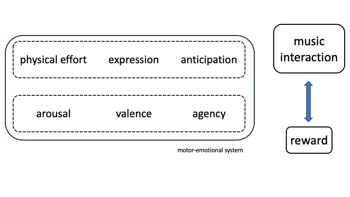

# Theory {#chapTheory}

All the assumptions -- or call them hypotheses -- that will be tested in this book refer to a theory of music interaction. This theory is based on something that our grandmothers told us^[Admittedly, not only grandmothers. Also great writers and philosophers, including Homer in the *Iliad*, Dante in the *Divina Comedia*, and Spinoza in the *Ethica.* And many others, including painters!], namely that to achieve something in life, you have to improve yourself through physical effort and endurance.

Applied to music, this means that we need an alert and active engagement to gain something from music, such as a feeling of beauty or power. Musicians may recognize this; good performances build on precision and focus.

Now, this chapter is an attempt to reformulate our grandmothers' advice from the perspective of modern music research. 

## Self-augmented interactions

In this book, we assume that people have an urge to engage in particular interactions with music because they derive benefits from doing so. For example, they discover new musical features, they improve the accuracy of their movements in dance, they perform better in an ensemble, and they experience positive emotions. The benefits experienced relate to learning, self-improvement, and enriching experiences. Alertness, attention, and focus are crucial elements for reaching the level at which interaction is experienced as beneficial. Unlike taking drugs, the approach is not passive; it is quite the opposite. It requires physical effort and endurance to experience the benefits and become aware of them.

In this book, we discuss *self-augmented interactions*, as people tend to create these interactions voluntarily, through choice and decision. Through these interactions, they augment themselves, performing better and experiencing beneficial long-term effects (over days, weeks, and beyond). Our claim is that these long-term effects are conditional upon self-augmented interactions with music. In other words, self-augmented interactions are necessary for these effects to occur. However, due to confounding variables, it may not be easy to predict these effects.

Currently, we are far from being able to predict the long-term effects of music, as the research domain is still young and not yet mature enough to address the enormous complexity of the subject. In their comprehensive review of the evidence for the power of music, Hallam and Himonides conclude:  "As the evidence stands at the moment, it is not clear which
musical activities might be beneficial for promoting any particular
outcome. Currently, much of the evidence is mixed, to some extent
explicable in terms of the different musical activities studied and the
research methods used. As research into the wider benefits of music is
not a high priority for research funders, it may be many years before it
is possible to provide clear guidance on which musical interventions
might lead to particular outcomes, and what qualities in the delivery of
those interventions are key to success." (p. 595)^[See Hallam and Himonides (2022). 
Note that references in this book are restricted, mainly to reviews and textbooks, but not exclusively. ]

Given the interaction and its involvement of bodily functions, we envision a complex system whose states can be built up over time, maintained for a period, and then decline back to normal. Rather than focusing on the off-line effects of music, such as what happens after listening, dancing, or playing music, we are interested in examining the on-line effects—that is, what happens during the interaction with music. This is a relatively new domain, and as we have mentioned, understanding on-line effects is a prerequisite for comprehending off-line effects. Therefore, our primary focus should be on understanding what happens during the interaction with music.

Evidence can be drawn from behavioral and neuroscience studies, with neurobiology playing a necessary role in the complete picture. Indeed, increased alertness, reduced stress, pleasure, and motivation suggest the involvement of neurotransmitters and hormones such as norepinephrine, oxytocin, cortisol, and dopamine, which regulate brain functions and affect behavioral activities during interactions^[For a review of neurochemical responses to music, see Reybrouck and Van Dyck (2024).].

However, this book has a rather focused scope. Our contribution to this theory centers primarily on timing performances. Additionally, we concentrate on the statistical processing of timing data.

Consequently, what we aim to achieve with this book is a small part of the grand dynamics at play. Therefore, our claims are modest.

We believe that timing is interesting because it is a distinctive, measurable, and partly controllable feature of interaction. As mentioned, we do not focus on the after-effects of timing or neuroplasticity effects. Instead, we return to the basics and study fundamental aspects using statistical processing tools. We examine the preconditions for plausible effects in performance parameters, aiming to better understand the dynamics of music interaction.

A paradigmatic example is the musical tempo played by an ensemble of musicians. As a feature of timing, it is created and maintained through collaborative effort, involving the co-regulation of individual musicians' actions within the ensemble. Tempo is a delicate state associated with the ensemble's musical quality. A stable tempo is crucial, except when changes in tempo are required. While tempo is not the only interesting feature of timing, it is certainly important. It can be measured, for instance, by identifying onsets in audio and calculating the underlying distribution of inter-onset intervals. When the intended stable timing is achieved, the ensemble can be said to be in a special interaction state.

The co-regulation of actions to maintain an intended stable tempo requires alertness, physical effort, and fine sensory-motor control from each member. Any mistake can disrupt the moment. However, the effort pays off: a good performance brings relief and satisfaction.

In short, the theory of self-augmented interaction is about improving ourselves with music, through performing. It requires an optimal performance of action and perception processes, it involves effort -- pleasure -- reward -- motivation, and it draws upon intentions, goals and collaborative actions.
While a complete theory of *self-augmented interaction* might not yet be within our reach, our goal is to contribute to it, firstly by proposing elements that contribute to theory, secondly, and perhaps more important for this book, by offering data-analysis tools that sharpen some details of contributing insights that may lead us towards such theory. Thereby, we don't focus on effects of music, but rather on properties of the interaction.

In short, the theory of self-augmented interaction is about improving ourselves through musical performance. It requires optimal integration of action and perception processes, involving effort, pleasure, reward, and motivation, and it draws upon intentions, goals, and collaborative actions. While a complete theory of self-augmented interaction may not yet be within our reach, our goal is to contribute to it in two main ways: first, by proposing elements that contribute to the theory; and second, more importantly for this book, by offering data-analysis tools that refine our understanding of key insights and guide us toward such a theory. To do this, we focus not on the effects of music, but rather on the properties of the interaction itself.

## Supporting theories

The ultimate theory draws upon a number of other theories about humans interacting with their environment.
Those theories relate to embodiment, prediction and expression.

### Embodiment {-}
*Embodiment* holds the idea that humans have a repertoire of gestures and actions, which they use for coding and decoding music^[These ideas have been explored in several books, such as: Leman (2007, 2016), as well as several book chapters in Godøy and Leman, eds. (2010) and Bader, ed. (2028).]. 

- During musical performance (or coding), various bodily gestures shape the phrasing, articulation, intonation, and overall structure of the sound. Consequently, the musical sound reflects traces of these gestures as patterns, known as *moving sonic forms*. 

- When listening and dancing (or decoding), individuals draw upon their own repertoire of bodily gestures to align with these moving sonic forms. This alignment enables them to experience music from a gestural and action-oriented perspective, essentially embodying the gestural traces within the music.

Coding and decoding can be understood as components of an *expressive communication process*. Coding translates gestures into sound, while decoding converts sound back into gestures. In communication, people share a common repertoire of information, which is conveyed through gestures and actions. This repertoire is both biological and cultural in nature. It is biological because people share a similar biological and biomechanical foundation. It is cultural due to the codified ways people move and behave within specific cultural contexts. Therefore, this shared repertoire enables individuals to encode and decode information through music using their biological and culturally codified gestures. In the context of communication, music serves as a vehicle for mediating gestures and actions that carry expressive forms.

Consider the role of timing. As bodily actions generate sound cues for timing, there is an intrinsic relationship between timing and body movement. Timing is encoded into sound and can be decoded from sound, allowing us to experience and perceive the timing. Consequently, sound or music serves as a vehicle for mediating timing gestures, which carry expressive forms that can be experienced and interpreted.

The link between sound and gestures can be crucial for the measurement of timing, even though detecting timing in sound can be challenging. Consider, for example, the onsets of violin tones and the timing they induce. It can be difficult to detect timing cues from violin audio alone. However, it is likely that these timing cues can be extracted from the violin bowing gestures, as the movement goes from point A to point B in space. The turning points at A and B may provide important cues for timing. This is measured not with sound recording, but with movement recording, using a *motion capture system*^[This technology, along with many others, is standard in music research. An example infrastructure can be explored at https://asil.ugent.be/infrastructure/.].

### Prediction {-}

Embodiment is closely linked with *prediction*, as moving sonic forms can be anticipated by the human encoder/decoder (Seth, 2015). Often, this anticipation is based on gesturing. Interestingly, during dancing to the beat of music, gestural alignment and body movement are typically initiated ahead of the beat. If not initiated ahead, the crucial timing movement would come too late.

Moving in sync with the musical beat demonstrates that embodiment is fundamentally predictive. Consider conducting your favorite piece of music on CD^[Admittedly, this is old technology, but it also applies to streaming]. Your conducting is likely ahead of the music due to your brain's predictive processing. When deeply engaged in conducting, it probably evokes a feeling of agency and power. Why?

This is due to the *reverse causality illusion*^[David Hume, in his *A Treatise of Human Nature*, launched the idea that causality in the brain is a matter of association, taking into account time and a contiguous relationship between cause and effect. In other words, Hume assumed that in the brain, causality is just a association, nothing more, no force or whatsoever.]. In this illusion, it appears as if your gestures cause the music—as if your movements are the cause and the music is the effect. The reason for this illusion is the correlation and contiguity between gestural and musical events: gestural events precede musical events.

Clearly, the perception of reverse causality is illusory, as the music continues even if your gesturing suddenly stops. Nevertheless, experiencing this illusion may create a strong feeling of control (agency). You may feel that your gestures influence the music, providing a sense of power and satisfaction. These effects occur during the musical interaction and performance. Whether these effects persist after the performance is another matter.

The connection to self-augmented interaction is evident. Establishing reverse causality creates a self-augmented interaction state. The ability to generate this state is crucial for the human decoder to create empowering effects.

However, reverse causality is not the only effect. Prediction enables the co-regulation of one's actions with those heard from other musicians, allowing for the establishment of a stable tempo through collaboration. Prediction is ubiquitous and thus a crucial element in understanding how self-augmented interaction states are maintained. Effects such as the reverse causality illusion can be seen as consequences of prediction.

### Expression {-}

Embodiment and prediction, when considered from the perspective of social interaction, support *expression*. Gestures serve as social signals, grounded in human biology and culturally codified social actions. A gesture becomes an expressive signal when the receiver responds with an expressive signal ^[The viewpoint adopted here is based on scholars working on human interaction, such as David Hume, Charles Darwin, Adam Smith, Erving Goffman. See Bonicco-Donato (2016) for a historical overview.]. Through the exchange of expressive signals via gestures, the sender and receiver typically trigger embodied predictions, arousal, enhanced attention, focus, and emotional engagement. This exchange can lead to ritualized behavior when gestures become habituated.

Expression is thus vital in human interactions. *Expressive timing* refers to the use of timing as a signal that evokes responses from the audience. Through the mutual exchange of gestural expressions and predictions, humans can interact in a coordinated manner. Musical rhythms enhance these exchanges of bodily expressions, facilitating the formation of co-regulated interactions and paving the way for self-augmentation.

Together, the three constructs—gestural, anticipatory, and expressive dynamics—provide a framework for understanding musical self-augmentation. This dynamic ultimately leads to an enhanced state where senses, cognitive abilities, and emotional engagement are sharpened and function optimally. We are particularly interested in the behavioral features of this dynamic as expressed through timing. Although this is a specific domain of musical interaction, it is both challenging and intriguing.

## Music as moving sonic forms

Given the above theories about human interactive abilities, it is valuable to examine music itself, particularly how music can be understood as moving sonic forms. This perspective is based on the notions of *pattern emergence* and *endowed expression*, which are vital for understanding interaction.^[The concepts were introduced in Leman (2008) but it is of interest to briefly summarize them here.]

### Pattern emergence {-}

*Pattern emergence* is the concept that a pattern possesses structural features aligned with the human capacity for emergence. This alignment, along with the pattern's structure, facilitates the emergence of perceptual phenomena. Consider the auditory system: it has the capacity to transform a pattern with specific structural features into a perceptual experience. For instance, a harmonic structure composed of 600, 800, 1000, and 1200 Hz may be perceived as a pitch at 200 Hz due to the auditory system's transformative ability^[For a review of the human auditory system and pitch as pattern emergence, see (Langner, 2015).].. The pattern is perceived as such because its structure allows for this pitch perception, and the auditory system performs this transformation.

The auditory system can also integrate multiple harmonic patterns into a single perceived chord. When such harmonic patterns are played in sequence, their integration may generate expectations, leading to tonal tensions and relaxation dynamics^[For reviews of pitch and timbre perception in music, see Schneider (2018a, b).]. Furthermore, the auditory system can process slightly altered structures, resulting in shifts in pitch perception.

Interestingly, the bottom-up mechanisms of pattern emergence may compete with top-down mechanisms driven by habitual patterns. This competition can influence the perception of tonal tension and relaxation. While the precise contributions of sensory (bottom-up) and cognitive (long-term memory) processing are still debated ^[Collins et al. (2014) show how tonality can be understood from sensory processing. 
Sears et al. (2018) for a discussion of sensory and cognitive tonality effects.], there is a considerable understanding of these mechanisms. Pitch emergence arises from the structure of patterns and underlying dispositions, involving auditory and brain mechanisms.

A similar observation can be made for rhythms. Rhythms consist of pulses that collectively form a meter, acting as a super-structure emerging from the lower-level pulse structure. Similarly, timbres can blend to form emergent textural patterns, a phenomenon well-known in orchestration. Thus, in the domains of rhythm and timbre, super-structures emerge from underlying structures and processing mechanisms.

However, there is a clear distinction between music and speech in terms of the degree and depth of pattern emergence. Blending timbres is less common in speech, as it may blur the signal and hinder semantic understanding. Moreover, in music, performers often co-regulate their actions to generate joint pattern emergence at rhythmic, pitch, and timbre levels. This joint emergence is far less prominent in speech; for instance, in heated debates, a moderator may intervene to ensure only one speaker talks at a time.

These examples illustrate that music, compared to speech, has an extraordinary capacity for pattern emergence. This capacity is a strong asset for (self-)augmentation, as it allows emergence to be achieved, when it might otherwise be non-existent. A striking example is Sardinian throat singing (*cantu a tenore*), where self-augmentation is physically perceived in the quality of the blending. This style is typically performed by groups of four male singers standing in a close circle.

### Endowed expression {-}

Emergent patterns do not exist in isolation. When produced by humans, these patterns become *endowed with expression*, referring to the gestures involved in both encoding and decoding sounds^[See Godøy and Leman, 2010.]. Gestures define movements as expressive, and during the encoding of sounds, gestural traces become an integral part of the sound pattern and its emergent features. For instance, during singing, musical pitch exhibits portamento and intonation, and intervals between certain pitches may be shortened or lengthened to articulate rhythms.

In essence, gestural traces in sound define articulations (e.g., legato and staccato), sound color, musical narrative, and dynamics (e.g., crescendo and diminuendo), either complementing or integrating with emergent patterns. Consequently, human gestures become embedded in the musical structure, creating emergent patterns endowed with gestural expression.

We argue that this endowment of emergent patterns with expression provides another incentive for creating self-augmented interaction states. Emergent patterns endowed with expression facilitate augmentation. Emergence itself is a form of augmentation, and expression enhances what would otherwise be perceived as mere bodily movement.

## Interaction capacities

At this point, I recognize that the theory of self-augmented interaction remains somewhat vague and undefined. However, both the theories of environmental interaction and the nature of music (as emergent patterns endowed with expression) point towards Gestalt theory. This theory posits that when parts are combined, the result is more than the sum of its parts. Essentially, our theory is a reinterpretation of Gestalt principles through the lens of modern cognitive science.

To complete our set of concepts introduced earlier in this chapter, we add three additional concepts: affordance, entrainment, and narration. A brief mention of these concepts will suffice.

### Affordance {-}
An *affordance* is a property of music (as a sonic form), and the ability to act upon an affordance offered by the music is called affordance capacity. Therefore, music possesses affordance capacity; it guides action. Affordances have sometimes been linked with the notion of frozen emotion, where composers and performers encode emotions in music, and listeners have the capacity to decode these emotions. As affordances, these frozen emotions are activated through music. In fact, it is possible to replace "emotion" with "gesture," and the idea still holds: sound traces set gestures into action. Good music, I believe, possesses a strong affordance capacity.

### Entrainment {-}

*Entrainment* is the capacity to adapt and align with music, either continuously, where movement flows with the music, or discretely, where movement marks musical events^[For introductions to entrainment, see f.i. Clayton et al. (2005) and Trost et al. (2017). ]. As the term suggests, entrainment implies that something in the music attracts the listener, acting as a driver for human activity. This could be motion, expression, or emotion.

In the context of this book, entrainment will be specifically defined as (co-regulated) sensorimotor synchronization. Notably, entrainment has been linked to a subliminal bias that reduces prediction errors in aligning body movement with sound cues^[Repp and Su (2013) is a classical reference.]. Similar to the tempo maintained by a musical ensemble, entrainment can be understood as either an error-correction mechanism or a dynamic adaptation system.

In the final chapters (see \@ref(chapTappers1) and \@ref(chapTappers2)) we will demonstrate that entrainment, in the context of two individuals interacting with each other, involves both error-correction and dynamic adaptation. This process engages a contrasting dynamic between intentionally acted events and perceived events. Our goal is to operationalize this concept. However, it is important to note that entrainment can also be defined more broadly as the capacity to respond to cues or as a brain principle acting on neuronal oscillations.

### Narration {-}
Last but not least, we must mention *narration*, one of the least understood yet most important principles in music research. Narration refers to storytelling and is often associated with the human encoder. For instance, jazz musicians use patterns and previously trained playing gestures as a kind of alphabet to construct larger arcs of phrases, binding them into larger structures—stories in music. The manner of telling a narrative, i.e., the performance, is equally important, as it builds anticipation, entrainment, and affordance capacity.

A prime example is Clifford Brown, a legendary jazz trumpeter and composer who tragically died at the age of 25 in a car crash. Brown was renowned for his ability to tell stories through his music, using patterns and trained playing gestures to construct larger arcs of phrases. One of his most famous improvisations is on *Joy Spring*. In several recorded solos of this piece, similar phrase components are arranged differently. One of these solos is widely regarded as one of the best solo improvisations ever played. Brown's work in jazz was as striking for its architectonic structure as for its emotional immediacy.

Unfortunately, narration is not often integrated in musicological studies on embodiment, prediction, and expression. We have a small contribution in chapter \@ref(chapDancer) but it's limited and more work is needed in this domain where sensorimotor and cognitive capacities intersect.

In short, music involves several capacities that are necessary to interact with the environment. These capacities are well-suited to process the dynamic structure of music, and in return, the emergent patterns. 

## Music addiction

(\#fig:chapTheoryInteractionHypothesis)Engine for self-augmented interaction

Let us return to the idea, often espoused by grandmothers, that physical effort and endurance are necessary for self-improvement. Why would people engage in interactions that demand physical effort? The likely answer is that it pays off, and a more compelling explanation may lie in the biological processes that govern reward and pleasure. I prefer to view this as a form of pro-social addiction^[See Robbins et al. (2010) for theories of addiction.]. 

Figure \@ref(fig:chapTheoryInteractionHypothesis) offers a rough model suggesting that interaction with music engages physical effort, expression, and prediction mechanisms. Together they co-engage arousal, valence, and agency, which trigger reward-related processes, based on dopamine-spread in the brain, that drive human subjects to engage more with music. As in addiction.  
Such a cycle may support the realization of self-augmented interaction states. Such states are rewarding and pleasurable, and it probably sets the scene for more such states. As in pro-social addiction.

We propose that *emergent patterns endowed with expression* facilitate the generation of self-augmented interaction states. These patterns align with the human capacity to capture affordances and engage in entrainment. The co-regulation of actions among multiple individuals creates a social context that can be motivating, and the formation of a musical narrative can be compelling. Moreover, this process can be rewarding in numerous ways.

The theory thus posits that music, due to the human disposition, offers and facilitates opportunities for self-augmented interaction states. As previously mentioned, this book aims to investigate specific elements of this broader theoretical claim, with a primary focus on statistical modeling.

## Note about expression theory

To close this chapter, something should be said about the *expression theory* because it is often, like the narrative, and often neglected if not misunderstood.

Briefly stated, expression theory is based on the idea that expression in person A calls for an expressive response in person B, which in turn serves as stimulus for expression in A and so on, thus leading to a mutual exchange of expressions that might result in a particular interaction state. 
This is indeed what is suggested in figure \@ref(fig:chapTheoryBayesianModel2) (see next chapter), from a dynamic perspective.

Although this idea is very simple, some scholars find it hard to understand that expressions do not always require reasons for expressing. In many contexts, expressions really don’t require the inference of a presumed cause. 

Interactions are often based on a direct and spontaneous gesturing, implying responses to patterns using gestures. This kind of direct gestural responding goes fast, and it is based on alignment, mirroring, including counterpoint gesturing. Interpreting an expression in terms of its presumed cause, largely depends on context and type of interaction. The main point is that expressions, to be valid and significant, do not always have to point to some deep underlying reason, a reason that can be found by inference. Instead, expressive interacting may occur without assuming the causes of the expression.

This is why. Expression is biological and largely intuitive. Therefore, rather than inferencing the latent state of being (known as the theory of mind theory), it is more appropriate to speak about gestural responding (based on mirroring). The real power of expression exchange is its dynamic ability to build up and maintain self-augmented states. Like in Sardinian throat singing, the real power is in the ability to blend voices and create an implied harmony or ghost tone. But others may hear in it an expression of a divine being. Expression theory may thus be understood in terms of an exchange of expressive gestures as patterns (and their possible inferred underlying states cannot always excluded) that steer-up the interaction towards self-augmented states. 

The question raises whether Bayesian inference applies to patterns or to causes. 
Sorry, but Bayesian inference is explained in the next chapter.
Anyhow, the answer is that it applies to both. Responding to an expression implies the processing of patterns and the assumption of a particular shape of the observed pattern can be seen as the prior of a Bayesian inference about that pattern. Inferring the cause of an expression would also apply that Bayesian inference scheme. In that case, the prior has a focus on the cause, for example, an emotion, or a character associated.
We'll show that Bayesian inference is a general machinery for dealing with assumptions and observations, regardless whether it applies to expressive forms or expressive causes of those forms.

## Conclusion

With a theory of music interaction in our hands, we have a perspective for understanding what music does with people and what people do with music, and why they do this. This theory evolved over several decades of research in musicology. However, it's far from being an established theory because it needs refinement, or even a reformulation. It is biased by certain trends in cognitive science, and in the future, it is likely that neuroscience and neuro-biology will have a important contribution allowing for a refinement of the theory. 

In this book, we use this theory as a general framework for case studies that highlight particular phenomena related to timing. We believe that an proper description and causal modelling of timing may contribute to our understanding of that same theory.
And yes, timing covers only a tiny small aspect of the entire theoretical framework but we believe that timing is an essential cornerstone. To be linked up with neuro-something in future research!

<!-- ## References -->

<!-- Reybrouck and Van Dyck (2024), -->
<!-- Leman (2007, 2016), -->
<!-- Bader (2018), -->
<!-- Bonicco-Donato (2016), -->
<!-- Langner (2015), -->
<!-- Schneider (2018a, b), -->
<!-- Collins et al. (2014), -->
<!-- Sears et al. (2018), -->
<!-- Godøy and Leman (2010), -->
<!-- Clayton et al. (2005), -->
<!-- Trost et al. (2017), -->
<!-- Robbins et al. (2010) -->
