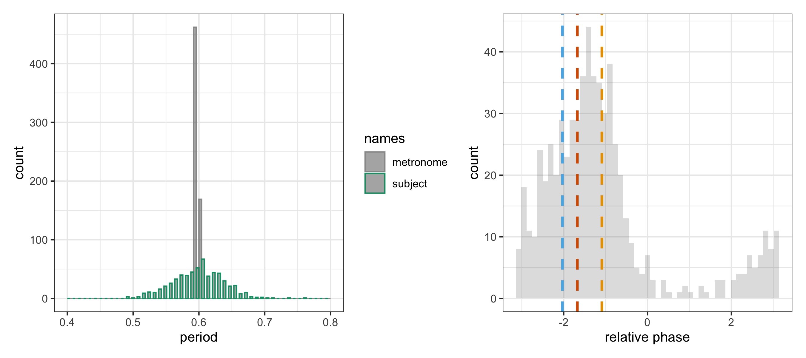

# Modelling{#chapModelling}

Statistical modelling aims at establishing a connection between data and theory, basically by capturing the data as estimated parameters of an assumed model. Outcomes of experiments with a normal distribution would thus be captured by a model whose predictors map onto the mean and standard variation of that distribution. Not only better and more accurate conclusions can be drawn from models, they can also clarify the key theoretical insights. And once the parameters are known, the model can predict data. Statistical modelling thus drives the domain forwards in terms of a better understanding of the data's underlying parameters. 
 
This chapter depends on the following scripts for data preparation, plotting, modelling and model plotting:


```r
source("Code/chapAll_00_Initialization.R")
source("Code/chapAll_01_Functions.R")
source("Code/chapModelling/chapModelling_02_DataPreparation.R")
source("Code/chapModelling/chapModelling_03_DataPlotting.R")
source("Code/chapModelling/chapModelling_04_Modelling.R")
source("Code/chapModelling/chapModelling_05_ModelPlotting.R")
```


## Bayesian epistemology

In this book we adopt an overall Bayesian epistemology to knowledge acquisition.
It applies to subjects interacting with the environment.
The best way to introduce this approach is by means of a graph -- and a simple example.

<div class="figure" style="text-align: center">

<p class="caption">(\#fig:chapTheoryBayesianModel1)Bayesian model</p>
</div>


Consider figure \@ref(fig:chapTheoryBayesianModel1) and its graphical description of a human subject (left circle), observing a pattern (middle circle), and making an inference about the state that caused that pattern (right circle).

### From pattern to state {-}

Say, you see a dog in the distance and you're not sure if it's friendly or aggressive. You have a prior belief that the dog is equally likely to be friendly or aggressive.
If the dog is friendly, it's likely to have a relaxed posture, while if it's aggressive, it's likely to have a stiff posture. Based on the dog's posture, you can calculate the likelihood of the posture given a particular belief whether the dog is friendly or aggressive.
Then you can combine your prior belief with the likelihood of the data to obtain your posterior belief. For example, if the dog's posture is very relaxed, your posterior belief might be that the dog is very likely to be friendly.

Now, suppose the dog suddenly lunges towards you, snarling and baring its teeth. This new observation is not consistent with your previous belief that the dog is friendly. However, you might be biased towards maintaining your previous belief, even in the face of contradictory evidence.

To account for the new observation, you can update your posterior belief, this time with a new likelihood that reflects the dog's aggressive behavior. For example, if the dog's behavior is very aggressive, the likelihood of that behavior given that the dog is friendly is low, whereas the likelihood of that behavior given that the dog is aggressive is high.
Using this new likelihood, you can obtain a new posterior belief that reflects the evidence from both the dog's posture and its behavior. For example, your new posterior belief might be that the dog is very likely to be aggressive.

The dog example illustrates Bayesian reasoning (inferring the posterior from likelihood and prior), and the dynamic behind that reasoning (the posterior becomes the new prior). As you observe more data, you can continue to update your beliefs (priors) and refine your understanding of the world. Additionally, Bayesian reasoning can be applied to a wide range of domains, from animal behavior to music and beyond. Patterns would be human gestures from which we infer the underlying state. Or it could be musical sounds from which we infer the underlying expressive state. Note that the Bayesian inferences could be rapid and direct, rather than based on conscious steps.

Figure \@ref(fig:chapTheoryBayesianModel1) also suggests that it is possible to probe the subject's experiences, for example with questionnaires or physiological measures as *indicators* of those experiences. 
A questionnaire assumes that the subject is somehow capable of translating experiences in verbal descriptions. 

The way in which the subject infers about the dog, is also the way in which we -- researchers -- infer about the data gathered from observations during experiments. Most often our prior is rather uninformative, but sometimes it can be informed. We keep it as an option.

In this book, we use this Bayesian approach as a general epistemological framework, not necessarily as a data modelling framework. The latter would lead us to machine learning where data-modelling involves Bayesian reasoning cycles. Our modelling is a stage before machine learning, just plain statistics. Yet, the general research strategy may adopt the Bayesian updating of a theory. Our theory about self-augmented interaction states is typically updated once we applied it to concrete case studies.

### Interactions {-}

Next, consider two subjects interacting with each other. This can be represented using the configuration shown in \@ref(fig:chapTheoryBayesianModel1), now applied to two subjects.
Each subject has a state-of-being expressed via a pattern. Each subject observes the pattern from the other subject and infers the state of the other subject.
Figure \@ref(fig:chapTheoryBayesianModel2) shows the states-of-being of two subjects represented as fully colored left and right cycles (state 1 and state 2). 


<div class="figure" style="text-align: center">

<p class="caption">(\#fig:chapTheoryBayesianModel2)Bayesian model for 2 subjects</p>
</div>

It is likely that the subjects will be mutually influenced when interacting. Interestingly, in timing -- which is a typical musical preoccupation -- this influence is reflected in the timing itself. As shown in chapter \@ref(chapTappers2), this influence (called: entrainment) draws upon a complex dynamics that is governed by mechanisms of embodiment, prediction and expression. It can be understood as a natural bias in humans to adapt to each other, thus facilitating the formation of a self-augmented interaction state.

In short, the Bayesian epistemology applies to both the subjects interacting, as well as to the researcher who is studying this interaction.
Now that we know the overall approach, let's go deeper into the kind of modelling that we can use, given this overall Bayesian epistemology.

## Regression

In what follows, we utilize *regression* as a tool for analysis. 
Regression analysis is based on the idea that a variable, known as the response or dependent variable, can be predicted from other variables, known as predictors or independent variables. This prediction relies on estimating parameters of a mathematical model, which encapsulates the relationship between the variables. These parameters include coefficients that signify the strength and direction of the relationships. 

Following Buerckner (2018), we write 
\begin{equation}
y_i \sim D(\theta_{1,i},\theta_{2,i}, ...)
(\#eq:chapModellingEqRegression2)
\end{equation}
<!-- \@ref(eq:chapModellingEqRegression2) -->
to say that the response $y$ is predicted by all parameters $\theta_p$ of the response distribution D at the $i$th observation. 
and every parameter $\theta_p$ can be regressed on its own predictor term $\eta_p$, 
transformed by the inverse link function $f_p$, that is $\theta_{pi} = f_p(\eta_{pi})$. Accordingly, every $\eta_p$ is regressed as in:
\begin{equation}
\eta = X\beta + Zu + \sum_{k=1}^{K} s_k(x_{k})
(\#eq:chapModellingEqRegression3)
\end{equation}
<!-- \@ref(eq:chapModellingEqRegression3) -->
where $\beta$ and $u$ are the respective coefficients at the population-level and group-level (also known as random variables), 
and $X$, $Z$ are the corresponding design matrices. 
The terms $s_k(x_k)$ symbolize optional smooth functions of unspecified form based on covariates $x_k$ fitted via functions (e.g. splines, gaussian processes). 
For example, if we work with the normal distribution, then we model both the mean *and* the standard deviance according to Expression \@ref(eq:chapModellingEqRegression3). We can use splines to capture the covariance among data ($x_k$) that occur over time.

## Data as indicator
Let's work out a regression example using timing data.
Along the way, we'll introduce some relevant concepts that will return in later chapters.

Here we go.
Consider the simple question whether humans can synchronize their finger *tap* along with a regular metronome *tic.* 
Finger tapping points to a central phenomenon of musical synchronization, namely that the brain is predictive.
Can we use regression to say something about finger tapping?
<!-- See Chapter \@ref(chapDanceMusic) for a study with dancers, or Chapter \@ref(chap:DriftingMetronomes) for a study with dyadic finger tapping. -->

### Dataset {-}
Here we use data from a study by Rosso et al. (2023), in which a subject is instructed to tap with the finger on the table, along with regular metronome tics, heard every $0.6$ seconds, during $390$ seconds.
When the finger touches the measurement device on the table, a clock time gets registered for a tap. 
And it also registers the tic.
The data can then be arranged as an array of time values at which the tap and tic appeared.
The first six rows of the dataset look like:

<table class="table table-striped" style="font-size: 11px; margin-left: auto; margin-right: auto;">
<caption style="font-size: initial !important;">(\#tab:chapModellingHeadD1)Tic and tap times</caption>
 <thead>
  <tr>
   <th style="text-align:right;"> time </th>
   <th style="text-align:left;"> names </th>
  </tr>
 </thead>
<tbody>
  <tr>
   <td style="text-align:right;"> 0.12 </td>
   <td style="text-align:left;"> tap </td>
  </tr>
  <tr>
   <td style="text-align:right;"> 0.60 </td>
   <td style="text-align:left;"> tic </td>
  </tr>
  <tr>
   <td style="text-align:right;"> 0.64 </td>
   <td style="text-align:left;"> tap </td>
  </tr>
  <tr>
   <td style="text-align:right;"> 1.20 </td>
   <td style="text-align:left;"> tic </td>
  </tr>
  <tr>
   <td style="text-align:right;"> 1.21 </td>
   <td style="text-align:left;"> tap </td>
  </tr>
  <tr>
   <td style="text-align:right;"> 1.80 </td>
   <td style="text-align:left;"> tic </td>
  </tr>
</tbody>
</table>

The column `time` marks numerical time values while `names` is a factor with two levels: tic and tap. 
Another view on the variables is given by:


```
## 'data.frame':	6 obs. of  2 variables:
##  $ time : num  0.12 0.6 0.64 1.2 1.21 1.8
##  $ names: Factor w/ 2 levels "tic","tap": 2 1 2 1 2 1
```


### Period {-}
Now, consider a simple analysis based on counting the periods of successive tics and successive taps (or inter-tic and inter-tap intervals).
The data look like this:
<table class="table table-striped" style="font-size: 11px; margin-left: auto; margin-right: auto;">
<caption style="font-size: initial !important;">(\#tab:chapModellingPeriods)Periods: inter-tap and inter-tic intervals</caption>
 <thead>
  <tr>
   <th style="text-align:left;"> names </th>
   <th style="text-align:right;"> time </th>
   <th style="text-align:right;"> dtime </th>
  </tr>
 </thead>
<tbody>
  <tr>
   <td style="text-align:left;"> tap </td>
   <td style="text-align:right;"> 0.12 </td>
   <td style="text-align:right;"> NA </td>
  </tr>
  <tr>
   <td style="text-align:left;"> tic </td>
   <td style="text-align:right;"> 0.60 </td>
   <td style="text-align:right;"> 0.600 </td>
  </tr>
  <tr>
   <td style="text-align:left;"> tap </td>
   <td style="text-align:right;"> 0.64 </td>
   <td style="text-align:right;"> 0.514 </td>
  </tr>
  <tr>
   <td style="text-align:left;"> tic </td>
   <td style="text-align:right;"> 1.20 </td>
   <td style="text-align:right;"> 0.601 </td>
  </tr>
  <tr>
   <td style="text-align:left;"> tap </td>
   <td style="text-align:right;"> 1.21 </td>
   <td style="text-align:right;"> 0.568 </td>
  </tr>
  <tr>
   <td style="text-align:left;"> tic </td>
   <td style="text-align:right;"> 1.80 </td>
   <td style="text-align:right;"> 0.600 </td>
  </tr>
  <tr>
   <td style="text-align:left;"> tap </td>
   <td style="text-align:right;"> 1.82 </td>
   <td style="text-align:right;"> 0.612 </td>
  </tr>
  <tr>
   <td style="text-align:left;"> tap </td>
   <td style="text-align:right;"> 2.40 </td>
   <td style="text-align:right;"> 0.582 </td>
  </tr>
  <tr>
   <td style="text-align:left;"> tic </td>
   <td style="text-align:right;"> 2.40 </td>
   <td style="text-align:right;"> 0.600 </td>
  </tr>
  <tr>
   <td style="text-align:left;"> tic </td>
   <td style="text-align:right;"> 3.00 </td>
   <td style="text-align:right;"> 0.598 </td>
  </tr>
</tbody>
</table>
 The values of `dtime` are based on the time difference between each successive tap, as well as the time difference between each successive tic.
A histogram of the periods is then shown in figure \@ref(fig:chapModellingTapping1), left panel.

<div class="figure">

<p class="caption">(\#fig:chapModellingTapping1)Left panel, histogram of periods. Right panel, histogram of relative phases. The blue line shows the mean at -2.03[rad] according to the circular model. The ocre line shows the mean at -1.09[rad] according to the non-circular model. The red line shows the mean at -1.68[rad] according to the synchronization strength measure</p>
</div>


In order to be able to count periods,
small containers covering small ranges (= bins) are defined by setting a binwidth, in which periods of slightly different value fit. 
For our current purposes the binwidth is not that important but should be small enough and not too small, so that a good amount of periods fit in a bin.
Whenever a measured period falls in such a bin, the bin count increases.
The histogram on the left reveals that the metronome's periods, shown in gray color, are not exactly $0.6 ~s$, as expected, but close. This is due to small differences (a few milliseconds) in tics. 

The subject's periods, shown in green color, fluctuate more broadly around this value.
They appear as a normal distribution with a mean close to $0.6 ~s$ and a standard deviation of $0.046~s$.
More precisely:
<table class="table table-striped" style="font-size: 11px; margin-left: auto; margin-right: auto;">
 <thead>
  <tr>
   <th style="text-align:right;"> mu </th>
   <th style="text-align:right;"> sd </th>
  </tr>
 </thead>
<tbody>
  <tr>
   <td style="text-align:right;"> 0.5959834 </td>
   <td style="text-align:right;"> 0.0457898 </td>
  </tr>
</tbody>
</table>

### Relative phase {-}

More revealing, perhaps, is a view of the *relative phase*, shown in the histogram on the right.
The data look like this:
<table class="table table-striped" style="font-size: 11px; margin-left: auto; margin-right: auto;">
<caption style="font-size: initial !important;">(\#tab:chapModellingRelPhases)Data with relative phase</caption>
 <thead>
  <tr>
   <th style="text-align:right;"> time </th>
   <th style="text-align:right;"> relphase </th>
  </tr>
 </thead>
<tbody>
  <tr>
   <td style="text-align:right;"> 0.637 </td>
   <td style="text-align:right;"> 0.38 </td>
  </tr>
  <tr>
   <td style="text-align:right;"> 1.205 </td>
   <td style="text-align:right;"> 0.03 </td>
  </tr>
  <tr>
   <td style="text-align:right;"> 1.817 </td>
   <td style="text-align:right;"> 0.16 </td>
  </tr>
  <tr>
   <td style="text-align:right;"> 2.399 </td>
   <td style="text-align:right;"> -0.03 </td>
  </tr>
  <tr>
   <td style="text-align:right;"> 3.006 </td>
   <td style="text-align:right;"> 0.06 </td>
  </tr>
  <tr>
   <td style="text-align:right;"> 3.590 </td>
   <td style="text-align:right;"> -0.13 </td>
  </tr>
</tbody>
</table>

To calculate the relative phase, let's go back to the previous table showing tic and tap times from metronome and subject.
The tap event at row $n$ ($tap_n$) is considered within the two surrounding tic events closest in time, found at row $m$ and row $m+$ (the next row where we find a tic).
The relative phase $\phi$ of $tap_n$ (called: $\phi_n$) is then defined as the time interval from $tic_m$ to $tap_n$, divided by the time interval from $tic_{m}$ to $tic_{m+}$, multiplied by $2\pi$ to represent the ratio of time intervals in $radians$, as in:

\begin{equation}
\phi_n~= ~2\pi \left(\frac{tic_m - tap_n}{tic_m - tic_{m+}}\right)
(\#eq:chapModellingEquationRelPhase)
\end{equation}
<!-- \@ref(eq:chapModellingEquationRelPhase) -->

After the tic at $0.6 s$, the first tap occurs at $0.64 s$. The tap is in the tic interval $[0.60,1.20]s$, 
thus we have $2\pi[(.6 - .64) / (.6 - 1.2)] = 0.42 [rad]$.
With \@ref(eq:chapModellingEquationRelPhase) we always get a value between 0 and $2\pi$.
To obtain a value in the range $[-\pi,+\pi]$ it is necessary to rotate as in:

\begin{equation}
\hat\phi_n = [(\phi_n + \pi)mod(2\pi)] -\pi
(\#eq:chapModellingEquationPhaseRotation)
\end{equation}
<!-- \@ref(eq:chapModellingEquationPhaseRotation) -->

where  $\hat\phi_n$ is the rotated value, and $mod$ is the modulo operation `(A)modulo(B)`.
Rotation has the effect that all values above $\pi$ go below $0$.

Accordingly, when $tap_n$ occurs in the half cycle after $tic_m$,  $\hat\phi_n$ is positive, indicating delay.
When $tap_n$ occurs in the half cycle before $tic_{m+}$, $\hat\phi_n$ is negative, indicating anticipation to $tic_{m+}$.
Rotating $0.42 [rad]$, we do $(.42 + \pi)$ modulo $(2 \pi)- \pi$ and we get again $0.42 [rad]$. In that case, rotation has no effect and
that's what we want. Only values above $\pi$ get rotated and re-appear below zero.
If the value is 4[rad], rotation gives -2.28[rad].

The obtained scale is a circular scale with $0\pi$ (equal to $2\pi$) appearing in the middle of the interval spanned by $[-\pi,+\pi]$. It expresses the relative phase on a cycle marked by successive taps. The circularity implies that values slightly $>\pi$ can also be considered slightly $<-\pi$.
In the relative phase histogram of figure \@ref(fig:chapModellingTapping1), the peak has a negative value, meaning that, on average, the taps occur in the half cycle before a tic (all tics being at zero). The taps are anticipating the ticks. 
Note that the histogram has a distribution that looks normal but slightly skewed to the right.

### Polar representation {-} 

Interestingly, the relative phase can be represented as the angle of a unit length vector in polar representation.
Accordingly, we construct the vector as:

\begin{equation}
v = e^{(j\phi)}
(\#eq:chapModellingEquationVector1)
\end{equation}
<!-- \@ref(eq:chapModellingEquationVector1) -->
where $v$ is the unit length vector with its angle equal to the relative phase $\phi$.
$j$ indicates that it is a complex number.

Given a series of relative phases, we first turn them all into unit vectors. 
We sum all unit vectors and divide by the number of unit vectors. 
From the resultant vector $V$ we can then easily extract the polar coordinates, being the vector length $R$ and the angle $\alpha$. That's what we do here.

\begin{equation}
V = \frac{1}{N}\sum_{n=1}^N v_n\\
R = Mod(V)\\
\alpha = Arg(V)
(\#eq:chapModellingEquationVector2)
\end{equation}
<!-- \@ref(eq:chapModellingEquationVector2) -->

For example, given the relative phases shown in table \@ref(tab:chapModellingRelPhases), we first turn them into unit vectors.
These vectors point in several directions along the unit circle because their phases are all different from zero. The mean length is smaller than one.


```r
V <- (exp(1i *0.38) + exp(1i*0.03) + exp(1i*0.16) + 
        exp(-1i*0.03) + exp(1i*0.06) + exp(-1i*0.13)) /6
```

R and $\alpha$ are given by

```r
Mod(V) 
```

```
## [1] 0.9871149
```

```r
Arg(V)
```

```
## [1] 0.077842
```

### Synchronization strength and delay {-}

When working with relative phase, the length $R$ can be interpreted as *synchronization strength*.
If the tap is perfectly synchronized with the tic, then $R = 1$.
The angle $\alpha$ can be interpreted as *synchronization delay*.
If the tap is not anticipated, or has no delay, then $\alpha = 0 [rad]$.

We can now return to the data from table \@ref(tab:chapModellingPeriods) as shown in figure \@ref(fig:chapModellingTapping1), right panel.
Taking all data into account, the synchronization strength $R = 0.61$ and the synchronization delay $\alpha = -1.68[rad]$.
The latter is shown in the right panel of figure \@ref(fig:chapModellingTapping1) as dotted red line.


At that point, the analysis could stop and conclusions could be drawn about the subject's tapping variability. 
It has a  *negative mean asynchrony*, indicating anticipation in tapping.

This finding would confirm the theory, because tapping proceeds ticking, which is in agreement with the assumption about the predictive brain. The brain can handle motor prediction because the asymmetric delay lines of (longer) tactile feedback and (shorter) auditory feedback are compensated by tapping earlier, so that tactile feedback and auditory feedback arrive at the same time in the brain.

## Data and model

Of course we don't stop here.
In fact, the fun just starts.
The tapping events can be considered indicators of a continuous hidden process related to the brain's prediction over time.
Statistical models can make that hidden process visible.

### Circular axis {-}


Consider again the dataset shown in table \@ref(tab:chapModellingRelPhases). 
We get an interesting graphical representation by showing the relative phase as an event in time, as ilustrated in figure \@ref(fig:chapModellingTapping0), that is, with `time` on the horizontal axis and `relphase` on the vertical axis.
The figure shows a particular tapping segment between 160 and 175 seconds.
The dashed vertical lines show the tics.
The circles show the taps at defined relative phase values, which depend on the tap time relative to the tic time.

Some tics may be missing because the tic selected is always the first tic before the tap. 
For example, when the tap period is wider than the tic period, the first tic is not selected. 
Given $tic_0, tap_1, tic_1, tic_2, tap_2$, then $tic_1$ will not be shown 
because $tic_0$ is the reference for $tap_1$ and $tic_2$ is the reference for $tap_2$. 
Taps have a positive relative phase (i.e., delayed) when they fall in the first half-cycle after a tic.
Taps have a negative relative phase (i.e., anticipated) when they fall in the first half-cycle before the next tic. 
Following that logic, the values on top of figure \@ref(fig:chapModellingTapping0), 
between about 163 and 167 seconds, form actually part of a U-shaped sequence of relative phase values, as the vertical axis is circular.


<div class="figure" style="text-align: center">

<p class="caption">(\#fig:chapModellingTapping0)Relative phase values over time, using a circular vertical axis</p>
</div>


<div class="figure" style="text-align: center">

<p class="caption">(\#fig:chapModellingBrms1)Relative phase values over time fitted, using a circular model (blue), a non-circular model (ocre)</p>
</div>

A complete tapping sequence is shown in figure \@ref(fig:chapModellingBrms1). 
The continuous lines are smooths generated by two different smooth regression models, either taking into account the circularity of the response (= blue line), or not (= ocre line). Smooths are in fact curves that go through the data in an optimal fluent way, whose resoluation we can define.
Given our knowledge about the circularity of the relative phase, the ocre line one is just wrong.

How did we obtain this figure?

### Smooth regression {-}
The description of the smooth regression model is based on the `lme4`-syntax, used in most R-packages for statistics.
It is defined by a relation between response and predictor as:
<!-- $$ -->
<!-- relphase \sim 1 + s(time, k=30) -->
<!-- $$ -->


```r
relphase ~ 1 + s(time, k=30)
```

The formula says that the relative phase `relphase` is distributed as an offset (indicated by 1) plus a smooth over time using a basis of $k=30$ spline-functions. 
Each relative phase value $\phi_i$, occurring at a particular time $t$, is equal to an offset plus a linear combination of 30 spline-functions values evaluated at $t$, plus some residual noise.
The splines capture the correlation among relative phase values over time.
Obviously, the model should come up with fitted splines for all $\phi_i$ at once.

As the values of $\phi_n$ have a value on a circular axis defined by the interval $[-\pi,+\pi]$, the regression model has to be *fitted* with a proper circular link function (family="von_mises"), so that the predictor gets correctly mapped to the circular axis of the response. 
Accordingly, the formula in the `brms`-package is:
<!-- $$ -->
<!-- formula \leftarrow relphase \sim1 + s(time, k=30), family =  "von\_mises"  -->
<!-- $$ -->

```r
formula = bf(relphase ~ 1 + s(time, k=30))
family = "von_mises"
```

If `family` is not specified, the model assumes that `relphase` is non-circular; it's the ocre model.
The non-circular model (ocre) is strongly affected by the values close to $\pi$.
It considers these as high positive values so that the time-independent mean goes up.
In contrast, the circular model (blue) considers the points near $\pi$ on the circular axis so that the mean is lower and more in line with the other estimates.
The time-independent means are shown as vertical (blue and ocre) lines on the histogram in figure \@ref(fig:chapModellingTapping1) (right panel).

### Uncertainty {-}
Figure \@ref(fig:chapModellingBrms1) shows the predicted mean and its uncertainty over time.
Taking the average over time, the means are at -2.03[rad] according to the circular model and at -1.09[rad] according to the non-circular model.
Since we know that the time between tics is $0.6 s$, the anticipated time is 
$(-2.03 / 2\pi) 0.6s = -0.194s$ for the circular model
and in the non-circular model it is $-0.105s$.
In the circular model the uncertainty is given by the critical interval (CI-95%) of $[-2.39,-1.75]$.
CI-95% indicates that the mean would appear in that interval in 95% of the estimations. 
In the non-circular model, the uncertainty is given by the critical interval (CI-95%) of $[-1.18,-1.00]$.
Clearly, both models have some uncertainty that is unresolved by the parameters of the regression model.

The type of statistical modelling can be called: *circular-linear smooth regression*.
With this name we stress the fact that the response is circular and the predictor is linear, and that we use smooths. 
Soon, we'll work with circular-linear hierarchical distributional smooth regression.
Don't panic, we know already the circular-linear smooth regression!

## Predictions of tapping

Given a model and its fitted parameters, it can be used to generate discrete tapping events.
Recall that the fitted model gives us an estimation of a continuous hidden process.
To create the discrete taps we have to make sure that the relative phase values match with the time values at which they occur. 
<!-- To obtain these time values, we first construct the phase of the tappings -->
<!-- First, the model generates the relative phase, of taps versus tics at given time values corresponding to the tics. -->
<!-- Then the tap phase is reconstructed using the given tic phase and the predicted relative phase, and turn that tap phase in the time values corresponding to the taps. -->
<!-- The last step goes from continuous to discrete by selecting the tap phase that occurs at multiples of $2\pi$. -->

- First, we predict the relative phase $\phi^{tap}_n$ from the fitted model using a sampling rate of 100 samples per second.
We thus get predictions of the relative phase $\phi^{tap}_n$ at time instances
$t_1=0[s], t_2= 0.01[s],...,t_N = 390[s]$, with $n$ as an index ($n=1,2,...,N$) over samples and $t_n$ being the sample time. 
- Next, we calculate the generated tap phase $\psi^{tap}_n$ as the sum of (i) the tic phase $\psi^{tic}_n$, (ii) the relative phase $\phi^{tap}_n$, and (ii) some noise $\epsilon_n$:
$$
\psi^{tap}_n = \psi_n^{tic} + \phi^{tap}_n + 2\pi\epsilon_n ~,~with \\
\psi_n^{tic}=\frac{2\pi t_n}{0.6},~and\\
\epsilon_n \sim  N(0,.05).
$$
Note that $\psi_n^{tic}$ is the phase that corresponds with the time indication given by the metronome tic $tic_n$.
The division by $0.6$ guarantees that $2\pi$ (= the maximum phase of the metronome tic) occurs at multiples of $t_n=0.6~[s]$.
The noise added to the predicted relative phase comes from a normal distribution with zero mean and 0.05 standard deviation.

- Finally, to get the discrete tap values $\psi^{tap}_{\hat n}$ we select all the samples $n$ at which 
$\psi^{tap}_n$ modulo $2 \pi$ is a maximum.
We then get the time value at which $\psi^{tap}_{\hat n}$ occurs:

$$
\psi^{tap}_{\hat n} = max(mod(\psi^{tap}_{n},2\pi))\\
t^{tap}_{\hat n}  = \frac{0.6 \psi^{tap}_{\hat n}  }{2\pi}
$$
with $\psi^{tap}_{\hat n}$ being the selected tap phase having $2 \pi$ as value, or close to this value, depending on the sampling rate, and $t^{tap}_{\hat n}$ being the time of the tap at $\hat n$.
The R code for calculating these predictions is found in `Code/chapModelling/chapModelling_05_ModelPlotting.R`.


<div class="figure" style="text-align: center">

<p class="caption">(\#fig:chapModellingB1predicted)Simulated discrete taps, using the underlying process, shown for the first 100 seconds</p>
</div>
The hidden process and its generated taps up to the first 100 seconds are shown in figure \@ref(fig:chapModellingB1predicted).
Obviously, the generated taps are not exactly similar to the original taps. However, they have a similar statistical structure.

So sum up, we used a fitted model to give us so-called *counterfactual* predictions at equal time intervals. 
This counterfactual prediction will be often needed.
It is straightforward once you get it.


<!-- Statistical modelling aims at better understanding the data. -->
<!-- Given the natural variability in human behavior, the goal may be to find a mean value in a group of subjects, in order to compensate for random variability in an individual subject. -->
<!-- Part of the proof may also involve statistical tests showing contrasts in parameters of the model and/or predicted values generated by the model.  -->
<!-- With simple models contrasts can be tested on parameter values. With complex models, it's better to use the prediction values. -->
<!-- Several concrete examples of *contrasts* are given in the chapters that follow.  -->
<!-- Other parts of the proof may consists in showing that the modelling is indeed accurate and that parameters and predictions of the model are reliable. -->

<!-- ## Modeling the latent process -->

<!-- The above tapping example suggests that statistical modelling can be done at different levels of abstraction. -->
<!-- In some cases, predictors are available but it is unclear how these are related with each other, that is, whether predictors are correlated (A and B), have a time arrow (A before B), and are based on a counterfactual relationship (if not A, then not B). -->
<!-- The predictors can be simply combined in a linear model where the outcome of the model is based on weighted sums of predictors. -->
<!-- Typically, such a model may give rise to a rather abstract predictive model, based solely on correlations of predictors. -->

<!-- In fact, the example of figure \@ref(fig:chapModellingBrms1), showing the predicted latent process in blue, is rather abstract in the sense that it doesn't tell us anything about a causal process, such as the flow of information between subject and metronome. It merely fits the data as good as possible, using 30 spline-functions. -->
<!-- Consequently, the latent process doesn't say much more than having fitted 30 spline-functions. -->
<!-- It doesn't say anything about the causal connection of the subject with the metronome. -->

<!-- Sometimes, there may be some idea of how variables are causally related. (However, most of the time there is no such idea). -->
<!-- That knowledge can then be expressed in a model definition such that the causal flow gets reflected in the model.  -->
<!-- The approach is much more powerful but it is not always easy to build such a model, due to the complexity and lack of knowledge of the assumed processes. -->
<!-- However, if a causal model can be built, then the estimated parameters can be directly interpreted in terms of causal flows. Such models are powerful and cool.  -->
<!-- For example, the processes behind finger tapping data can be modeled using a system of oscillators and a set of differential equations of how they behave over time. -->
<!-- Given the data, the control parameters of the differential equations can be estimated and the behavior can be understood in terms of control parameters. -->
<!-- When that is possible, the modelling may give new insights that are otherwise hard to get. -->
<!-- An example of this type of modelling will be shown in chapter XXXX. -->

## Note about Bayesian statistics

The Bayesian approach in statistics has many advantages, but also some disadvantages.
Among the advantages is the flexibility of working with the fitted model. Once fitted, all kinds of combinations of parameters and counterfactuals can be investigated by drawing samples from the model's posterior. 

The disadvantage is the time it takes to compute the the fitted model.
As mentioned and illustrated with a drawing in figure \@ref(fig:chapTheoryBayesianModel1), the estimation process in Bayesian data modelling revolves around optimizing a *likelihood function*, that is, the probability of observing the data given the parameters of the model. The goal is to find the values of the parameters that maximize this likelihood function, thereby providing the best fit to the observed data. This optimization can be viewed from a Bayesian perspective, where the goal is to find the *posterior distribution* of the parameters given data and *prior beliefs*.

One powerful technique used in Bayesian optimization is Hamiltonian Monte Carlo (HMC) sampling. HMC combines principles from Hamiltonian dynamics and Monte Carlo sampling to explore the parameter space more efficiently than traditional optimization methods^[See McElreath (2020)]. However, the computational cost is considerable.

## Conclusion

In this chapter we introduced smooth regression and applied it to a simple dataset of tic and tap events, showing that timing is a delicate matter. 
In addition we showed that, based on the estimated parameters of a regression model, it is possible to generate counterfactual tap events.
This approach offers many possibilities that will be further explored in the next chapters.
 
<!-- ## References -->
<!-- Buerckner (2018), -->
<!-- Buerckner (2017, 2018, 2021), -->
<!-- Rosso et al. (2023) -->
<!-- McElreath (2020) -->
