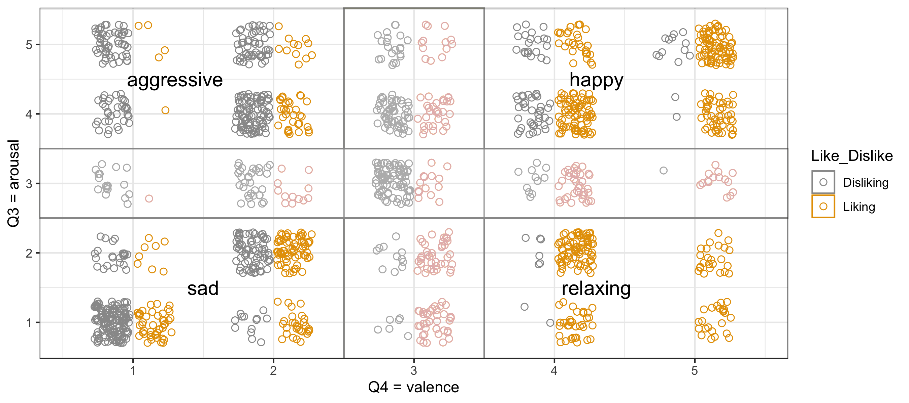
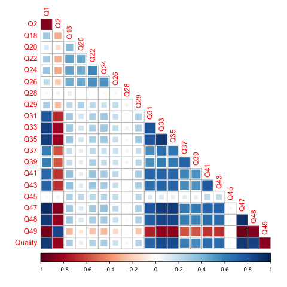
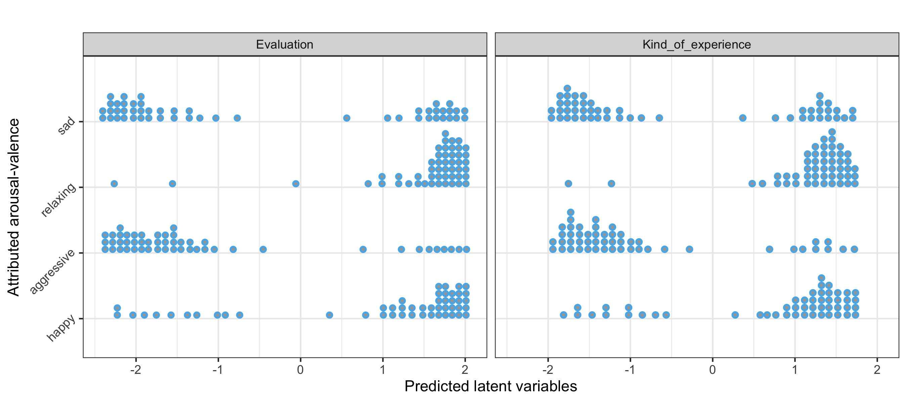

# Listener appreciation {#chapListener}

In this chapter^[This chapter is dedicated to the late Ir. Henk Jacobs (1953–2024), who was my PhD student in musicology from 2020 to 2024. Henk applied his expertise in marketing to musicology, and this chapter is highly inspired by his insights and feedback.], we delve into the question of what music does to listeners. Ultimately, the goal is to develop a theory of how people reflect on what music does to them. 

The chapter proposes a theory of music appreciation and we investigate how listeners rationalize about this appreciation, using a large empirical survey on music appreciation. In a way, the methodology is Bayesian because theory is used to develop a questionnaire for a survey. A statistical model is then used for analyzing the survey responses. That model draws upon the theory, and based on data, it informs the updated theory.  A few such cycles lead to a refined theory.

In this chapter, we are not studying how listeners interact with music; rather, we study how listeners reflect on their interactions with music. Therefore, this chapter is more offline than online. It focuses on the listener, not the performer. Nevertheless, performers are also listeners. In that sense, this chapter sketches a global background for the chapters that follow.

This chapter depends on the following scripts for data preparation, plotting, modelling and model plotting:


``` r
source("Code/chapAll_00_Initialization.R")
source("Code/chapAll_01_Functions.R")
source("Code/chapListener/chapListener_02_DataPreparation.R")
source("Code/chapListener/chapListener_03_DataPlotting.R")
source("Code/chapListener/chapListener_04_Modelling.R")
source("Code/chapListener/chapListener_05_ModelPlotting.R")
```


## Workflow

The chapter adopts a theory-driven approach as outlined in the previous chapter in figure \@ref(fig:chapTheoryBayesianModel1). The *subject* is the listener who interacts with music. However, in this chapter, we focus on the indicators. 
We probe the listener with questions about appreciation and motivation, forcing the listener to reflect on what happened during listening. Using the questions, we aim at building a model of the listener's appreciation.

To fully grasp the structure of this chapter, it is instructive to consider the workflow of figure \@ref(fig:chapListenerWorkflow), which also applies this Bayesian epistemology.

<div class="figure" style="text-align: center">

<p class="caption">(\#fig:chapListenerWorkflow)Overview of theory and statistical modelling</p>
</div>

The starting point is a theory of music appreciation.
Based on this theory, a questionnaire and a statistical model is generated.
The questionnaire is launched in a survey, and the answers to this questionnaire, the data, are processed and transmitted to the statistical model. 
The statistical modelling then serves as feedback to the theory.

In short, the theory which we start from is the prior, the data given the theory is the likelihood, and the updated theory is the posterior, which in turn becomes the new theory.

In what follows, we hook our wagon to an acceptable stage of this iteration, and we'll try to further refine the results obtained.

## Theory

Our approach, as it is currently developed, draws from the fields of *neurobiology*, *marketing*, and *musicology.* These fields enable us to conceptualize music appreciation as the rating assigned by listeners to the gratification they experience while engaging with music.

- *Neurobiology* suggests that gratification (reward) arises from the brain's chemistry fabric, such as the neurotransmitter dopamine. It diffuses throughout the brain, eliciting a pleasurable sensation and triggering a desire for more —- a behavioral pattern akin to seeking out further stimuli that induce this reward, reminiscent of addiction.

- In the realm of *marketing*, this pattern is called *wanting*. It is linked to the perceived value of a product, which reflects an overall appreciation indicative of customer satisfaction regarding the product's functionalities and qualities. These qualities can also be assessed through a series of questionnaires designed to probe various aspects.

- Finally, in the domain of *musicology*, it is proposed that music profoundly influences the listener's experience and this can be analyzed in terms of sub-categories of that experience, such as immersion, embodiment, anticipation, emotion and expression. Some of these concepts have been discussed in chapter \@ref(chapTheory).

Combining these insights from neurobiology, marketing, and musicology, a theory of music appreciation can be outlined as follows:
When a listener engages with music, a dynamic anticipation-reward-motivation loop is initiated, leading to experiences such as being emotionally moved, deeply absorbed, urge to move, or profoundly touched. The listener can subsequently reflect upon these experiences. The listener can also reflect upon the effect of these experiences, as they may culminate in a pleasurable bodily reward, which is positively evaluated.
Upon reflection, the listener may also identify specific qualities in the music which are assumed to have contributed to these pleasurable experiences. 
Finally, the appreciation can be expressed by means of a global score, say from 1 to 10.

Obviously, any comprehensive theory of music appreciation must also consider the influence of context. Factors such as the setting in which the music is heard (e.g., live concert versus radio broadcast), the listener's mood (happy, sad), demographic background (young, old), and other environmental variables can significantly impact how listeners perceive and interpret their musical experiences. Therefore, when conducting surveys or assessments, it is essential to account for these contextual factors to ensure clarity and accuracy in participants' responses, thus avoiding potential confusion or misinterpretation.

However, we believe that appreciation is independent of the specific type of music being listened to. Consider for example sad music. Despite its melancholic nature, a piece of sad music can trigger intense embodied experiences that are highly valued by listeners, leading to a high appreciation score. Conversely, happy music may not always receive high appreciation, for example when it fails to engage the listener with a compelling rhythm or groove.
In addition, the appreciation is agnostic to factors such as gender or age. 

Overall, in this theory, what truly matters is the activation of reward, pleasure, and wanting experiences by the music. Music appreciation reflects both an inward reflection, focusing on the nature and evaluation of the experience itself, and an outward reflection, directed towards the assumed qualities of the music. These reflections are influenced by various contextual factors such as background, gender, and setting.


## Causal model

The appreciation theory can be clarified as a network of variables and relationships between variables. However, what is shown here is already the outcome of a considerable study involving fine-tuning of concepts and modelling. As mentioned, we hook our wagon to an acceptable stage of this iteration and this is how the theory is currently conceived.

### Directed acyclic graph (DAG) {-}
<div class="figure" style="text-align: center">

<p class="caption">(\#fig:chapListenerDAG1)Causal model of appreciation shown as a DAG</p>
</div>

The network can be shown as a DAG, or directed acyclic graph (DAG), as shown in figure \@ref(fig:chapListenerDAG1). In this graph the theory is spelled out as a set of concepts and *causal* relationships among these concepts. Note that the use of the term *causal* has a very specific meaning in this context. A cause-effect relationship among two concepts means (i) that the information flow has a *direction*, in the sense that the cause precedes the effect in time, (ii) that there is an *association* (correlation) between the concepts, and (iii) that *no potential confounding variables* could account for the observed association.  The DAG causality is tested by considering the logic of causal relations (see below). Note that we do not really model causal flow in the sense of what will be done in chapters \@ref(chapTappers1) and \@ref(chapTappers2).

In this DAG, `Kind_of_Experience` stands for all kinds of experiences generated by the musical qualities (`Quality`) selected by the listener. Also other concepts are exposed to this one, with `Global_Appreciation` as outcome.
The concepts such as `Quality`, `Immersion` and so on, are called *latent variables* because they are not directly observable via questions. Instead, they live 
underneath the surface of what is observable but we can probe them via questions. 

The rationale is that musical qualities (`Quality`) affect the listener, causing experiences in the listener (`Kind_of_Experience`), including for instance, an increase in dopamine level generating pleasurable feelings and a wanting urge. `Quality` represents the musical attributes identified by the participant as contributing to the type of experience they had. It's not the objective quality of music, but the subjective quality, as identified by each individual listener. `Quality` can be considered a determinant of `Kind_of_Experience`, which we also divide in sub-concepts `Immersion`, `Emotion`, and `Embodiment.`
These experiences set the scene for an assessment (`Evaluation`), which then causes the scoring for `Global_Appreciation`. The latter is the product value, an expression of the degree of wanting that product.

In the DAG, the ellipses marked with X are questions. 
They have an incoming arrow because the answers are conceived as generated by the latent variables. 
Pretty much like catching fish from different environments underneath the water surface. It's the fish that bites.

### Confounding variables {-}
While the causal direction and the plausible associations show clear relationships among concepts, it might require careful logical reasoning in order to prevent confounding variables in such a network^[see McElreath (2020) for a summary of those reasonings.].
Fortunately, a DAG can be tested using the tool [Daggity](https://dagitty.net/dags.html). It involves evaluating whether the assumed causal structure is consistent, that is, whether certain sets of variables are conditionally independent given other sets of variables, as predicted by the DAG. We are lucky, our DAG is safe. No adjustment is necessary to estimate the total effect of `Kind_of_experience` on `Global_Appreciation`, meaning that there are no confounding paths between the variable `Kind_of_experience` and the outcome variable `Global_Appreciation`.

We can test different interpretations of the model, for example, by drawing an arrow from `Kind_of_experience` to `Quality`, assuming that the `Kind_of_experience` is the cause of the quality recognized in the music. 
However, one should be careful about possible open biasing paths, where confounding variable would bias the estimation of the causal effect between `Kind_of_experience` and `Global_Appreciation`.

## Questionnaire

Based on the above theory for music appreciation, it is possible to define questions that allow us to measure the latent variables. The following table is a summary of all questions used in a survey (see below), except the open questions which we don't handle here. In what follows, we briefly discuss how these questions are structured and processed.

<table class="table table-striped" style="font-size: 10px; margin-left: auto; margin-right: auto;">
<caption style="font-size: initial !important;">(\#tab:chapListener_datasetQ)Questionnaire with label, question summary and question. L5 means: Likert scale from 1 to 5</caption>
 <thead>
  <tr>
   <th style="text-align:left;"> label </th>
   <th style="text-align:left;"> question summary </th>
   <th style="text-align:left;"> question </th>
  </tr>
 </thead>
<tbody>
  <tr>
   <td style="text-align:left;"> Title </td>
   <td style="text-align:left;"> Title Open </td>
   <td style="text-align:left;"> Give the title of the musical piece </td>
  </tr>
  <tr>
   <td style="text-align:left;"> Composer </td>
   <td style="text-align:left;"> Composer Open </td>
   <td style="text-align:left;"> Give the name of the composer </td>
  </tr>
  <tr>
   <td style="text-align:left;"> Q1 </td>
   <td style="text-align:left;"> Global_appreciation 1 to 10 </td>
   <td style="text-align:left;"> Give your global appreciation score </td>
  </tr>
  <tr>
   <td style="text-align:left;"> Q2 </td>
   <td style="text-align:left;"> Connection	L5 </td>
   <td style="text-align:left;"> |With this piece of music I feel no connection </td>
  </tr>
  <tr>
   <td style="text-align:left;"> Q3 </td>
   <td style="text-align:left;"> Arousal	L5 </td>
   <td style="text-align:left;"> |In this piece I hear density, energy, activity, excitement </td>
  </tr>
  <tr>
   <td style="text-align:left;"> Q4 </td>
   <td style="text-align:left;"> Valence	L5 </td>
   <td style="text-align:left;"> |In this piece I hear joy, optimism, positive emotions </td>
  </tr>
  <tr>
   <td style="text-align:left;"> Q6 </td>
   <td style="text-align:left;"> Loving	Yes(1)/No(2) </td>
   <td style="text-align:left;"> |Does the piece of music have certain core qualities for you? These are characteristics that you immediately think of when you consider the piece of music. They give you a euphoric feeling, they touch you. They are also called 'WOW' effects. Because of these core qualities, you love the piece of music. </td>
  </tr>
  <tr>
   <td style="text-align:left;"> Q8 </td>
   <td style="text-align:left;"> Liking	Yes/No </td>
   <td style="text-align:left;"> |Question 2: Besides core qualities, the piece of music may have distinctive elements for you that are certainly worth listening to. They give you a good feeling and often create a 'click' with the piece of music. Do you recognize these elements? </td>
  </tr>
  <tr>
   <td style="text-align:left;"> Q10 </td>
   <td style="text-align:left;"> Indifferent	Yes/No </td>
   <td style="text-align:left;"> |Question 3: Does the piece of music have certain distinctive elements for you that you don't care for? These may be found, for example, in transitional passages. They have no positive, but also no negative effect on your musical experience. </td>
  </tr>
  <tr>
   <td style="text-align:left;"> Q12 </td>
   <td style="text-align:left;"> Disliking	Yes/No </td>
   <td style="text-align:left;"> |Question 4: Even if the piece is your first KLARA top 100 piece, it may still have certain distinctive elements that you don't like. Do you recognize this? </td>
  </tr>
  <tr>
   <td style="text-align:left;"> Q14 </td>
   <td style="text-align:left;"> Disturbing	Yes/No </td>
   <td style="text-align:left;"> |Question 5: Does the piece of music have certain distinctive elements that bother you or even annoy you? </td>
  </tr>
  <tr>
   <td style="text-align:left;"> Q16 </td>
   <td style="text-align:left;"> Missing	Yes/No </td>
   <td style="text-align:left;"> |Question 6: It may be that the piece of music lacks certain elements that are important to you. Is this the case? </td>
  </tr>
  <tr>
   <td style="text-align:left;"> Q18 </td>
   <td style="text-align:left;"> Sphere	L5 </td>
   <td style="text-align:left;"> |Statement 1: The atmosphere I hear in the music influences my choice. </td>
  </tr>
  <tr>
   <td style="text-align:left;"> Q20 </td>
   <td style="text-align:left;"> Structure	L5 </td>
   <td style="text-align:left;"> |Statement 2: The structure/composition of the piece of music influences my choice. </td>
  </tr>
  <tr>
   <td style="text-align:left;"> Q22 </td>
   <td style="text-align:left;"> Melody	L5 </td>
   <td style="text-align:left;"> |Statement 3: The melody of this piece of music influences my choice. </td>
  </tr>
  <tr>
   <td style="text-align:left;"> Q24 </td>
   <td style="text-align:left;"> Harmony	L5 </td>
   <td style="text-align:left;"> |Statement 4: The harmony/ensemble singing in this music influences my choice. </td>
  </tr>
  <tr>
   <td style="text-align:left;"> Q26 </td>
   <td style="text-align:left;"> Time	L5 </td>
   <td style="text-align:left;"> |Statement 5: The rhythm and tempo of this piece of music influences my choice. </td>
  </tr>
  <tr>
   <td style="text-align:left;"> Q28 </td>
   <td style="text-align:left;"> Texture	Categorial </td>
   <td style="text-align:left;"> |Does the piece of music have vocals or is it instrumental? </td>
  </tr>
  <tr>
   <td style="text-align:left;"> Q29 </td>
   <td style="text-align:left;"> Texture	L5 </td>
   <td style="text-align:left;"> |The lyrics influence my choice. </td>
  </tr>
  <tr>
   <td style="text-align:left;"> Q31 </td>
   <td style="text-align:left;"> Attention	L5 </td>
   <td style="text-align:left;"> |Statement 1: Generally, this piece of music demands my full attention (for example, 'forgetting time', 'full concentration on the music (and the lyrics)', 'completely shut off from the surroundings'). </td>
  </tr>
  <tr>
   <td style="text-align:left;"> Q33 </td>
   <td style="text-align:left;"> Absorbtion	L5 </td>
   <td style="text-align:left;"> |Statement 2: Generally, it feels as if this piece of music and I are one (for example, 'being completely captivated by the music', 'feeling one with the music', 'feeling after listening as if I have been on a journey'). </td>
  </tr>
  <tr>
   <td style="text-align:left;"> Q35 </td>
   <td style="text-align:left;"> Engagement	L5 </td>
   <td style="text-align:left;"> |Statement 3: Generally, I feel completely engaged with this piece of music (for example, sympathy, empathy, and identification with the performer(s), composer, characters in the music, meaning of the music). </td>
  </tr>
  <tr>
   <td style="text-align:left;"> Q37 </td>
   <td style="text-align:left;"> Moving	L5 </td>
   <td style="text-align:left;"> |Statement 4: Generally, I move automatically with this piece of music (for example, tapping to the beat, swaying, conducting along). </td>
  </tr>
  <tr>
   <td style="text-align:left;"> Q39 </td>
   <td style="text-align:left;"> Participation	L5 </td>
   <td style="text-align:left;"> |Statement 5: Generally, I sing, whistle, or hum along with this piece of music. </td>
  </tr>
  <tr>
   <td style="text-align:left;"> Q41 </td>
   <td style="text-align:left;"> Physical	L5 </td>
   <td style="text-align:left;"> |Statement 6: Generally, I experience physical sensations with this piece of music (for example, goosebumps, shivers down the spine, lump in the throat, tears of emotion, heart beats faster). </td>
  </tr>
  <tr>
   <td style="text-align:left;"> Q43 </td>
   <td style="text-align:left;"> Emotions	L5 </td>
   <td style="text-align:left;"> |Statement 7: Generally, I experience certain emotions with this piece of music (for example, nostalgia, energy, happiness, sadness, inspiration). </td>
  </tr>
  <tr>
   <td style="text-align:left;"> Q45 </td>
   <td style="text-align:left;"> Mood	L5 </td>
   <td style="text-align:left;"> |Statement 8: Generally, my mood changes when listening to this piece of music. </td>
  </tr>
  <tr>
   <td style="text-align:left;"> Q47 </td>
   <td style="text-align:left;"> Enjoying	L5 </td>
   <td style="text-align:left;"> |I can intensely enjoy this piece of music. </td>
  </tr>
  <tr>
   <td style="text-align:left;"> Q48 </td>
   <td style="text-align:left;"> Touching	L5 </td>
   <td style="text-align:left;"> |This piece of music affects me in a positive way. </td>
  </tr>
  <tr>
   <td style="text-align:left;"> Q49 </td>
   <td style="text-align:left;"> Annoying	L5 </td>
   <td style="text-align:left;"> |I can get extremely annoyed by this piece of music. </td>
  </tr>
  <tr>
   <td style="text-align:left;"> Q50 </td>
   <td style="text-align:left;"> Listening	Categorial </td>
   <td style="text-align:left;"> |How long do you typically listen to music in a day? </td>
  </tr>
  <tr>
   <td style="text-align:left;"> Q51 </td>
   <td style="text-align:left;"> Playing	Categorial </td>
   <td style="text-align:left;"> |How long do you typically play music yourself in a day? </td>
  </tr>
  <tr>
   <td style="text-align:left;"> Q52 </td>
   <td style="text-align:left;"> Level	Categorial </td>
   <td style="text-align:left;"> |How would you rate your musical ability? </td>
  </tr>
  <tr>
   <td style="text-align:left;"> Q53 </td>
   <td style="text-align:left;"> Age	Categorial </td>
   <td style="text-align:left;"> |What is your age? </td>
  </tr>
  <tr>
   <td style="text-align:left;"> Q54 </td>
   <td style="text-align:left;"> Gender	Categorial </td>
   <td style="text-align:left;"> |You are </td>
  </tr>
</tbody>
</table>

This is how the questions are linked up with the DAG. Note that the DAG's questions are marked with `X` but that's just a dummy. In what follows, we mark questions  with `Q` as indicated in table \@ref(tab:chapListener_datasetQ). Accordingly, to complete the DAG with the real questions, it is necessary to take the following steps into consideration:

- `Global_appreciation` in the DAG is estimated with a single question (Q1), scored on a scale from 1 to 10. It reflects how eager the listener would want this music.

- `Quality` in the DAG is based on six yes/no questions (Q6, Q8, Q10, Q12, Q14, Q16 in the dataset) probing different aspects of the musical quality. `Quality` is a score based on a weighted combination of these binary questions^[This is based on the so-called Kano model, see https://www.interaction-design.org/literature/article/the-kano-model-a-tool-to-prioritize-the-users-wants-and-desire.]. It gives a colored assessment about the musical features believed to have influenced the experiences.

- `Evaluation` is based on three questions (Q47, Q48, Q49)  probing the personal value of the experience specified in `Kind_of_experience`.

- `Kind_of_experience` is subdivided in `Immersion` (Q31, Q33, Q35), `Embodiment` (Q37, Q41, Q43) and `Emotion` (Q43, Q45). These questions probe the kind of experience that was generated by the music.

There are some additional questions about demography such as hours listening (Q50), hours playing (Q51), education (Q52), listener's age (Q53), and gender (Q54).
There are also two questions about arousal (Q3) and valence (Q4) attributes of the music. These questions span a space that is further divided into four parts (see below).

By utilizing this questionnaire, researchers can effectively gather data to understand and analyze the components of music appreciation outlined in the theory.

## Survey and data

Validation of the theory was based on a large survey.
This survey was conducted in collaboration with VRT-Klara, the classic music radio of the Flemish radio and television broadcasting company. In the edition of the Klara-Top100 in 2023, listeners could participate in our survey, using a redirect to a survey platform (Qualtrix) mounted at Ghent University. Approximately 1200 listeners responded to the survey and about 807 listeners completed the entire questionnaire.

The questionnaire was set up in two parts The first part, the listener had to focus on high appreciation, coded as *Liking* in Q57, while the second part, the listener had to focus on low appreciation, coded as *Disliking* in Q57. 

This is how the data looks like:


 \small


```
## 'data.frame':	1614 obs. of  38 variables:
##  $ Title                  : chr  "Concerto in D voor viool en orkest op35 3Finale" "Miserere" "Comptine dun autre t" "BWV 0248: Weihnachtsoratorium (Jauchzet, frohlocket! Auf, preiset die Tage)" ...
##  $ Composer               : chr  "Tsjaikovski, Pjotr Iljitsj" "Allegri, Gregorio" "Tiersen, Yann" "Bach, Johann Sebastian" ...
##  $ Q1                     : num  10 10 9 9 10 9 10 10 10 10 ...
##  $ Q2                     : num  1 1 1 1 1 1 2 1 1 1 ...
##  $ Q3                     : num  5 2 2 4 5 NA 5 2 1 2 ...
##  $ Q4                     : num  5 4 5 5 2 4 5 2 4 NA ...
##  $ Q6                     : num  1 1 1 1 0 0 1 1 1 1 ...
##  $ Q8                     : num  1 1 1 1 1 1 1 0 1 1 ...
##  $ Q10                    : num  0 0 0 0 0 0 0 0 0 0 ...
##  $ Q12                    : num  0 1 0 0 0 0 0 1 0 0 ...
##  $ Q14                    : num  0 0 0 0 0 0 0 0 0 0 ...
##  $ Q16                    : num  0 0 0 0 0 0 0 0 0 0 ...
##  $ Q18                    : num  4 5 4 4 3 3 4 4 5 4 ...
##  $ Q20                    : num  4 4 3 4 3 3 4 2 5 4 ...
##  $ Q22                    : num  5 4 4 4 3 4 4 4 5 4 ...
##  $ Q24                    : num  5 5 3 4 3 4 4 2 5 4 ...
##  $ Q26                    : num  3 5 4 4 3 4 4 4 5 4 ...
##  $ Q28                    : num  1 3 1 2 1 1 1 2 1 1 ...
##  $ Q29                    : num  NA 3 NA 2 NA NA NA 4 NA NA ...
##  $ Q31                    : num  4 4 3 4 5 3 4 5 5 3 ...
##  $ Q33                    : num  4 4 4 3 4 4 4 4 5 3 ...
##  $ Q35                    : num  4 5 4 4 4 3 4 5 5 4 ...
##  $ Q37                    : num  5 4 2 3 4 4 3 3 4 4 ...
##  $ Q39                    : num  4 2 2 2 4 2 4 3 1 3 ...
##  $ Q41                    : num  3 5 2 3 3 3 3 5 5 4 ...
##  $ Q43                    : num  4 5 4 4 4 4 4 4 5 3 ...
##  $ Q45                    : num  5 5 3 3 4 3 4 3 5 4 ...
##  $ Q47                    : num  5 5 5 5 5 4 5 5 1 5 ...
##  $ Q48                    : num  5 5 5 5 5 4 5 5 1 5 ...
##  $ Q49                    : num  1 1 1 1 1 1 1 1 1 1 ...
##  $ Q50                    : Factor w/ 7 levels "0","0m-15m","15m-30m",..: 7 4 6 7 7 6 7 7 7 5 ...
##  $ Q51                    : Factor w/ 7 levels "0","0m-15m","15m-30m",..: 1 1 1 1 1 1 1 1 1 3 ...
##  $ Q52                    : num  0 0 0 0 0 0 0 0 0 3 ...
##  $ Q53                    : Factor w/ 10 levels "11-20","21-30",..: 6 4 7 6 6 7 7 6 6 7 ...
##  $ Q54                    : Factor w/ 3 levels "male","female",..: 2 2 2 2 1 1 2 2 2 2 ...
##  $ Q57                    : chr  "Liking" "Liking" "Liking" "Liking" ...
##  $ Quality                : num  2.5 1.33 2.5 2.5 1 ...
##  $ ArousalValence_category: chr  "high_pos" "low_pos" "low_pos" "high_pos" ...
```

 \normalsize

The 1614 observations come from the 807 subjects and each rated two pieces of music, one for `Liking` and one for `Disliking.` 
Basically, this datset reflects the questionnaire, except that some labels have been constructed on top, such as Q57, Quality (based on Q6, Q8, Q10, Q12, Q14, Q16), and ArousalValence_category (based on Q3, Q4).

## Inspect the data

Exploration of the data via plotting is always useful. 

### Appreciation {-}
Here we show the global appreciation (labelled in the dataset as: Q1) on a scale from 1 to 10, per category *Liking* or *Disliking.* 
The highest appreciated music gets a mean of 9.42, and standard deviation of 0.88.
The lowest appreciated music gets a mean of 2.89 and standard deviation of 1.66.
Apparently, the highest appreciated music is somewhat better defined than the lowest appreciated music which, in some case still gets an overall appreciation of 5/10 and in rare cases even 6/10.

<div class="figure">

<p class="caption">(\#fig:chapListeningPlot1)Distribution of scorings for global appreciation (Q1) for music qualified as Liking and Disliking (Q57), with mean and standard deviation indicated</p>
</div>

### Participants {-}
A quick view on participants shows some striking facts. About 43% is 61-70 years old and only 17% is younger than 50 years old. There are about twice as many females compared to men. The majority has a low level of music education. Their main interaction with music is listening, not playing.

<div class="figure">

<p class="caption">(\#fig:chapListeningPlot2)Some info about the listeners</p>
</div>

### Affect attribution {-}


The listeners' attribution of arousal (Q3) and valence (Q4) was probed with a Likert scale from 1 to 5. 
These scores can be interpreted as coordinates in a so-called circumplex model of affect^[The classical paper is by Russell (1980)], as shown in figure \@ref(fig:chapListenerArousalValenceLikeDislike). 
We use it here to identify only four different attributed affect categories of music.

- High-arousal high-valence is defined as `happy`

- high-arousal low-valence is defined as `aggressive`

- low-arousal high-valence is defined as `relaxing`

- low-arousal low-valence is defined as `sad`.

The  horizontal and vertical band in the middle show the neutral zone where listeners gave a score of 3 to either question.
The other scores reveal an interesting pattern.
Relaxing music is liked a lot, while aggressive music is mostly disliked.
Likewise, happy music is mostly liked, but sometimes disliked.
And sad music, it seems, is often disliked, but often also liked.

<div class="figure">

<p class="caption">(\#fig:chapListenerArousalValenceLikeDislike)Liked and disliked music categorized by arousal and valence on a 5-point scale. To show the distributions in each point, we added jitter</p>
</div>


Overall, there seems to be quite some structure in the dataset.
Cronbach's alpha gives a value of 0.84, which is considered good or excellent, meaning that the internal consistency of the dataset is high. The mean value of all correlations among all subjects is 0.54.
More can be said about the data but we restrict ourselves to the minimum needed for modelling.


<table class="table table-striped" style="font-size: 9px; margin-left: auto; margin-right: auto;">
<caption style="font-size: initial !important;">(\#tab:chapListenerExplore2)Cronbach alpha and mean</caption>
 <thead>
  <tr>
   <th style="text-align:right;"> Cronbach.s.alpha </th>
   <th style="text-align:right;"> mean </th>
  </tr>
 </thead>
<tbody>
  <tr>
   <td style="text-align:right;"> 0.8339282 </td>
   <td style="text-align:right;"> 0.5618432 </td>
  </tr>
</tbody>
</table>


## Preparing analysis

The steps that follow can be seen as preparatory work for statistical modelling.
The rationale is that in view of the main question about the global appreciation (Q1), it is possible to
identify the questions that have low correlation with Q1. 
Such questions will anyhow not really affect Q1 and therefore they can be deleted.

To start with, consider figure \@ref(fig:chapListenerExplore1a).
The left panel shows the correlation among all (numerical) questions. 

<div class="figure" style="text-align: center">

<p class="caption">(\#fig:chapListenerExplore1a)Correlation matrices. (left) original, (right) pruned</p>
</div>

To check contributes to Q1, it may suffice to look at the first vertical column (with Q1 as label). 
The important questions have high correlation values. Here we decided that
questions having a correlation value less then $.5$ can be deleted -- or, as we did, set to zero.

The leftovers are shown in the right panel.
These are: Q2, Q31, Q33, Q35, Q37, Q39, Q41, Q43, Q47, Q48, Q49, and Quality.
Basically, questions that probe the structural features of the music do not correlate high, either because it is too difficult, and/or because listeners have a subjective focus on selected aspects, as captured by `Quality.` Also Q45 is left out, probably because listeners interpreted this question in different ways.

In short, based on a somewhat arbitrary correlation threshold, a pruned version of our questionnaire has been obtained.
The questions that pass the threshold can now be considered candidates for a model. 
Let us see how far we get with the modelling.

## Structural equation modelling

A structural equation model (SEM) implements the DAG shown in figure \@ref(fig:chapListenerDAG1) as a statistical model. Meanwhile, however, we have identified the questions and therefore, from now on, we use the question labels as used in the table \@ref(tab:chapListener_datasetQ).

The SEM estimates the strength and significance of the association between the variables.
Then, we can assess the fit of the model to the observed data, and evaluate the overall model's explanatory power. It's validity.

### Model {-}


``` r
  model_1 <- '
Evaluation =~ Q47 + Q48  + Q49
Immersion =~ Q33 + Q35 + Q31 
Embodiment =~ Q37 + Q39 + Q41
Emotion =~ Q43
Kind_of_experience =~ Immersion + Embodiment + Emotion
Kind_of_experience ~ Quality 
Evaluation ~ Kind_of_experience
Q1 ~ Evaluation + Q2'
```

The SEM follows the syntax from the R-package `lavaan.` 
The operator `=~` defines a confirmatory factor analysis, which is used to created a latent variable.
For example, `Evaluation` is constructed from Q47, Q48 and Q49.
Similarly, `Immerson`, `Embodiment` and `Emotion` are latent variables, and they all define `Kind_of_experience`.
The operator `~` defines a regression, which is used to relate a response variable to predictor variables. 
`Quality` (as indicator) has a link to `Kind_of_experience` and `Kind_of_experience` to `Evaluation`.
Then, `Evaluation` and Q2 are predictors for `Q1`, which was called `Global_appreciation` in our DAG of figure \@ref(fig:chapListenerDAG1).

### Covariance matrix {-}

Mathematically speaking, a SEM fits the covariance matrix $\Sigma(\theta)$ of a defined model with a covariance matrix $\Sigma$ of the data. In optimal fitting:
$$
\Sigma = \Sigma(\theta),
$$
where $\theta$ are the parameters of the model.

Our pruned questionnaire contains 12 questions of about 800 respondents who answered the questions. That gives us a 12x12 covariance matrix of questions ($\Sigma$), and a 12x12 covariance matrix of questions embedded in a model with parameters, $\Sigma(\theta)$. 
Then, this $\Sigma(\theta)$ will be optimized to approach $\Sigma$.
When optimization is successful, we obtained insight in the data from the viewpoint of the model, which was inspired by our theory of music appreciation.

Thus, rather than just putting all data unrelated in a box, our theory suggests that data are structured.
The data come from measurements using questions that relate to a theory.
Hence, it can be tested if that theory is justified by the data.

### CFA and regression {-}
Let us just recall what we just said.
Structure among variables, as specified by the DAG, is defined by *confirmatory factor analysis (CFA)* and *regression.*
The *CFA* generates a new latent variable from a weighted sum of variables. 
For example, the latent variable `Immersion` is generated from indicators Q33, Q35, Q31.
The *regression* associates a given variable with a weighted sum of given variables.
For example,  Q1 (the response) is associated with `Evaluation` and Q2 (the predictors).
Recall that `Quality` is not really a latent variable anymore in this model because it was obtained by combining yes/no questions in a pre-processing stage. In contrast, `Kind_of_experience` and `Evaluation` can be considered genuine latent variables.


## Dataset and SEM

Let's now fit the SEM with our data. Recall that the goal of doing this fitting is to see whether there is indeed structure in our data, as defined in the model.


``` r
semfit1 <- lavaan::sem(model_1, data = Data, 
                       group = "Q57",  meanstructure = TRUE)
```

`Lavaan` has a lot of bells and whistles. We will limit ourselves here to a simple fitting in which we use Q57 to divide the database in two parts, based on *Liking* and *Disliking*.
The two parts of our database reflect the fact that listeners filled in the same questionnaire twice. First for their preferred music, and then for a piece that they did not like.
When fitting the models, we obtain weights for the parameters that associate the variables. 
However, whether the fitted model is acceptable depends on some tests that check the discrepancy between $\Sigma$ and $\Sigma(\theta)$.

### Measurement invariance {-}

We use a technique called called  *measurement invariance* to check the consistency across different groups or conditions simply by comparing the fit of several nested models that impose increasingly restrictive constraints on the parameters of the measurement model across groups. If measurement invariance is not established, differences in the observed scores between groups may be due to measurement bias rather than true differences in the underlying construct. Here we have a summary of the measurmement invariance.


 \small


```
## ####################### Model Fit Indices ###########################
##             chisq  df pvalue rmsea   cfi   tli  srmr        aic        bic
## semfit1  902.093† 122   .000 .089  .849† .810  .083† 40633.042† 41042.366 
## semfit2  956.857  130   .000 .089† .840  .811† .085  40671.807  41038.044†
## semfit3 1125.185  136   .000 .095  .809  .783  .093  40828.134  41162.057
```

 \normalsize

Comparing the results of different models (semfit1, semfit2, and semfit3), we can see the following trends:

- Chi-square: All models have significant chi-square values (p < .05), indicating that the models do not perfectly fit the data. However, this is often the case with large sample sizes, where even minor deviations from the model can lead to significant chi-square values.

- RMSEA: All models have RMSEA values around .089-.095, which are within an acceptable range (typically below .08 for good fit), indicating reasonable fit.
 
- CFI and TLI: All models have CFI values around .81-.85 and TLI values around .79-.81, suggesting a reasonable fit.

- SRMR: Model semfit1 has the lowest SRMR (.083), indicating better fit in terms of standardized root mean square residual.

- AIC and BIC: Model semfit1 has the lowest AIC value among the three models, indicating better parsimony.

Based on these results, the conclusion might be that model semfit1 provides the best overall fit to the data among the three models tested. However, given the minor differences among the three models, measurement invariance can be assumed.

### Parameters {-}

Here we inspect the estimated parameters for the latent variables and the regression:


 \tiny


``` r
s <- summary(semfit1, standardized = TRUE, rsquare = TRUE, ci = T)
reg <- '
Group 1 [Liking]:

Latent Variables:
                        Estimate  Std.Err  z-value  P(>|z|) ci.lower ci.upper   Std.lv  Std.all
  Evaluation =~                                                                                
    Q47                    1.000                               1.000    1.000    0.315    0.674
    Q48                    0.848    0.114    7.422    0.000    0.624    1.072    0.267    0.383
    Q49                   -0.368    0.054   -6.756    0.000   -0.474   -0.261   -0.116   -0.337
  Immersion =~                                                                                 
    Q33                    1.000                               1.000    1.000    0.671    0.783
    Q35                    0.702    0.050   13.968    0.000    0.604    0.801    0.471    0.600
    Q31                    0.856    0.058   14.747    0.000    0.742    0.969    0.574    0.649
  Embodiment =~                                                                                
    Q37                    1.000                               1.000    1.000    0.896    0.727
    Q39                    0.957    0.104    9.205    0.000    0.753    1.161    0.857    0.672
    Q41                    0.408    0.052    7.860    0.000    0.306    0.509    0.365    0.381
  Emotion =~                                                                                   
    Q43                    1.000                               1.000    1.000    0.681    1.000
  Kind_of_experience =~                                                                        
    Immersion              1.000                               1.000    1.000    0.870    0.870
    Embodiment             0.602    0.094    6.412    0.000    0.418    0.786    0.393    0.393
    Emotion                0.688    0.075    9.156    0.000    0.540    0.835    0.589    0.589

Regressions:
                       Estimate  Std.Err  z-value  P(>|z|) ci.lower ci.upper   Std.lv  Std.all
  Evaluation ~                                                                                
    Kind_of_exprnc        0.322    0.040    8.028    0.000    0.244    0.401    0.597    0.597
  Kind_of_experience ~                                                                        
    Quality               0.089    0.027    3.300    0.001    0.036    0.142    0.152    0.141
  Q1 ~                                                                                        
    Evaluation            1.382    0.160    8.630    0.000    1.068    1.696    0.435    0.497
    Q2                   -0.015    0.046   -0.318    0.750   -0.105    0.075   -0.015   -0.010
'
```

 \normalsize
All latent variables, except Q2, fit well.
This can be seen in the P(>|z|) or Std.all columns.
When looking at the regression we see that Q2 doesn't play any role for the specification of Q1.


 \tiny


``` r
 # summary(semfit1, standardized = TRUE, rsquare = TRUE, ci = T)
reg <- '
Group 2 [Disliking]:

Latent Variables:
                        Estimate  Std.Err  z-value  P(>|z|) ci.lower ci.upper   Std.lv  Std.all
  Evaluation =~                                                                                
    Q47                    1.000                               1.000    1.000    0.568    0.787
    Q48                    0.988    0.049   20.044    0.000    0.892    1.085    0.561    0.761
    Q49                   -0.742    0.067  -11.033    0.000   -0.874   -0.610   -0.421   -0.420
  Immersion =~                                                                                 
    Q33                    1.000                               1.000    1.000    0.617    0.837
    Q35                    1.027    0.040   25.803    0.000    0.949    1.105    0.633    0.854
    Q31                    0.775    0.059   13.041    0.000    0.659    0.892    0.478    0.467
  Embodiment =~                                                                                
    Q37                    1.000                               1.000    1.000    0.766    0.901
    Q39                    0.904    0.044   20.712    0.000    0.818    0.989    0.692    0.800
    Q41                    0.413    0.059    6.989    0.000    0.298    0.529    0.317    0.261
  Emotion =~                                                                                   
    Q43                    1.000                               1.000    1.000    1.287    1.000
  Kind_of_experience =~                                                                        
    Immersion              1.000                               1.000    1.000    0.940    0.940
    Embodiment             0.917    0.058   15.852    0.000    0.804    1.031    0.694    0.694
    Emotion                0.664    0.086    7.766    0.000    0.497    0.832    0.299    0.299

Regressions:
                       Estimate  Std.Err  z-value  P(>|z|) ci.lower ci.upper   Std.lv  Std.all
  Evaluation ~                                                                                
    Kind_of_exprnc        0.840    0.051   16.573    0.000    0.740    0.939    0.857    0.857
  Kind_of_experience ~                                                                        
    Quality               0.205    0.017   12.108    0.000    0.172    0.238    0.354    0.453
  Q1 ~                                                                                        
    Evaluation            1.517    0.109   13.914    0.000    1.303    1.731    0.861    0.523
    Q2                   -0.142    0.044   -3.190    0.001   -0.229   -0.055   -0.142   -0.098
'
```

 \normalsize

As far as the second part of our dataset is concerned, all latent variables fit well. 
Again, Q2 doesn't contribute much to the global result.

Overall, the model suggests that `Evaluation` is a relevant predictor for Q1. 
Moreover, `Evaluation` is predicted by `Kind_of_experience` and
`Immersion` is the strongest contributor in Liking and Disliking groups. 

In the Liking group, `Emotion` contributes more than `Embodiment`, while in Disliking, `Embodiment` contributes more than `Emotion.`
`Quality` has less an impact in the Liking group, compared to the Disliking group. 

Overall, in the Liking group `Immersion` and `Emotion` are strong predictors, while in the Disliking group, `Immersion` and `Embodiment` and `Quality` are strong. When they like the music, subjects are more emotionally touched. When they dislike the music, subjects seem to be overall less emotionally touched. They refer more consistently to the quality of the music as source of disliking.

## Predictions

In this and the following sections, we show that the model can be used for predicting.

### J.S. Bach {-}
In a first example, we'll predict the listeners' overall appreciation (Q1) of Bach pieces.
Can we predict Q1 for Bach pieces, given a SEM trained with a dataset where Bach pieces have not been included? 
This can only happen if the SEM captures necessary information from other pieces, so that it can predict the Q1 for new pieces using the indicators Q47, Q48, Q33, Q35, Q31 and Quality. In other words, SEM has to generalize its input to Q1 so that it applies to Bach.

To figure that out, a distinction is made between *training-data* and *test-data*.
The training-data contain all data except the answers of 157 listeners who said something about Bach.
The test-data contain only Bach pieces. 
Then, a SEM is trained with the training-data, and predictions are regenerated.

<table class="table table-striped" style="font-size: 9px; margin-left: auto; margin-right: auto;">
<caption style="font-size: initial !important;">(\#tab:chapListenerBachPrediction)Prediction of Bach pieces, versus original data</caption>
 <thead>
  <tr>
   <th style="text-align:right;"> Q1_predict </th>
   <th style="text-align:right;"> Q1_data </th>
   <th style="text-align:left;"> LD </th>
  </tr>
 </thead>
<tbody>
  <tr>
   <td style="text-align:right;"> 11.86 </td>
   <td style="text-align:right;"> 9 </td>
   <td style="text-align:left;"> Liking </td>
  </tr>
  <tr>
   <td style="text-align:right;"> 12.04 </td>
   <td style="text-align:right;"> 10 </td>
   <td style="text-align:left;"> Liking </td>
  </tr>
  <tr>
   <td style="text-align:right;"> 12.55 </td>
   <td style="text-align:right;"> 10 </td>
   <td style="text-align:left;"> Liking </td>
  </tr>
  <tr>
   <td style="text-align:right;"> 10.67 </td>
   <td style="text-align:right;"> 9 </td>
   <td style="text-align:left;"> Liking </td>
  </tr>
  <tr>
   <td style="text-align:right;"> 12.84 </td>
   <td style="text-align:right;"> 10 </td>
   <td style="text-align:left;"> Liking </td>
  </tr>
  <tr>
   <td style="text-align:right;"> 13.54 </td>
   <td style="text-align:right;"> 10 </td>
   <td style="text-align:left;"> Liking </td>
  </tr>
</tbody>
</table>


Figure \@ref(fig:chapListenerBachpred1) shows the prediction of Bach appreciation in `Q1_prediction` and the original Bach appreciation data in `Q1_data` (cor =.95). The horizontal axis shows the true Q1, the answers given by the participants. The vertical axis shows the predicted Q1, the answers generated by the model that doesn't know Bach. The regression lines show both a linear regression (straight line) and a loess or Locally Estimated Scatterplot Smoothing (sigmoid line).
To generate the figure, see the code in `Code/chapListener/chapListener_05_ModelPlotting.R`.

<div class="figure">

<p class="caption">(\#fig:chapListenerBachpred1)Prediction of global appreciation of Bach pieces</p>
</div>

The model gives a rather accurate prediction of the global appreciation of Bach's pieces.
Interestingly, Bach's pieces are not always liked. 
A more in depth analysis would be needed to figure out whether this depends on particular music pieces.

### Attributed affects {-}

In a second example, we look at latent variables from the viewpoint of sad, relaxing, aggressive and happy music. 
These categories were introduced in figure \@ref(fig:chapListenerArousalValenceLikeDislike).
After prediction, figure \@ref(fig:chapListenerArousalValencepred) is created.
It shows the distribution of 50 dots per latent variable and these latent variables are scaled from -2 to 2.
The distributions reflect what each latent variable contributes to Q1 for sad, relaxing, aggressive and happy music.
`Evaluation` and `Experience` display similar distributions, meaning that the appraisal about experiences depends on whether experiences have a high degree of immersion.

The figure reveals that the distribution of relaxing, aggressive, and happy tends towards an unipolar scoring, with 96%, 82% and 78% of the counted dots at one side of `Evaluation.` This scoring is in agreement with the valence.
High valence (relaxing and happy) get high scores, low valence (aggressive) gets low scores.
However, the distribution of sad tends to be bi-polar with a balance of 62% having a negative evaluation.
That means that 38% of the listeners, with a decisive opinion about the arousal-valence questions, had attributed high `Evaluation` to sad music and thus a high overall appreciation (Q1) because both are strongly correlated.


<div class="figure">

<p class="caption">(\#fig:chapListenerArousalValencepred)Latent variables from SEM modelling and distributions for the category of happy,  aggressive, relaxing, and sad, as attributed by listeners</p>
</div>

## Discussion

Overall, the statistics supports our proposed theory of music appreciation.
Music appreciation rest mainly on the evaluation of pleasurable experiences and 
the attribution of quality plays a role depending on whether music is liked or disliked.

The main findings are:

- When a listener likes the music, then quality scores low, compared to the situation when a listener dislikes the music. This can be explained by the fact that the listener had anticipated certain qualities in the music. In liked music, the qualities agree with the anticipation and therefore, their role is less prominent than when the qualities do not agree with the anticipation. State otherwise, when people dislike the music, it is attributed to the musical qualities, and not to their anticipation.

- The causes of appreciation are experiences. Immersion appears to be the most important consistent predictor, while embodiment and emotion have different roles depending on whether music is liked or not. This is somewhat surprising because the literature puts quite a lot of emphasis on emotion. Here we show that the experience of unity and absorption are more consistent and strong predictors, compared to felt emotions.  

The connection between quality and experience/evaluation may be intricate.
A listener may find that the music is of high quality, for example due to its composition, its performance, and so on, but that the music doesn't appeal to a pleasant feeling when played over the radio. Probably, it would get a low rating for appreciation. 
Hhowever, in our dataset we don't have examples of dis-accordance between attributed quality and experience/evaluation.
This may be due to the fact that listeners were asked to give an example of music they dislike when hearing over the radio, and then finding a rationale for the disliking. 

If listeners would have been asked to select a piece with high quality, and then rationalize whether that piece would be pleased when hearing over the radio, the situation might have been different because a context is added.
The reason why somebody doesn't like to hear music over the radio may not be due to intrinsic musical qualities, but to context. This aspect probably needs further clarification in follow-up studies.

Finally, what happens when listeners hear the same music repeatedly? Can they still experience reward when the anticipation-reward-motivation mechanism becomes saturated? The theory suggests an affirmative answer. 
Listeners may become entrained by the music. Similar to a locomotive pulling wagons, music propels the listener to a point where reward can be consistently experienced. The crux lies in its dynamic binding structure, known as *sonic moving forms* and their ability to dynamically shape anticipation through the melodic line, harmonic progression, rhythmic flow, tension, and resolution. Being entrained by the music, embodied experiences are anticipative. This feeling is potent, fostering a sense of control that is rewarding and, thus, pleasurable (see the illusion of reversed causality explained in chapter \@ref(chapTheory)).


## Conclusion

In this chapter, we probed listeners to reflect on what music does to them. Using a questionnaire, we refined a theory of music appreciation. Based on neurobiology, marketing and musicology, a causal model was tested in a structural equation modelling approach using data from this questionnaire. 

The model suggests that music can cause experiences in listeners and that immersion is an important experience contributing to appreciation. 
Can it be linked with our dynamic concept of self-augmented interactions?
The latter indeed suggests that experiences occur during the interaction with music, rather than after the interaction with music.

Related to our theory of self-augmented interaction, expressed in chapter \@ref(chapTheory), the theory of appreciation focuses more on the reflective aspect, involving an evaluation of the state reached. It is likely that  self-augmented interactions will lead to highly appreciated music. And rationalizations about appreciation may well be relevant for understanding self-augmentation. Again, in appreciation theory we are dealing with an off-line situation, whereas our self-augmentation theory attempts a grasping the on-line situation.

In the chapters that follow, we focus less on appreciation, and less on experiences even. Instead, we look at music interactions from the viewpoint of performance.
In that sense, we put more emphasis on encoders (dancers, musicians) than on decoders (listeners).


<!-- ## References -->
<!-- Jacobs et al. (in preparation) -->
<!-- McElreath (2020) -->
