# Dancer synchronization {#chapDancer}

In this chapter^[Thanks to M. Talebi and A. Campo for input and feedback] we look at what music does with dancers of classical ballet, while assuming their roles prescribed by the narrative.
We investigate how music, as a constant given audio track, influences the timing of dancers.
In particular, we show that repeats in the musical structure, such as repeats of musical fragments and phrases within fragments, somehow influence the micro-timing in dancing without dancers being aware of this influence. 

The code can be found in the following scripts for data preparation and plotting, modelling and plotting, and contrast analysis and plotting:


``` r
source("Code/chapAll_00_Initialization.R")
source("Code/chapAll_01_Functions.R")
source("Code/chapDancer/chapDancer_02_DataPreparation.R")
source("Code/chapDancer/chapDancer_03_DataPlotting.R")
source("Code/chapDancer/chapDancer_04_Modelling.R")
source("Code/chapDancer/chapDancer_05_ModelPlotting.R")
source("Code/chapDancer/chapDancer_06_Contrasts.R")
```


## Theory

A dance solo from the Swan Lake (1875–76) by Pyotr Ilyich Tchaikovsky's ballet composition is taken as an example for our study of micro-timing. The dance forms part of a narrative of Princess Odette's metamorphosis into a swan, orchestrated by a malevolent sorcerer. Accordingly, dancers articulate swan personas as their movements unfold with a precise swan-like alignment to the musical cadence. The dance solo known as *Odile variation* is a famous solo dance taken from the ballet. It was recorded in the laboratory while dancers heard the audio track.
The recordings form the starting point for studying the effect of phrase repeats on micro-timing in dance-music synchronizations.^[This chapter draws on Tabeli et al. (2023).]

The synchronization of body movement to a musical beat is a sensory-motor process, guided by brain predictions about timing. The classic example is human finger tapping to a metronome. At the micro-timing level, measured in milliseconds and centiseconds, it seems that synchronization is a largely automated process based on error-correction mechanisms, although skilled performers can exert a top-down influence. For instance, experienced jazz musicians can intentionally play *laid-back* or *up-beat*, affecting micro-timing by introducing varying levels of anticipation in synchronization with fellow musicians. Given these observations, our research focus is whether micro-timing can be independently influenced by the mere repetition in musical structure, devoid of intentional or even vaguely intentional acts. If repetition in musical structure influences micro-timing, then this would be another interesting example of a top-down influence on synchronization activity.

Classical ballet offer a good example, given its musical structure expressed through the narrative.
The mechanisms underlying the potential influence of perceived musical structure on micro-timing are likely associated with memory, anticipation, and expression. Repetition in choreographic sequences is intricately linked to memory and anticipation/prediction frameworks. 

It is generally assumed that through training, movement sequences become stored in motor memoryso that cognitive effort required for their activation during performance is reduced. However, the precise dynamics of the interaction between the retrieval of high-level (cognitive) sequences and their execution at the low-level (sensory-motor) synchronized micro-timing may hinge on the effectiveness of the established prediction model.

The work hypothesis adopted in this chapter is that a dance-music sequence establishes a timing model in the dancer. When the sequence is repeated shortly after, the established timing model facilitates the micro-timing for that sequence. Our hypothesis is that this facilitation translates to a subtle increase in anticipation. We further assume that it is likely that a dancer intuitively uses this effect as an expressive element to drive and create tension. In line with our theory of self-augmented music interaction (chapter \@ref(chapTheory)), dancing along with the music could create the illusion of *reverse causality*, that dancing causes music. This illusion may generate arousal which in turns affects the dancing, thus providing ingredients for expressivity in a context of self-augmentation.  

The timing of the dancer can be understood from a Bayesian perspective. The establishment of a timing model can be understood as a prior affecting the likelihood of synchronized events to occur in time. This prior can be adapted in view of past experiences and future anticipations, such as repeated phrases, and expression arcs that propulse to the future. The outcome is likely reflected in the *relative phase*, that is, the time difference between the musical event and the movement event, probably due to intuitions in which artistic expression is rooted.

From a statistical modelling point of view, the challenge is to check whether repeated music-dance fragments, and repeated phrases within these fragments, show differences in the micro-timing. 
Therefore, a suitable music-dance representation is needed, using events extracted from music and dance. Then, a suitable statistical model for music-dance events has to be developed, such that phrases can be contrasted with each other in terms of synchronization differences.

## Experiment

The dataset contains recordings of 3 ballerinas performing the Odile variation, a masterpiece of female classical ballet which occurs in Act III of the Swan Lake ballet. The analysis is applied to a dance figure within that variation, known as *Promenade in Arabesque*. In that dance figure, the dancer performs a promenade (turn or walk) while holding the arabesque position. It uses a turnout motion of the standing foot and leg to rotate the position as a solid posture, see figure \@ref(fig:chapDancerdancer1) and this [performance](https://www.youtube.com/watch?v=PE7QgQVeeYs)^[See https://www.youtube.com/watch?v=PE7QgQVeeYs].


<div class="figure" style="text-align: center">
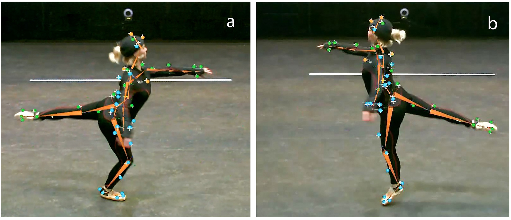
<p class="caption">(\#fig:chapDancerdancer1)Arabesque figure in ASIL, the art and science lab at UGent</p>
</div>

Obviously, the data of three ballerinas is extremely meager. However, we draw upon repeated measure and confine our main conclusions to this limited population.
In the Odile variation, the *Promenade in Arabesque* occurs twice, and these dance fragments are here called F1 and F2. As shown in figures \@ref(fig:chapDancerfragment1) and \@ref(fig:chapDancerfragment2), each fragment has a repeated phrase. F1 has a phrase structure of the form A,B,A,B while F2 has A,B,A,C', with C being a phrase leading to an different part of the piece.
Dancers were requested to perform 12 times the *Promenade in Arabesque* as an isolated figure (I.F1), followed by the entire Odile variation isolation in which F1 and F2 are embedded in succession. 

Note that the repeats occur, both at the level of fragments, and at the level of the phrases within the fragments. Moreover, dancers are requested to perform the task 12 times. 

The repeated measures design thus implies 12 trials of the entire task and it might be of interest to check whether these trials generate any additional effect over the measurement, for example, due to fatigue.
Of these 12 trials, we exclude trial 5 and trial 8 because these trials entailed an experimental manipulation that is not relevant in the present study. 


<div class="figure" style="text-align: center">
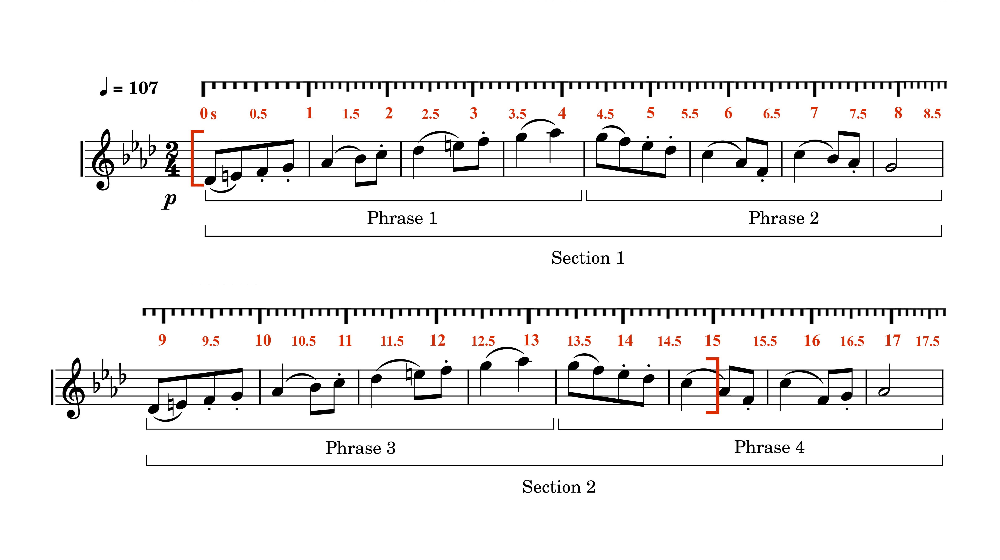
<p class="caption">(\#fig:chapDancerfragment1)Fragment F1</p>
</div>

<div class="figure" style="text-align: center">
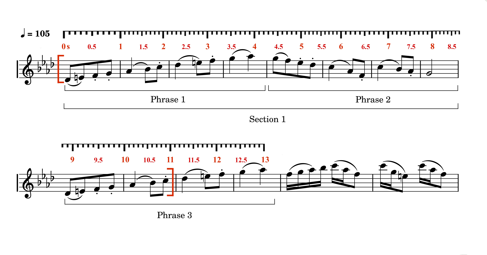
<p class="caption">(\#fig:chapDancerfragment2)Fragment F2</p>
</div>

## Hypotheses

With statistical modelling we aim at figuring out whether (i) fragments are different, (ii) phrases within fragments are different,
and whether there is (iii) a bias over trials due to repeated measures.
These questions may be formulated as hypotheses of expectations based on the above theoretical considerations:

- hypothesis 1: fragments are different, because we assume that a prediction model will influence the micro-timing, allowing for more anticipation.

- hypothesis 2: phrases within fragments are different, because we assume that a prediction model will influence the micro-timing allowing for more anticipation.

- hypothesis 3: trails show a bias towards less anticipation due to fatigue.

## Data

Given the focus on timing, the performance can be reduced to the time at which events occur. 
The musical event is the beat-onset and in this study, it is measured manually by experts.

The dance event is either a heel_up or heel_down event. The heel_up event occurs when the vertical displacement of the heel is maximal, while the heel_down event occurs when the vertical displacement of the heel is minimal, when touching the ground. Heel movement is measured by a motion caption system using infra-red reflexive markers that allow an accurate measurement of position in millimeters and time in milliseconds. Given the 3-dimensional motion caption signal of the heel, the vertical dimension suffices to extract the time at which maximum and minimum values occur. These are the time indications for the heel_up and heel_down events.

Accordingly, the data look like:
<table class="table table-striped" style="font-size: 10px; margin-left: auto; margin-right: auto;">
<caption style="font-size: initial !important;">(\#tab:chapDancerdata1)Dataset dancer</caption>
 <thead>
  <tr>
   <th style="text-align:right;"> phase </th>
   <th style="text-align:right;"> time0 </th>
   <th style="text-align:left;"> Fragment </th>
   <th style="text-align:left;"> Participant </th>
   <th style="text-align:left;"> Heel </th>
   <th style="text-align:left;"> Trialf </th>
  </tr>
 </thead>
<tbody>
  <tr>
   <td style="text-align:right;"> 2.99 </td>
   <td style="text-align:right;"> 0.27 </td>
   <td style="text-align:left;"> F1 </td>
   <td style="text-align:left;"> P2 </td>
   <td style="text-align:left;"> HeelsDown </td>
   <td style="text-align:left;"> 01 </td>
  </tr>
  <tr>
   <td style="text-align:right;"> 2.18 </td>
   <td style="text-align:right;"> 0.76 </td>
   <td style="text-align:left;"> F1 </td>
   <td style="text-align:left;"> P2 </td>
   <td style="text-align:left;"> HeelsDown </td>
   <td style="text-align:left;"> 01 </td>
  </tr>
  <tr>
   <td style="text-align:right;"> 1.73 </td>
   <td style="text-align:right;"> 1.28 </td>
   <td style="text-align:left;"> F1 </td>
   <td style="text-align:left;"> P2 </td>
   <td style="text-align:left;"> HeelsDown </td>
   <td style="text-align:left;"> 01 </td>
  </tr>
  <tr>
   <td style="text-align:right;"> 1.35 </td>
   <td style="text-align:right;"> 1.81 </td>
   <td style="text-align:left;"> F1 </td>
   <td style="text-align:left;"> P2 </td>
   <td style="text-align:left;"> HeelsDown </td>
   <td style="text-align:left;"> 01 </td>
  </tr>
  <tr>
   <td style="text-align:right;"> 0.43 </td>
   <td style="text-align:right;"> 2.28 </td>
   <td style="text-align:left;"> F1 </td>
   <td style="text-align:left;"> P2 </td>
   <td style="text-align:left;"> HeelsDown </td>
   <td style="text-align:left;"> 01 </td>
  </tr>
  <tr>
   <td style="text-align:right;"> 6.12 </td>
   <td style="text-align:right;"> 2.79 </td>
   <td style="text-align:left;"> F1 </td>
   <td style="text-align:left;"> P2 </td>
   <td style="text-align:left;"> HeelsDown </td>
   <td style="text-align:left;"> 01 </td>
  </tr>
</tbody>
</table>

The column indicated as `phase` holds the relative phase, that is, the time of the heel event relative to the time of the previous musical beat event in a context defined by the next musical beat event, multiplied by $2\pi$, expressed in a range of $[0,2\pi]rad$, see formula
\@ref(eq:chapModellingEquationRelPhase).

The column indicated as `time0` holds the time of the events from the start of the fragment.
Then we have the factors `Fragment`, `Participant`, `Heel`, and `Trialf`. 
`Fragment` has 3 levels ("I.F1", "F1", "F2") indicating the 3 fragments, 
`Particpant` has 3 levels ("P2", "P3", "P4"), indicating 3 participants, 
`Heel` has 2 levels ("HeelsUp", "HeelsDown"), and 
`Trialf` has 12 levels ("01", "02", "03", "04", "05", "06", "07", "08", "09", "10", "11", "12"). As mentioned, trial "05" and "08" are not in the dataset.


A visual representation of heel_down events per fragment, including all participants and trials, is shown in figure \@ref(fig:chapDancerDataplot1). The right panel has its axis and data rotated so that $0 [rad]$ appears in the middle of the vertical axis, using the formula for rotating the axis and data, see equation \@ref(eq:chapModellingEquationPhaseRotation). 
In what follows, we always use this rotated representation to represent the relative phase.

<div class="figure" style="text-align: center">
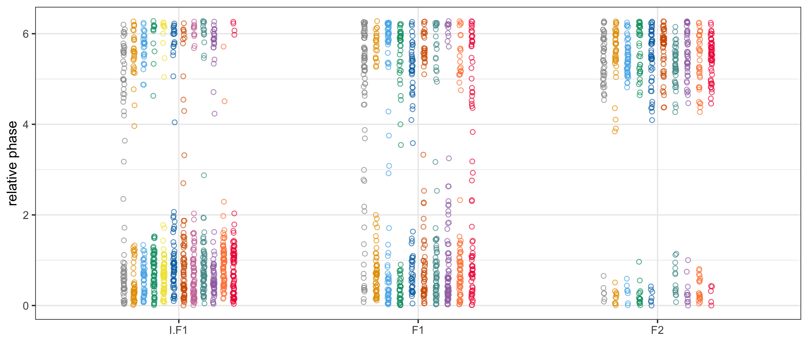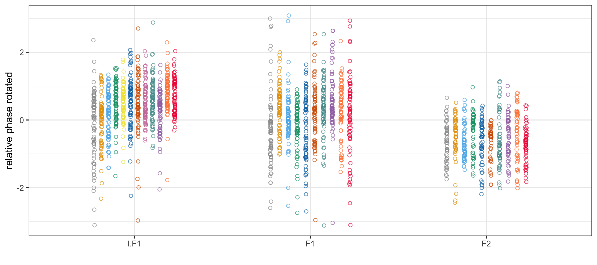
<p class="caption">(\#fig:chapDancerDataplot1)Plot of all relative phase of heel-down events for fragments IF1, F1 and F2, (top) on a scale from 0 to 2pi, (bottom) on a scale from -pi to +pi.</p>
</div>

This view on the data immediately suggests that fragments might indeed be different from each other. At first sight, a difference can be observed between F1 and F2, with lower relative phase values in F2 than in F1. Lower values imply a shorter delay, and eventually a larger anticipation, of the heel-down event, given the beat event. 

In addition to this overall trend, the different trials per fragment, here represented as colored vertical circles next to each other, suggest a trend towards higher values. This implies more delay and less anticipation with respect to the musical beat. Although the trend is somewhat more prominent in I.F1 compared to F1 and F2, it doesn't overrule the major difference between fragments.
Recall that the difference between fragments might be due to anticipation/prediction mechanisms. However, the trend over trials, clearly visible in I.F1, may be due to fatigue.

But let's proceed with a further inspection of our data. Consider how heel events evolve over time. In figure \@ref(fig:chapDancerDataplot2), a view of the heel-down events of trial 1 of F1 is shown next to a view of all trials of F1. The horizontal axis is the time starting from the beginning of fragment F1.
The vertical axis is again the phase of the heel-down event relative to the musical beat event, expressed in radians. Note that the vertical lines are slightly tilted to the right. That's because time and relative phase are related. 


<div class="figure" style="text-align: center">
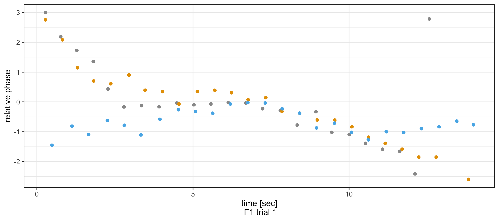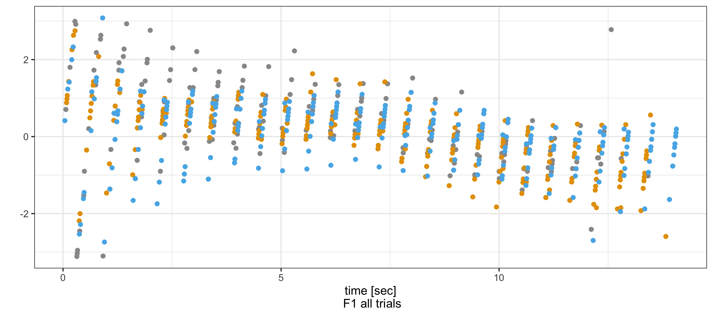
<p class="caption">(\#fig:chapDancerDataplot2)Plot of heel-down events of three different dancers for fragment F1, (top) one single trial, (bottom) all trials</p>
</div>

The figure reveals that relative phase decreases as time proceeds, suggesting that the micro-timing changes as the performance proceeds. In the left picture, it is suggestive to see a change in relative phase values around about 8-9 seconds. The dots appearing between 0 and 8 seconds seem to be higher than the dots appearing between 9 and 16 seconds. These correspond to phrase 1-2 and phrase 3-4 in figure \@ref(fig:chapDancerfragment2). 

Overall, the visualization of the data suggests that our hypotheses could probably be confirmed by solid quantitative tests using statistical modelling.

## Regression

Our goal is to find a statistical support for the trends observed in the data.
Our first focus is on fragments.
The idea is to extract the mean and variance for each fragment from the data, disregarding the variance that is possibly due to repeated measures.
A comparison will reveal whether fragments are different among conditions.
This analysis is similar to an ANOVA, except that our data is circular, and that we use a hierarchical distributional approach. We have a group-level variable `Trialf` and we model the two parameters of the `von Mises` response distribution model which are the mean of `Phase`, and `kappa`, a scale parameters of the model. In the next section, we will add time.

### Model {-}

The model specification in `brms` is shown here:


``` r
formula = bf(Phase ~ 1 + Fragment * Participant * Heel + (1| Trialf),
kappa ~ 1 + Fragment * Participant * Heel + (1 | Trialf))
family = von_mises()
```


The first line says that we have `Phase` as response, and `Fragment`, `Participant`, `Heel` and `Trialf` as predictors. The intercept, indicated by 1 in the syntax, captures the overall mean in the data. 
The predictors `Fragment`, `Participant`, `Heel` have corresponding parameters that reveal population-level effects.
The predictor `Trialf` has a corresponding parameter that reveals a group-level effect, that is, an effect among the levels of `Trialf`, assuming a normal distribution for its variability. 

The second line says that we also have `kappa` as response, using the same specification of predictors as in the top part. 
Given a circular response distribution, the link function is *von_mises*, and the parameter corresponding to the gaussian `sigma` is called `kappa`.
It is defined as:
$$
f(x | \mu, \kappa) = \frac{1}{2\pi I_0(\kappa)} \exp(\kappa \cos(x - \mu))
$$
Where:
$x$ is the observed value on the unit circle (an angle),
$\mu$ is the mean direction parameter,
$\kappa$ is the concentration parameter (which measures the dispersion of the distribution), and
$I_0(\kappa)$ is the modified Bessel function of order 0:
$$
I_0(\kappa) = \frac{1}{\pi} \int_{0}^{2\pi} e^{\kappa \cos(\theta)} d\theta
$$

With a non-circular regression model, we would have used a *gaussian* link function with `sigma` as a specification of the variance parameter. 
The code is found in `Code/chapDancer/chapDancer_04_Modelling.R`.


The alert reader may object that our data, as shown in figure \@ref(fig:chapDancerDataplot1) doesn't need a circular link function because the data look very much gaussian. That's true and therefore, a non-circular model with a gaussian link function may work for this data. However, when considering the entire dataset,  including heels-up events, circularity pops up more clearly, with many data points below and on top of the figure. For that reason, a circular model is a better choice to apply to the entire dataset.

### Model check {-}
It is useful to check how good the response distribution is fitted, using a visual tool called `pp_check()` in `brms`. 
The posterior predictive check shows the model's prediction of that response. 
In the following figure we see that the fit to the response (`yrep` to `y`), is acceptable.


<div class="figure">
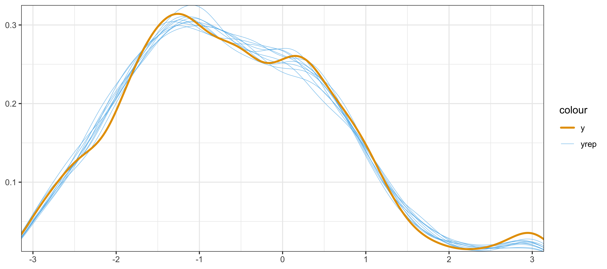
<p class="caption">(\#fig:chapDancerModel1PPcheck)Posterior predictive check</p>
</div>


### Model plotting {-}

Figure \@ref(fig:chapDancermodel1Fragments) shows the results of applying the model to the dataset in two figures. The cloud of points is just from the data. The modelling result is specified in terms of big dots and error bars. To extract the correct data for the correct predicted mean and the critical interval (CI-95%) of these means, per group, from the posterior, we can use circular statistics. The two figures show the difference between using this circular statistics and not using this circular statistics, or using the regular plotting routines instead. There are slight differences due to the circularity of the data. Recall that a CI-95% means that estimates of the mean fall in this interval in 95% of the cases. The way to calculate this can be found in `Code/chapDancer/chapDancer_05_ModelPlotting.R`.


<div class="figure" style="text-align: center">
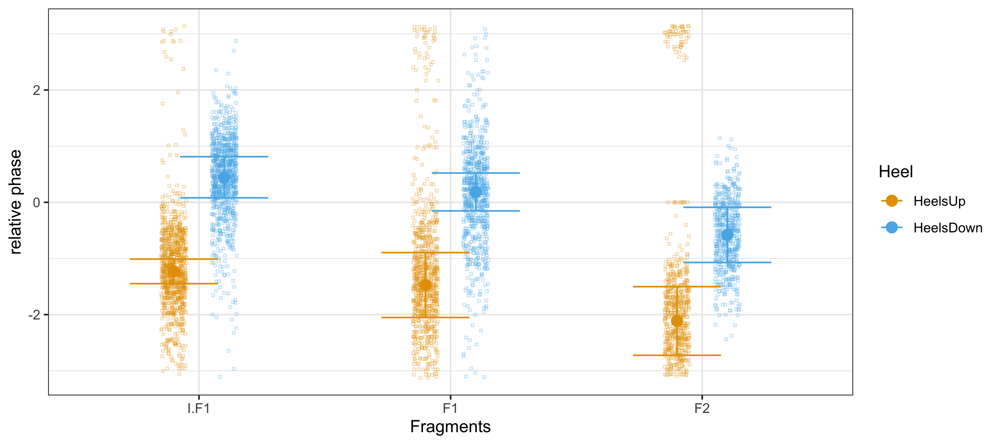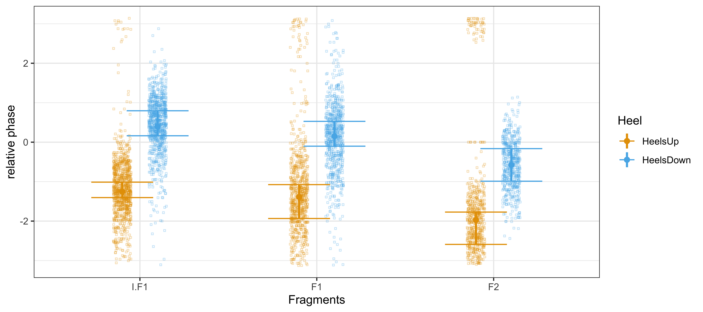
<p class="caption">(\#fig:chapDancermodel1Fragments)Mean and variance of heel conditions in fragments. Circular (left) versus non-circular (right) statistics on posterior</p>
</div>

In the next figure \@ref(fig:chapDancermodel1FragmentsParticipants) we go in more detail by looking at each participant in the fragments. We also use the circular statistics for plotting, although the difference with non-circular plotting can be neglected.

We plot two error bars per mean. 
The one with the large horizontal lines shows the CI-95% when the variance of `Trialf` is *included.* 
The error bar with the short horizontal lines shows the CI-95% when the variance of `Trialf` is *excluded.* 
The difference between the two error bars suggests the group-level effect, that is, the effect of repeated measures. 

We are now ready to calculate contrasts that show differences among fragments.

<div class="figure" style="text-align: center">
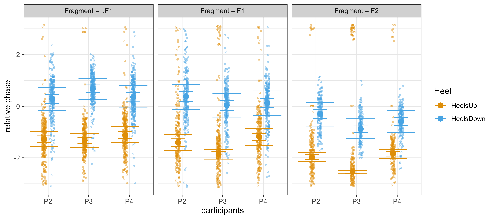
<p class="caption">(\#fig:chapDancermodel1FragmentsParticipants)Showing mean and variance for each dancer among fragments</p>
</div>

Before we proceed, we briefly summarize what we did so far.
First, to retrieve the posterior predictive distributions we use the `brms` function `epred_draws()`. It uses the fitted model and a dataset to generate draws from the expected value of the posterior distribution. This piece of code can be found in `Code/chapDancer/chapDancer_05_ModelPlotting.R`:


``` r
model1 <- readRDS("Fitted/chapDancer_Model1.rds")
pred_NULL <-
  epred_draws(model1, newdata = LL_data_1_2, re_formula = NULL, ndraws = 500, prob = .95) %>%
  ungroup() %>%
  dplyr::select(Heel, Fragment, Participant, .epred)
```

First we read the posterior of the fitted model and call it `model1.`
Next we sample from the posterior 500 samples (`ndraws` = 500, per Heel, Fragment, Participant), including all group-level effects (`re_formula` = NULL), using a critical interval of `prob` = .95.
The data frame to generate predictions from is the same as the data frame used for fitting the model: `newdata` = LL_data_1_2. The fitted Bayesian model is `model1.`
We `ungroup` the data frame, select the relevant parameters, and store the results in `pred_NULL`.
This data frame contains a total of 2221000 observations of `.epred` for the factors `Heel`, `Fragment` and `Participant.` 

We then calculate the circular mean and CI-95% from these `.epred` values.
We have to be careful that we take the factors into account:


``` r
  predsum_NULL <- pred_NULL  %>% group_by(Fragment, Heel, Participant) %>% 
    summarize(mean_angle = mean.circular(.epred),
              sd_angle = sd.circular(.epred), 
              len = n()) %>% ungroup()
  
  pred_NULL <- predsum_NULL %>% group_by(Fragment, Heel, Participant) %>% 
    mutate(ci.lower = mean_angle - 1.96 * sd_angle ,
           ci.upper = mean_angle + 1.96 * sd_angle )
```

Note that these calculations draw upon the R-package `circular` to calculate the mean and the standard deviation of the circular scale, and CI-95% from the standard deviation.
Basically, what it does is very similar to the calculations discussed in chapter \@ref(chapModelling). To calculate the mean,
each observation is treated as a unit vector, or point on the unit circle. The resultant vector of the observations is found, and the direction of the resultant vector is returned. We called it the synchronization delay $\alpha$.
The standard deviation is defined as the square root of minus 2 times the log of the mean resultant length $R$ divided by the number of observations.
Given `predsum_NULL` we then use a simple formula to go fron standard deviation to CI-95%.

### Contrasts {-}

Using the R-package `brms`, contrasts can be estimated by considering the difference between two posterior predictive distributions, as drawn from a fitted model's predictions. We prefer this method rather than looking at the posterior distributions of the model parameters because these distributions can be hard to interpret when the model is complex. A way to retrieve these posterior predictive distributions is via `posterior_epred()`. It computes summaries of draws of the expected value (i.e., the mean) of the posterior predictive distribution. Alternatively one can use `epred_draws() %>% median_qi()`. The latter takes raw draws and summarizes them.

Figure \@ref(fig:chapDancerContrastFragmentsFigureA) illustrates how it works with a contrast between two ballet fragments, I.F1 and F1, using the heels-down condition. 
On top, we have the posterior predictive distributions of the mean for two segments called `seg1` and `seg2`, standing for I.F1 and F1, respectively. 

In order to get distributions with an equal number of samples -- which we need to subtract both distributions (see below) -- we define the two counterfactual datasets with an equal number of time points in the segment, regardless of segment duration of the original data.
Assuming that `data_seg1` and `datseg2` contain all the data of segment 1 and segment 2, we calculate the new data frame using a data_grid, as follows:


``` r
newdata_seg1 <- data_seg1 %>% 
  data_grid(Timeregion, Trialf, Participant, Fragment, Heel, 
            time0 = seq_range(time0, 25))
newdata_seg2 <- data_seg2 %>% 
  data_grid(Timeregion, Trialf, Participant, Fragment, Heel, 
            time0 = seq_range(time0, 25))
```

Accordingly, the fitted model can now be used to generalize over the specified time points of the new data, and thus generate the wanted predictions, which are stored in `pp_seg1` and `pp_seg2.` 


``` r
pp_seg1 <- posterior_epred(fit, newdata = newdata_seg1, re_formula = NA) 
pp_seg2 <- posterior_epred(fit, newdata = newdata_seg2, re_formula = NA)
```

Details are provided in `Code/chapDancer/chapDancer_06_Contrasts.R` where we do also the plotting.

Consider figure \@ref(fig:chapDancerContrastFragmentsFigureA) where I.F1 and F1 Heelsdown are shown.
For `seg1` (I.F1), the mean is about $0.44 [rad]$, while for `seg2` (F1), it is about $0.21 [rad]$. Subtracting the distributions implies that we have an equal amount of draws in both distributions (which we have meanwhile) and that we subtract the (randomly drawn) samples from both.

```{reval=FALSE, include=TRUE}
diff_seg12 <- pp_seg1 - pp_seg2 %>% data.frame()
```


This gives a new distribution `diff_seg12` which represents `seg1 - seg2`.
The units are also in radians, indicating a contrast between `seg1` and `seg2.` 
The probability mass of this distribution is above zero, with a mean difference close to $0.23 [rad]$. 
That means that there is a strong support for a contrast between segments, meaning that `seg1` has higher values than `seg2`, or higher relative phase, implying that `seg2` is more anticipative.

Assume that the posterior distributions would have overlapped more, then it is likely that many samples from one distribution would be close to many samples of the other distribution, generating values of zero or close to zero. Accordingly, zero would come in the picture and not all of the probability mass would be positive, or negative.
When 95% of the probability mass is either positive or negative (this is called: probability direction, or *pd*) then there is strong support for a high contrast. But this percentage is a matter of choice^[Depending on the context, 90% can be used, or 89% as in McElreath (2020).]. 

The `data` panel shows a thumbnail of the events over time, just to have an additional check of what we are talking about: the posterior distributions obviously apply to the means in these data, regardless of time.

<div class="figure" style="text-align: center">
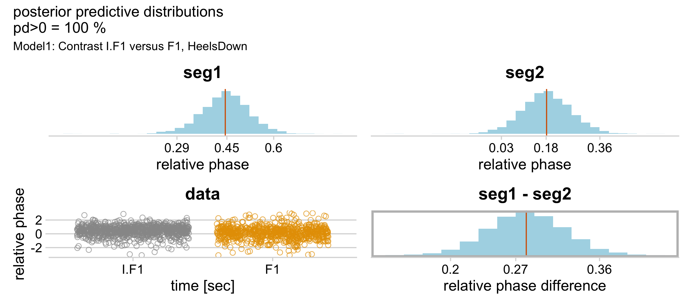
<p class="caption">(\#fig:chapDancerContrastFragmentsFigureA)Contrasts (see text for explanation)</p>
</div>

<!-- # ```{r chapDancerContrastFragmentsFigureB, echo=FALSE, fig.align='center', fig.asp=.75, fig.cap='Contrasts', warning=FALSE, out.width='49%'} -->
<!-- #  -->
<!-- #   knitr::include_graphics("Figures/chapDancer_ContrastFragments_test_2.png") -->
<!-- #  -->
<!-- # # \@ref(fig:chapDancerContrastFragmentsFigureB) -->
<!-- # ``` -->
<!-- #  -->
<!-- #  -->
<!-- # ```{r chapDancerContrastFragmentsFigureC, echo=FALSE, fig.align='center', fig.asp=.75, fig.cap='Contrast', warning=FALSE, out.width='49%'} -->
<!-- #  -->
<!-- #   knitr::include_graphics("Figures/chapDancer_ContrastFragments_test_3.png") -->
<!-- #  -->
<!-- # # \@ref(fig:chapDancerContrastFragmentsFigureC) -->
<!-- # ``` -->

<!-- ```{r} -->
<!-- pp_check(model1) -->
<!-- ``` -->

Table \@ref(tab:chapDancerTableContrasts1) shows some contrasts among fragments for the heels-down condition. The labels `est1` and `est2` show the mean of the posterior predictive distributions for the fragments indicated, and `estdiff` is the mean of the difference distribution, with `pd>0` indicating the probability mass of `estdiff` above zero, expressed as percentage.

<table class="table table-striped" style="font-size: 10px; margin-left: auto; margin-right: auto;">
<caption style="font-size: initial !important;">(\#tab:chapDancerTableContrasts1)Contrasts among fragments for the heel-down condition</caption>
 <thead>
  <tr>
   <th style="text-align:left;"> fragment </th>
   <th style="text-align:right;"> est1 </th>
   <th style="text-align:right;"> est2 </th>
   <th style="text-align:right;"> estdiff </th>
   <th style="text-align:right;"> pd&gt;0 </th>
  </tr>
 </thead>
<tbody>
  <tr>
   <td style="text-align:left;"> I.F1, F1 </td>
   <td style="text-align:right;"> 0.45 </td>
   <td style="text-align:right;"> 0.18 </td>
   <td style="text-align:right;"> 0.27 </td>
   <td style="text-align:right;"> 100 </td>
  </tr>
  <tr>
   <td style="text-align:left;"> F1, F2 </td>
   <td style="text-align:right;"> 0.18 </td>
   <td style="text-align:right;"> -0.58 </td>
   <td style="text-align:right;"> 0.78 </td>
   <td style="text-align:right;"> 100 </td>
  </tr>
  <tr>
   <td style="text-align:left;"> I.F1, F2 </td>
   <td style="text-align:right;"> 0.45 </td>
   <td style="text-align:right;"> -0.58 </td>
   <td style="text-align:right;"> 1.06 </td>
   <td style="text-align:right;"> 100 </td>
  </tr>
</tbody>
</table>
In this table it is easy to see that the fragments contrast, with size of the contrast in radians.

## Smooth regression

A slightly more advanced type of modelling is obtained when mean and variance are calculated over time, for each fragment, over all trials, and all participants, using the circular representation of the relative phase of the heel-beat events.
This can be done with smooth regression modelling: (i) calculate the mean over time of a music-dance phrase, (ii) give us a mean where variance due to repeated measures has been eliminated, allow for (iii) contrast checks of music-dance phrases.

### Model

The model has a smooth term specified by `time0`, the time in seconds of each fragment, starting from zero. The smooth term accounts for a factor called `HeelFragment`, which specifies all interactions between Heel and Fragment as levels. A simple way to handle this interaction is to create a new column `HeelFragment` in the data set with the interaction defined as a factor.


The model specification thus contains a general intercept for the overall mean, an intercept per level in `HeelFragment`, and a smooth term over time for each level in `HeelFragment`. In addition, the variance is modeled per participant, with repeated measures related to each participant. The notation `1|Participant/Trialf` is equal to `1|Participant + 1|Participant:Trialf` and it means that the variance among participants is accounted for by assuming that it is drawn from a normal distribution. In other words, the trials are nested within each participant and it is assumed that also these trials can be drawn from a normal distribution.


``` r
formula = bf(Phase1 ~ 1 + HeelFragment + s(time0, by = HeelFragment) + 
               (1  |  Participant/Trialf ),
             kappa ~ 1 + HeelFragment + s(time0, by = HeelFragment) + 
               (1  |  Participant/Trialf ) )
family = von_mises()
```


The model is computational intensive and therefore, we ran it on our server rather than on our laptop.
The calculated model comes with the code in `Code/chapDancer/chapDancer_02_ModelPlotting.R`.

### Model plotting

<div class="figure" style="text-align: center">
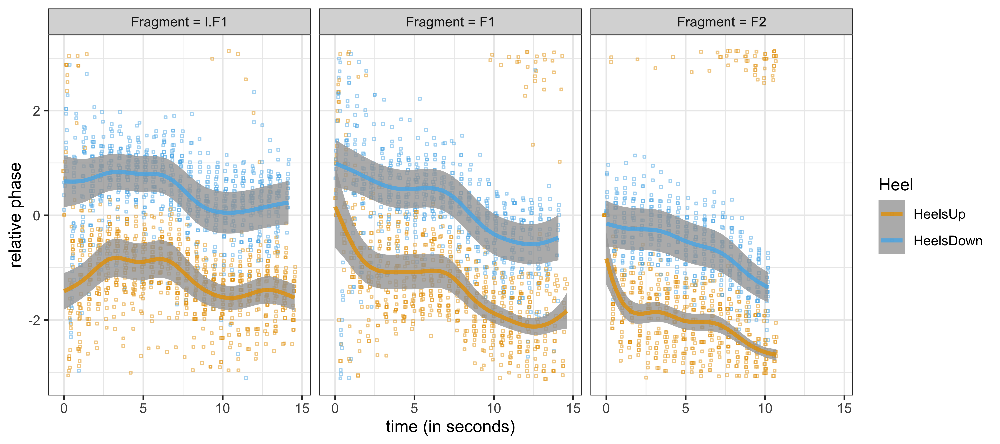
<p class="caption">(\#fig:chapDancermodel3FragmentsParticipants)Showing floating mean and variance for each dancer among fragments</p>
</div>

Figure \@ref(fig:chapDancermodel3FragmentsParticipants) now shows the heel events as colored dots, with lines indicating the mean over time, and grey bands indicating the uncertainty of the mean (95%-CI). 

An inspection of this figure suggests a plateau between about 3 to 8 seconds, and another one between 9 and 15 seconds (except for F2 where the data stop at 11 seconds). Now the question is whether these plateau's can be substantiated in terms of a statistical contrast.

### Contrasts

Figure \@ref(fig:chapDancerContrastFigure1)
shows the contrasts of two segments, with time intervals identified as `seg1` = $[2.51, 4.25]sec$ and `seg2` = $[4.26, 6.00]sec$ in fragment F2 and for heels-down.
The figure shows the posterior distribution of the mean for `seg1` and `seg2`, as well as the difference in distribution as `seg1 - seg2`. The panel of `data` shows thumbnails of the fragments with the `seg1` and `seg2` indicated in red. 
If the distribution corresponding to `seg1 - seg2` does not include zero, or the probability mass at one side of zero is equal or higher than 95% then there is a strong support for the claim that the means are different.
In this example, the segments are different from each other.  


<div class="figure" style="text-align: center">
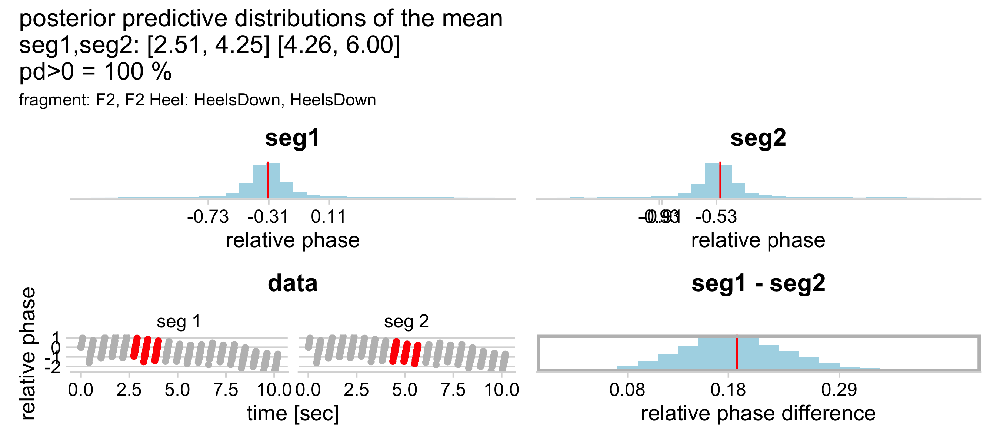
<p class="caption">(\#fig:chapDancerContrastFigure1)Contrast of two segments</p>
</div>

A summary table provides all the information we need at this moment.
The label `fragment`
indicates the fragment of the segments contrasted,
the label `contrast` shows the times of the segments contrasted, for example the segment from $[0.00, 4.25]s$ versus the segment from $[9.00, 13.25]s$.
The labels `est`, `est2` and `estdiff` show the estimated mean of the first and second segment, and the difference, and  `pd>0` is the probability of direction greater than zero.

<table class="table table-striped" style="font-size: 10px; margin-left: auto; margin-right: auto;">
<caption style="font-size: initial !important;">(\#tab:chapDancerTableContrasts2)Contrasts among time segments for the heel-down condition</caption>
 <thead>
  <tr>
   <th style="text-align:left;"> fragment </th>
   <th style="text-align:left;"> contrast </th>
   <th style="text-align:right;"> est1 </th>
   <th style="text-align:right;"> est2 </th>
   <th style="text-align:right;"> estdiff </th>
   <th style="text-align:right;"> pd&gt;0 </th>
  </tr>
 </thead>
<tbody>
  <tr>
   <td style="text-align:left;"> I.F1, I.F1 </td>
   <td style="text-align:left;"> [0.00, 4.25] [9.00, 13.25] </td>
   <td style="text-align:right;"> 0.74 </td>
   <td style="text-align:right;"> 0.08 </td>
   <td style="text-align:right;"> 0.65 </td>
   <td style="text-align:right;"> 100.00 </td>
  </tr>
  <tr>
   <td style="text-align:left;"> I.F1, I.F1 </td>
   <td style="text-align:left;"> [4.26, 6.00] [13.26, 15.00] </td>
   <td style="text-align:right;"> 0.79 </td>
   <td style="text-align:right;"> 0.23 </td>
   <td style="text-align:right;"> 0.58 </td>
   <td style="text-align:right;"> 100.00 </td>
  </tr>
  <tr>
   <td style="text-align:left;"> I.F1, I.F1 </td>
   <td style="text-align:left;"> [2.51, 4.25] [4.26, 6.00] </td>
   <td style="text-align:right;"> 0.81 </td>
   <td style="text-align:right;"> 0.79 </td>
   <td style="text-align:right;"> 0.03 </td>
   <td style="text-align:right;"> 74.18 </td>
  </tr>
  <tr>
   <td style="text-align:left;"> I.F1, I.F1 </td>
   <td style="text-align:left;"> [11.51, 13.25] [13.26, 15] </td>
   <td style="text-align:right;"> 0.13 </td>
   <td style="text-align:right;"> 0.23 </td>
   <td style="text-align:right;"> -0.08 </td>
   <td style="text-align:right;"> 9.94 </td>
  </tr>
  <tr>
   <td style="text-align:left;"> F1, F1 </td>
   <td style="text-align:left;"> [0.00, 4.25] [9.00, 13.25] </td>
   <td style="text-align:right;"> 0.72 </td>
   <td style="text-align:right;"> -0.46 </td>
   <td style="text-align:right;"> 1.15 </td>
   <td style="text-align:right;"> 100.00 </td>
  </tr>
  <tr>
   <td style="text-align:left;"> F1, F1 </td>
   <td style="text-align:left;"> [4.26, 6.00] [13.26, 15.00] </td>
   <td style="text-align:right;"> 0.51 </td>
   <td style="text-align:right;"> -0.50 </td>
   <td style="text-align:right;"> 0.97 </td>
   <td style="text-align:right;"> 100.00 </td>
  </tr>
  <tr>
   <td style="text-align:left;"> F1, F1 </td>
   <td style="text-align:left;"> [2.51, 4.25] [4.26, 6.00] </td>
   <td style="text-align:right;"> 0.55 </td>
   <td style="text-align:right;"> 0.51 </td>
   <td style="text-align:right;"> 0.04 </td>
   <td style="text-align:right;"> 82.90 </td>
  </tr>
  <tr>
   <td style="text-align:left;"> F1, F1 </td>
   <td style="text-align:left;"> [11.51, 13.25] [13.26, 15] </td>
   <td style="text-align:right;"> -0.58 </td>
   <td style="text-align:right;"> -0.50 </td>
   <td style="text-align:right;"> -0.07 </td>
   <td style="text-align:right;"> 15.96 </td>
  </tr>
  <tr>
   <td style="text-align:left;"> F2, F2 </td>
   <td style="text-align:left;"> [0.00, 4.25] [9.00, 13.25] </td>
   <td style="text-align:right;"> -0.28 </td>
   <td style="text-align:right;"> -1.30 </td>
   <td style="text-align:right;"> 1.01 </td>
   <td style="text-align:right;"> 100.00 </td>
  </tr>
  <tr>
   <td style="text-align:left;"> F2, F2 </td>
   <td style="text-align:left;"> [2.51, 4.25] [4.26, 6.00] </td>
   <td style="text-align:right;"> -0.31 </td>
   <td style="text-align:right;"> -0.53 </td>
   <td style="text-align:right;"> 0.18 </td>
   <td style="text-align:right;"> 100.00 </td>
  </tr>
</tbody>
</table>

Table \@ref(tab:chapDancerTableContrasts2) is best understood in reference to 
figure \@ref(fig:chapDancerfragment1).
In that figure, we have indicated sections and phrases within fragments.
Phrase 1 is repeated in phrase 3, and phrase 2 is repeated in phrase 4. 

The time segments defined in table \@ref(tab:chapDancerTableContrasts2) correspond more or less with these phrase indications.
The table shows that
segments corresponding with repeats in phrases show contrast, while segments not corresponding with repeats in phrases show no contrast.
These findings are in support of hypothesis 2, that phrases within fragments are different. We assumed that a prediction model influences the micro-timing allowing for more anticipation.

We repeat that a key aspect of the computation is based on drawing posterior predictive distributions such that segments can be compared on the basis of an equal number of samples spread over the segment.
With `data_grid()` it is then possible to generate an evenly spaced grid of new data points using the model. Why? Because we have a model. Even if the segments have different intervals of time, or if they would have missing data points, this grid can be used to draw posterior predictive distributions, which can then be compared with each other. 

## Conclusion

Given our current knowledge about sensory-motor synchronization, memory and anticipation/prediction, contrast analysis seems to support the idea that a sequence establishes a micro-timing model in the dancer. When the sequence is repeated shortly after, the established micro-timing model facilitates the timing events for that sequence, which translates to a subtle shift in relative phase, in a direction suggesting increase in anticipation. Statistical modelling allows for dealing with circularity in the response (relative phase in radians) and having a hierarchical representation of repeated measures nested within subjects with different variances in conditions. The resulting model could be called *circular-linear hierarchical distributional smooth regression* but that's too long for a name, isn't it?

Overall, the question whether repeats in a musical sequence somehow influence the micro-timing of synchronization is a step in understanding artistic expression in terms of an interaction between a cognitive and sensory-motor level. It could be useful in future technological *mirrors*, where dancers monitor their performances in order to become aware of their intuitions and perhaps fine-tune their artistic espression on that basis.

Finally, we introduce our theory of self-augmented interactions. The present results indicate that sequences influence micro-timing in the direction of increased anticipation. Given that anticipation is often linked to arousal and satisfaction, it appears that structure may enhance the interaction, providing a boost for augmentation.

<!-- ## References -->
<!-- Tabeli et al. (2023), -->
<!-- McElreath (2020) -->
