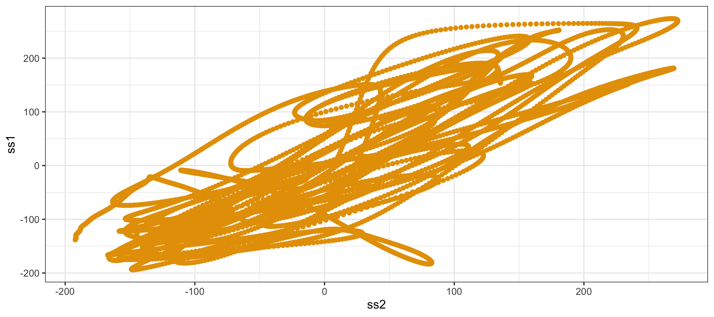

# Two violin players' haptic feedback{#chapExoskeletons}

In this chapter^[Thanks to A. Michalko and A. Campo for their significant contribution to this and other related experiments in the CONBOTS project. See Michałko et al. (2024), Campo et al. (submitted)], we examine mutual interactions between musicians using futuristic equipment: exoskeletons. With these devices, we study the effect of haptics on music playing, in addition to the natural auditory and visual modalities.

In a typical setting, two violinists playing together rely on hearing and seeing each other, thus involving the auditory and visual modalities to co-regulate their actions. However, when a violinist is equipped with an exoskeleton mounted around the right arm, it becomes possible to influence the bowing movements through forces exerted by the exoskeleton, as if somehow aiding the arm movement of the violinist. These forces stimulate the sense of movement, or haptics.

Consider what happens when two exoskeletons are connected. It is as if two violinists are helping each other move their arms. What would be the effect on their interaction?

Would the haptic modality contribute to co-regulation? Is it as strong as the visual or auditory modalities? Which of the three modalities provides the best feedback for synchronization?

Finally, we also consider whether the embodied connection through exoskeletons would contribute to self-augmented interactions. For example, by influencing each other's movements, it might be easier to achieve a desired synchronized interaction state.

The code can be found in the following scripts for data preparation and plotting, modelling and plotting, and contrast analysis and plotting:


``` r
source("Code/chapAll_00_Initialization.R")
source("Code/chapAll_01_Functions.R")
source("Code/chapExoskeletons/chapExoskeletons_02_DataPreparation.R")
source("Code/chapExoskeletons/chapExoskeletons_03_DataPlotting.R")
source("Code/chapExoskeletons/chapExoskeletons_04_Modelling.R")
source("Code/chapExoskeletons/chapExoskeletons_05_ModelPlotting.R")
source("Code/chapExoskeletons/chapExoskeletons_06_Contrasts.R")
```

## Unidirectional haptic feedback

<div class="figure" style="text-align: center">

<p class="caption">(\#fig:chapExoskeletonsTeacherStudent)(a) Teacher with exoskeleton and motion capture suit. (b) Student equipped with exoskeleton seeing a video for play-along</p>
</div>


Let us first introduce the exoskeleton shown in figure \@ref(fig:chapExoskeletonsTeacherStudent). It depicts a violinist equipped with a robotic arm mounted on the right arm. The cap and suit are unrelated to this exoskeleton. The white dots are markers of the motion capture system, containing tiny mirrors that reflect the infrared light of surrounding cameras. This setup provides kinematic measurements in addition to the force measurements obtained through the exoskeleton.

In this setup, the violinist imitates the movements of the teacher displayed on the screen. The configuration is similar to that discussed in chapter \@ref(chapViolinist), where a student synchronizes bowing gestures with a teacher. However, in this setup, both the teacher and the student are equipped with exoskeletons, and the teacher violinist transmits haptic information to the student violinist. In other words, the student both sees and feels the teacher's movements. The question is whether the haptic information enhances the student's learning experience. Campo et al. (submitted) demonstrate that haptic assistance indeed enhances learning outcomes.

## Bidirectional haptic feedback

We go one step further and consider what happens when two violinists have a haptic connection via exoskeletons, bi-directional. The latter means that both violinists feel and send haptic information to each other. The ultimate goal of [CONBOTS](https://www.conbots.eu)^[See the EU-project CONBOTS (CONnected through roBOTS, project nr. 871803, 2020-2024), https://www.conbots.eu.] was indeed to connect humans through exoskeletons, allowing for mutual haptic information exchange such that a common task can be executed. A common task could be: moving a heavy table, or playing a music piece, simple self-augmented interactions. 

The bi-directional connected exoskeletons realize a channel for mutual haptic feedback (also called: exoskeleton feedback) among violinist, for bowing movements.
Here, the question is whether exoskeleton feedback, or haptic control, is effective for playing a (polyphonic) music piece with synchronized bowing movements.

The statistical modelling needed to figure out which modality, or combination of modalities, works best is based on techniques that have been explored throughout several chapters.
This chapter is much of a rehearsal of the techniques, with some attention to signal conditioning, before statistical modelling is applied.

<div class="figure" style="text-align: center">

<p class="caption">(\#fig:chapExoskeletons0foto)Violinists equipped with exoskeletons (photo: Shalan Alhamwy)</p>
</div>

## Theory

Two violinists playing together act in a co-regulated way, meaning that their sensory-motor control is coordinated through feedback which they receive from each other's actions. In a natural setting, violinists would co-regulate their synchronized bowing movements using auditory and visual sensing. The feedback control is then mediated through the audio-visual modalities, by hearing and seeing. This sensory-motor feedback via auditory and/or visual sensing is indirect (or mediated) because it involves the translation from one modality (audio, visual) to another modality (motor).

The hypothesis is that exoskeleton feedback through haptic control offers an additional feedback mechanism that is effective for co-regulated action (bowing movements) because the exoskeleton provides direct (or non-mediated) sensory-motor feedback by directly impacting muscle activity.

It can be assumed that direct (non-mediated) feedback is more effective than indirect (mediated) feedback because the latter consumes more cognitive resources.

This is, in any case, a rather bold hypothesis. The demonstration of the effectiveness of exoskeleton feedback on co-regulated action would be a unique discovery with significant implications for domains requiring movement synchronization via co-regulated sensory-motor control of joint actions.

## Experiment 

The advantage of this hypothesis is that it can be tested empirically. Here is how this can be done. To test the hypothesis, an experiment was designed with four conditions involving different feedback modalities.

<table class="table table-striped" style="font-size: 10px; margin-left: auto; margin-right: auto;">
<caption style="font-size: initial !important;">(\#tab:chapExoskeletons1condi)Experimental setup</caption>
 <thead>
  <tr>
   <th style="text-align:left;"> Condition </th>
   <th style="text-align:left;"> audio </th>
   <th style="text-align:left;"> visual </th>
   <th style="text-align:left;"> exoskeleton </th>
  </tr>
 </thead>
<tbody>
  <tr>
   <td style="text-align:left;"> A </td>
   <td style="text-align:left;"> yes </td>
   <td style="text-align:left;"> no </td>
   <td style="text-align:left;"> no </td>
  </tr>
  <tr>
   <td style="text-align:left;"> AE </td>
   <td style="text-align:left;"> yes </td>
   <td style="text-align:left;"> no </td>
   <td style="text-align:left;"> yes </td>
  </tr>
  <tr>
   <td style="text-align:left;"> AV </td>
   <td style="text-align:left;"> yes </td>
   <td style="text-align:left;"> yes </td>
   <td style="text-align:left;"> no </td>
  </tr>
  <tr>
   <td style="text-align:left;"> AVE </td>
   <td style="text-align:left;"> yes </td>
   <td style="text-align:left;"> yes </td>
   <td style="text-align:left;"> yes </td>
  </tr>
</tbody>
</table>
As the table suggests, `A` stands for auditory feedback, `AE` for auditory and exoskeleton feedback, `AV` for auditory and visual feedback, `AVE` for auditory, visual, and exoskeleton feedback. Note that in all conditions we have auditory feedback. Playing violin without auditory feedback would be rather weird and non-natural. 


In total, 20 violin dyads participated in the study.

## Data
In what follows, we highlight (i) signal conditioning, (ii) feature extraction, and (iii) statistical modelling.

Our analysis strategy is based on the timing of both violins, measured through bowing movements.
The timing of both violins, or more particularly, the relative timine of both violins can be characterized in terms of their phase synchronization.
As discussed in chapter \@ref(chapModelling)) we can then make a distinction between
*synchronization strength* and *synchronization delay*.
The *strength* of synchronization provides information about how well both violinists are synchronizing.
The *delay* of synchronization provides information about the preferred time delay between both violinists. 

The relative timing can be extracted from bowing movements, using motion caption recording of the duet performances. 
Regression modelling (based on the R-package `brms`) can be used to check whether conditions are different. 

First we explain how the relevant timing information can be extracted from continuous movement signals.
We first explain it verbally, then we show the code in R.

### Signal conditioning {-}

Any raw input signal coming from a motion caption system needs to be processed and manipulated to prepare it for further statistical analysis, especially when dealing with phase, or relative time among musicians.

The raw motion data of interest come from markers attached to the violin and to the violin bow. The data come from infra-red camera's whose emitted infra-red light is reflected by the small mirrors on the surface of the marker. Based on the reflected infra-red light, the motion caption system can determine the position of each marker in a system of coordinates X, Y and Z, at a rate of 120 samples per second.

To determine synchronization among two violinists it is useful to prepare the data such that it gives the most efficient measure of synchronization.

Consider one violinist. We need to track the movement of the bow with respect to the violin. We attached one marker close to the frog of the bow, called the bow_marker. Additionally, we attached one marker on the violin in the direction where the bow moves, called the violin_marker. Clearly, recording the bow_marker alone is not sufficient because any movement of the body would translate to a movement of the bow_marker, even if the bow is not displaced relative to the violin. Therefore, we need to measure the relative movement based on the difference between the bow_marker and the violin_marker. Accordingly, when the body moves, the violin moves, and the bow can move relative to the violin.

We can then apply the following:

### Filtering {-}

As a first step, raw data are smoothed (filtered) because raw motion caption data of the X, Y and Z coordinates may contain small irregularities, or even missing data, due to measurement. Luckily our data don't contain missing values and so we just apply a filter, using a Nadaraya–Watson kernel regression estimate, with a bandwidth of .3. This filter is applied to all raw signals coming from a recorded performance. Here we use 3 coordinates from a bow-marker and 3 coordinates from a violin-marker, for 2 violinists. Accordingly, filtering is done on the 12 signals coming from the duet performances. The goal is now to reduce these 12 signals to only 2 signals, one per violinist, so that we can compare them in terms of synchronization.

<div class="figure" style="text-align: center">

<p class="caption">(\#fig:chapExoskeletonsBowViolinmarkers1)Displacement signals at 120 sa/sec of the X, Y and Z dimension of bow-marker (left) and violin-marker (right) as provided by the mocap recording, with smoothed signal on top of each signal to avoid peaks</p>
</div>
Figure \@ref(fig:chapExoskeletonsBowViolinmarkers1) shows the X, Y and Z axis for one single bow-marker and one single violin-marker. The horizontal axis is time in seconds, the vertical axis is displacement in millimeter. It's hard to see, but the red color is the original signal and the grey color is the filtered signal. Due to filtering, some red extremes become smoother. As we work with time, we try to avoid deformation of the signal. We follow the original as much as possible.

Then, we calculate per coordinate, the difference between bow-marker and violin-marker, and so we get 6 signals, three per violinist. 

### PCA {-}

In the next step, the goal is to reduce 3 coordinates per violinist to only one coordinate per violinist. The assumption here is that bowing has most of its movement in one direction, relative to the violin. This can be done by rotating the coordinate system such that we capture the bowing movement in the principal component of that rotated coordinate system. The approach is called PCA (principal component analysis).
Given the filtered coordinates (Xs1,Ys1,Zs1 and Xs2,Ys2,Zs2) the direction of the largest variance is determined, and scorings are computed for the first principal component. The output signals are $s1 = s1_n (n=1...N)$ and $s2 = s2_n (n=1...N)$, $n$ being an index for a sample. 

Figure \@ref(fig:chapExoskeletonsPCAextracted) shows how the signals in the three coordinates of a single violinist relate to the extracted signal (in gray).

<div class="figure" style="text-align: center">

<p class="caption">(\#fig:chapExoskeletonsPCAextracted)PCA-extracted signal (gray) compared to the original X, Y, Z signals (red)</p>
</div>

Figure \@ref(fig:chapExoskeletonss1s2A) shows  the extracted signal of two violin players in a dyad, during one performance, over time, and as correlated.

<div class="figure" style="text-align: center">

<p class="caption">(\#fig:chapExoskeletonss1s2A)Comparing the extracted bowing gesture movements of two violin players, (left) over time, (right) as correlated</p>
</div>

The resulting CONBOTS_exo2_dataset `Dat` contains data from dyads, with the conditioned signals s1 and s2 that form the basis for further feature extraction.


```
## tibble [4,382,362 × 42] (S3: tbl_df/tbl/data.frame)
##  $ Placeholder: Factor w/ 560 levels "D03_B1_T1_AE",..: 1 1 1 1 1 1 1 1 1 1 ...
##  $ Dyad       : Factor w/ 20 levels "D03","D07","D09",..: 1 1 1 1 1 1 1 1 1 1 ...
##  $ Block      : Factor w/ 7 levels "B1","B2","B3",..: 1 1 1 1 1 1 1 1 1 1 ...
##  $ Trial      : Factor w/ 6 levels "T1","T2","T3",..: 1 1 1 1 1 1 1 1 1 1 ...
##  $ Condition  : Factor w/ 6 levels "A","AE","AV",..: 2 2 2 2 2 2 2 2 2 2 ...
##  $ Tempo      : Factor w/ 2 levels "100BPM","72BPM": 2 2 2 2 2 2 2 2 2 2 ...
##  $ Time       : num [1:4382362] 21.2 21.2 21.2 21.2 21.2 ...
##  $ Expertise  : Factor w/ 3 levels "amateur","professional",..: 1 1 1 1 1 1 1 1 1 1 ...
##  $ BOW1_1 X   : num [1:4382362] -894 -894 -894 -894 -894 ...
##  $ BOW1_1 Y   : num [1:4382362] -105 -105 -105 -105 -105 ...
##  $ BOW1_1 Z   : num [1:4382362] 967 967 967 967 967 ...
##  $ BOW2_1 X   : num [1:4382362] 1136 1138 1139 1141 1143 ...
##  $ BOW2_1 Y   : num [1:4382362] -96.7 -97.1 -97.4 -97.7 -97.9 ...
##  $ BOW2_1 Z   : num [1:4382362] 961 963 966 969 972 ...
##  $ VIOLIN1_3 X: num [1:4382362] -910 -910 -910 -910 -910 ...
##  $ VIOLIN1_3 Y: num [1:4382362] 24.6 24.6 24.6 24.6 24.5 ...
##  $ VIOLIN1_3 Z: num [1:4382362] 1037 1037 1037 1037 1037 ...
##  $ VIOLIN2_3 X: num [1:4382362] 1250 1250 1249 1249 1249 ...
##  $ VIOLIN2_3 Y: num [1:4382362] -41.5 -41.6 -41.6 -41.8 -42.1 ...
##  $ VIOLIN2_3 Z: num [1:4382362] 1071 1071 1071 1071 1070 ...
##  $ BX1        : num [1:4382362] -894 -894 -894 -894 -894 ...
##  $ BY1        : num [1:4382362] -106 -106 -106 -106 -106 ...
##  $ BZ1        : num [1:4382362] 969 969 969 969 969 ...
##  $ BX2        : num [1:4382362] 1150 1151 1151 1152 1152 ...
##  $ BY2        : num [1:4382362] -98.9 -98.9 -98.9 -99 -99 ...
##  $ BZ2        : num [1:4382362] 987 988 988 989 990 ...
##  $ VX1        : num [1:4382362] -909 -909 -909 -909 -909 ...
##  $ VY1        : num [1:4382362] 24.1 24.1 24.1 24 24 ...
##  $ VZ1        : num [1:4382362] 1037 1038 1038 1038 1038 ...
##  $ VX2        : num [1:4382362] 1249 1249 1249 1249 1249 ...
##  $ VY2        : num [1:4382362] -44.1 -44.2 -44.3 -44.4 -44.5 ...
##  $ VZ2        : num [1:4382362] 1069 1069 1069 1068 1068 ...
##  $ X1         : num [1:4382362] -15.3 -15.3 -15.3 -15.3 -15.3 ...
##  $ Y1         : num [1:4382362] 130 130 130 130 130 ...
##  $ Z1         : num [1:4382362] 68.9 68.8 68.8 68.7 68.6 ...
##  $ X2         : num [1:4382362] 99.1 98.7 98.3 97.9 97.4 ...
##  $ Y2         : num [1:4382362] 54.8 54.7 54.6 54.6 54.5 ...
##  $ Z2         : num [1:4382362] 82 81.2 80.3 79.4 78.5 ...
##  $ s1         : num [1:4382362, 1] -107 -107 -107 -107 -107 ...
##  $ s2         : num [1:4382362, 1] 109 108 107 106 105 ...
##  $ ss1        : num [1:4382362, 1] 117 117 117 117 117 ...
##  $ ss2        : num [1:4382362, 1] 62.3 63.1 64 64.8 65.7 ...
```

<!-- It's always useful to make a plot of all data and check whether data are well represented. -->
<!-- In figure \@ref(fig:chapExoskeletonOverview1) we have all conditions on top, as recorded over 6 Blocks. -->
<!-- The data appear a signals densely packed along over time. -->

<!-- ```{r chapExoskeletons3Overview1, echo=FALSE, fig.align='center', fig.asp=.75, fig.cap='Overview of all data', message=FALSE, warning=FALSE, out.width='100%'} -->

<!--   knitr::include_graphics("Figures/chapExoskeletons_DataPlotting_p1.png") -->

<!-- # \@ref(fig:chapExoskeletonOverview1) -->
<!-- ``` -->

Here we show the R code of the above steps.
It is found in
`Code/chapExoskeletons/chapExoskeletons_02_DataPreparation.R`.

First we define two functions in R which we need for processing the signals.

``` r
################
# Define a smooth function to run over raw mocap signals
do_smooth <- function(D,Time){
  print("--> in do_smooth() ")
  Ds = ksmooth(Time, D, "normal", bandwidth = .3)$y
  return(Ds)
}
# Define a principal component analysis and map the data to the first component
do_pca <- function(D1,D2,D3){
  cov_matrix <- cov(cbind(D1, D2, D3))
  eigen_decomp <- eigen(cov_matrix)
  sorted_indices <- order(eigen_decomp$values, decreasing = TRUE)
  sorted_eigenvectors <- eigen_decomp$vectors[, sorted_indices]
  max_variance_index <- 1  # Assuming the first eigenvector has the max variance
  selected_eigenvector <- sorted_eigenvectors[, max_variance_index]
  # Project the original data onto the selected eigenvector
  S <- cbind(D1, D2, D3) %*% selected_eigenvector
  return(S)
}
#####################
```


Then we read in the raw data frame as they come from the motion caption device in our lab.

``` r
data <- readRDS("Data/df_bow_complete1.rds")
head(data)
```

We then extract the relevant markers from the very raw data frame, just to be more clear about what we are going to process.


``` r
#####################
Data <- data %>%
  dplyr::select(Placeholder,Dyad,Block,
         Trial,Condition,Tempo,Time, Expertise,
         "BOW1_1 X", "BOW1_1 Y", "BOW1_1 Z",
         "BOW2_1 X", "BOW2_1 Y", "BOW2_1 Z",
         "VIOLIN1_3 X","VIOLIN1_3 Y","VIOLIN1_3 Z",
         "VIOLIN2_3 X","VIOLIN2_3 Y","VIOLIN2_3 Z",
  )
```

`Placeholder` is a unique identifier for each recording. In fact it already contains the information of the dyad, block, tiral, and condition (A, AE, AV, AVE) in one string. Tempo is either 100BPM or 72BPM. 

In the following chunk we first calculate the smoothed signal of all signals, then we apply the PCA to extract one signal from three coordinate signals. It's the signal with the largest displacement.


``` r
Dat <- Data %>%
  group_by(Placeholder) %>%
  
  mutate(
    # 1. Smoothing
    # bow-marker violinist 1, X,Y,Z
    BX1 = do_smooth(`BOW1_1 X`,Time),
    BY1 = do_smooth(`BOW1_1 Y`,Time), 
    BZ1 = do_smooth(`BOW1_1 Z`,Time), 
    # bow-marker violinist 2, X,Y,Z
    BX2 = do_smooth(`BOW2_1 X`,Time),  
    BY2 = do_smooth(`BOW2_1 Y`,Time), 
    BZ2 = do_smooth(`BOW2_1 Z`,Time),
    # violin-marker violinist 1, X,Y,Z
    VX1 = do_smooth(`VIOLIN1_3 X`,Time), 
    VY1 = do_smooth(`VIOLIN1_3 Y`,Time), 
    VZ1 = do_smooth(`VIOLIN1_3 Z`,Time),
    # violin-marker violinist 2, X,Y,Z
    VX2 = do_smooth(`VIOLIN2_3 X`,Time), 
    VY2 = do_smooth(`VIOLIN2_3 Y`,Time), 
    VZ2 = do_smooth(`VIOLIN2_3 Z`,Time)   ,
    # relative violin-bow-markers violinist 1
    X1 = VX1 - BX1, Y1 = VY1 - BY1, Z1 = VZ1 - BZ1,
    # relative violin-bow-markers violinist 1
    X2 = VX2 - BX2, Y2 = VY2 - BY2, Z2 = VZ2 - BZ2,
    
    # 2. PCA
    # get movement in the direction of largest variance
    s1 = do_pca(X1,Y1,Z1),
    s2 = do_pca(X2,Y2,Z2),
    
    # to ensure correct comparison among the 2 violinists
    ss1 = scale(s1,scale= FALSE),
    ss1 = ss1 * ifelse(ss1[1]>0,1,-1), # First value should be on top
    
    ss2 = scale(s2,scale= FALSE),
    ss2 =  ss2 * ifelse(ss2[1]>0,1,-1), # First value should be on top
  ) %>%
  ungroup()
```

Accordingly, we obtain the data frame `Dat`.
The code shown in `Code/chapExoskeletons/chapExoskeletons_03_DataPlotting.R` shows how the above figure have been made.

## Feature extraction

Given the conditioned movement signals for each violin, the *synchronization strength* $R$ and *synchronization delay* $\alpha$ values are calculated using the following steps:

- First we turn the signals s1 and s2 into analytic signals (or phasors) and from these signals we extract the phase, ignoring amplitude. This is done with a Hilbert transformation and extraction of the instantaneous phase $\phi1$ and $\phi2$.

- We focus on timing, which can be captured by the relative phase $\phi = \phi1 - \phi2$ (with $\phi_n$ being the relative phase at sample $n$). Then, we turn each relative phase into a complex unit vector: $v_n = e^{j\phi{_n}}$. Accordingly each vector, represented in polar coordinates, is defined by its phase and length. The latter is simply equal to one. Accordingly, we have one vector of unit length per sample.

- We then take the mean of all complex unit vectors: $V = \frac{1}{N}{\sum_{n=1}^N}v_n$. When all vectors would have pointed to the same point on the circle, then the length of that mean vector would be equal to 1. Its phase would be equal to all phases at each sample. When all vectors point to different points spread over the circle, then the length of that mean vector would be zero because the different directions would cancell each other out. 

- Accordingly, we extract the mean vector length and mean vector angle: $R = \left|V\right|$ and $\alpha = arg(V)$.
The mean vector length $R$ is the *synchronization strength*. If the two violinists synchronize perfectly, then  $R=1$. (The variance of the synchronization strength is defined as $1-R$.) 
The mean vector angle $\alpha$ is the *synchronization delay*, expressed in radians. If the two violinists have no delay, then $\alpha = 0$. If one of them goes systematically faster than the other, that would be reflected in an $\alpha = 0$ being higher or lower than zero. We expect it to be around zero.

All this is done by the following code:

``` r
# Calculate hilbert signal and extract the instantaneous phase
as1<- hilbert(datnow$ss1, 120)
ps1 <- ifreq(as1, f=120,plot=FALSE)$p

as2 <- hilbert(datnow$ss2, 120)
ps2 <- ifreq(as2, f=120,plot=FALSE)$p

# Unwrap the fase and calculate the difference, called relphase
phi1 <- unwrap(ps1[,2])
phi2 <- unwrap(ps2[,2])
relphase <- phi1 - phi2

# then extract mean vector, then vector length (Mod) and angle (Arg)
V <- mean(exp(1i*relphase))
R <- Mod(V)
alpha <- Arg(V)
abs_alpha <- abs(alpha)
```

Figure \@ref(fig:chapExoskeletonssubject12relphase) shows the calculated relative phase.

<div class="figure" style="text-align: center">

<p class="caption">(\#fig:chapExoskeletonssubject12relphase)(a) Upper panel: PCA-signal of two violins (blue and ocre). (b) Lower panel: relative phase.</p>
</div>

This feature extraction is applied to each trial, i.e., each melody played.
The resulting CONBOTS_exo2_dataset `Vector_Condition1234` contains the following factors:


```
## 'data.frame':	480 obs. of  12 variables:
##  $ R          : num  0.591 0.871 0.957 0.898 0.88 ...
##  $ alpha      : num  0.0906 0.2174 0.1471 0.1609 0.1615 ...
##  $ abs_alpha  : num  0.0906 0.2174 0.1471 0.1609 0.1615 ...
##  $ c          : num  0.645 0.82 0.926 0.852 0.833 ...
##  $ count      : num  1 2 3 4 5 6 7 8 9 10 ...
##  $ Placeholder: Factor w/ 480 levels "D03_B1_T1_AE",..: 1 2 3 4 5 6 7 8 9 10 ...
##  $ Dyad       : Factor w/ 20 levels "D03","D04","D05",..: 1 1 1 1 1 1 1 1 1 1 ...
##  $ Block      : Factor w/ 6 levels "B1","B2","B3",..: 1 1 1 1 2 2 2 2 3 3 ...
##  $ Trial      : Factor w/ 4 levels "T1","T2","T3",..: 1 2 3 4 1 2 3 4 1 2 ...
##  $ Condition  : Factor w/ 4 levels "A","AE","AV",..: 2 3 4 1 3 2 1 4 4 3 ...
##  $ Tempo      : Factor w/ 2 levels "100BPM","72BPM": 2 2 2 2 1 1 1 1 2 2 ...
##  $ Expertise  : Factor w/ 3 levels "amateur","professional",..: 1 1 1 1 1 1 1 1 1 1 ...
```
- Dyad has levels: "D03" "D04" "D05" "D06" "D07" "D08" "D09" "D10" "D11" "D12" "D14" "D15" "D16" "D19" "D20" "D21" "D22" "D23" 

- Block has levels: "B1" "B2" "B3" "B4" "B5" "B6" 

- Condition has levels: "A"   "AE"  "AV"  "AVE"

- Tempo has levels: "100BPM" "72BPM"

- Expertise has levels: "amateur" "professional" "semiprofessional"


## Statistical modelling

Next we use a hierarchical distributional regression model allowing for flexible modeling of the entire distribution of the response variable, using nesting of groups, and relaxing assumptions of variance among groups. 
The specification of the model is:


``` r
form <- bf(response ~ Condition*Tempo + (1|Expertise:Dyad:Block)
sigma ~ Condition*Tempo + (1|Expertise:Dyad:Block))
fam <- "skew_normal"
```

The response (either the synchronization strength $R$, or the synchronization delay $\alpha$) is modeled with the predictors `Condition` and `Tempo`, in interaction.
Information about `Dyads` is nested in the sense that `Dyads` are either amateur, professional, or semiprofessional, and each `Dyad` performs in certain `Blocks.` That hierarchy is captured by the group-level predictor.
The variance `sigma` is estimated using the same predictors.
Given the slightly skewed distribution of the data, a `skew_normal` link function is used.
The code is found in `Code/chapExoskeletons/chapExoskeletons_04_Modelling.R`.


After fitting, the analysis can be based on contrast measures of the population-level and group-level predictions, as given by the posterior distributions.


## Model checking

A visual check of the modelling fitting shows that model simulations can predict the data distribution.

<div class="figure">

<p class="caption">(\#fig:chapExoskeletons6modelchecking1)Posterior prediction check, (left) R, (right) alpha</p>
</div>


## Synchronization strengh R

Posterior predictions for the synchronization strength R are calculated and compared with the data, leaving out the effects of group-levels.

<div class="figure">

<p class="caption">(\#fig:chapExoskeletons8postpredR)Posterior predictions for R</p>
</div>

Figure \@ref(fig:chapExoskeletons8postpredR) shows the modelling in comparison with the data. Each dot represents a performance.
The vertical axis shows R, the horizontal axis shows the four conditions, for tempo at 72 BPM and at 100 BPM.
Dots and error bars show the mean and uncertainty of the mean at the critical interval of 95% (CI-95%).

All contrasts are relevant, except AE-AVE at 100BPM.
There is strong evidence for condition A having a lower R than all other conditions, in both tempi.
There is strong evidence for conditions AE and AVE having a higher R than conditions A and AV.
There is weak evidence that 72 BPM has higher R than 100 BPM.

The following tables show calculated differences in more detail.

### Population-level effects model 1 (fit_R)

<table class="table table-striped" style="font-size: 10px; margin-left: auto; margin-right: auto;">
<caption style="font-size: initial !important;">(\#tab:chapExoskeletons9model2feR)Contrasts population effects for alpha</caption>
 <thead>
  <tr>
   <th style="text-align:left;"> label </th>
   <th style="text-align:right;"> y </th>
   <th style="text-align:right;"> ymin </th>
   <th style="text-align:right;"> ymax </th>
   <th style="text-align:right;"> pd(%) </th>
  </tr>
 </thead>
<tbody>
  <tr>
   <td style="text-align:left;"> AAV-AEAVE_ 72BPM </td>
   <td style="text-align:right;"> -0.04 </td>
   <td style="text-align:right;"> -0.09 </td>
   <td style="text-align:right;"> 0.00 </td>
   <td style="text-align:right;"> 1 </td>
  </tr>
  <tr>
   <td style="text-align:left;"> A-AE_ 72BPM </td>
   <td style="text-align:right;"> -0.05 </td>
   <td style="text-align:right;"> -0.08 </td>
   <td style="text-align:right;"> -0.03 </td>
   <td style="text-align:right;"> 0 </td>
  </tr>
  <tr>
   <td style="text-align:left;"> A-AV_ 72BPM </td>
   <td style="text-align:right;"> -0.03 </td>
   <td style="text-align:right;"> -0.06 </td>
   <td style="text-align:right;"> -0.01 </td>
   <td style="text-align:right;"> 0 </td>
  </tr>
  <tr>
   <td style="text-align:left;"> A-AVE_ 72BPM </td>
   <td style="text-align:right;"> -0.07 </td>
   <td style="text-align:right;"> -0.09 </td>
   <td style="text-align:right;"> -0.05 </td>
   <td style="text-align:right;"> 0 </td>
  </tr>
  <tr>
   <td style="text-align:left;"> AE-AV_ 72BPM </td>
   <td style="text-align:right;"> 0.02 </td>
   <td style="text-align:right;"> 0.00 </td>
   <td style="text-align:right;"> 0.04 </td>
   <td style="text-align:right;"> 96 </td>
  </tr>
  <tr>
   <td style="text-align:left;"> AE-AVE_ 72BPM </td>
   <td style="text-align:right;"> -0.02 </td>
   <td style="text-align:right;"> -0.04 </td>
   <td style="text-align:right;"> 0.00 </td>
   <td style="text-align:right;"> 2 </td>
  </tr>
  <tr>
   <td style="text-align:left;"> AV-AVE_ 72BPM </td>
   <td style="text-align:right;"> -0.04 </td>
   <td style="text-align:right;"> -0.05 </td>
   <td style="text-align:right;"> -0.02 </td>
   <td style="text-align:right;"> 0 </td>
  </tr>
  <tr>
   <td style="text-align:left;"> AAV-AEAVE_ 100BPM </td>
   <td style="text-align:right;"> -0.04 </td>
   <td style="text-align:right;"> -0.07 </td>
   <td style="text-align:right;"> -0.02 </td>
   <td style="text-align:right;"> 0 </td>
  </tr>
  <tr>
   <td style="text-align:left;"> A-AE_ 100BPM </td>
   <td style="text-align:right;"> -0.05 </td>
   <td style="text-align:right;"> -0.07 </td>
   <td style="text-align:right;"> -0.03 </td>
   <td style="text-align:right;"> 0 </td>
  </tr>
  <tr>
   <td style="text-align:left;"> A-AV_ 100BPM </td>
   <td style="text-align:right;"> -0.02 </td>
   <td style="text-align:right;"> -0.03 </td>
   <td style="text-align:right;"> 0.00 </td>
   <td style="text-align:right;"> 6 </td>
  </tr>
  <tr>
   <td style="text-align:left;"> A-AVE_ 100BPM </td>
   <td style="text-align:right;"> -0.05 </td>
   <td style="text-align:right;"> -0.07 </td>
   <td style="text-align:right;"> -0.03 </td>
   <td style="text-align:right;"> 0 </td>
  </tr>
  <tr>
   <td style="text-align:left;"> AE-AV_ 100BPM </td>
   <td style="text-align:right;"> 0.03 </td>
   <td style="text-align:right;"> 0.01 </td>
   <td style="text-align:right;"> 0.05 </td>
   <td style="text-align:right;"> 100 </td>
  </tr>
  <tr>
   <td style="text-align:left;"> AE-AVE_ 100BPM </td>
   <td style="text-align:right;"> 0.00 </td>
   <td style="text-align:right;"> -0.02 </td>
   <td style="text-align:right;"> 0.02 </td>
   <td style="text-align:right;"> 48 </td>
  </tr>
  <tr>
   <td style="text-align:left;"> AV-AVE_ 100BPM </td>
   <td style="text-align:right;"> -0.03 </td>
   <td style="text-align:right;"> -0.05 </td>
   <td style="text-align:right;"> -0.01 </td>
   <td style="text-align:right;"> 0 </td>
  </tr>
  <tr>
   <td style="text-align:left;"> 72BPM-100BPM </td>
   <td style="text-align:right;"> 0.02 </td>
   <td style="text-align:right;"> -0.05 </td>
   <td style="text-align:right;"> 0.09 </td>
   <td style="text-align:right;"> 69 </td>
  </tr>
</tbody>
</table>


### Group-level effects model 1 (fit_R): Expertise
<table class="table table-striped" style="font-size: 10px; margin-left: auto; margin-right: auto;">
<caption style="font-size: initial !important;">(\#tab:chapExoskeletons10model1reER)Contrasts group effects (Expertise) for R</caption>
 <thead>
  <tr>
   <th style="text-align:left;"> label </th>
   <th style="text-align:right;"> y </th>
   <th style="text-align:right;"> ymin </th>
   <th style="text-align:right;"> ymax </th>
   <th style="text-align:right;"> pd(%) </th>
  </tr>
 </thead>
<tbody>
  <tr>
   <td style="text-align:left;"> Amateur-Prof </td>
   <td style="text-align:right;"> 0.05 </td>
   <td style="text-align:right;"> -0.75 </td>
   <td style="text-align:right;"> 1.14 </td>
   <td style="text-align:right;"> 59 </td>
  </tr>
  <tr>
   <td style="text-align:left;"> Amateur-Semiprof </td>
   <td style="text-align:right;"> 0.04 </td>
   <td style="text-align:right;"> -0.85 </td>
   <td style="text-align:right;"> 1.13 </td>
   <td style="text-align:right;"> 58 </td>
  </tr>
  <tr>
   <td style="text-align:left;"> Prof-Semiprof </td>
   <td style="text-align:right;"> -0.01 </td>
   <td style="text-align:right;"> -0.87 </td>
   <td style="text-align:right;"> 0.78 </td>
   <td style="text-align:right;"> 47 </td>
  </tr>
</tbody>
</table>


There are no group-level effect for Expertise.
Nevertheless, it may be of interest to the reader to see how we extracted the group-level distributions from the posterior. See code in in `Code/chapExoskeletons/chapExoskeletons_06_Contrasts.R`.

### Group-level effects model 1 (fit_R): Blocks

<table class="table table-striped" style="font-size: 10px; margin-left: auto; margin-right: auto;">
<caption style="font-size: initial !important;">(\#tab:chapExoskeletons11model1reBR)Contrasts group effects (Blocks) for R</caption>
 <thead>
  <tr>
   <th style="text-align:left;"> label </th>
   <th style="text-align:right;"> y </th>
   <th style="text-align:right;"> ymin </th>
   <th style="text-align:right;"> ymax </th>
   <th style="text-align:right;"> pd(%) </th>
  </tr>
 </thead>
<tbody>
  <tr>
   <td style="text-align:left;"> B1-B2 </td>
   <td style="text-align:right;"> 0.00 </td>
   <td style="text-align:right;"> -0.14 </td>
   <td style="text-align:right;"> 0.10 </td>
   <td style="text-align:right;"> 48 </td>
  </tr>
  <tr>
   <td style="text-align:left;"> B1-B3 </td>
   <td style="text-align:right;"> 0.01 </td>
   <td style="text-align:right;"> -0.13 </td>
   <td style="text-align:right;"> 0.11 </td>
   <td style="text-align:right;"> 54 </td>
  </tr>
  <tr>
   <td style="text-align:left;"> B1-B4 </td>
   <td style="text-align:right;"> 0.00 </td>
   <td style="text-align:right;"> -0.13 </td>
   <td style="text-align:right;"> 0.11 </td>
   <td style="text-align:right;"> 49 </td>
  </tr>
  <tr>
   <td style="text-align:left;"> B1-B5 </td>
   <td style="text-align:right;"> 0.00 </td>
   <td style="text-align:right;"> -0.13 </td>
   <td style="text-align:right;"> 0.11 </td>
   <td style="text-align:right;"> 49 </td>
  </tr>
  <tr>
   <td style="text-align:left;"> B1-B6 </td>
   <td style="text-align:right;"> 0.00 </td>
   <td style="text-align:right;"> -0.13 </td>
   <td style="text-align:right;"> 0.11 </td>
   <td style="text-align:right;"> 49 </td>
  </tr>
</tbody>
</table>

There are no group-level effects for Blocks.

## Posterior predictions model 2 (fit_log_abs_alpha)

<div class="figure">

<p class="caption">(\#fig:chapExoskeletons12posteriorpredictionsAlpha)Posterior predictions of R</p>
</div>

The vertical axis shows alpha (in radians), the horizontal axis shows again the four conditions with values for tempo at 72 BPM and at 100 BPM.
Dots and error bars show the mean and uncertainty of the mean at the critical interval of 95% (CI-95%).
The values are centered closely around zero, suggesting no considerable phase delay.

### Population-level effects model 2 (synchronization delay log_abs_alpha)

<table class="table table-striped" style="font-size: 10px; margin-left: auto; margin-right: auto;">
<caption style="font-size: initial !important;">(\#tab:model2fea)Contrasts population effects for alpha</caption>
 <thead>
  <tr>
   <th style="text-align:left;"> label </th>
   <th style="text-align:right;"> y </th>
   <th style="text-align:right;"> ymin </th>
   <th style="text-align:right;"> ymax </th>
   <th style="text-align:right;"> pd(%) </th>
  </tr>
 </thead>
<tbody>
  <tr>
   <td style="text-align:left;"> AAV-AEAVE_ 72BPM </td>
   <td style="text-align:right;"> -0.02 </td>
   <td style="text-align:right;"> -0.05 </td>
   <td style="text-align:right;"> 0.01 </td>
   <td style="text-align:right;"> 12 </td>
  </tr>
  <tr>
   <td style="text-align:left;"> A-AE_ 72BPM </td>
   <td style="text-align:right;"> -0.01 </td>
   <td style="text-align:right;"> -0.05 </td>
   <td style="text-align:right;"> 0.02 </td>
   <td style="text-align:right;"> 25 </td>
  </tr>
  <tr>
   <td style="text-align:left;"> A-AV_ 72BPM </td>
   <td style="text-align:right;"> 0.00 </td>
   <td style="text-align:right;"> -0.03 </td>
   <td style="text-align:right;"> 0.04 </td>
   <td style="text-align:right;"> 59 </td>
  </tr>
  <tr>
   <td style="text-align:left;"> A-AVE_ 72BPM </td>
   <td style="text-align:right;"> -0.02 </td>
   <td style="text-align:right;"> -0.06 </td>
   <td style="text-align:right;"> 0.01 </td>
   <td style="text-align:right;"> 8 </td>
  </tr>
  <tr>
   <td style="text-align:left;"> AE-AV_ 72BPM </td>
   <td style="text-align:right;"> 0.02 </td>
   <td style="text-align:right;"> -0.01 </td>
   <td style="text-align:right;"> 0.04 </td>
   <td style="text-align:right;"> 86 </td>
  </tr>
  <tr>
   <td style="text-align:left;"> AE-AVE_ 72BPM </td>
   <td style="text-align:right;"> -0.01 </td>
   <td style="text-align:right;"> -0.04 </td>
   <td style="text-align:right;"> 0.02 </td>
   <td style="text-align:right;"> 19 </td>
  </tr>
  <tr>
   <td style="text-align:left;"> AV-AVE_ 72BPM </td>
   <td style="text-align:right;"> -0.03 </td>
   <td style="text-align:right;"> -0.06 </td>
   <td style="text-align:right;"> 0.00 </td>
   <td style="text-align:right;"> 2 </td>
  </tr>
  <tr>
   <td style="text-align:left;"> AAV-AEAVE_ 100BPM </td>
   <td style="text-align:right;"> 0.01 </td>
   <td style="text-align:right;"> -0.03 </td>
   <td style="text-align:right;"> 0.04 </td>
   <td style="text-align:right;"> 66 </td>
  </tr>
  <tr>
   <td style="text-align:left;"> A-AE_ 100BPM </td>
   <td style="text-align:right;"> 0.00 </td>
   <td style="text-align:right;"> -0.04 </td>
   <td style="text-align:right;"> 0.04 </td>
   <td style="text-align:right;"> 53 </td>
  </tr>
  <tr>
   <td style="text-align:left;"> A-AV_ 100BPM </td>
   <td style="text-align:right;"> 0.00 </td>
   <td style="text-align:right;"> -0.04 </td>
   <td style="text-align:right;"> 0.03 </td>
   <td style="text-align:right;"> 43 </td>
  </tr>
  <tr>
   <td style="text-align:left;"> A-AVE_ 100BPM </td>
   <td style="text-align:right;"> 0.01 </td>
   <td style="text-align:right;"> -0.03 </td>
   <td style="text-align:right;"> 0.04 </td>
   <td style="text-align:right;"> 66 </td>
  </tr>
  <tr>
   <td style="text-align:left;"> AE-AV_ 100BPM </td>
   <td style="text-align:right;"> 0.00 </td>
   <td style="text-align:right;"> -0.03 </td>
   <td style="text-align:right;"> 0.02 </td>
   <td style="text-align:right;"> 38 </td>
  </tr>
  <tr>
   <td style="text-align:left;"> AE-AVE_ 100BPM </td>
   <td style="text-align:right;"> 0.01 </td>
   <td style="text-align:right;"> -0.02 </td>
   <td style="text-align:right;"> 0.03 </td>
   <td style="text-align:right;"> 69 </td>
  </tr>
  <tr>
   <td style="text-align:left;"> AV-AVE_ 100BPM </td>
   <td style="text-align:right;"> 0.01 </td>
   <td style="text-align:right;"> -0.01 </td>
   <td style="text-align:right;"> 0.03 </td>
   <td style="text-align:right;"> 82 </td>
  </tr>
  <tr>
   <td style="text-align:left;"> 72BPM-100BPM </td>
   <td style="text-align:right;"> 0.01 </td>
   <td style="text-align:right;"> -0.05 </td>
   <td style="text-align:right;"> 0.06 </td>
   <td style="text-align:right;"> 64 </td>
  </tr>
</tbody>
</table>


### Group-level effects model 2 (fit_log_abs_alpha): Expertise

<table class="table table-striped" style="font-size: 10px; margin-left: auto; margin-right: auto;">
<caption style="font-size: initial !important;">(\#tab:model2reEa)Contrasts group effects (Expertise) for alpha</caption>
 <thead>
  <tr>
   <th style="text-align:left;"> label </th>
   <th style="text-align:right;"> y </th>
   <th style="text-align:right;"> ymin </th>
   <th style="text-align:right;"> ymax </th>
   <th style="text-align:right;"> pd(%) </th>
  </tr>
 </thead>
<tbody>
  <tr>
   <td style="text-align:left;"> Amateur-Prof </td>
   <td style="text-align:right;"> 0.05 </td>
   <td style="text-align:right;"> -0.69 </td>
   <td style="text-align:right;"> 1.13 </td>
   <td style="text-align:right;"> 58 </td>
  </tr>
  <tr>
   <td style="text-align:left;"> Amateur-Semiprof </td>
   <td style="text-align:right;"> 0.04 </td>
   <td style="text-align:right;"> -0.66 </td>
   <td style="text-align:right;"> 1.07 </td>
   <td style="text-align:right;"> 57 </td>
  </tr>
  <tr>
   <td style="text-align:left;"> Prof-Semiprof </td>
   <td style="text-align:right;"> -0.01 </td>
   <td style="text-align:right;"> -0.74 </td>
   <td style="text-align:right;"> 0.78 </td>
   <td style="text-align:right;"> 49 </td>
  </tr>
</tbody>
</table>


No effect.

### Group-level effects model 2 (fit_log_abs_alpha): Blocks

<table class="table table-striped" style="font-size: 10px; margin-left: auto; margin-right: auto;">
<caption style="font-size: initial !important;">(\#tab:model2reBa)Contrasts group effects (Blocks) for alpha</caption>
 <thead>
  <tr>
   <th style="text-align:left;"> label </th>
   <th style="text-align:right;"> y </th>
   <th style="text-align:right;"> ymin </th>
   <th style="text-align:right;"> ymax </th>
   <th style="text-align:right;"> pd(%) </th>
  </tr>
 </thead>
<tbody>
  <tr>
   <td style="text-align:left;"> B1-B2 </td>
   <td style="text-align:right;"> 0.03 </td>
   <td style="text-align:right;"> -0.13 </td>
   <td style="text-align:right;"> 0.18 </td>
   <td style="text-align:right;"> 66 </td>
  </tr>
  <tr>
   <td style="text-align:left;"> B1-B3 </td>
   <td style="text-align:right;"> 0.02 </td>
   <td style="text-align:right;"> -0.20 </td>
   <td style="text-align:right;"> 0.16 </td>
   <td style="text-align:right;"> 58 </td>
  </tr>
  <tr>
   <td style="text-align:left;"> B1-B4 </td>
   <td style="text-align:right;"> 0.03 </td>
   <td style="text-align:right;"> -0.15 </td>
   <td style="text-align:right;"> 0.21 </td>
   <td style="text-align:right;"> 61 </td>
  </tr>
  <tr>
   <td style="text-align:left;"> B1-B5 </td>
   <td style="text-align:right;"> 0.03 </td>
   <td style="text-align:right;"> -0.15 </td>
   <td style="text-align:right;"> 0.21 </td>
   <td style="text-align:right;"> 61 </td>
  </tr>
  <tr>
   <td style="text-align:left;"> B1-B6 </td>
   <td style="text-align:right;"> 0.03 </td>
   <td style="text-align:right;"> -0.15 </td>
   <td style="text-align:right;"> 0.21 </td>
   <td style="text-align:right;"> 61 </td>
  </tr>
</tbody>
</table>

No effect either.

## Discussion

The analysis reveals an effect of the bi-directional feedback via exoskeletons on the synchronization of both violin bowing gestures, at least as far as movement is concerned.
Conditions, ordered according to synchronization strength with $A \ll AV \ll AE \ll AVE$, reveal the importance of exoskeleton feedback. Conditions with exoskeletons have a better synchronization among violinists.

It is quite remarkable indeed that movement synchronization in the audio-visual condition is surpassed by movement synchronization in the audio-haptic (AE) condition.
The superiority of the AVE in synchronization delay may be due to its combination of three modalities, audio, visual, and haptic.

However, timing analyses of audio, based on phase synchronization of the RMS (root mean square) audio signal, reveals that the observations are not retained.
[[[[[Work THIS OUT]]]]]

The exoskeleton feedback raises a number of interesting questions related to the role of anticipation and sensory-motor control, more particularly, the question whether exoskeleton feedback is an immediate control effect, or whether it has predictive capacity.

## Conclusion

The remarkable result of the present study confirms the hypothesis that the distinctive feature of exoskeleton feedback may be due to a direct influence on the sensory-motor control, due to the motor modality on which it operates.
In contrast, the audio and visual feedback mediate the sensory-motor control, thus affecting the synchronization strength.
This is an interesting finding in view of our self-augmented interaction hypothesis. It shows that an embodied connection may facilitate co-regulated synchronization, and we would assume that as beneficial for establishing a self-augmented interaction.

In terms of modelling this chapter applied techniques introduced in previous chapters to a context in which two player mutually influence each other. This *mutual influence* needs more attention.
