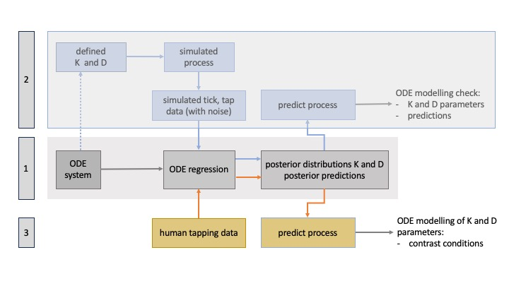
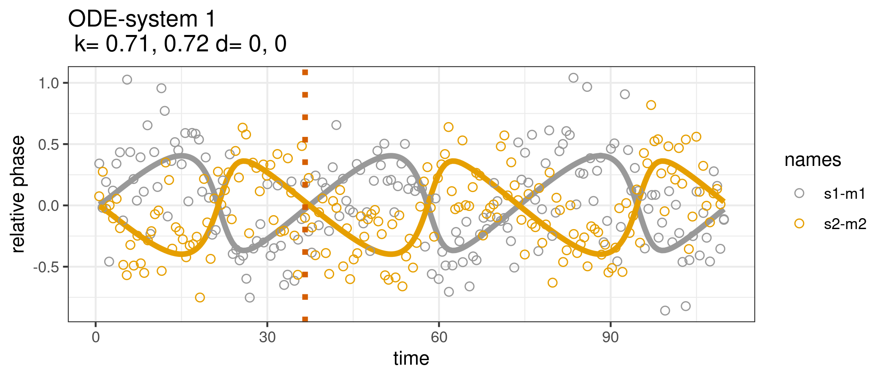
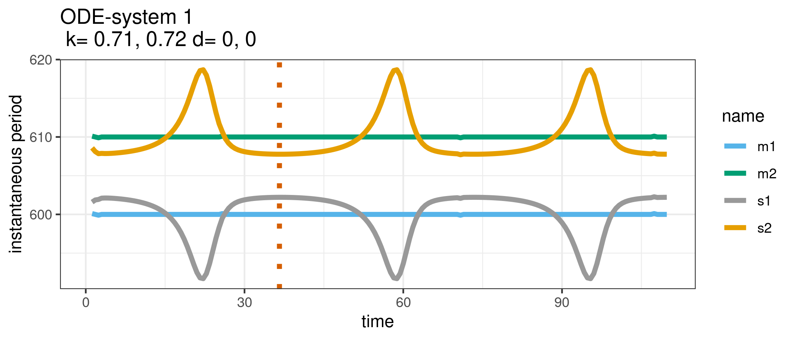
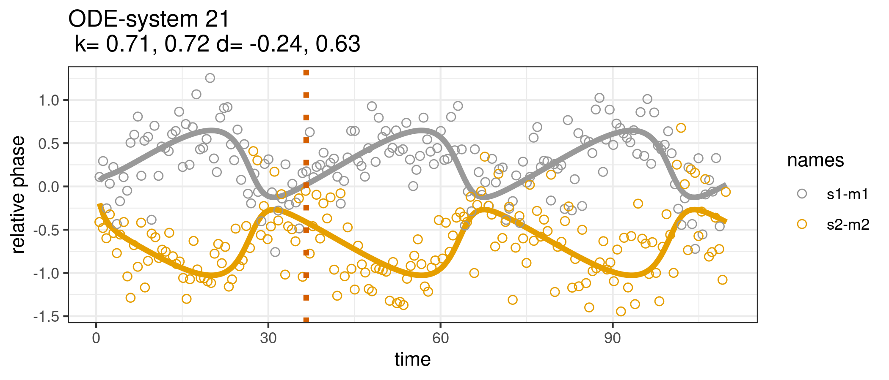
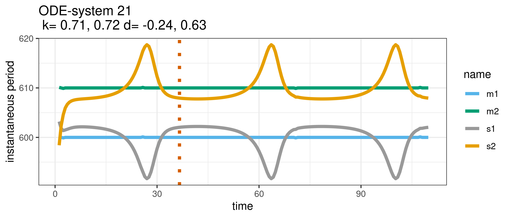
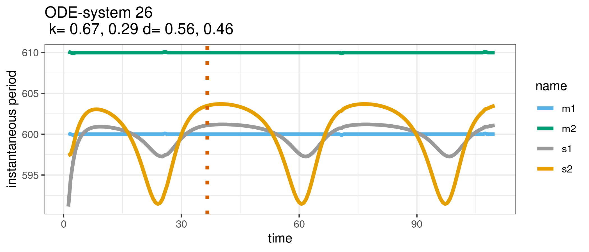
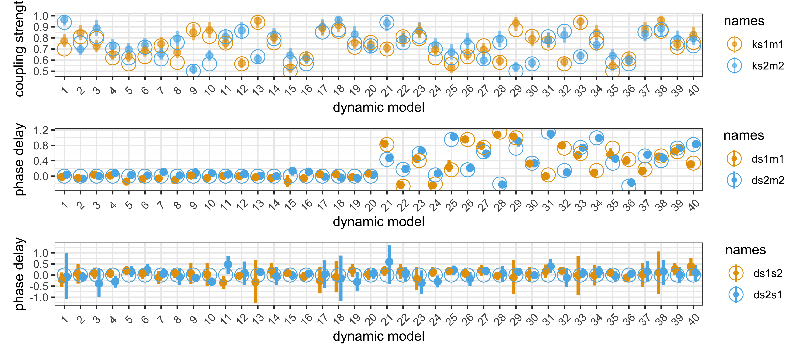

# Two finger tappers -- dynamic system{#chapTappers1}


This chapter deals with mutual influences while interacting. 
For example, two subjects perform a timing task while seeing each other performing this timing task differently.
Are the performances affecting each other, in terms of timing?
How would this mutual influence work? And why?

To analyse data about two persons interacting with each other, previous studies used methods such as cross-correlation, cross-recurrence analysis, quantification analysis, delay-coupled oscillators, among others^[For a review, see Demos & Palmer, 2023. For an approach based on Kuramoto models, see Heggli et al., 2019).]. 
Our  approach is inspired by *compartmental models* in which a state of units (subjects and metronomes) is changed by a flow among them^[See https://en.wikipedia.org/wiki/Compartmental_models_in_epidemiology, and Gesmann, M., and Morris, J. (2020) via https://www.casact.org/sites/default/files/2021-02/compartmental-reserving-models-gesmannmorris0820.pdf.]. The goal is to identify that flow and find the parameters that govern the flow among the units. The parameters then explain and predict what happens.
It's a cool idea but is it feasible?

In this chapter we also introduce Stan^[See https://mc-stan.org], the probabilistic programming language underneath the R-package `brms`. We show how to program in Stan, in order to calculate a regression with a dynamic system as predictor.

The code is contained in:

```r
source("Code/chapAll_00_Initialization.R")
source("Code/chapAll_01_Functions.R")
source("Code/chapTappers/chapTappers_02_Simulation.R")
#source("Code/chapTappers/chapTappers_04_Modelling.R")
# source("Code/chapTappers/chapTappers_05_ModelPlotting.R")
# source("Code/chapTappers/chapTappers_06_Contrasts.R")
# source("Code/chapTappers/chapTappers_07_ContrastPlotting.R")
```

## Theory

The theoretical background for this chapter is based on two principles: entrainment and dynamic systems.

### Entrainment {-}

First consider entrainment, or rhythmic entrainment. It can be defined as adaptation of timing, due to influences.
Here we study mutual influences, that is, entrainment in persons interacting with each other.
Entrainment is probably a factor that facilitates self-augmented interactions (see chapter \@ref(chapTheory)).
It probably works as an *automatic* adaptation of collaborative activities towards a joint goal.
Its power may be huge, even having an emotional effect on humans involved in such activities.

Here, the key idea is to focus on entrainment and timing.
In demonstrating the near inevitability of entrainment under controlled circumstances, Rosso et al. (2024) created an *incongruency* in the feedback for controlling actions. It was done by creating conditions in which hearing and seeing inform our timing differently. Rosso et al. (2024) collected super-interesting data which we want to use in the next chapter. Before being able to use those data, we ask ourselves here how entrainment can be captured by a dynamic system.

### Dynamic system {-}

In fact, entrainment can be understood as a principle that tends to solve incongruent feedback for actions. Entrainment would lead to more congruent perception due to an adaptation of your actions that cause those perceptions. From that viewpoint, it's of interest to consider a dynamic framework of understanding.

The idea to capture entrainment in terms of a dynamic system is challenging, because human behavior is complicated and the details of action-perception mechanisms leading to entrainment are specific in each individual, and far from known. So, how should we deal with this?

Well, the *dynamic systems approach* assumes that the interaction is ruled by higher-level parameters that matter for the interaction. Therefore, at that level, a reduction to the underlying action-perception mechanisms is not necessary because the behavior can be globally described. Accordingly, each unit involved in the interaction can be handled a black box whose inputs and outputs are known (or estimated) without knowing how the black box functions. In order words, we drop reductionism and adopt a more holistic perspective. Ultimately, both approaches may be integrated.
But let's see how far we get with the holistic perspective.

## Drifting metronomes

The *drifting metronomes* paradigm, developed in (Rosso et al., 2021, 2023), is a clever way to uncover entrainment, by controlling for incongruency. Here is how it works in detail.

Two subjects engage in synchronized tapping while listening to a metronome through headphones. The metronomes are slightly detuned in tempo, so that their phase is drifting. In particular, one metronome tics  every 600 ms, while the other tics  every 610 ms. Initially, the metronomes start ticking together (in-phase), but as time evolves, the tics  become wider apart (out-phasing), eventually reaching an anti-phase state before their ticking comes closer in time again (in-phasing). When the cycle is completed, the metronomes have one tic exactly together. One complete outphasing and inphasing cycle takes $36.6$ seconds ($600 * 610/ 10$). The subjects are asked to perform 10 such cycles in a row during one performance. They are instructed to follow the metronome they hear through the headphones. 

The conditions of interest are: (i) not seeing each other and (ii) seeing each other.^[In the original experiment, there are 4 conditions. The two other conditions control the perspective of looking. Using VR, subjects see their own arm ticking from a second perspective, or they see the partner's arm ticking as their own arm. Here we don't consider these swapping conditions. Rather, we focus on the modality (hearing, and hearing+seeing)]

Rosso et al. (2023)  found that the subjects' tapping behavior was influenced by seeing each other tapping, despite the instruction to follow their own metronome. In other words, visual coupling between the individuals led to an entrainment effect on tapping behavior, even if the task implied anti-entrainment (or resistence to entrainment). This suggests that incongruent visual cues from the partner's tapping influenced the synchronization between the subjects can be particularly strong, overriding the intended synchronization with the metronome they heard.

Our interest here is to offer a causal explanation of this phenomenon at the level of a phase flow, or change in timing among subjects. Our goal is to build a dynamic system that would predict the entrainment, using a few control parameters that covern the causal flow among interacting units.


### Causality {-}

The type of modelling suggests a *causal* level at which tapping/ticking is basically understood in terms of the *coupling strength*, and (if any), *phase delay*, among persons and metronomes involved. Conceptually speaking, this approach is very different from smooth regression, where modelling is based on a basis expansion using many splines. Here, the number of parameters is limited and the parameters have a straightforward physically interpretation in terms of attention and time. Moreover, all the knowledge is in the dynamics of the causal flow. We don't need to go deeper into the subcomponents of our interacting units. We don't model oscillators! 
The dynamics pops up from (the less well understood) action-perception mechanisms that characterize the timing of the interacting units, and this dynamics is described at that higher level in which *coupling strength* and *phase delay* have a physical meaning.

The only restriction is that we cannot measure the *coupling strength* nor the *phase delay* directly.
Rather we have to infer these values from the data.

### Approach {-}

The development of the dynamical system, and the regression model, implies several steps which we sumarize in figure \@ref(fig:chapTappers1framework):


<div class="figure" style="text-align: center">

<p class="caption">(\#fig:chapTappers1framework)Methodological approach (see text for explanation)</p>
</div>

- Block 1 defines the dynamic system (ODE-system)  and the regression (ODE-regression). The causal flow among interacting units is defined by coupling strength (K) and phase delay (D) parameters. The regression estimates the value of these parameters using data. 

- Block 2 aims at validating the regression model with simulated tic and tap data, in which parameters K and D are defined in order to generate these data. The goal is to retrieve the parameters from the simulated data. The parameters used for generating data and the parameters obtained from estimation should correspond.

- Block 3 then applies the regression model to real human tapping data. The goal is to estimate the parameters and generate the process that generates the data. At this point we can contrast the parameters for seeing versus non-seeing conditions and check whether they are different. 


This chapter has a focus on Block 1 and 2, while the next chapter has a focus on Block 3.

<!-- To implement the model, Stan 2.26.1 is used. The calculations are performed on a dedicated server running R version 4.3.0 (2023-04-21) and R-Studio Server 2023.6.0.421 on Ubuntu 22.04.2 LTS. The hardware configuration of the server includes a dual AMD Epyc 74F3 CPU with a total of 48 cores (96 threads), 128 GB (8x16GB) ECC DDR4 RAM, and an Nvidia RTX 3090TI graphics card. The simulations are set up in R. The R-package `doParallel` is used for parallel processing of ODE-regression models. The R-package `rstan` is used as an interface to the Stan engine. -->

## Dynamic system

Let us start by defining the dynamic system in the context of the drifting metronomes paradigm.
It should contain four units: two metronomes to synchronize with and two subjects interacting.
Accordingly, the dynamic system can be described by units and arrows, as shown in figure \@ref(fig:chapTappers2ODEsystem). 

Metronome 1, subject 1, metronome 2 and subject 2 are represented as units $m1,s1,m2$ and $s2$ and
their coupling is represented by arrows pointing from one unit to another unit. An arrow from $s1$ pointing to $m1$ means that subject 1 is coupled to metronome 1, which is described by a combination of coupling strength and phase delay.
The arrow show that each subject is coupled to the own metronome, and to the other subject.

We follow the convention that the arrows point in the direction where the influence comes from. Accordingly, each subject points to the own metronome and to the other subject.


<div class="figure" style="text-align: center">

<p class="caption">(\#fig:chapTappers2ODEsystem)Dynamic system</p>
</div>


### Coupling parameters {-}

Each arrow is defined by two parameters: coupling strength and phase delay.

The *coupling strength* has the prefix $k$. Its value ranges from 0 to 1, where a value of 0 indicates no coupling, and a value of 1 indicates full coupling. The coupling strength $ks1m1$ captures how strongly $s1$ is coupled to $m1$ and thus, how strongly $m1$ is affecting the tapping of $s1$. 

A very important feature of this model is that the coupling parameters are constrained by the fact that, in one subject, all coupling parameters always sum to $1$. In other words: $1 = ks1m1 + ks1s2$.

The rationale for this constraint is that a subject has limited attention resources (between 0 and 1) that define the coupling. Accordingly, the attention devoted to $s2$ is at the cost of the attention devoted to $m1$. Therefore, attention to $m1$ and/or $s2$ works as a system of communicating vessels, there is a constant volume to be distributed over two focus points. 

Accordingly, we can represent the coupling strength by the length of the arrows, as suggested in figure \@ref(fig:chapTappers2ODEsystem2).
In the left block the subjects devote all attention to their own metronome ($ks1m1 = ks2m2 = 1$). It would be a typical situation in the condition where subjects *hear* the metronome and *don't see* each other.
In the right block, the subjects divide attention partly to the metronome, partly to the partner.
It would be a typical situation in the condition where subjects *hear* the metronome and *see* each other.
The figure suggests that $s1$ has more attention to the own metronome than to the partner (say, $ks1m1 = .7$ and  $ks1s2 = 1-.7 =.3$), while $s2$ has more attention to the partner than to the metronome (say, $ks2m2 = .3$ and $ks2s1 = 1-.3 = .7$). 

<div class="figure" style="text-align: center">

<p class="caption">(\#fig:chapTappers2ODEsystem2)Assumed coupling strength parameters of the uncoupled and coupled condition</p>
</div>


The *phase delay* has the prefix $d$ (figure \@ref(fig:chapTappers2ODEsystem)) and its value ranges from $-\pi$ to $\pi$.
<!-- $-\frac{\pi}{2}$ to $\frac{\pi}{2}$.  -->
It specifies an average time lag over the entire outphasing-inphasing cycle of 36.6 seconds.
The phase delay can be interpreted as an average synchronization offset. 
Stricly speaking it can be deleted from the model but introducing it gives more flexibility to the model.

### Phase and Phase flow {-}

The dynamic system describes the change of phase over time, of connected units in a network.
We focus on phase because we work with events (taps and tics ) occurring at fixed time intervals for metronomes, and varying time intervals for subjects. Each such time interval covers $2\pi$. The phase is a proportion of $2\pi$, and the dynamic system describes how much the phase changes over time in all units. 
Note that phase increases continuously but it can be wrapped on a scale of $2\pi$, in the interval $[0, 2\pi]$, or when rotated, in the interval $[-\pi,+\pi]$.

Let us now look in more detail at the change in phase among the components of the dynamic system. 

### Phase flow metronomes {-}

The change in phase over time of the metronomes is notated as $\dot{\theta}_{m}$ or $\frac{d\theta_m}{dt}$. It is the *eigen-frequency* in units of radians per second $[\frac{rad}{sec}]$. Accordingly, $m1$ runs through the ticking phase cycle ($2\pi$) in $.6 sec$, while $m2$ does it in $.61 sec$. The metronomes will have a fixed phase cycle because there are no influences acting upon it. No outward pointing arrows. The dynamic equations are:

$$
\dot{\theta}_{m1} = \omega_{m1} =  \frac{2\pi}{.6}\\
\dot{\theta}_{m2} = \omega_{m2} =  \frac{2\pi}{.61}
$$

### Phase flow subjects {-}

The phase flow in subjects is a bit more demanding, due to outgoing arrows that represent influences.
The subjects will have a varying phase cycle due to influences. 
The dynamic equations for $s1$ and $s2$ are:

\begin{equation}
\begin{array}{rl}
\dot{\theta}_{s1} = & \omega_{m1} + \\
& ks1m1 \cdot sin(\theta_{m1} - \theta_{s1} + ds1m1) + \\
& (1-ks1m1) \cdot sin(\theta_{s2} - \theta_{s1} + ds1s2)\\
\end{array}\\
\begin{array}{rl}
\dot{\theta}_{s2} = & \omega_{m2} + \\
& ks2m2 \cdot sin(\theta_{m2} - \theta_{s2} + ds2m2) +\\
& (1-ks2m2) \cdot sin(\theta_{s1} - \theta_{s2} + ds2s1)\\
\end{array}
(\#eq:chapTappersequation1a)
\end{equation}

Let's focus on $s1$.
The subject is requested to follow $m1$ and therefore its eigen-frequency is set equal to the eigen-frequency of the own metronome. 
When the subject is devoting all attention to $m1$, then $ks1m1 = 1$ and the subject will tap in phase with the metronome, apart from a possible phase delay. 
Ideally, there will be zero contribution from the second and third term on the right hand side of the equation. We keep that in mind.

When the subject is devoting some attention to $s2$,
then $ks1m1 < 1$ and an influence will be exerted. 

We first consider the second term, which we simplify to
$$sin(\theta_{m1} - \theta_{s1}).$$
In the first part of the outphasing-inphasing cycle, $s1$ will be influenced by $s2$ and therefore the phase difference $\theta_{m1s1} = \theta_{m1} - \theta_{s1}$ will be increasing over time until it reaches a maximum at $\theta_{m1s1} = \frac{\pi}{2}$. At that point, the pulling force will be such that the phase of $s1$ comes back to the phase of $m1$. In the second part of the outphasing-inphasing cycle, the phase difference is decreasing and we have a minimum ($-1$) at $\theta_{m1s1} = \frac{3\pi}{2}$.

Next, consider the third term, simplified as:
$$sin(\theta_{s2} - \theta_{s1}).$$
In the first part of the outphasing-inphasing cycles, $s2$ is tapping slower than $s1$ and the phase difference $\theta_{s2s1} = \theta_{s2} - \theta_{s1}$ will be descreasing. It will be increasing in the second part. A minimum will appear at $\theta_{s2s1} = \frac{\pi}{2}$, and a maximum at $\theta_{s2s1} = \frac{3\pi}{2}$.

In other words, $m1$ and $s2$ pull in the opposite direction and due to outphasing and inphasing of $s2$, one may expect that, typically, the anti-phase zero-crossing point will be more delayed by $s2$ than by $m1$. The more it is slowed down, the later that zero-crossing point will occur in a outphasing-inphasing cycle. 

Since both sinusoids add, the curve will become asymmetrical both in time and in amplitude.  Don't forget that $sin(.)$ is first multiplied by the coupling strength. With extreme parameter settings (e.g., $ks1m1$ < .4) the zero-crossing effect disappears (see the examples below).

Finally, we also have to consider the effect of the phase delay parameters.
Since these parameters are constant over the entire outphasing-inphasing cycle, they affect the entire curve by a shift of all values.
This effect is also best illustrated by means of examples.

### Understanding the dynamic {-}

At this point it is instructive to consider phase flow using a simulation of the dynamic equation.
First we take the dynamic equations to define a differential equation function called `dydt.`


```r
# Define the differential equation do_dydt
dydt <- function(t, y, parms) {
  with(as.list(c(y, parms)), {
    ############################## dynamic system
    dm1 = 2*pi*1000/600
    ds1 = 2*pi*1000/600  + 
          .5*(ks1m1* sin(m1 - s1 + ds1m1) + 
             (1-ks1m1)* sin(s2 - s1 + ds1s2) )
    
    dm2 = 2*pi*1000/610
    ds2 = 2*pi*1000/610  + 
          .5*(ks2m2* sin(m2 - s2 + ds2m2) + 
             (1-ks2m2)* sin(s1 - s2 + ds2s1) )
    ############################## retrieve components for ds1
    ds1a = ks1m1 * sin(m1 - s1 + ds1m1)
    ds1b = (1-ks1m1) * sin(s2 - s1 + ds1s2)
    
    return(list(c(dm1,ds1,dm2,ds2,ds1a,ds1b)))
  })
}
```
The first four equations define the dynamic system as depicted in figure \@ref(fig:chapTappers2ODEsystem).
Next we retrieve components that contribute to $ds1$.
In fact, we re-calculate $ks1m1* sin(m1 - s1 + ds1m1)$ as $ds1a$ and 
$(1-ks1m1)* sin(s2 - s1 + ds1s2)$ as $ds1b$. 
We solve the equations numerically using the R-package `deSolve`.


```r
# define time points
dt = 1/100
time_points <- seq(0, 36.6, by = dt)
# define initial state
state <- c(m1 = 0, s1 = 0, m2 = 0, s2 = 0, s1a = 0, s1b = 0)
# define the parameters
parm = c(ks1m1 = .9, ks2m2 = .7, ds1m1 = 0, ds2m2 = 0, ds1s2 = 0, ds2s1 = 0)
# solve the ODE
solution <- ode(y = state, times = time_points, func = dydt, parms = parm) %>% 
      data.frame()
# calculate the phase change over time = instantaneous frequency
solution <- solution %>% mutate(
  dm1 = c(NA,diff(m1)),
  ds1 = c(NA,diff(s1)),
  dm2 = c(NA,diff(m2)),
  ds2 = c(NA,diff(s2)),
  ds1a = c(NA,diff(s1a)),
  ds1b = c(NA,diff(s1b))
)
```

Here is how the data frame looks like:


```
## 'data.frame':	3661 obs. of  13 variables:
##  $ time: num  0 0.01 0.02 0.03 0.04 0.05 0.06 0.07 0.08 0.09 ...
##  $ m1  : num  0 0.105 0.209 0.314 0.419 ...
##  $ s1  : num  0 0.105 0.209 0.314 0.419 ...
##  $ m2  : num  0 0.103 0.206 0.309 0.412 ...
##  $ s2  : num  0 0.103 0.206 0.309 0.412 ...
##  $ s1a : num  0.00 1.93e-09 1.15e-08 3.65e-08 8.34e-08 ...
##  $ s1b : num  0.00 -8.58e-07 -3.43e-06 -7.71e-06 -1.37e-05 ...
##  $ dm1 : num  NA 0.105 0.105 0.105 0.105 ...
##  $ ds1 : num  NA 0.105 0.105 0.105 0.105 ...
##  $ dm2 : num  NA 0.103 0.103 0.103 0.103 ...
##  $ ds2 : num  NA 0.103 0.103 0.103 0.103 ...
##  $ ds1a: num  NA 1.93e-09 9.61e-09 2.50e-08 4.69e-08 ...
##  $ ds1b: num  NA -8.58e-07 -2.57e-06 -4.28e-06 -5.99e-06 ...
```


The solution comes with a time indicator, with phases $m1, s1, m2, s2, s1a$ and $s1b$, and phase changes $dm1, ds1, dm2, ds2, ds1a$ and $ds1b$ - the prefix $d$ refers to the differential, not to the delay.

Note that in this example, the coupling strengths are defined as $ks1m1 = .9, ks2m2 = .7$ and delay parameters are set to zero.
However, it is more instructive to vary the coupling strengths in a systematic way to see what happens.
So let us have a look at $s1a$ and $s1b$, the components that contribute to phase change in $s1$. 

<div class="figure" style="text-align: center">

<p class="caption">(\#fig:chapTappersSol1)Phase change in s1 due to competing influences of m1 and s2. The columns show five different values of ks1m1, the rows show two different values of ks2m2. The thick line is the average of the thin lines, representing instantaneous frequency (without the eigen-frequency)</p>
</div>
The first row shows the phase change in $s1$, with different values of $ks1m1$ and influences due to $s2$, with $ks2m2 = 1$. In second row shows the phase change in $s1$ with $ks2m2 = .75$.

We see how the contrasting sinusoids for $m1$ and $s2$ (shown as thin lines) define the phase change (shown as thick line). The dotted vertical line marks the anti-phase time of the metronomes.
Note furthermore that when $ks1m1 = .4$ the curve has flipped. It marks the fact that the tapping is more in line with $s2$ than with the own $s1$.
In a similar way, it is possible to calculate the change of phase for $s2$ based on the pulling to metronome and partner subject.

Next we show the phase change of both $s1$ and $s2$.
In this graph we represent the inverse of the instantaneous frequency, known as *instantaneous period*, with period on the vertical axis. Accordingly, with $ks1m1 = ks2m2 = 1$, subjects follow their metronomes and therefore the instantaneous period of their tapping is on 600 ms and 610 ms. Note that the blue curves (from $s1$) are the reversed curves from those in figure \@ref(fig:chapTappersSol1).

<div class="figure" style="text-align: center">

<p class="caption">(\#fig:chapTappersSol2)Instantaneous period of s1 and s2. The columns show five different values of ks1m1, the rows show two different values of ks2m2</p>
</div>

The figure reveals that the blue curves (from $s1$) become slightly different when there is a mutual influence due to $ks2m2 = .75$. We now see more clearly that the instantaneous period of $s1$ comes close to the instantaneous period of $s2$ when $ks1m1 = .4$ and $ks1m1 = .2$.

Next, we shown the relative phase, rather than the instantaneous period.
However, as the phase is continuously increasing it is more practical to look at the phase relative to the metronome, for example by taking the phase of the metronome minus the phase of the subject. We rotate the axis such that the interval covers $[-\pi,+\pi]$.

<div class="figure" style="text-align: center">

<p class="caption">(\#fig:chapTappersSol3)Relative phase of s1 and s2. The columns show five different values of ks1m1, the rows show two different values of ks2m2</p>
</div>

This viewpoint is of interest when phase delays enter the picture.
The next figure shows the relative phase when $ds1m1 = ds2m2 = 1$. 

<div class="figure" style="text-align: center">

<p class="caption">(\#fig:chapTappersSol4)Relative phase of s1 and s2, with phase delay ds1m1 = ds2m2 = 1. The columns show five different values of ks1m1, the rows show two different values of ks2m2</p>
</div>
Note that the phase delay tends to shift the curve downward, implying anticipation, while similar figures appear, except at the beginning of the curves because at that point, we start our state at the zero position.

The examples reveal the complex character of the dynamical system. Despite the fact that it is composed of simple sinusoids, its final behavior can be rather surprising.


### General specification {-}

It is possible to generalize the dynamical system to more units, arranged in different constellations but we don't go into that topic here.
Instead, we want to check whether this dynamic system is worth the effort.
But before we proceed, it may be of interest to generalize the above approach using equation \@ref(eq:chapTappersequation1):

\begin{equation}
\frac{d\theta_{i}}{dt} = \omega_{i} + \sum_j K_{i,j} sin(\theta_{t,j} - \theta_{t,i} + D_{i,j}),~
with ~ \theta_i(0) = 0 (\#eq:chapTappersequation1)
\end{equation}

where $\theta$ is the phase, 
$i,j$ is an index for elements in $\left\{ m1,s1,s2,m2 \right\}$, and
$\omega$ is the instantaneous frequency, set as $\omega_i = \frac{2\pi*}{.6}~[\frac{rad}{sec}]$, for $i=1,2$ and $\omega_i = \frac{2\pi}{.61}~[\frac{rad}{sec}]$ for $i=3,4$. 

### Design matrices {-}
The matrix $K$ contains the coupling parameters from rows (index $i$) to columns (index $j$), and the parameters are in the range $[0,1]$. 
Accordingly, $K(2,1) = K_{s1,m1} = ks1m1$.
The matrix $D$ contains the delay parameters in the range $[-\pi,\pi]$. 


Matrices K and D are design matrices that define the dynamic system. Dots mean that no parameter is created. If a parameter is created (e.g. $ks1m1$), then there are two possibilities: either that parameter gets a defined value and data can be generated with it, or the value of that parameter is estimated from given data. In this chapter, we'll first define them, and then estimate them. We can then check whether the estimation is correctly done.


$$
K = \begin{matrix}   
&m1~~~~~~~~~~s1~~~~~~~~~~m2~~~~~~~~~~s2\\
\begin{matrix}   
   &m1 \\
   &s1 \\
   &m2 \\
   &s2 \\
\end{matrix} &
\begin{bmatrix}
. &. &. &. \\
ks1m1 &. &. &1-ks1m1 \\
. &. &. &. \\
. &1-ks2m2  &ks2m2 &.\\
\end{bmatrix}
\end{matrix}
$$


$$
D = \begin{matrix}   
&m1~~~~~s1~~~~~m2~~~~~s2\\
\begin{matrix}   
   &m1 \\
   &s1 \\
   &m2 \\
   &s2 \\
\end{matrix} &
\begin{bmatrix}
. &. &. &. \\
ds1m1 &. &. &. \\
. &. &. &. \\
. &.  &ds2m2 &.\\
\end{bmatrix}
\end{matrix}
$$


## Simulating phase flow dynamics
Equation \@ref(eq:chapTappersequation1) is non-linear and therefore it is useful to explore it with simulations. We refer to a shiny application [here](http://odetappers.shinyapps.io/odetappers2/)^[See http://odetappers.shinyapps.io/odetappers2/], which readers may explore. 
Given the above explanation, we believe that the tool is self-explanatory.

<!-- <iframe src="http://odetappers.shinyapps.io/odetappers2/" width="750" height="1000"></iframe> -->


## Generating data

Now that we have a dynamic system our goal is to generate tics and taps, in three steps:

- Continuous phase-function generation. The dynamic equations generate curves for each unit of the dynamic system. These curves, or *phase-functions*, represent the underlying ticking or tapping process, either as relative phase or as instantaneous frequency (and period) We consider generating a series of dynamic systems, defined by the parameters. For each dynamic system, we'll get phase functions for each unit.

- Extraction of event times. Using the generated phase-functions we can extract the time at which the phase-functions becomes a multiple of $2\pi$. Those time instances correspond to tics or taps from metronomes and subjects. 

- Addition of tap time noise. Given the human variability in finger tapping tasks, it is possible to introduce some noise to the extracted tap times.

These steps generate a dataset of discrete metronome tics  and subject taps which will be used in a regression to retrieve the parameters that generated these tics  and taps.

### Constraints in parameters {-}

Based on the *drifting metronomes* paradigm, in which subjects are asked to tap along with the metronome heard through their headphones, we assume that most subjects will indeed be able to adhere to their own metronome. This implies that the coupling strength $ks1m1$ and $ks2m2$ will be rarely < .4 because in that case they actually follow the partner (as illustrated in the above figures). Furthermore, we assume for testing purposes that both subjects have the same distribution of coupling strength. Accordingly, we first generate coupling strength values for subject 1. Then we reshuffle these values and assign coupling strength values to subject 2.

Constraints in phase delays can be justified by studies showing that humans tend to anticipate to the beat.
At this point, however, we define the phase delay with the metronomes, and set the phase delay among subjects to zero.


### Generate phase-functions {-}

The phase-functions are then generated using parameters for coupling strength and phase delay using samples from the distributions shown in figure \@ref(fig:chapTappers4couplingdelay2). 


<div class="figure" style="text-align: center">

<p class="caption">(\#fig:chapTappers4couplingdelay2)Densities for coupling parameters $ks1m1$ and $ks2m2$, and delay parameters $ds1m1$ and $ds2m2$</p>
</div>

The coupling strength parameters is based on a beta distribution. The phase delay is based on a  skewed normal distribution, accounting for a small anticipation in $ds1m1$ and $ds2m2$.  This distribution allows for capturing the asymmetry and slight anticipation commonly observed in tapping behavior^[See Repp and Su (2012) for a review of finger tapping and anticipation.]
.

Table \@ref(tab:chapTappers5couplingdelay3) shows the parameters for 40 randomly generated dynamic systems.
The columns represent the number and the parameters $ks1m1, ks2m2, ds1m1, ds2m2$. 
Note that the first 20 dynamic systems, specified by these parameters, have zero phase delay, while the second 20 have the same coupling strength and a non-zero phase delay:


<table class="table table-striped" style="font-size: 11px; margin-left: auto; margin-right: auto;">
<caption style="font-size: initial !important;">(\#tab:chapTappers5couplingdelay3)Parameters of 40 dynamic systems</caption>
 <thead>
  <tr>
   <th style="text-align:right;"> sim </th>
   <th style="text-align:right;"> ks1m1 </th>
   <th style="text-align:right;"> ks2m2 </th>
   <th style="text-align:right;"> ds1m1 </th>
   <th style="text-align:right;"> ds2m2 </th>
  </tr>
 </thead>
<tbody>
  <tr>
   <td style="text-align:right;"> 1 </td>
   <td style="text-align:right;"> 0.71 </td>
   <td style="text-align:right;"> 0.72 </td>
   <td style="text-align:right;"> 0.00 </td>
   <td style="text-align:right;"> 0.00 </td>
  </tr>
  <tr>
   <td style="text-align:right;"> 2 </td>
   <td style="text-align:right;"> 0.76 </td>
   <td style="text-align:right;"> 0.61 </td>
   <td style="text-align:right;"> 0.00 </td>
   <td style="text-align:right;"> 0.00 </td>
  </tr>
  <tr>
   <td style="text-align:right;"> 3 </td>
   <td style="text-align:right;"> 0.72 </td>
   <td style="text-align:right;"> 0.78 </td>
   <td style="text-align:right;"> 0.00 </td>
   <td style="text-align:right;"> 0.00 </td>
  </tr>
  <tr>
   <td style="text-align:right;"> 4 </td>
   <td style="text-align:right;"> 0.88 </td>
   <td style="text-align:right;"> 0.46 </td>
   <td style="text-align:right;"> 0.00 </td>
   <td style="text-align:right;"> 0.00 </td>
  </tr>
  <tr>
   <td style="text-align:right;"> 5 </td>
   <td style="text-align:right;"> 0.80 </td>
   <td style="text-align:right;"> 0.71 </td>
   <td style="text-align:right;"> 0.00 </td>
   <td style="text-align:right;"> 0.00 </td>
  </tr>
  <tr>
   <td style="text-align:right;"> 6 </td>
   <td style="text-align:right;"> 0.67 </td>
   <td style="text-align:right;"> 0.29 </td>
   <td style="text-align:right;"> 0.00 </td>
   <td style="text-align:right;"> 0.00 </td>
  </tr>
  <tr>
   <td style="text-align:right;"> 7 </td>
   <td style="text-align:right;"> 0.29 </td>
   <td style="text-align:right;"> 0.67 </td>
   <td style="text-align:right;"> 0.00 </td>
   <td style="text-align:right;"> 0.00 </td>
  </tr>
  <tr>
   <td style="text-align:right;"> 8 </td>
   <td style="text-align:right;"> 0.90 </td>
   <td style="text-align:right;"> 0.80 </td>
   <td style="text-align:right;"> 0.00 </td>
   <td style="text-align:right;"> 0.00 </td>
  </tr>
  <tr>
   <td style="text-align:right;"> 9 </td>
   <td style="text-align:right;"> 0.39 </td>
   <td style="text-align:right;"> 0.54 </td>
   <td style="text-align:right;"> 0.00 </td>
   <td style="text-align:right;"> 0.00 </td>
  </tr>
  <tr>
   <td style="text-align:right;"> 10 </td>
   <td style="text-align:right;"> 0.78 </td>
   <td style="text-align:right;"> 0.76 </td>
   <td style="text-align:right;"> 0.00 </td>
   <td style="text-align:right;"> 0.00 </td>
  </tr>
  <tr>
   <td style="text-align:right;"> 11 </td>
   <td style="text-align:right;"> 0.71 </td>
   <td style="text-align:right;"> 0.82 </td>
   <td style="text-align:right;"> 0.00 </td>
   <td style="text-align:right;"> 0.00 </td>
  </tr>
  <tr>
   <td style="text-align:right;"> 12 </td>
   <td style="text-align:right;"> 0.56 </td>
   <td style="text-align:right;"> 0.83 </td>
   <td style="text-align:right;"> 0.00 </td>
   <td style="text-align:right;"> 0.00 </td>
  </tr>
  <tr>
   <td style="text-align:right;"> 13 </td>
   <td style="text-align:right;"> 0.83 </td>
   <td style="text-align:right;"> 0.60 </td>
   <td style="text-align:right;"> 0.00 </td>
   <td style="text-align:right;"> 0.00 </td>
  </tr>
  <tr>
   <td style="text-align:right;"> 14 </td>
   <td style="text-align:right;"> 0.29 </td>
   <td style="text-align:right;"> 0.56 </td>
   <td style="text-align:right;"> 0.00 </td>
   <td style="text-align:right;"> 0.00 </td>
  </tr>
  <tr>
   <td style="text-align:right;"> 15 </td>
   <td style="text-align:right;"> 0.47 </td>
   <td style="text-align:right;"> 0.39 </td>
   <td style="text-align:right;"> 0.00 </td>
   <td style="text-align:right;"> 0.00 </td>
  </tr>
  <tr>
   <td style="text-align:right;"> 16 </td>
   <td style="text-align:right;"> 0.61 </td>
   <td style="text-align:right;"> 0.47 </td>
   <td style="text-align:right;"> 0.00 </td>
   <td style="text-align:right;"> 0.00 </td>
  </tr>
  <tr>
   <td style="text-align:right;"> 17 </td>
   <td style="text-align:right;"> 0.82 </td>
   <td style="text-align:right;"> 0.29 </td>
   <td style="text-align:right;"> 0.00 </td>
   <td style="text-align:right;"> 0.00 </td>
  </tr>
  <tr>
   <td style="text-align:right;"> 18 </td>
   <td style="text-align:right;"> 0.54 </td>
   <td style="text-align:right;"> 0.71 </td>
   <td style="text-align:right;"> 0.00 </td>
   <td style="text-align:right;"> 0.00 </td>
  </tr>
  <tr>
   <td style="text-align:right;"> 19 </td>
   <td style="text-align:right;"> 0.60 </td>
   <td style="text-align:right;"> 0.88 </td>
   <td style="text-align:right;"> 0.00 </td>
   <td style="text-align:right;"> 0.00 </td>
  </tr>
  <tr>
   <td style="text-align:right;"> 20 </td>
   <td style="text-align:right;"> 0.46 </td>
   <td style="text-align:right;"> 0.90 </td>
   <td style="text-align:right;"> 0.00 </td>
   <td style="text-align:right;"> 0.00 </td>
  </tr>
  <tr>
   <td style="text-align:right;"> 21 </td>
   <td style="text-align:right;"> 0.71 </td>
   <td style="text-align:right;"> 0.72 </td>
   <td style="text-align:right;"> -0.24 </td>
   <td style="text-align:right;"> 0.63 </td>
  </tr>
  <tr>
   <td style="text-align:right;"> 22 </td>
   <td style="text-align:right;"> 0.76 </td>
   <td style="text-align:right;"> 0.61 </td>
   <td style="text-align:right;"> 1.01 </td>
   <td style="text-align:right;"> 0.35 </td>
  </tr>
  <tr>
   <td style="text-align:right;"> 23 </td>
   <td style="text-align:right;"> 0.72 </td>
   <td style="text-align:right;"> 0.78 </td>
   <td style="text-align:right;"> 0.63 </td>
   <td style="text-align:right;"> -0.12 </td>
  </tr>
  <tr>
   <td style="text-align:right;"> 24 </td>
   <td style="text-align:right;"> 0.88 </td>
   <td style="text-align:right;"> 0.46 </td>
   <td style="text-align:right;"> 0.70 </td>
   <td style="text-align:right;"> 1.01 </td>
  </tr>
  <tr>
   <td style="text-align:right;"> 25 </td>
   <td style="text-align:right;"> 0.80 </td>
   <td style="text-align:right;"> 0.71 </td>
   <td style="text-align:right;"> 0.13 </td>
   <td style="text-align:right;"> 0.17 </td>
  </tr>
  <tr>
   <td style="text-align:right;"> 26 </td>
   <td style="text-align:right;"> 0.67 </td>
   <td style="text-align:right;"> 0.29 </td>
   <td style="text-align:right;"> 0.56 </td>
   <td style="text-align:right;"> 0.46 </td>
  </tr>
  <tr>
   <td style="text-align:right;"> 27 </td>
   <td style="text-align:right;"> 0.29 </td>
   <td style="text-align:right;"> 0.67 </td>
   <td style="text-align:right;"> 0.54 </td>
   <td style="text-align:right;"> 0.13 </td>
  </tr>
  <tr>
   <td style="text-align:right;"> 28 </td>
   <td style="text-align:right;"> 0.90 </td>
   <td style="text-align:right;"> 0.80 </td>
   <td style="text-align:right;"> 0.70 </td>
   <td style="text-align:right;"> 0.58 </td>
  </tr>
  <tr>
   <td style="text-align:right;"> 29 </td>
   <td style="text-align:right;"> 0.39 </td>
   <td style="text-align:right;"> 0.54 </td>
   <td style="text-align:right;"> 0.18 </td>
   <td style="text-align:right;"> 0.51 </td>
  </tr>
  <tr>
   <td style="text-align:right;"> 30 </td>
   <td style="text-align:right;"> 0.78 </td>
   <td style="text-align:right;"> 0.76 </td>
   <td style="text-align:right;"> 0.33 </td>
   <td style="text-align:right;"> 0.54 </td>
  </tr>
  <tr>
   <td style="text-align:right;"> 31 </td>
   <td style="text-align:right;"> 0.71 </td>
   <td style="text-align:right;"> 0.82 </td>
   <td style="text-align:right;"> 0.76 </td>
   <td style="text-align:right;"> 0.56 </td>
  </tr>
  <tr>
   <td style="text-align:right;"> 32 </td>
   <td style="text-align:right;"> 0.56 </td>
   <td style="text-align:right;"> 0.83 </td>
   <td style="text-align:right;"> 0.17 </td>
   <td style="text-align:right;"> 0.70 </td>
  </tr>
  <tr>
   <td style="text-align:right;"> 33 </td>
   <td style="text-align:right;"> 0.83 </td>
   <td style="text-align:right;"> 0.60 </td>
   <td style="text-align:right;"> 0.35 </td>
   <td style="text-align:right;"> 0.33 </td>
  </tr>
  <tr>
   <td style="text-align:right;"> 34 </td>
   <td style="text-align:right;"> 0.29 </td>
   <td style="text-align:right;"> 0.56 </td>
   <td style="text-align:right;"> 0.47 </td>
   <td style="text-align:right;"> 0.76 </td>
  </tr>
  <tr>
   <td style="text-align:right;"> 35 </td>
   <td style="text-align:right;"> 0.47 </td>
   <td style="text-align:right;"> 0.39 </td>
   <td style="text-align:right;"> 0.29 </td>
   <td style="text-align:right;"> 0.18 </td>
  </tr>
  <tr>
   <td style="text-align:right;"> 36 </td>
   <td style="text-align:right;"> 0.61 </td>
   <td style="text-align:right;"> 0.47 </td>
   <td style="text-align:right;"> 0.46 </td>
   <td style="text-align:right;"> 0.33 </td>
  </tr>
  <tr>
   <td style="text-align:right;"> 37 </td>
   <td style="text-align:right;"> 0.82 </td>
   <td style="text-align:right;"> 0.29 </td>
   <td style="text-align:right;"> -0.12 </td>
   <td style="text-align:right;"> 0.70 </td>
  </tr>
  <tr>
   <td style="text-align:right;"> 38 </td>
   <td style="text-align:right;"> 0.54 </td>
   <td style="text-align:right;"> 0.71 </td>
   <td style="text-align:right;"> 0.33 </td>
   <td style="text-align:right;"> 0.29 </td>
  </tr>
  <tr>
   <td style="text-align:right;"> 39 </td>
   <td style="text-align:right;"> 0.60 </td>
   <td style="text-align:right;"> 0.88 </td>
   <td style="text-align:right;"> 0.51 </td>
   <td style="text-align:right;"> 0.47 </td>
  </tr>
  <tr>
   <td style="text-align:right;"> 40 </td>
   <td style="text-align:right;"> 0.46 </td>
   <td style="text-align:right;"> 0.90 </td>
   <td style="text-align:right;"> 0.58 </td>
   <td style="text-align:right;"> -0.24 </td>
  </tr>
</tbody>
</table>

The number of dynamic systems (n = 40) is purely arbitrary and conforms our practical concerns in keeping the regression calculations (to be done later) within a reasonable amount of time. 

Given the parameters, we generate the dynamic systems using code similar to the ode-solver code shown above. However, the phase-functions are calculated at a high sampling rate of 10,000 samples per second in order to get precise time indications for tics  and taps.

### Extract tics  and taps {-}

For each unit, the time values are taken at multiples of $2\pi$, using the phase-function calculated in the previous step.
The resulting data set, with rows $n=1...N$, contains time, phases of metronomes and subjects, simulation number (= defined by the matrices) and reference unit, as illustrated in figure \@ref(tab:chapTappers6odePhi12view).
For example, at time 0.6, metronome 1 (see column `names`) has produced a tick, and its phase (being $6.283185$, or $2pi$) is shown in column `phi_m1`. 
At time 0.61, metronome 2 has produced a tic. Its phase ($2\pi$) is shown in `phi_m2`.
At time 0.6006, subject 1 has produced a tap, as shown in `phi_s1`. The phase is close to $2\pi$, but has a small acceptable peak extraction error.
And so on.

<table class="table table-striped" style="font-size: 11px; margin-left: auto; margin-right: auto;">
<caption style="font-size: initial !important;">(\#tab:chapTappers6odePhi12view)Tappers data</caption>
 <thead>
  <tr>
   <th style="text-align:right;"> time </th>
   <th style="text-align:right;"> phi_m1 </th>
   <th style="text-align:right;"> phi_s1 </th>
   <th style="text-align:right;"> phi_m2 </th>
   <th style="text-align:right;"> phi_s2 </th>
   <th style="text-align:left;"> sim </th>
   <th style="text-align:left;"> names </th>
  </tr>
 </thead>
<tbody>
  <tr>
   <td style="text-align:right;"> 0.6000 </td>
   <td style="text-align:right;"> 6.283185 </td>
   <td style="text-align:right;"> 6.276223 </td>
   <td style="text-align:right;"> 6.180182 </td>
   <td style="text-align:right;"> 6.187058 </td>
   <td style="text-align:left;"> 1 </td>
   <td style="text-align:left;"> metronome 1 </td>
  </tr>
  <tr>
   <td style="text-align:right;"> 0.6006 </td>
   <td style="text-align:right;"> 6.289468 </td>
   <td style="text-align:right;"> 6.282494 </td>
   <td style="text-align:right;"> 6.186363 </td>
   <td style="text-align:right;"> 6.193250 </td>
   <td style="text-align:left;"> 1 </td>
   <td style="text-align:left;"> subject 1 </td>
  </tr>
  <tr>
   <td style="text-align:right;"> 0.6093 </td>
   <td style="text-align:right;"> 6.380575 </td>
   <td style="text-align:right;"> 6.373420 </td>
   <td style="text-align:right;"> 6.275975 </td>
   <td style="text-align:right;"> 6.283040 </td>
   <td style="text-align:left;"> 1 </td>
   <td style="text-align:left;"> subject 2 </td>
  </tr>
  <tr>
   <td style="text-align:right;"> 0.6100 </td>
   <td style="text-align:right;"> 6.387905 </td>
   <td style="text-align:right;"> 6.380736 </td>
   <td style="text-align:right;"> 6.283185 </td>
   <td style="text-align:right;"> 6.290265 </td>
   <td style="text-align:left;"> 1 </td>
   <td style="text-align:left;"> metronome 2 </td>
  </tr>
  <tr>
   <td style="text-align:right;"> 1.1999 </td>
   <td style="text-align:right;"> 12.565323 </td>
   <td style="text-align:right;"> 12.542819 </td>
   <td style="text-align:right;"> 12.359334 </td>
   <td style="text-align:right;"> 12.381545 </td>
   <td style="text-align:left;"> 1 </td>
   <td style="text-align:left;"> metronome 1 </td>
  </tr>
  <tr>
   <td style="text-align:right;"> 1.2021 </td>
   <td style="text-align:right;"> 12.588362 </td>
   <td style="text-align:right;"> 12.565792 </td>
   <td style="text-align:right;"> 12.381995 </td>
   <td style="text-align:right;"> 12.404271 </td>
   <td style="text-align:left;"> 1 </td>
   <td style="text-align:left;"> subject 1 </td>
  </tr>
</tbody>
</table>


### Adding noise  {-}

Finally, having extracted the taps and tics , some noise is added to the time values.
The noise has the characteristic $2\pi N(0, \sigma)$, with $\sigma$ defined as $0.0045$ [s].

### Examples {-}

Figure \@ref(fig:chapTappers7generatedODEsample1) shows the phase functions and the discrete taps of dynamic system 1, whose parameters were defined in the first row of table \@ref(tab:chapTappers5couplingdelay3)).
The parameters are indicated on top.
The top panel shows the relative phase of each subject tapping with respect to its associated metronome ticking.
The dotted vertical line indicates one completed outphasing-inphasing cycle. Three such cycles are shown.
The bottom panel shows the instantaneous periods of all units (subjects and metronomes).
Note that the metronomes form straight lines at 600 and 610 ms.

<!-- ```{r echo=FALSE} -->
<!-- KD[c(1,21,3,23),] -->
<!-- ``` -->

<div class="figure" style="text-align: center">

<p class="caption">(\#fig:chapTappers7generatedODEsample1)Dynamic system 1. Generated phase-functions with tapping data</p>
</div>


Note that the introduction of a delay results in an offset as shown in figure \@ref(fig:chapTappers8generatedODEsample21). With the inclusion of delay lines in dynamic system 21, it can be observed that the two relative phase curves no longer overlap (compared to ODE-system 1) and that the relative phase of subject 2 is below zero, reflecting anticipation to metronome 2. 


<div class="figure" style="text-align: center">

<p class="caption">(\#fig:chapTappers8generatedODEsample21)Dynamic system 21. Generated phase-functions with tapping data</p>
</div>


Next consider the parameters for ODE-system 26.

<div class="figure" style="text-align: center">

<p class="caption">(\#fig:chapTappers8generatedODEsample21ip)Dynamic system 26. Generated phase-functions with tapping data</p>
</div>


The coupling parameters in dynamic system 26 result in subject 2 being more strongly coupled to subject 1, causing a positive bias in the relative phase of subject 2 towards subject 1. Conversely, subject 1 is strongly coupled to its own metronome and is less influenced by subject 2, resulting in a relatively constant relative phase over time. A similar behavior is actually reflected in the instantaneous period representation.

Additionally, it is important to note that the dynamic system is constrained to start at $0 [rad]$. As indicated by the dashed red line, at the beginning of the second de-phasing/in-phasing cycle, the phase deviates from $0 [rad]$ but the dynamics over cycles becomes more stable (cf. cycle 2 and cycle 3). Note that the dashed red line marks the end of the first cycle.

These observations highlight the intricate dynamics and deviations from perfect synchrony in the tapping process, influenced by the coupling parameters, delay lines, and initial conditions of the dynamic system.
Using the interactive tool [odetappers2](http://odetappers.shinyapps.io/odetappers2/), these figures can be replicated by setting the parameters accordingly.


## Regression with dynamic system


After having specified the dynamic system, and how discrete tap data can be extracted from the generated phase-functions, we now turn our attention to regression.
The objective is to estimate parameters of the dynamic system using the data, and predict the phase function based on observed discrete taps.
If this works, we have a super cool regression model with a dynamical system as predictor.

### Data {-}

Let us first define how the dataset, which we created, is gives as input to the regression. 
It's is a list of times and names at which tics/taps occur, notated as $\theta_n = \theta_{t,i}$, with $n=1,2,3...$ indicating a row having $i$ as index for a unit ($\left\{ m1,s1,s2,m2 \right\}$), and $t$ as time at which the tics/taps occur
The dataset is shown in table \@ref(tab:chapTappers6odePhi12view), where `time` and `names` have been selected.

<table class="table table-striped" style="font-size: 11px; margin-left: auto; margin-right: auto;">
<caption style="font-size: initial !important;">(\#tab:chapTappersInData)Simulated tappers data</caption>
 <thead>
  <tr>
   <th style="text-align:right;"> time </th>
   <th style="text-align:left;"> names </th>
  </tr>
 </thead>
<tbody>
  <tr>
   <td style="text-align:right;"> 0.6000 </td>
   <td style="text-align:left;"> metronome 1 </td>
  </tr>
  <tr>
   <td style="text-align:right;"> 0.6006 </td>
   <td style="text-align:left;"> subject 1 </td>
  </tr>
  <tr>
   <td style="text-align:right;"> 0.6093 </td>
   <td style="text-align:left;"> subject 2 </td>
  </tr>
  <tr>
   <td style="text-align:right;"> 0.6100 </td>
   <td style="text-align:left;"> metronome 2 </td>
  </tr>
  <tr>
   <td style="text-align:right;"> 1.1999 </td>
   <td style="text-align:left;"> metronome 1 </td>
  </tr>
  <tr>
   <td style="text-align:right;"> 1.2021 </td>
   <td style="text-align:left;"> subject 1 </td>
  </tr>
</tbody>
</table>


These times mark a tic/tap and therefore, the phase at that time instance is $2\pi = 0 [rad]$, indicating the start of a new phase cycle that lasts until the next tic/tap.
For computational purposes, the tics/taps will have to be represented as phase on a rotated scale, from $[-\pi,+\pi]$. 

### Equation {-}
The regression is then defined by a fitting based on:

\begin{equation}
\theta_n \sim f(\eta_n, \kappa)
\end{equation}


with $\theta_n$ being the response at row $n$, containing the time information at phase $2\pi$ or $0 [rad]$.
$f$ is a von-Mises distribution, with mean $\eta_n$, and precision $\kappa$, realizing a mapping to the circular representation of phase in $\theta_n$.

$\eta_n$ is the outcome of an ODE-solver $Z$ up to the time indicated in row $n$. Modulo $2\pi$ (`fmod`) is used to prevent an undefined growing phase value:

$$
\eta_n = fmod(Z(t_n;\Theta),2\pi).
$$
The ODE-solver $Z$ returns successive phases estimates for each unit $i$ as defined by a set of parameters $\Theta$

$$
\Theta = (\theta_i(0),K_{i,j}, D_{i,j})
$$
with
$\theta_{m1,m2}(0) = 0$ and $\theta_{s1,s2}(0)$ to be estimated.
Obviously, parameters in the design matrices K and D are also estimated.
Finally, the solution of the ODE-solver, which gives the phase value up to $t_n=T$, can be specified as
$$
\\
\begin{aligned}
&\theta_{t_n > 0,i} =  \theta_i(0) + \int_{t>0}^{T} \left[ \omega_{i} + \sum_{j=1}^4 K_{i,j} sin(\theta_{t,j} - \theta_{t,i} + D_{i,j}) \right]~ dt &\\
&\theta_i(0) =  0&\\
\end{aligned}
$$

### Priors {-}
The priors for the parameters in K and D are defined using previous available knowledge.
As subjects are requested to follow their own metronome, the prior for the coupling strength parameter obeys a beta distribution with a peak towards 1. Accordingly, beta is specified as $beta(19,2)$.
Phase delay parameters are unknown but we assume that they are normal distributed with standard deviation 0.5. 
`Kappa` is defined with a $lognormal(.1,.15)$.
Finally, the initial phases of $s1$ and $s2$ are defined to occur in the neighborhood of zero, with $normal(.0,.15)$.

<!-- & dss &\sim &normal(.2,.1) &\text{Prior for delay among s1 and s2,} [-\frac{\pi}{2},\frac{\pi}{2}]\\ -->

$$
\begin{aligned}
& ks1m1 &\sim &beta(19,2) &\text{Prior for coupling strength s1 to m1, range: [0,1] }\\
& ks2m2 &\sim &beta(19,2) &\text{Prior for coupling strength s2 to m2, [0,1]  }\\\\
& ds1m1 &\sim &normal(.0,.5) &\text{Prior for phase delay s1 to m1},[-\pi,\pi]\\
& ds2m2 &\sim &normal(.0,.5) &\text{Prior for phase delay s2 to m2}, [-\pi,\pi]\\ 
& ds1s2 &\sim &normal(.0,.5) &\text{Prior for phase delay s1 to s2}, [-\pi,\pi]\\ 
& ds2s1 &\sim &normal(.0,.5) &\text{Prior for phase delay s2 to s1}, [-\pi,\pi]\\\\
& \kappa &\sim &lognormal(0.1,1.0) &\text{Prior for precision} \\\\
& \theta_{s1}(0) &\sim &normal(.0,.15) &\text{Prior for initial phase of s1} \\
& \theta_{s2}(0) &\sim &normal(.0,.15) &\text{Prior for initial phase of s2} \\
\end{aligned}
$$


## Running Stan

We now turn to Stan, which we need in order to calculate the regression.
Stan is a probabilistic programming language used primarily for statistical modeling and Bayesian inference. It provides a flexible framework for specifying and fitting a wide range of statistical models, including linear regression, hierarchical models, time series models, and more complex models involving latent variables and hierarchical structures. In fact, the R-package `brms` translates lme4-syntax into Stan code, to run it on the Stan engine. In this book, Stan has been with us for a while but only indirectly, via `brms`. Here we program directly in Stan.

Recall that our objective is to assess the feasibility of retrieving the coupling parameters from the simulated data. Once we have the values of coupling parameters, we can compare the parameter estimates in terms of the posterior distributions.
In addition, we can also compare phase-functions, also known as posterior predictions.

To facilitate this evaluation, we randomly selected the third outphasing/inphasing cycle of the simulated data as input.

The input to Stan is a list containing number of observations (`n_times`), number of generated time instances (`n_gen_times`), initial time (`time0`), phase (`phase`), time at which the phase appears (`time`), generated time instances (`time_gen`), unit (`name_indicator`) (1=$m1$, 2=$s1$, 3= $m2$, 4= $s2$). This is how the list looks like:


```
## List of 7
##  $ n_times        : int 487
##  $ n_gen_times    : num 100
##  $ time0          : num 0
##  $ phase          : num [1:487] 0 0 0 0 0 0 0 0 0 0 ...
##  $ time           : num [1:487] 0 0.0127 0.0177 0.5689 0.5895 ...
##  $ time_gen       : num [1:100] 0.0001 0.3698 0.7395 1.1092 1.4789 ...
##  $ names_indicator: int [1:487] 1 4 2 2 2 1 1 4 3 3 ...
```


The call for the Stan function in R has the following specification: 


Inside the Stan code, which the reader can retrieve from the code in `./Code/chapTappers`, the call to the ODE function is:


```r
...
vector[4] omega[n_times] = ode_rk45(do_dt, y0, time0, time, ks1m1, ks2m2, ds1m1, ds2m2, ds1s2, ds2s1) ;

...
  
 for (n in 1:n_times){
     phase[n] ~ von_mises(fmod(omega[n,names_indicator[n]] + pi(), 2*pi()) - pi(), kappa) ;
   }
```

The ODE-function is defined according to our dynamic system as:


```r
functions {
  vector do_dt(real t, vector y,  real ks1m1, real ks2m2,  real ds1m1, real ds2m2,
  real ds1s2, real ds2s1){
    real pi600 = 2*pi()/.6; // Eigenfrequency s1, m1
    real pi610 = 2*pi()/.61;  // Eigenfrequency s2, m2

    real dm1dt = pi600; 
    real ds1dt = pi600 + 
              .5*( 
              ks1m1 * sin(y[1] - y[2] + ds1m1) + 
              (1-ks1m1) * sin(y[4] - y[2] + ds1s2)  ); 
    real dm2dt = pi610;
    real ds2dt = pi610 + 
              .5*( 
              ks2m2 * sin(y[3] - y[4] + ds2m2) + 
              (1-ks2m2) * sin(y[2] - y[4] + ds2s1)  ); 
    return to_vector([dm1dt,ds1dt,dm2dt,ds2dt]);
  }
}
```

The phases are retrieved with:
 

```r
vector[4] phase_gen[n_gen_times] = ode_rk45(do_dt, y0, time0, time_gen, ks1m1, ks2m2, ds1m1, ds2m2, ds1s2, ds2s1) ;
```
 
Basically, this defines the regression as implemented in Stan. 
It's rather compact and not more than half a page of code^[Admitted, it takes some effort to get into the philosophy of probabilistic programming. Our sources were the Stan manuals available at https://mc-stan.org/users/documentation/), and the study of Bob Carpenter on the predator-pray population dynamics available at https://mc-stan.org/users/documentation/case-studies/lotka-volterra-predator-prey.html].
 
## Evaluation

Having defined the dynamic system, having generated data with 40 dynamic systems, having set up the regression model, and having run 40 regression models in order to estimate the parameters of the 40 dynamic systems,
we are now ready to 
devoted our attention to evaluation.

As mentioned, we have two options of evaluating the output of the regression. 
The first option is to consider the posterior distributions of the estimated parameters.
The second option is to consider the posterior predictions, as phase-function.

### Evaluating the posterior distributions of parameters {-}

Here we look at the parameters of 40 fitted models.
Figure \@ref(fig:chapTappers12ODEfittedParametersKD) shows the posterior distributions (estimated mean and 95%CI), compared to designed parameters (cicles).

The top panel shows the coupling strengths of the 40 dynamic models tested. 
White circles imply that there is no match of designed and estimated parameter values.
Recall that the designed K-parameters are exactly the same for models 1 to 20, and models 21 to 40.
The middle panel shows the phase delay to the metronome, which is zero in models 1 to 20 and randomly assigned in models 21 to 40. It seems that the match of K-parameters is somewhat less good when the phase delay is forced to be zero.
The bottom panel shows the phase delay to the partner. Overall, the values are rather small and around zero.

<div class="figure" style="text-align: center">

<p class="caption">(\#fig:chapTappers12ODEfittedParametersKD)Posterior distributions of fitted parameters, compared to designed parameters (cicles). Top: coupling strength. Middle: phase delay to metronome. Bottom: phase delay to partner</p>
</div>

<!-- ```{r chapTappers13ODEfittedParametersD, echo=FALSE, fig.cap="(a) Posterior distributions of fitted delay parameters D, compared to defined D (cicles). (b) Error as the difference between the mean value of the posterior distribution (called: fitted value) and the designed value. The boxplot shows the 25%, 50%, and 75% quantiles", out.width='35%', fig.asp=.75, fig.align='center', fig.show = "hold"} -->

<!-- knitr::include_graphics(c("Figures/chapTappers_OverviewODE_fittedParametersD_13_july.png", -->
<!--                           "Figures/chapTappers_OverviewODE_fittedParametersErrorD_13_july.png")) -->
<!-- # \@ref(fig:chapTappers12ODEfittedParametersD) -->
<!-- ``` -->

In table \@ref(tab:chapTappers15KDcompare3) we show the parameters of all models.


<table class="table table-striped" style="font-size: 9px; margin-left: auto; margin-right: auto;">
<caption style="font-size: initial !important;">(\#tab:chapTappers15KDcompare3)Defined and fitted parameters of 40 dynamic systems. 
Column names have the following coding convention:
Defined parameters are: $k1 = ks1m1$, $k2 = ks2m2$,
$d1 = ds1m1$, $d2 = ds2m2$, $d3 = ds1s2$, $d4 = ds2s1$.
Fitted parameters are:  $K1 = ks1m1$,
$K2 = ks2m2$, 
$D1 = ds1m1$, 
$D2 = ds2m2$,
$D3 = ds1s2$, 
$D4 = ds2s1$.
Differences are: 
$Kk1 = K1 - k1$, 
$Kk2 = K2 - k2$,
$Dd1 = D1 - d1$ and
$Dd2 = D2 - d1$</caption>
 <thead>
<tr>
<th style="empty-cells: hide;border-bottom:hidden;" colspan="1"></th>
<th style="border-bottom:hidden;padding-bottom:0; padding-left:3px;padding-right:3px;text-align: center; " colspan="6"><div style="border-bottom: 1px solid #ddd; padding-bottom: 5px; ">defined</div></th>
<th style="border-bottom:hidden;padding-bottom:0; padding-left:3px;padding-right:3px;text-align: center; " colspan="6"><div style="border-bottom: 1px solid #ddd; padding-bottom: 5px; ">fitted</div></th>
<th style="border-bottom:hidden;padding-bottom:0; padding-left:3px;padding-right:3px;text-align: center; " colspan="4"><div style="border-bottom: 1px solid #ddd; padding-bottom: 5px; ">fitted - defined</div></th>
</tr>
  <tr>
   <th style="text-align:right;"> sim </th>
   <th style="text-align:right;"> k1 </th>
   <th style="text-align:right;"> k2 </th>
   <th style="text-align:right;"> d1 </th>
   <th style="text-align:right;"> d2 </th>
   <th style="text-align:right;"> d3 </th>
   <th style="text-align:right;"> d4 </th>
   <th style="text-align:right;"> K1 </th>
   <th style="text-align:right;"> K2 </th>
   <th style="text-align:right;"> D1 </th>
   <th style="text-align:right;"> D2 </th>
   <th style="text-align:right;"> D3 </th>
   <th style="text-align:right;"> D4 </th>
   <th style="text-align:right;"> Kk1 </th>
   <th style="text-align:right;"> Kk2 </th>
   <th style="text-align:right;"> Dd1 </th>
   <th style="text-align:right;"> Dd2 </th>
  </tr>
 </thead>
<tbody>
  <tr>
   <td style="text-align:right;border-right:1px solid;"> 1 </td>
   <td style="text-align:right;"> 0.70 </td>
   <td style="text-align:right;border-right:1px solid;"> 0.94 </td>
   <td style="text-align:right;"> 0.00 </td>
   <td style="text-align:right;"> 0.00 </td>
   <td style="text-align:right;"> 0 </td>
   <td style="text-align:right;border-right:1px solid;border-right:1px solid;"> 0 </td>
   <td style="text-align:right;"> 0.77 </td>
   <td style="text-align:right;border-right:1px solid;"> 0.97 </td>
   <td style="text-align:right;"> -0.02 </td>
   <td style="text-align:right;"> 0.04 </td>
   <td style="text-align:right;"> -0.21 </td>
   <td style="text-align:right;border-right:1px solid;"> -0.07 </td>
   <td style="text-align:right;"> 0.07 </td>
   <td style="text-align:right;border-right:1px solid;"> 0.02 </td>
   <td style="text-align:right;"> -0.02 </td>
   <td style="text-align:right;border-right:1px solid;"> 0.04 </td>
  </tr>
  <tr>
   <td style="text-align:right;border-right:1px solid;"> 2 </td>
   <td style="text-align:right;"> 0.81 </td>
   <td style="text-align:right;border-right:1px solid;"> 0.76 </td>
   <td style="text-align:right;"> 0.00 </td>
   <td style="text-align:right;"> 0.00 </td>
   <td style="text-align:right;"> 0 </td>
   <td style="text-align:right;border-right:1px solid;border-right:1px solid;"> 0 </td>
   <td style="text-align:right;"> 0.85 </td>
   <td style="text-align:right;border-right:1px solid;"> 0.70 </td>
   <td style="text-align:right;"> -0.05 </td>
   <td style="text-align:right;"> -0.07 </td>
   <td style="text-align:right;"> 0.05 </td>
   <td style="text-align:right;border-right:1px solid;"> -0.09 </td>
   <td style="text-align:right;"> 0.04 </td>
   <td style="text-align:right;border-right:1px solid;"> -0.06 </td>
   <td style="text-align:right;"> -0.05 </td>
   <td style="text-align:right;border-right:1px solid;"> -0.07 </td>
  </tr>
  <tr>
   <td style="text-align:right;border-right:1px solid;"> 3 </td>
   <td style="text-align:right;"> 0.79 </td>
   <td style="text-align:right;border-right:1px solid;"> 0.81 </td>
   <td style="text-align:right;"> 0.00 </td>
   <td style="text-align:right;"> 0.00 </td>
   <td style="text-align:right;"> 0 </td>
   <td style="text-align:right;border-right:1px solid;border-right:1px solid;"> 0 </td>
   <td style="text-align:right;"> 0.72 </td>
   <td style="text-align:right;border-right:1px solid;"> 0.89 </td>
   <td style="text-align:right;"> 0.04 </td>
   <td style="text-align:right;"> 0.00 </td>
   <td style="text-align:right;"> 0.08 </td>
   <td style="text-align:right;border-right:1px solid;"> -0.39 </td>
   <td style="text-align:right;"> -0.07 </td>
   <td style="text-align:right;border-right:1px solid;"> 0.07 </td>
   <td style="text-align:right;"> 0.04 </td>
   <td style="text-align:right;border-right:1px solid;"> 0.00 </td>
  </tr>
  <tr>
   <td style="text-align:right;border-right:1px solid;"> 4 </td>
   <td style="text-align:right;"> 0.62 </td>
   <td style="text-align:right;border-right:1px solid;"> 0.70 </td>
   <td style="text-align:right;"> 0.00 </td>
   <td style="text-align:right;"> 0.00 </td>
   <td style="text-align:right;"> 0 </td>
   <td style="text-align:right;border-right:1px solid;border-right:1px solid;"> 0 </td>
   <td style="text-align:right;"> 0.65 </td>
   <td style="text-align:right;border-right:1px solid;"> 0.73 </td>
   <td style="text-align:right;"> 0.02 </td>
   <td style="text-align:right;"> 0.08 </td>
   <td style="text-align:right;"> 0.06 </td>
   <td style="text-align:right;border-right:1px solid;"> -0.30 </td>
   <td style="text-align:right;"> 0.03 </td>
   <td style="text-align:right;border-right:1px solid;"> 0.03 </td>
   <td style="text-align:right;"> 0.02 </td>
   <td style="text-align:right;border-right:1px solid;"> 0.08 </td>
  </tr>
  <tr>
   <td style="text-align:right;border-right:1px solid;"> 5 </td>
   <td style="text-align:right;"> 0.57 </td>
   <td style="text-align:right;border-right:1px solid;"> 0.62 </td>
   <td style="text-align:right;"> 0.00 </td>
   <td style="text-align:right;"> 0.00 </td>
   <td style="text-align:right;"> 0 </td>
   <td style="text-align:right;border-right:1px solid;border-right:1px solid;"> 0 </td>
   <td style="text-align:right;"> 0.63 </td>
   <td style="text-align:right;border-right:1px solid;"> 0.70 </td>
   <td style="text-align:right;"> -0.14 </td>
   <td style="text-align:right;"> 0.03 </td>
   <td style="text-align:right;"> 0.20 </td>
   <td style="text-align:right;border-right:1px solid;"> 0.16 </td>
   <td style="text-align:right;"> 0.07 </td>
   <td style="text-align:right;border-right:1px solid;"> 0.07 </td>
   <td style="text-align:right;"> -0.14 </td>
   <td style="text-align:right;border-right:1px solid;"> 0.03 </td>
  </tr>
  <tr>
   <td style="text-align:right;border-right:1px solid;"> 6 </td>
   <td style="text-align:right;"> 0.63 </td>
   <td style="text-align:right;border-right:1px solid;"> 0.72 </td>
   <td style="text-align:right;"> 0.00 </td>
   <td style="text-align:right;"> 0.00 </td>
   <td style="text-align:right;"> 0 </td>
   <td style="text-align:right;border-right:1px solid;border-right:1px solid;"> 0 </td>
   <td style="text-align:right;"> 0.68 </td>
   <td style="text-align:right;border-right:1px solid;"> 0.74 </td>
   <td style="text-align:right;"> -0.08 </td>
   <td style="text-align:right;"> 0.02 </td>
   <td style="text-align:right;"> 0.06 </td>
   <td style="text-align:right;border-right:1px solid;"> 0.23 </td>
   <td style="text-align:right;"> 0.05 </td>
   <td style="text-align:right;border-right:1px solid;"> 0.02 </td>
   <td style="text-align:right;"> -0.08 </td>
   <td style="text-align:right;border-right:1px solid;"> 0.02 </td>
  </tr>
  <tr>
   <td style="text-align:right;border-right:1px solid;"> 7 </td>
   <td style="text-align:right;"> 0.73 </td>
   <td style="text-align:right;border-right:1px solid;"> 0.61 </td>
   <td style="text-align:right;"> 0.00 </td>
   <td style="text-align:right;"> 0.00 </td>
   <td style="text-align:right;"> 0 </td>
   <td style="text-align:right;border-right:1px solid;border-right:1px solid;"> 0 </td>
   <td style="text-align:right;"> 0.75 </td>
   <td style="text-align:right;border-right:1px solid;"> 0.65 </td>
   <td style="text-align:right;"> -0.06 </td>
   <td style="text-align:right;"> 0.11 </td>
   <td style="text-align:right;"> -0.12 </td>
   <td style="text-align:right;border-right:1px solid;"> 0.05 </td>
   <td style="text-align:right;"> 0.02 </td>
   <td style="text-align:right;border-right:1px solid;"> 0.04 </td>
   <td style="text-align:right;"> -0.06 </td>
   <td style="text-align:right;border-right:1px solid;"> 0.11 </td>
  </tr>
  <tr>
   <td style="text-align:right;border-right:1px solid;"> 8 </td>
   <td style="text-align:right;"> 0.58 </td>
   <td style="text-align:right;border-right:1px solid;"> 0.76 </td>
   <td style="text-align:right;"> 0.00 </td>
   <td style="text-align:right;"> 0.00 </td>
   <td style="text-align:right;"> 0 </td>
   <td style="text-align:right;border-right:1px solid;border-right:1px solid;"> 0 </td>
   <td style="text-align:right;"> 0.67 </td>
   <td style="text-align:right;border-right:1px solid;"> 0.79 </td>
   <td style="text-align:right;"> -0.11 </td>
   <td style="text-align:right;"> 0.02 </td>
   <td style="text-align:right;"> 0.10 </td>
   <td style="text-align:right;border-right:1px solid;"> -0.09 </td>
   <td style="text-align:right;"> 0.09 </td>
   <td style="text-align:right;border-right:1px solid;"> 0.03 </td>
   <td style="text-align:right;"> -0.11 </td>
   <td style="text-align:right;border-right:1px solid;"> 0.02 </td>
  </tr>
  <tr>
   <td style="text-align:right;border-right:1px solid;"> 9 </td>
   <td style="text-align:right;"> 0.88 </td>
   <td style="text-align:right;border-right:1px solid;"> 0.50 </td>
   <td style="text-align:right;"> 0.00 </td>
   <td style="text-align:right;"> 0.00 </td>
   <td style="text-align:right;"> 0 </td>
   <td style="text-align:right;border-right:1px solid;border-right:1px solid;"> 0 </td>
   <td style="text-align:right;"> 0.85 </td>
   <td style="text-align:right;border-right:1px solid;"> 0.52 </td>
   <td style="text-align:right;"> 0.02 </td>
   <td style="text-align:right;"> 0.09 </td>
   <td style="text-align:right;"> 0.07 </td>
   <td style="text-align:right;border-right:1px solid;"> -0.13 </td>
   <td style="text-align:right;"> -0.02 </td>
   <td style="text-align:right;border-right:1px solid;"> 0.02 </td>
   <td style="text-align:right;"> 0.02 </td>
   <td style="text-align:right;border-right:1px solid;"> 0.09 </td>
  </tr>
  <tr>
   <td style="text-align:right;border-right:1px solid;"> 10 </td>
   <td style="text-align:right;"> 0.81 </td>
   <td style="text-align:right;border-right:1px solid;"> 0.57 </td>
   <td style="text-align:right;"> 0.00 </td>
   <td style="text-align:right;"> 0.00 </td>
   <td style="text-align:right;"> 0 </td>
   <td style="text-align:right;border-right:1px solid;border-right:1px solid;"> 0 </td>
   <td style="text-align:right;"> 0.87 </td>
   <td style="text-align:right;border-right:1px solid;"> 0.64 </td>
   <td style="text-align:right;"> -0.05 </td>
   <td style="text-align:right;"> 0.07 </td>
   <td style="text-align:right;"> 0.03 </td>
   <td style="text-align:right;border-right:1px solid;"> -0.30 </td>
   <td style="text-align:right;"> 0.06 </td>
   <td style="text-align:right;border-right:1px solid;"> 0.08 </td>
   <td style="text-align:right;"> -0.05 </td>
   <td style="text-align:right;border-right:1px solid;"> 0.07 </td>
  </tr>
  <tr>
   <td style="text-align:right;border-right:1px solid;"> 11 </td>
   <td style="text-align:right;"> 0.75 </td>
   <td style="text-align:right;border-right:1px solid;"> 0.81 </td>
   <td style="text-align:right;"> 0.00 </td>
   <td style="text-align:right;"> 0.00 </td>
   <td style="text-align:right;"> 0 </td>
   <td style="text-align:right;border-right:1px solid;border-right:1px solid;"> 0 </td>
   <td style="text-align:right;"> 0.75 </td>
   <td style="text-align:right;border-right:1px solid;"> 0.81 </td>
   <td style="text-align:right;"> 0.01 </td>
   <td style="text-align:right;"> 0.04 </td>
   <td style="text-align:right;"> -0.35 </td>
   <td style="text-align:right;border-right:1px solid;"> 0.48 </td>
   <td style="text-align:right;"> 0.00 </td>
   <td style="text-align:right;border-right:1px solid;"> 0.00 </td>
   <td style="text-align:right;"> 0.01 </td>
   <td style="text-align:right;border-right:1px solid;"> 0.04 </td>
  </tr>
  <tr>
   <td style="text-align:right;border-right:1px solid;"> 12 </td>
   <td style="text-align:right;"> 0.57 </td>
   <td style="text-align:right;border-right:1px solid;"> 0.86 </td>
   <td style="text-align:right;"> 0.00 </td>
   <td style="text-align:right;"> 0.00 </td>
   <td style="text-align:right;"> 0 </td>
   <td style="text-align:right;border-right:1px solid;border-right:1px solid;"> 0 </td>
   <td style="text-align:right;"> 0.57 </td>
   <td style="text-align:right;border-right:1px solid;"> 0.87 </td>
   <td style="text-align:right;"> 0.00 </td>
   <td style="text-align:right;"> 0.05 </td>
   <td style="text-align:right;"> -0.03 </td>
   <td style="text-align:right;border-right:1px solid;"> 0.08 </td>
   <td style="text-align:right;"> 0.01 </td>
   <td style="text-align:right;border-right:1px solid;"> 0.01 </td>
   <td style="text-align:right;"> 0.00 </td>
   <td style="text-align:right;border-right:1px solid;"> 0.05 </td>
  </tr>
  <tr>
   <td style="text-align:right;border-right:1px solid;"> 13 </td>
   <td style="text-align:right;"> 0.94 </td>
   <td style="text-align:right;border-right:1px solid;"> 0.63 </td>
   <td style="text-align:right;"> 0.00 </td>
   <td style="text-align:right;"> 0.00 </td>
   <td style="text-align:right;"> 0 </td>
   <td style="text-align:right;border-right:1px solid;border-right:1px solid;"> 0 </td>
   <td style="text-align:right;"> 0.96 </td>
   <td style="text-align:right;border-right:1px solid;"> 0.61 </td>
   <td style="text-align:right;"> -0.03 </td>
   <td style="text-align:right;"> 0.01 </td>
   <td style="text-align:right;"> -0.32 </td>
   <td style="text-align:right;border-right:1px solid;"> 0.14 </td>
   <td style="text-align:right;"> 0.02 </td>
   <td style="text-align:right;border-right:1px solid;"> -0.02 </td>
   <td style="text-align:right;"> -0.03 </td>
   <td style="text-align:right;border-right:1px solid;"> 0.01 </td>
  </tr>
  <tr>
   <td style="text-align:right;border-right:1px solid;"> 14 </td>
   <td style="text-align:right;"> 0.76 </td>
   <td style="text-align:right;border-right:1px solid;"> 0.79 </td>
   <td style="text-align:right;"> 0.00 </td>
   <td style="text-align:right;"> 0.00 </td>
   <td style="text-align:right;"> 0 </td>
   <td style="text-align:right;border-right:1px solid;border-right:1px solid;"> 0 </td>
   <td style="text-align:right;"> 0.80 </td>
   <td style="text-align:right;border-right:1px solid;"> 0.82 </td>
   <td style="text-align:right;"> -0.05 </td>
   <td style="text-align:right;"> 0.00 </td>
   <td style="text-align:right;"> 0.21 </td>
   <td style="text-align:right;border-right:1px solid;"> -0.04 </td>
   <td style="text-align:right;"> 0.05 </td>
   <td style="text-align:right;border-right:1px solid;"> 0.03 </td>
   <td style="text-align:right;"> -0.05 </td>
   <td style="text-align:right;border-right:1px solid;"> 0.00 </td>
  </tr>
  <tr>
   <td style="text-align:right;border-right:1px solid;"> 15 </td>
   <td style="text-align:right;"> 0.50 </td>
   <td style="text-align:right;border-right:1px solid;"> 0.58 </td>
   <td style="text-align:right;"> 0.00 </td>
   <td style="text-align:right;"> 0.00 </td>
   <td style="text-align:right;"> 0 </td>
   <td style="text-align:right;border-right:1px solid;border-right:1px solid;"> 0 </td>
   <td style="text-align:right;"> 0.53 </td>
   <td style="text-align:right;border-right:1px solid;"> 0.64 </td>
   <td style="text-align:right;"> -0.15 </td>
   <td style="text-align:right;"> 0.14 </td>
   <td style="text-align:right;"> 0.08 </td>
   <td style="text-align:right;border-right:1px solid;"> -0.03 </td>
   <td style="text-align:right;"> 0.03 </td>
   <td style="text-align:right;border-right:1px solid;"> 0.06 </td>
   <td style="text-align:right;"> -0.15 </td>
   <td style="text-align:right;border-right:1px solid;"> 0.14 </td>
  </tr>
  <tr>
   <td style="text-align:right;border-right:1px solid;"> 16 </td>
   <td style="text-align:right;"> 0.61 </td>
   <td style="text-align:right;border-right:1px solid;"> 0.57 </td>
   <td style="text-align:right;"> 0.00 </td>
   <td style="text-align:right;"> 0.00 </td>
   <td style="text-align:right;"> 0 </td>
   <td style="text-align:right;border-right:1px solid;border-right:1px solid;"> 0 </td>
   <td style="text-align:right;"> 0.63 </td>
   <td style="text-align:right;border-right:1px solid;"> 0.62 </td>
   <td style="text-align:right;"> -0.06 </td>
   <td style="text-align:right;"> 0.12 </td>
   <td style="text-align:right;"> -0.08 </td>
   <td style="text-align:right;border-right:1px solid;"> 0.06 </td>
   <td style="text-align:right;"> 0.01 </td>
   <td style="text-align:right;border-right:1px solid;"> 0.05 </td>
   <td style="text-align:right;"> -0.06 </td>
   <td style="text-align:right;border-right:1px solid;"> 0.12 </td>
  </tr>
  <tr>
   <td style="text-align:right;border-right:1px solid;"> 17 </td>
   <td style="text-align:right;"> 0.85 </td>
   <td style="text-align:right;border-right:1px solid;"> 0.85 </td>
   <td style="text-align:right;"> 0.00 </td>
   <td style="text-align:right;"> 0.00 </td>
   <td style="text-align:right;"> 0 </td>
   <td style="text-align:right;border-right:1px solid;border-right:1px solid;"> 0 </td>
   <td style="text-align:right;"> 0.89 </td>
   <td style="text-align:right;border-right:1px solid;"> 0.90 </td>
   <td style="text-align:right;"> 0.05 </td>
   <td style="text-align:right;"> -0.02 </td>
   <td style="text-align:right;"> -0.26 </td>
   <td style="text-align:right;border-right:1px solid;"> 0.03 </td>
   <td style="text-align:right;"> 0.03 </td>
   <td style="text-align:right;border-right:1px solid;"> 0.05 </td>
   <td style="text-align:right;"> 0.05 </td>
   <td style="text-align:right;border-right:1px solid;"> -0.02 </td>
  </tr>
  <tr>
   <td style="text-align:right;border-right:1px solid;"> 18 </td>
   <td style="text-align:right;"> 0.86 </td>
   <td style="text-align:right;border-right:1px solid;"> 0.88 </td>
   <td style="text-align:right;"> 0.00 </td>
   <td style="text-align:right;"> 0.00 </td>
   <td style="text-align:right;"> 0 </td>
   <td style="text-align:right;border-right:1px solid;border-right:1px solid;"> 0 </td>
   <td style="text-align:right;"> 0.92 </td>
   <td style="text-align:right;border-right:1px solid;"> 0.96 </td>
   <td style="text-align:right;"> 0.05 </td>
   <td style="text-align:right;"> -0.04 </td>
   <td style="text-align:right;"> -0.09 </td>
   <td style="text-align:right;border-right:1px solid;"> -0.15 </td>
   <td style="text-align:right;"> 0.06 </td>
   <td style="text-align:right;border-right:1px solid;"> 0.09 </td>
   <td style="text-align:right;"> 0.05 </td>
   <td style="text-align:right;border-right:1px solid;"> -0.04 </td>
  </tr>
  <tr>
   <td style="text-align:right;border-right:1px solid;"> 19 </td>
   <td style="text-align:right;"> 0.72 </td>
   <td style="text-align:right;border-right:1px solid;"> 0.75 </td>
   <td style="text-align:right;"> 0.00 </td>
   <td style="text-align:right;"> 0.00 </td>
   <td style="text-align:right;"> 0 </td>
   <td style="text-align:right;border-right:1px solid;border-right:1px solid;"> 0 </td>
   <td style="text-align:right;"> 0.76 </td>
   <td style="text-align:right;border-right:1px solid;"> 0.83 </td>
   <td style="text-align:right;"> -0.03 </td>
   <td style="text-align:right;"> -0.05 </td>
   <td style="text-align:right;"> 0.22 </td>
   <td style="text-align:right;border-right:1px solid;"> -0.31 </td>
   <td style="text-align:right;"> 0.04 </td>
   <td style="text-align:right;border-right:1px solid;"> 0.08 </td>
   <td style="text-align:right;"> -0.03 </td>
   <td style="text-align:right;border-right:1px solid;"> -0.05 </td>
  </tr>
  <tr>
   <td style="text-align:right;border-right:1px solid;"> 20 </td>
   <td style="text-align:right;"> 0.76 </td>
   <td style="text-align:right;border-right:1px solid;"> 0.73 </td>
   <td style="text-align:right;"> 0.00 </td>
   <td style="text-align:right;"> 0.00 </td>
   <td style="text-align:right;"> 0 </td>
   <td style="text-align:right;border-right:1px solid;border-right:1px solid;"> 0 </td>
   <td style="text-align:right;"> 0.74 </td>
   <td style="text-align:right;border-right:1px solid;"> 0.71 </td>
   <td style="text-align:right;"> 0.07 </td>
   <td style="text-align:right;"> 0.03 </td>
   <td style="text-align:right;"> 0.03 </td>
   <td style="text-align:right;border-right:1px solid;"> 0.07 </td>
   <td style="text-align:right;"> -0.02 </td>
   <td style="text-align:right;border-right:1px solid;"> -0.02 </td>
   <td style="text-align:right;"> 0.07 </td>
   <td style="text-align:right;border-right:1px solid;"> 0.03 </td>
  </tr>
  <tr>
   <td style="text-align:right;border-right:1px solid;"> 21 </td>
   <td style="text-align:right;"> 0.70 </td>
   <td style="text-align:right;border-right:1px solid;"> 0.94 </td>
   <td style="text-align:right;"> 0.82 </td>
   <td style="text-align:right;"> 0.43 </td>
   <td style="text-align:right;"> 0 </td>
   <td style="text-align:right;border-right:1px solid;border-right:1px solid;"> 0 </td>
   <td style="text-align:right;"> 0.71 </td>
   <td style="text-align:right;border-right:1px solid;"> 0.94 </td>
   <td style="text-align:right;"> 0.84 </td>
   <td style="text-align:right;"> 0.47 </td>
   <td style="text-align:right;"> 0.19 </td>
   <td style="text-align:right;border-right:1px solid;"> 0.59 </td>
   <td style="text-align:right;"> 0.01 </td>
   <td style="text-align:right;border-right:1px solid;"> -0.01 </td>
   <td style="text-align:right;"> 0.02 </td>
   <td style="text-align:right;border-right:1px solid;"> 0.04 </td>
  </tr>
  <tr>
   <td style="text-align:right;border-right:1px solid;"> 22 </td>
   <td style="text-align:right;"> 0.81 </td>
   <td style="text-align:right;border-right:1px solid;"> 0.76 </td>
   <td style="text-align:right;"> -0.26 </td>
   <td style="text-align:right;"> 0.18 </td>
   <td style="text-align:right;"> 0 </td>
   <td style="text-align:right;border-right:1px solid;border-right:1px solid;"> 0 </td>
   <td style="text-align:right;"> 0.80 </td>
   <td style="text-align:right;border-right:1px solid;"> 0.78 </td>
   <td style="text-align:right;"> -0.23 </td>
   <td style="text-align:right;"> 0.19 </td>
   <td style="text-align:right;"> 0.18 </td>
   <td style="text-align:right;border-right:1px solid;"> 0.05 </td>
   <td style="text-align:right;"> -0.01 </td>
   <td style="text-align:right;border-right:1px solid;"> 0.03 </td>
   <td style="text-align:right;"> 0.03 </td>
   <td style="text-align:right;border-right:1px solid;"> 0.01 </td>
  </tr>
  <tr>
   <td style="text-align:right;border-right:1px solid;"> 23 </td>
   <td style="text-align:right;"> 0.79 </td>
   <td style="text-align:right;border-right:1px solid;"> 0.81 </td>
   <td style="text-align:right;"> 0.40 </td>
   <td style="text-align:right;"> 0.59 </td>
   <td style="text-align:right;"> 0 </td>
   <td style="text-align:right;border-right:1px solid;border-right:1px solid;"> 0 </td>
   <td style="text-align:right;"> 0.86 </td>
   <td style="text-align:right;border-right:1px solid;"> 0.87 </td>
   <td style="text-align:right;"> 0.45 </td>
   <td style="text-align:right;"> 0.67 </td>
   <td style="text-align:right;"> -0.18 </td>
   <td style="text-align:right;border-right:1px solid;"> -0.36 </td>
   <td style="text-align:right;"> 0.07 </td>
   <td style="text-align:right;border-right:1px solid;"> 0.05 </td>
   <td style="text-align:right;"> 0.04 </td>
   <td style="text-align:right;border-right:1px solid;"> 0.08 </td>
  </tr>
  <tr>
   <td style="text-align:right;border-right:1px solid;"> 24 </td>
   <td style="text-align:right;"> 0.62 </td>
   <td style="text-align:right;border-right:1px solid;"> 0.70 </td>
   <td style="text-align:right;"> -0.21 </td>
   <td style="text-align:right;"> 0.03 </td>
   <td style="text-align:right;"> 0 </td>
   <td style="text-align:right;border-right:1px solid;border-right:1px solid;"> 0 </td>
   <td style="text-align:right;"> 0.69 </td>
   <td style="text-align:right;border-right:1px solid;"> 0.74 </td>
   <td style="text-align:right;"> -0.24 </td>
   <td style="text-align:right;"> 0.07 </td>
   <td style="text-align:right;"> 0.13 </td>
   <td style="text-align:right;border-right:1px solid;"> -0.29 </td>
   <td style="text-align:right;"> 0.07 </td>
   <td style="text-align:right;border-right:1px solid;"> 0.04 </td>
   <td style="text-align:right;"> -0.03 </td>
   <td style="text-align:right;border-right:1px solid;"> 0.04 </td>
  </tr>
  <tr>
   <td style="text-align:right;border-right:1px solid;"> 25 </td>
   <td style="text-align:right;"> 0.57 </td>
   <td style="text-align:right;border-right:1px solid;"> 0.62 </td>
   <td style="text-align:right;"> 0.16 </td>
   <td style="text-align:right;"> 0.95 </td>
   <td style="text-align:right;"> 0 </td>
   <td style="text-align:right;border-right:1px solid;border-right:1px solid;"> 0 </td>
   <td style="text-align:right;"> 0.53 </td>
   <td style="text-align:right;border-right:1px solid;"> 0.67 </td>
   <td style="text-align:right;"> 0.24 </td>
   <td style="text-align:right;"> 1.03 </td>
   <td style="text-align:right;"> 0.17 </td>
   <td style="text-align:right;border-right:1px solid;"> 0.22 </td>
   <td style="text-align:right;"> -0.03 </td>
   <td style="text-align:right;border-right:1px solid;"> 0.05 </td>
   <td style="text-align:right;"> 0.07 </td>
   <td style="text-align:right;border-right:1px solid;"> 0.08 </td>
  </tr>
  <tr>
   <td style="text-align:right;border-right:1px solid;"> 26 </td>
   <td style="text-align:right;"> 0.63 </td>
   <td style="text-align:right;border-right:1px solid;"> 0.72 </td>
   <td style="text-align:right;"> 0.95 </td>
   <td style="text-align:right;"> 0.16 </td>
   <td style="text-align:right;"> 0 </td>
   <td style="text-align:right;border-right:1px solid;border-right:1px solid;"> 0 </td>
   <td style="text-align:right;"> 0.65 </td>
   <td style="text-align:right;border-right:1px solid;"> 0.77 </td>
   <td style="text-align:right;"> 0.96 </td>
   <td style="text-align:right;"> 0.21 </td>
   <td style="text-align:right;"> 0.07 </td>
   <td style="text-align:right;border-right:1px solid;"> -0.17 </td>
   <td style="text-align:right;"> 0.02 </td>
   <td style="text-align:right;border-right:1px solid;"> 0.05 </td>
   <td style="text-align:right;"> 0.00 </td>
   <td style="text-align:right;border-right:1px solid;"> 0.05 </td>
  </tr>
  <tr>
   <td style="text-align:right;border-right:1px solid;"> 27 </td>
   <td style="text-align:right;"> 0.73 </td>
   <td style="text-align:right;border-right:1px solid;"> 0.61 </td>
   <td style="text-align:right;"> 0.75 </td>
   <td style="text-align:right;"> 0.63 </td>
   <td style="text-align:right;"> 0 </td>
   <td style="text-align:right;border-right:1px solid;border-right:1px solid;"> 0 </td>
   <td style="text-align:right;"> 0.69 </td>
   <td style="text-align:right;border-right:1px solid;"> 0.60 </td>
   <td style="text-align:right;"> 0.79 </td>
   <td style="text-align:right;"> 0.59 </td>
   <td style="text-align:right;"> 0.21 </td>
   <td style="text-align:right;border-right:1px solid;"> 0.19 </td>
   <td style="text-align:right;"> -0.03 </td>
   <td style="text-align:right;border-right:1px solid;"> -0.01 </td>
   <td style="text-align:right;"> 0.05 </td>
   <td style="text-align:right;border-right:1px solid;"> -0.05 </td>
  </tr>
  <tr>
   <td style="text-align:right;border-right:1px solid;"> 28 </td>
   <td style="text-align:right;"> 0.58 </td>
   <td style="text-align:right;border-right:1px solid;"> 0.76 </td>
   <td style="text-align:right;"> 1.15 </td>
   <td style="text-align:right;"> -0.21 </td>
   <td style="text-align:right;"> 0 </td>
   <td style="text-align:right;border-right:1px solid;border-right:1px solid;"> 0 </td>
   <td style="text-align:right;"> 0.59 </td>
   <td style="text-align:right;border-right:1px solid;"> 0.79 </td>
   <td style="text-align:right;"> 1.08 </td>
   <td style="text-align:right;"> -0.22 </td>
   <td style="text-align:right;"> -0.03 </td>
   <td style="text-align:right;border-right:1px solid;"> 0.05 </td>
   <td style="text-align:right;"> 0.01 </td>
   <td style="text-align:right;border-right:1px solid;"> 0.03 </td>
   <td style="text-align:right;"> -0.07 </td>
   <td style="text-align:right;border-right:1px solid;"> -0.01 </td>
  </tr>
  <tr>
   <td style="text-align:right;border-right:1px solid;"> 29 </td>
   <td style="text-align:right;"> 0.88 </td>
   <td style="text-align:right;border-right:1px solid;"> 0.50 </td>
   <td style="text-align:right;"> 1.00 </td>
   <td style="text-align:right;"> 0.73 </td>
   <td style="text-align:right;"> 0 </td>
   <td style="text-align:right;border-right:1px solid;border-right:1px solid;"> 0 </td>
   <td style="text-align:right;"> 0.93 </td>
   <td style="text-align:right;border-right:1px solid;"> 0.54 </td>
   <td style="text-align:right;"> 1.03 </td>
   <td style="text-align:right;"> 0.91 </td>
   <td style="text-align:right;"> -0.11 </td>
   <td style="text-align:right;border-right:1px solid;"> 0.15 </td>
   <td style="text-align:right;"> 0.06 </td>
   <td style="text-align:right;border-right:1px solid;"> 0.04 </td>
   <td style="text-align:right;"> 0.03 </td>
   <td style="text-align:right;border-right:1px solid;"> 0.18 </td>
  </tr>
  <tr>
   <td style="text-align:right;border-right:1px solid;"> 30 </td>
   <td style="text-align:right;"> 0.81 </td>
   <td style="text-align:right;border-right:1px solid;"> 0.57 </td>
   <td style="text-align:right;"> 0.34 </td>
   <td style="text-align:right;"> 0.34 </td>
   <td style="text-align:right;"> 0 </td>
   <td style="text-align:right;border-right:1px solid;border-right:1px solid;"> 0 </td>
   <td style="text-align:right;"> 0.79 </td>
   <td style="text-align:right;border-right:1px solid;"> 0.57 </td>
   <td style="text-align:right;"> 0.33 </td>
   <td style="text-align:right;"> 0.34 </td>
   <td style="text-align:right;"> 0.02 </td>
   <td style="text-align:right;border-right:1px solid;"> -0.01 </td>
   <td style="text-align:right;"> -0.02 </td>
   <td style="text-align:right;border-right:1px solid;"> 0.01 </td>
   <td style="text-align:right;"> -0.01 </td>
   <td style="text-align:right;border-right:1px solid;"> 0.00 </td>
  </tr>
  <tr>
   <td style="text-align:right;border-right:1px solid;"> 31 </td>
   <td style="text-align:right;"> 0.75 </td>
   <td style="text-align:right;border-right:1px solid;"> 0.81 </td>
   <td style="text-align:right;"> 0.03 </td>
   <td style="text-align:right;"> 1.15 </td>
   <td style="text-align:right;"> 0 </td>
   <td style="text-align:right;border-right:1px solid;border-right:1px solid;"> 0 </td>
   <td style="text-align:right;"> 0.77 </td>
   <td style="text-align:right;border-right:1px solid;"> 0.78 </td>
   <td style="text-align:right;"> 0.00 </td>
   <td style="text-align:right;"> 1.10 </td>
   <td style="text-align:right;"> 0.17 </td>
   <td style="text-align:right;border-right:1px solid;"> 0.39 </td>
   <td style="text-align:right;"> 0.02 </td>
   <td style="text-align:right;border-right:1px solid;"> -0.03 </td>
   <td style="text-align:right;"> -0.03 </td>
   <td style="text-align:right;border-right:1px solid;"> -0.05 </td>
  </tr>
  <tr>
   <td style="text-align:right;border-right:1px solid;"> 32 </td>
   <td style="text-align:right;"> 0.57 </td>
   <td style="text-align:right;border-right:1px solid;"> 0.86 </td>
   <td style="text-align:right;"> 0.73 </td>
   <td style="text-align:right;"> 0.15 </td>
   <td style="text-align:right;"> 0 </td>
   <td style="text-align:right;border-right:1px solid;border-right:1px solid;"> 0 </td>
   <td style="text-align:right;"> 0.58 </td>
   <td style="text-align:right;border-right:1px solid;"> 0.83 </td>
   <td style="text-align:right;"> 0.80 </td>
   <td style="text-align:right;"> 0.10 </td>
   <td style="text-align:right;"> 0.20 </td>
   <td style="text-align:right;border-right:1px solid;"> -0.13 </td>
   <td style="text-align:right;"> 0.02 </td>
   <td style="text-align:right;border-right:1px solid;"> -0.03 </td>
   <td style="text-align:right;"> 0.07 </td>
   <td style="text-align:right;border-right:1px solid;"> -0.04 </td>
  </tr>
  <tr>
   <td style="text-align:right;border-right:1px solid;"> 33 </td>
   <td style="text-align:right;"> 0.94 </td>
   <td style="text-align:right;border-right:1px solid;"> 0.63 </td>
   <td style="text-align:right;"> 0.59 </td>
   <td style="text-align:right;"> 0.75 </td>
   <td style="text-align:right;"> 0 </td>
   <td style="text-align:right;border-right:1px solid;border-right:1px solid;"> 0 </td>
   <td style="text-align:right;"> 0.95 </td>
   <td style="text-align:right;border-right:1px solid;"> 0.64 </td>
   <td style="text-align:right;"> 0.55 </td>
   <td style="text-align:right;"> 0.74 </td>
   <td style="text-align:right;"> -0.01 </td>
   <td style="text-align:right;border-right:1px solid;"> 0.08 </td>
   <td style="text-align:right;"> 0.01 </td>
   <td style="text-align:right;border-right:1px solid;"> 0.01 </td>
   <td style="text-align:right;"> -0.04 </td>
   <td style="text-align:right;border-right:1px solid;"> -0.01 </td>
  </tr>
  <tr>
   <td style="text-align:right;border-right:1px solid;"> 34 </td>
   <td style="text-align:right;"> 0.76 </td>
   <td style="text-align:right;border-right:1px solid;"> 0.79 </td>
   <td style="text-align:right;"> 0.15 </td>
   <td style="text-align:right;"> 1.00 </td>
   <td style="text-align:right;"> 0 </td>
   <td style="text-align:right;border-right:1px solid;border-right:1px solid;"> 0 </td>
   <td style="text-align:right;"> 0.85 </td>
   <td style="text-align:right;border-right:1px solid;"> 0.74 </td>
   <td style="text-align:right;"> 0.09 </td>
   <td style="text-align:right;"> 0.99 </td>
   <td style="text-align:right;"> -0.02 </td>
   <td style="text-align:right;border-right:1px solid;"> 0.15 </td>
   <td style="text-align:right;"> 0.09 </td>
   <td style="text-align:right;border-right:1px solid;"> -0.06 </td>
   <td style="text-align:right;"> -0.06 </td>
   <td style="text-align:right;border-right:1px solid;"> -0.01 </td>
  </tr>
  <tr>
   <td style="text-align:right;border-right:1px solid;"> 35 </td>
   <td style="text-align:right;"> 0.50 </td>
   <td style="text-align:right;border-right:1px solid;"> 0.58 </td>
   <td style="text-align:right;"> 0.73 </td>
   <td style="text-align:right;"> 0.34 </td>
   <td style="text-align:right;"> 0 </td>
   <td style="text-align:right;border-right:1px solid;border-right:1px solid;"> 0 </td>
   <td style="text-align:right;"> 0.55 </td>
   <td style="text-align:right;border-right:1px solid;"> 0.64 </td>
   <td style="text-align:right;"> 0.56 </td>
   <td style="text-align:right;"> 0.46 </td>
   <td style="text-align:right;"> 0.11 </td>
   <td style="text-align:right;border-right:1px solid;"> -0.04 </td>
   <td style="text-align:right;"> 0.05 </td>
   <td style="text-align:right;border-right:1px solid;"> 0.06 </td>
   <td style="text-align:right;"> -0.17 </td>
   <td style="text-align:right;border-right:1px solid;"> 0.12 </td>
  </tr>
  <tr>
   <td style="text-align:right;border-right:1px solid;"> 36 </td>
   <td style="text-align:right;"> 0.61 </td>
   <td style="text-align:right;border-right:1px solid;"> 0.57 </td>
   <td style="text-align:right;"> 0.43 </td>
   <td style="text-align:right;"> -0.26 </td>
   <td style="text-align:right;"> 0 </td>
   <td style="text-align:right;border-right:1px solid;border-right:1px solid;"> 0 </td>
   <td style="text-align:right;"> 0.62 </td>
   <td style="text-align:right;border-right:1px solid;"> 0.59 </td>
   <td style="text-align:right;"> 0.40 </td>
   <td style="text-align:right;"> -0.16 </td>
   <td style="text-align:right;"> -0.14 </td>
   <td style="text-align:right;border-right:1px solid;"> 0.05 </td>
   <td style="text-align:right;"> 0.00 </td>
   <td style="text-align:right;border-right:1px solid;"> 0.03 </td>
   <td style="text-align:right;"> -0.03 </td>
   <td style="text-align:right;border-right:1px solid;"> 0.10 </td>
  </tr>
  <tr>
   <td style="text-align:right;border-right:1px solid;"> 37 </td>
   <td style="text-align:right;"> 0.85 </td>
   <td style="text-align:right;border-right:1px solid;"> 0.85 </td>
   <td style="text-align:right;"> 0.18 </td>
   <td style="text-align:right;"> 0.52 </td>
   <td style="text-align:right;"> 0 </td>
   <td style="text-align:right;border-right:1px solid;border-right:1px solid;"> 0 </td>
   <td style="text-align:right;"> 0.88 </td>
   <td style="text-align:right;border-right:1px solid;"> 0.84 </td>
   <td style="text-align:right;"> 0.14 </td>
   <td style="text-align:right;"> 0.56 </td>
   <td style="text-align:right;"> 0.01 </td>
   <td style="text-align:right;border-right:1px solid;"> 0.16 </td>
   <td style="text-align:right;"> 0.02 </td>
   <td style="text-align:right;border-right:1px solid;"> -0.02 </td>
   <td style="text-align:right;"> -0.04 </td>
   <td style="text-align:right;border-right:1px solid;"> 0.04 </td>
  </tr>
  <tr>
   <td style="text-align:right;border-right:1px solid;color: red !important;"> 38 </td>
   <td style="text-align:right;color: red !important;"> 0.86 </td>
   <td style="text-align:right;border-right:1px solid;color: red !important;"> 0.88 </td>
   <td style="text-align:right;color: red !important;"> 0.52 </td>
   <td style="text-align:right;color: red !important;"> 0.40 </td>
   <td style="text-align:right;color: red !important;"> 0 </td>
   <td style="text-align:right;border-right:1px solid;border-right:1px solid;color: red !important;"> 0 </td>
   <td style="text-align:right;color: red !important;"> 0.96 </td>
   <td style="text-align:right;border-right:1px solid;color: red !important;"> 0.88 </td>
   <td style="text-align:right;color: red !important;"> 0.51 </td>
   <td style="text-align:right;color: red !important;"> 0.46 </td>
   <td style="text-align:right;color: red !important;"> 0.12 </td>
   <td style="text-align:right;border-right:1px solid;color: red !important;"> 0.16 </td>
   <td style="text-align:right;color: red !important;"> 0.10 </td>
   <td style="text-align:right;border-right:1px solid;color: red !important;"> 0.01 </td>
   <td style="text-align:right;color: red !important;"> -0.01 </td>
   <td style="text-align:right;border-right:1px solid;color: red !important;"> 0.06 </td>
  </tr>
  <tr>
   <td style="text-align:right;border-right:1px solid;"> 39 </td>
   <td style="text-align:right;"> 0.72 </td>
   <td style="text-align:right;border-right:1px solid;"> 0.75 </td>
   <td style="text-align:right;"> 0.63 </td>
   <td style="text-align:right;"> 0.73 </td>
   <td style="text-align:right;"> 0 </td>
   <td style="text-align:right;border-right:1px solid;border-right:1px solid;"> 0 </td>
   <td style="text-align:right;"> 0.74 </td>
   <td style="text-align:right;border-right:1px solid;"> 0.79 </td>
   <td style="text-align:right;"> 0.64 </td>
   <td style="text-align:right;"> 0.73 </td>
   <td style="text-align:right;"> 0.27 </td>
   <td style="text-align:right;border-right:1px solid;"> 0.01 </td>
   <td style="text-align:right;"> 0.03 </td>
   <td style="text-align:right;border-right:1px solid;"> 0.04 </td>
   <td style="text-align:right;"> 0.01 </td>
   <td style="text-align:right;border-right:1px solid;"> 0.00 </td>
  </tr>
  <tr>
   <td style="text-align:right;border-right:1px solid;"> 40 </td>
   <td style="text-align:right;"> 0.76 </td>
   <td style="text-align:right;border-right:1px solid;"> 0.73 </td>
   <td style="text-align:right;"> 0.34 </td>
   <td style="text-align:right;"> 0.82 </td>
   <td style="text-align:right;"> 0 </td>
   <td style="text-align:right;border-right:1px solid;border-right:1px solid;"> 0 </td>
   <td style="text-align:right;"> 0.83 </td>
   <td style="text-align:right;border-right:1px solid;"> 0.79 </td>
   <td style="text-align:right;"> 0.31 </td>
   <td style="text-align:right;"> 0.83 </td>
   <td style="text-align:right;"> 0.39 </td>
   <td style="text-align:right;border-right:1px solid;"> 0.10 </td>
   <td style="text-align:right;"> 0.07 </td>
   <td style="text-align:right;border-right:1px solid;"> 0.07 </td>
   <td style="text-align:right;"> -0.03 </td>
   <td style="text-align:right;border-right:1px solid;"> 0.01 </td>
  </tr>
</tbody>
</table>

Table \@ref(tab:chapTappers13ODEfittedParametersKDTable) gives a summary of the
error between designed and estimated parameters.
The columns show the mean of the absolute value of the errors, 
the standard deviation of the absolute value of the errors, 
lower boundary of 95% of the errors, upper boundary of 95% of the errors, phase delay (No, Yes) and parameter (K, D).
For K parameters the mean of the absolute value of the errors is 0.04 and its standard deviation is 0.03 (0.02 when phase delay is specified).
These values suggest that the error is about 3% of the coupling strength (having the interval $[0,1]$).
For D parameters the error is $100* .10 / (2\pi) = 1.6 \%$ of the phase delay (having the interval $[-\pi,+\pi]$).

<table class="table table-striped" style="font-size: 11px; margin-left: auto; margin-right: auto;">
<caption style="font-size: initial !important;">(\#tab:chapTappers13ODEfittedParametersKDTable)Mean of absolute value of errors, standard deviation of absolute errors, and Q95 range of between designed and estimated compling strength K and phase deley D, without and with designed phase delay</caption>
 <thead>
  <tr>
   <th style="text-align:right;"> m_abs </th>
   <th style="text-align:right;"> sd_abs </th>
   <th style="text-align:right;"> Q95.l </th>
   <th style="text-align:right;"> Q95.u </th>
   <th style="text-align:left;"> phasedelay </th>
   <th style="text-align:left;"> parameter </th>
  </tr>
 </thead>
<tbody>
  <tr>
   <td style="text-align:right;"> 0.04 </td>
   <td style="text-align:right;"> 0.03 </td>
   <td style="text-align:right;"> -0.04 </td>
   <td style="text-align:right;"> 0.09 </td>
   <td style="text-align:left;"> No </td>
   <td style="text-align:left;"> K </td>
  </tr>
  <tr>
   <td style="text-align:right;"> 0.04 </td>
   <td style="text-align:right;"> 0.02 </td>
   <td style="text-align:right;"> -0.03 </td>
   <td style="text-align:right;"> 0.10 </td>
   <td style="text-align:left;"> Yes </td>
   <td style="text-align:left;"> K </td>
  </tr>
  <tr>
   <td style="text-align:right;"> 0.10 </td>
   <td style="text-align:right;"> 0.10 </td>
   <td style="text-align:right;"> -0.32 </td>
   <td style="text-align:right;"> 0.23 </td>
   <td style="text-align:left;"> No </td>
   <td style="text-align:left;"> D </td>
  </tr>
  <tr>
   <td style="text-align:right;"> 0.10 </td>
   <td style="text-align:right;"> 0.11 </td>
   <td style="text-align:right;"> -0.18 </td>
   <td style="text-align:right;"> 0.39 </td>
   <td style="text-align:left;"> Yes </td>
   <td style="text-align:left;"> D </td>
  </tr>
</tbody>
</table>


Overall, it can be concluded that the dynamic models are quite successful in retrieving the K and D parameters.
The dynamic model might be useful for real data.

### Evaluating the posterior predictions {-}

Here we look at the posterior predictions which we know already as phase-functions: either the relative phase is shown, or the instantaneous period is shown. 
Such a comparison is more qualitative, showing pictures of designed phase-functions and fitted phase-functions.
Below are shown some examples:


<div class="figure" style="text-align: center">

<p class="caption">(\#fig:chapTappers16simFinal)Dynamic systems 1 and 21. Left: Generated data (circles) and defined phase functions (dotted lines) versus fitted phase functions (full lines and gray band showing the mean and 95% confidence of the posterior predictions). The estimations cover one single tapping cycle, using cycle 3 of the generated data. Right: Instanteneous period of the fitted model</p>
</div>


## Discussion

The error between *defined* and *estimated* coupling strength parameters is about 2% or less of the coupling strength scale, and there is no great difference in accuracy for coupling strengths with our without defined phase delay. Good news for further applications of this dynamic system approach.

However, several limitations and shortcomings of the evaluation should be mentioned as well.

First, the dynamic system assumes that attention is either devoted to the own metronome heard or to the other subject seen. One may question whether it is realistic. Perhaps human subjects get distracted by other events outside the timing task. Distraction is something that the model doesn't capture.

Second, in the current model, the coupling strength in the model is fixed over time but it could be that human have a coupling strength that changes over time. 

Finally, the modelling needs to accurately reflect the physical setup. A slightly different paradigm for studying rhythmic entrainment (e.g. with spontaneous tapping without metronomes) could require a careful adaptation of the dynamic system defined in this chapter. 

## Conclusion


<!-- In this and the following chapter, we show that dyadic tapping data, given the setup of the drifting metronomes paradigm, can be analysed with the help of a set of ordinal differential equations that define the dynamic model. Our goal is to estimate the parameters of these equations, in order to predict entrainment. This estimation is challenging due to the nonlinear nature of the model and its sensitivity to initialization.  -->

In this chapter we studied entrainment as a dynamic system defined by network of timing units (metronomes and subjects) whose phase flow can be described by differential equations.
This dynamic system can generate phase-functions from which it is possible to extract discrete events, standing for tics  and taps.

We then developed a regression model where the dynamic system is used as predictor for estimating the parameters that would generate tic and tap data. We used the designed tic and tap date as input to the regression model in order to estimate the parameters of the dynamic system.

Finally, the estimated parameters can be compared with the designed parameters, and the predicted phase-functions can be compared with the designed phase functions.

Overall, the non-linear regression modelling seems to offer a
valuable tool for acquiring insight about rhythmic entrainment in terms of causal dyadic interactions at the level of a phase flow.

<!-- Further research focusing on different experimental paradigms, and application of the ODE-regression model on human data has the potential to contribute to a deeper understanding of sensorimotor synchronization in music-dance (e.g. Talebi et al., 2023), motor rehabilitation (Moumdjian et al., 2022), and other forms of human expression and empowerment, including biofeedback systems (Leman, 2016). -->

<!-- ## References -->
<!-- (for a comprehensive overview, refer to Demos & Palmer, 2023) -->
<!-- (e.g. Heggli et al., 2019) Kuramoto models -->
<!-- (see Repp and Su (2012) for a review of finger tapping and anticipation -->
<!-- (e.g. McElreath, 2020, Gelman et al., 2013) -->
<!-- , see a number of blogs listed at the end of this chapter -->
<!-- (Rosso et al., 2021, 2023) -->
