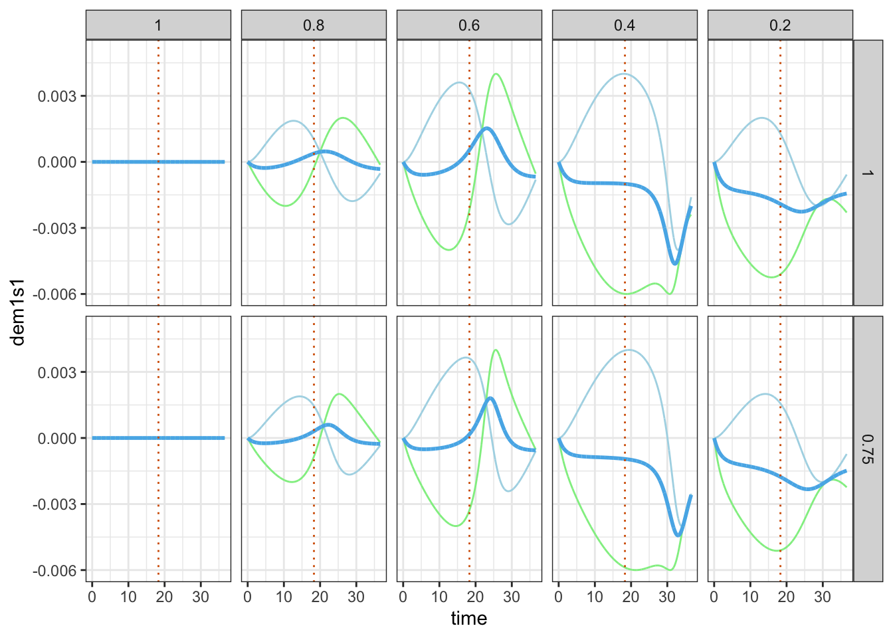

# Two finger tappers' entrainment (Part 1) {#chapTappers1}


This chapter is about mutual influences during music interaction.
In the restricted context of finger tapping this influence can be formulated as follows:
Would my own tapping be affected by seeing another person tapping at a different speed?
And would the other person be influence by me?

To analyse data about two persons interacting this way, previous studies used methods such as cross-correlation, cross-recurrence analysis, quantification analysis, delay-coupled oscillators, among others^[For a review, see Demos & Palmer, 2023. For an approach based on Kuramoto models, see Heggli et al., 2019).]. 

In this chapter, however, we explore the *state-space model*, a mathematical representation of a dynamic system allowing the description of an evolution of internal states over time. This discription is based on a state equation that defines the transition of states, for example by means of differential, or difference, equations. The internal states are linked to observations by means of an observation equation which would, for example, add some fluctuation noise to the states.
The internal states of a system containing two persons tapping, could represent the tapping frequency, tapping period, or tapping phase at any moment. Adding fluctuation noise at discrete tapping events would be due to human sensorimotor variability, giving rise to observations. Basically that state-space model offers a toolbox for studing such mutual influences in finger tapping interactions.

We'll study this state-space model from two perspectives. Firstly, from model to observations, using defined parameters we solve the state equation and generate observations by adding noise.
Secondly, from observations to model, by estimating the parameters and solving a likelihood function based on the state-space model (state and observation equations).

To solve the likelihood equation, we use Stan^[See https://mc-stan.org], a probabilistic programming language based on Markov chain Monte Carlo (MCMC) sampling algorithms. Note that Stan is also the engine beneath `brms`, the package used in previous chapters. Here we address that engine directly. 

The code is contained in:


``` r
source("Code/chapAll_00_Initialization.R")
source("Code/chapAll_01_Functions.R")
source("Code/chapTappers/chapTappers_02_DataPreparation.R")
source("Code/chapTappers/chapTappers_02_Simulation.R")
source("Code/chapTappers/chapTappers_03_DataPlotting.R")
source("Code/chapTappers/chapTappers_04_Modelling.R")
source("Code/chapTappers/chapTappers_05_ModelPlotting.R")
source("Code/chapTappers/chapTappers_06_Evaluation.R")
source("Code/chapTappers/chapTappers_07_EvaluationPlotting.R")
```

## Theory

The theoretical background for this chapter is based on two concepts: entrainment and dynamic systems.

### Entrainment {-}

First consider entrainment, or, more specifically, *rhythmic* entrainment. 
It can be defined as adaptation of timing, due to influences of persons interacting with each other. The influence can occur via modalities of perception other than hearing, for example through seeing, or feeling (see chapter \@ref(chapExoskeletons)).

We believe that entrainment is a factor that facilitates self-augmented interactions (see chapter \@ref(chapTheory)).
In that context, entrainment works as an *automatic* adapter of actions towards a joint goal. Hence it facilitaties the interaction. It is automatic in the sense that it relies on sensorimotor control mechanisms, which subjects are typically not aware off.
The power of entrainment is assumed to be considerable, probably even resulting in strong emotional effects. But this is not what we are dealing with here.

In demonstrating the near inevitability of entrainment under controlled circumstances, Rosso et al. (2024) created an ingenious paradigm based on conditions in which hearing and seeing inform our timing differently, that is, *incongruently.*  Entrainment is here understood as a principle that tends to solve incongruent feedback from actions by changing the actions that originally caused the incongruent feedback. Consequently, the perceptions are no longer incongruent, or at least less incongruent. Entrainment thus drives incongruent perception to more congruent perception, via changes in actions. That's what we are going to deal with. Actions are here understood as fingertapping actions whose control is largely unconscious control. And, as changes in timing are small, we should perhaps speak about micro-timing actions (synchrony with metronome), which occur under the umbrella of macro-timing actions (finger taps).

### Dynamic system {-}

Can we understand action change in terms of a dynamic system?
It sounds complicated because the details of action-perception mechanisms, or sensorimotor mechanisms, leading to entrainment are probably very specific in each individual, and far from known. So, how should we deal with this?

A *dynamic systems approach* assumes that the interaction is ruled by higher-level parameters that only matter for the observed interaction. 
Accordingly, each unit involved in the interaction can be handled as a black box whose inputs and outputs can be measured, without knowing how the black box functions. A reduction to the underlying action-perception mechanisms is not necessary because the observed behavior can be globally described. In order words, reductionism is replaced by a more wholistic perspective. Ultimately, reductionism and wholism may be integrated if we know more of the mechanisms. And, after all, we have to assume some mechanism in the black box as well.
But let us see how far we get with the wholistic perspective and some assumed black box mechanisms of error corrrection.

We capture the dynamic system as a state-space model, with a *state equation* and an *observation equation*. In global terms, these equations can be stated as:

\begin{equation}
\begin{array}{rl}
x_t = f(x_{t-1}, w) & \text{[state equation]} \\
y_t = h(x_t, v) & \text{[observation equation]}
\end{array}
\label{eq:chapTappersEquationStateSpaceModel}
\end{equation}

In this formulation, observation $y_t$ is based on a particular function $h$, of state $x_t$ and some observation noise $v$. For example, this function could be $x_t + v$ when the observation is generated by the state plus a random number $v$ drawn from a normal distribution, representing fluctuation noise.
The state $x_t$ depends on a function $f$, of the previous state $x_{t-1}$ and some system noise $w$.
In the simplest case $f$ could be $x_{t-1} + w$, with $w$ being a system related stochastic parameter, or a noise, but $f$ could also be a non-linear function, as in our approach.

A state could represent a time interval between taps and tics. 
A new time interval is then based on the previous time interval and some system noise, making the new time interval shorter, or larger.
We will use *phase* (= time * $2\pi$) because it allows us to stipulate that every tick or tap occurs at multiples of $2\pi$, starting from $0 [rad]$. Then, using a modulo $2\pi$ operator we can easily extract the timing situation between two successive tics and taps.
And given the fact that phase evolves with time we can always translate the phase value back to time (by simply dividing by $2\pi$).

The state can also be considered a vector, with vector components representing different units. 
That's exactly what we need in order to model entrainment.
We go deeper into the mathematics of the state-space model.
But before we do that we need to know what exactly we want to model.

### Drifting metronomes {-}

The *drifting metronomes* paradigm, developed in (Rosso et al., 2021, 2023), is a peculiar experimental design to uncover entrainment, by controlling for incongruency. Here is how it works.

Two subjects engage in synchronized tapping while listening to a metronome through headphones. The metronomes are slightly detuned in tempo, so that their phase drifts. In particular, one metronome tics  every 600 ms, while the other tics  every 610 ms. Initially, the metronomes start ticking together (in-phase), but as time evolves, the tics  become wider apart (out-phasing), eventually reaching an anti-phase state before their ticking comes closer in time again (in-phasing). When the cycle is completed, the metronomes have one tic exactly together. One complete outphasing and inphasing cycle takes $36.6$ seconds ($= 600 * 610/ 10$). The subjects are asked to perform 10 such cycles in a row during one performance. They are instructed to follow the metronome they hear through the headphones. 

The conditions of interest are: (i) not seeing each other and (ii) seeing each other.^[Note that in the original experiment, there are 4 conditions. The two other conditions control the perspective of looking. Using VR, subjects saw their own arm ticking from a second perspective, or they saw the partner's arm ticking as their own arm. However, here we don't consider these perspective swapping conditions.]

Rosso et al. (2023)  found that the subjects' tapping behavior was influenced by seeing each other tapping, despite the instruction to follow their own metronome. In other words, visual coupling between the individuals led to an entrainment effect on tapping behavior, even if the task implied anti-entrainment (or resistence to entrainment). This suggests that incongruent visual cues from the partner's tapping can be particularly strong, overriding the intended synchronization with the metronome they heard.

Our interest is to offer a causal explanation of this phenomenon. Our goal is to build a state-space model of entrainment, using a few control parameters that govern the causal flow among interacting units.

### Causality {-}

What is meant by *causal explanation*? The type of modelling suggests a *causal* level at which tapping/ticking is basically understood in terms of a limited number of parameters that control a phase flow among the units. All the knowledge is in the dynamics of this phase flow and we don't need to go deeper into the subcomponents of our interacting units. Conceptually speaking, this approach is very different from smooth regression, where modelling is based on a basis expansion using many parameters for splines (see previous chapters). The associated parameters don't model a flow, they just expand the space for the data.

What we want to model is a dynamics that pops up from the action-perception mechanisms that control the timing of the interacting units (subjects and metronomes). This dynamics is described at that higher level in which the parameters control the phase flow among those units. The parameters form part of the state equation, which describes how the internal states are propagated. That equation captures our belief of how the system works. In addition we have another parameter which links this state to the observation. 

As we cannot measure the parameters directly we have to infer them from the observations.

### Approach in this chapter {-}

The development of the state-space model implies several steps which we summarize in figure \@ref(fig:chapTappers1framework):


<div class="figure" style="text-align: center">

<p class="caption">(\#fig:chapTappers1framework)Methodological approach (see text for explanation)</p>
</div>

- In step 1, we define the state-space model its parameters. With state equations we obtain the states, and with the observation equation we obtain the observations.

- In step 2, we use simulated observations (from step 1) and feed them to the state-space model likelihood equation. The solution (via MCMC sampling) is a posterior distribution from which we retrieve parameters. We also calculate generated observations, called posterior predictions, and its estimated parameters.

- In step 3, we check whether the defined parameters correspond to the estimated parameters. Moreover, we check whether states and observations of the defined model correspond to the states and observations generated of the fitted model.

## Step1. From model to observations

### Define the units {-}
First we define the dynamic system.
It contains four units, whose interaction is described by arrows, as shown in figure \@ref(fig:chapTappers2ODEsystem). 

Metronome 1, subject 1, metronome 2 and subject 2 are represented by units $m1,s1,m2$ and $s2$ and
their coupling is represented by arrows pointing from one unit to another unit. An arrow from $s1$ pointing to $m1$ means that subject 1 is coupled to metronome 1, which is described by a combination of coupling strength and phase delay.
The arrows show that subjects are coupled to the own metronome, and to the other subject.

We follow the convention that the arrows point in the direction where the influence comes from. 
Accordingly, each subject points to the own metronome and to the other subject.


<div class="figure" style="text-align: center">

<p class="caption">(\#fig:chapTappers2ODEsystem)Dynamic system</p>
</div>


### Coupling parameters {-}

Each arrow is defined by two parameters, called *coupling strength* and *phase delay*.

The *coupling strength* has the prefix $k$ and its value ranges from 0 to 1. A value of 0 indicates no coupling, or no phase flow, and a value of 1 indicates full coupling, or full phase flow. The coupling strength $ks1m1$ captures how strongly $s1$ adheres to the phase of $m1$ and thus, how strongly $m1$ is affecting the tapping of $s1$. 

A very important feature of this model is that the coupling parameters always sum to $1$. In other words: $1 = ks1m1 + ks1s2$ and $1 = ks2m2 + ks2s1$. This constraint ensures competition among phase flows to metronome and partner. In other words, each subject has a constant volume of phase flow with metronome and partner. However, the gate that controls the phase flow of the own metronome competes with the gate that controls the phase flow gate of the partner. If the gate to the metronome is fully open, then the gate to the partner will be fully closed. The sum is always 1.

The coupling strength can be represented by the length of the arrows, as suggested in figure \@ref(fig:chapTappers2ODEsystem2).
In the left block the subjects devote all attention to their own metronome ($ks1m1 = ks2m2 = 1$). It would be a typical situation where subjects *hear* the metronome and *don't see* each other.
In the right block, the subjects divide attention partly to the metronome, partly to the partner.
It would be a typical situation where subjects *hear* the metronome and *see* each other.
The figure suggests that $s1$ has more attention to the own metronome than to the partner (say, $ks1m1 = .7$ and  $ks1s2 = 1-.7 =.3$), while $s2$ has more attention to the partner than to the metronome (say, $ks2m2 = .3$ and $ks2s1 = 1-.3 = .7$). 

<div class="figure" style="text-align: center">

<p class="caption">(\#fig:chapTappers2ODEsystem2)Assumed coupling strength parameters of the uncoupled and coupled condition</p>
</div>


The *phase delay* has the prefix $d$ (figure \@ref(fig:chapTappers2ODEsystem)) and its value ranges from $-\pi$ to $\pi$.
<!-- $-\frac{\pi}{2}$ to $\frac{\pi}{2}$.  -->
It specifies an average synchronization offset over the entire outphasing-inphasing cycle.
The phase delay could be deleted from the model but introducing it gives more flexibility to the model.

### State equations {-}

The state equations fully describe the phase flow, that is, how phase values of interconnected units ${m1,s1,m2,s2}$ change over time. The observation equation describes how observations relate to states. Typically, the relationship caputures the distinction between discrete observations and continuous states. In addition, it captures a fluctuation property, an inpredictable uncertainty leading to small deviations from predictions. 

Let us look in more detail at the state changes. 
First consider metronomes, then subjects.

The state of the metronomes $m1$ and $m2$ at a particular time can be notated as ${\theta}_{m1,t}$ and ${\theta}_{m2,t}$. It is simply the phase of $m1$, or $m2$, at time $t$.
The change of state (or phase change) over time is notated as $\dot\theta$, or in a different notation, $\frac{d\theta}{dt}$.

But how do we get the phase?
Well, metronomes tic at their own frequency, called the *eigen-frequency*, which is given in units of radians per second $[\frac{rad}{sec}]$. 
The discrete tic events of $m1$, every $.6$ second, are turned into a continuously increasing phase cycle running $2\pi$ radians every $.6$ second.  Similarly, $m2$ does its phase cycle in $.61$ seconds.

In short, metronome tics occur at $2\pi$ but this happens at a different speed, due to a different *eigen-frequency*.
Metronomes have a fixed phase cycle because there are no influences acting upon them. The system equations show that the continuous change in metronomes is constant.

$$
\begin{aligned}
\dot{\theta}_{m1} &= \omega_{m1} = \frac{2\pi}{0.6} \\
\dot{\theta}_{m2} &= \omega_{m2} = \frac{2\pi}{0.61}
\end{aligned}
$$

Or expressed as difference equation we have:

$$
\begin{aligned}
\theta_{m1,t} &= \theta_{m1,t-1} + \frac{2\pi}{0.6} \Delta t \\
\theta_{m2,t} &= \theta_{m2,t-1} + \frac{2\pi}{0.61} \Delta t
\end{aligned}
$$

This representation clearly says that the state at $t$ depends on the state at $t-1$ plus a constant depending on the time difference ($\Delta{t}$) between $t$ and $t-1$. The equation suggests that the phase $\theta$ is constantly increasing over time.

The state transition in subjects is a bit more demanding, due to influences.
The state equations for $s1$ and $s2$, formulated as differential equations, are:

\begin{equation}
\begin{array}{rl}
\dot{\theta}_{s1} = & \omega_{m1} + \\
& ks1m1 \cdot sin(\theta_{m1} - \theta_{s1} + ds1m1) + \\
& (1-ks1m1) \cdot sin(\theta_{s2} - \theta_{s1} + ds1s2)\\
\end{array}\\
\begin{array}{rl}
\dot{\theta}_{s2} = & \omega_{m2} + \\
& ks2m2 \cdot sin(\theta_{m2} - \theta_{s2} + ds2m2) +\\
& (1-ks2m2) \cdot sin(\theta_{s1} - \theta_{s2} + ds2s1)\\
\end{array}
(\#eq:chapTappersequation1a)
\end{equation}

Let us focus on $s1$.
The subject is requested to follow $m1$ and therefore its eigen-frequency is set equal to the eigen-frequency of the metronome $m1$ ($\omega_{m1}$). 

- When the subject is devoting all attention to $m1$, then $ks1m1 = 1$ and there will be zero contribution from the third term on the right hand side of the equation. In following the metronome, there might be deviations corrected by the error term $sin(\theta_{m1} - \theta_{s1} + ds1m1)$.
However, note that the subject can tap in perfect synchrony with the metronome (when $\theta_{m1} - \theta_{s1} = 0$), apart from a possible phase delay $ds1m1$. 

- When the subject is devoting some attention to $s2$,
then $ks1m1 < 1$ and an external influence will be exerted in addition. 

Let's expand on this influence. First, note that the terms two and three in the state equation are genuine error terms.
To better understand the contribution of these terms to the dynamics of the system, we will  simplify the second term to:
$$sin(\theta_{m1} - \theta_{s1})$$ or, in an even more simplified notation, we could write: $$sin(\theta_{m1-s1}).$$
It represents the phase error, or phase difference, between metronome 1 and subject 1.

We also keep in mind that in the first part of the outphasing-inphasing cycle, metronomes start ticking together but they start defasing immediately because $m2$ is ticking slower than $m1$.

Given this context, $sin(\theta_{m1-s1})$ will be positive when the phase difference between metronome 1 and subject 1 (modulo $2\pi$) is $<\pi$, reaching a maximum when $\theta_{m1-s1} = \frac{\pi}{2}$, as $sin(\frac{\pi}{2}) = 1$. 
This might typically happen when $s1$ is retarded, for example, due to the influence of seeing $s2$ tapping slower.
The value will be negative when the phase difference (modulo $2\pi$) is $>\pi$, reaching a minimum when $\theta_{m1-s1} = \frac{3\pi}{2}$, as $sin(\frac{3\pi}{2}) = -1$.
This might happen when the influence of seeing $s2$ is experienced as tapping ahead, due to an anti-phase effect.
Overall, this suggest that the error term evolves over time as a sinusoidal curve, first going up then going down, cross zero, going down and going up again.

Next, consider the third term, simplified as $$sin(\theta_{s2-s1})$$.
It represents the phase error between subject 2 and subject 1.

In the first part of the outphasing-inphasing cycle, $s2$ is tapping gradually slower than $s1$. The phase of $s1$ will be higher than the phase of $s2$ so that the phase difference $s2-s1$ will be negative.
And as long as the phase difference (modulo $2\pi$) is $> \pi$, $sin(\theta_{s2-s1})$ will be negative with a minimum at $\theta_{s2-s1} = \frac{\pi}{2}$. This situation typically occurs at the beginning of the sequence. 
However, when the phase difference (modulo $2\pi$) turns positive $< \pi$, $sin(\theta_{s2-s1})$ will be positive with a maximum at $\theta_{s2-s1} = \frac{3\pi}{2}$. This happens again due to an anti-phase effect.
Overall, the error term evolves over time as a sinusoidal curve, first going down then going up, cross zero, going up and going down again.

Note that $m1$ and $s2$ pull in opposite directions and the global resulting error term is a sum of these error terms, weighted by $km1s1$ and its reverse $1 - km1s1$, respectively.  

Due to the response to $s2$, one may expect that, typically, the anti-phase zero-crossing point of subjects tapping will be delayed in the second error term. This delay is more pronounced in $s2$ than in $m1$. The more the tapping slows down, the later that zero-crossing point will occur in the global error curve.

Since both sinusoids add, the curve will become asymmetrical both in time and in amplitude. And don't forget that $sin(.)$ is first multiplied by the coupling strength. 
With extreme parameter settings (e.g., $ks1m1$ < .4) the zero-crossing effect disappears (see the examples below).

Finally, we also have to consider the effect of the phase delay parameters.
Since these parameters are held constant over the entire outphasing-inphasing cycle, they affect the entire curve by a shift of all values.
This effect is also best illustrated by means of examples shown below.

The state equations for subjects can be written either as differential or difference equation.
Here we consider a concise notation for $s1$:

$$
\begin{aligned}
\dot{\theta}_{s1} &= \omega_{m1} + (\epsilon_{m1-s1} + \epsilon_{s2-s1}) \\
\theta_{s1,t} &= \theta_{s1,t-1} + (\omega_{m1} + \epsilon_{m1-s1} + \epsilon_{s2-s1}) \Delta t
\end{aligned}
$$

The first equation (differential) clearly shows the error term as $\epsilon_{m1-s1}+\epsilon_{s2-s1}$. The second equation (difference) clearly shows that $\theta$ of $s1$ at $t$ is equal to $\theta$ of $s1$ at $t-1$ plus a term that contains a fraction ($\Delta{t}$) of the eigen-frequency $\omega$ of $m1$ plus the error terms. The eigen-frequency is always positive and large compared to the error terms. Hence, the phase will continue to increase. Note that the error terms also include some system noise in coupling strength ($k$) and phase delay ($d$) parameters. 

The state equation governs the state transitions of the dynamic system.
State equations thus propagate the states.
With four units in the dynamic system, we have four states that need to be propagated at each time instance.
Accordingly, the state vector at $t$ is 

$$
\boldsymbol{\theta}_t = <\theta_{m1,t}, \theta_{s1,t}, \theta_{m2,t}, \theta_{s2,t}>
$$.

and the state equation is:

$$
\boldsymbol{\theta}_t = \boldsymbol{\theta}_{t-1} +  (\boldsymbol\omega + \boldsymbol\epsilon)\Delta{t}
$$
where $\boldsymbol\omega$ is a vector of eigen-frequencies and $\boldsymbol\epsilon$ is vector of an error terms. Clearly, for metronomes the error is always zero.

Then, finally, the observation $O$ is conceived as being based on the state $\boldsymbol{\theta_{t}}$, plus an observation noise $\textbf{v}$, where each component $v$ can be considered to have a normal distribution $N(0,\textbf{V})$ and thus we have:

$$
O_{t} = \boldsymbol{\theta_{t}} + \textbf{v}
$$
where $\textbf{v}$ is distributed as a normal distribution with mean 0 and standard deviation $V$: $N(0,\textbf{V})$.
$\textbf{V}$ is a vector of standard deviations associated with the vector components of $\boldsymbol{\theta_{t}}$.
It is zero for metronomes.
An observed tap of $s1$ at $t$ is equal to the state $\theta_{s1,t}$ plus a fluctuation noise. 

Note that the equations of the metronomes could be deleted from our state-space representation as they are completely deterministic.
However, we prefer to include them in the specifications of the state-space model, mainly for future generalization purposes.

### Understanding the dynamic {-}

At this point it is instructive to calculate some states using the state equation.
First we define an R function called `dydt, which contains the state equation.`


``` r
# Define dydt
dydt <- function(t, y, parms) {
  with(as.list(c(y, parms)), {
    ############################## dynamic system
    dm1 = 2*pi*1000/600
    ds1 = 2*pi*1000/600  + 
      .5*(ks1m1* sin(m1 - s1 + ds1m1) + 
            (1-ks1m1)* sin(s2 - s1 + ds1s2) )
    
    dm2 = 2*pi*1000/610
    ds2 = 2*pi*1000/610  + 
      .5*(ks2m2* sin(m2 - s2 + ds2m2) + 
            (1-ks2m2)* sin(s1 - s2 + ds2s1) )
    ############################## retrieve components for ds1
    dem1s1 = ks1m1 * sin(m1 - s1 + ds1m1)
    des2s1 = (1-ks1m1) * sin(s2 - s1 + ds1s2)
    
    return(list(c(dm1,ds1,dm2,ds2,dem1s1,des2s1)))
  })
}
```

For didactic reasons, we also retrieve the error terms that contribute to `ds1` separately.
In fact, we re-calculate the error term `ks1m1* sin(m1 - s1 + ds1m1)` as `dem1s1` and the error term
(`1-ks1m1)* sin(s2 - s1 + ds1s2)` as `des2s1`. 

We call upon this R-function to solve the equations numerically using the `ode`-function from the R-package `deSolve`, as shown in the code below. 
But first we have to specify some parameters.
In particular, we set the coupling strength to `ks1m1 = .9, ks2m2 = .7`, while phase delays are zero.
The initial values of our states, which is at time $0$, are all zero.
The states (`solution`) are then differentiated in order to obtain the instantaneous frequency from the phase. 


``` r
# define time points
dt = 1/100
time_points <- seq(0, 36.6, by = dt)
# define initial state
state <- c(m1 = 0, s1 = 0, m2 = 0, s2 = 0, em1s1 = 0, es2s1 = 0)
# define the parameters
parm = c(ks1m1 = .9, ks2m2 = .7, ds1m1 = 0, ds2m2 = 0, ds1s2 = 0, ds2s1 = 0)
# solve the ODE
solution <- ode(y = state, times = time_points, func = dydt, parms = parm) %>% 
  data.frame()
# calculate the phase change over time = instantaneous frequency
solution <- solution %>% mutate(
  dm1 = c(NA,diff(m1)),
  ds1 = c(NA,diff(s1)),
  dm2 = c(NA,diff(m2)),
  ds2 = c(NA,diff(s2)),
  dm1s1 = c(NA,diff(em1s1)),
  ds2s1 = c(NA,diff(es2s1))
)
```

Here is how the data frame `solution` looks like:


```
## 'data.frame':	3661 obs. of  13 variables:
##  $ time : num  0 0.01 0.02 0.03 0.04 0.05 0.06 0.07 0.08 0.09 ...
##  $ m1   : num  0 0.105 0.209 0.314 0.419 ...
##  $ s1   : num  0 0.105 0.209 0.314 0.419 ...
##  $ m2   : num  0 0.103 0.206 0.309 0.412 ...
##  $ s2   : num  0 0.103 0.206 0.309 0.412 ...
##  $ em1s1: num  0.00 1.93e-09 1.15e-08 3.65e-08 8.34e-08 ...
##  $ es2s1: num  0.00 -8.58e-07 -3.43e-06 -7.71e-06 -1.37e-05 ...
##  $ dm1  : num  NA 0.105 0.105 0.105 0.105 ...
##  $ ds1  : num  NA 0.105 0.105 0.105 0.105 ...
##  $ dm2  : num  NA 0.103 0.103 0.103 0.103 ...
##  $ ds2  : num  NA 0.103 0.103 0.103 0.103 ...
##  $ dm1s1: num  NA 1.93e-09 9.61e-09 2.50e-08 4.69e-08 ...
##  $ ds2s1: num  NA -8.58e-07 -2.57e-06 -4.28e-06 -5.99e-06 ...
```


The solution comes with a time indicator called `time`, with `m1, s1, m2, s2` representing the states' phase, as well as the phase of the error terms `em1s1` and `es2s1` related to `s1`. 
By differentiating, we get the instantaneous frequencies: `dm1, ds1, dm2, ds2, dm1s1` and `ds2s1`, where the prefix $d$ refers to the differential.

It is instructive to vary the coupling strengths in a systematic way, to see what happens.
Let's do that, but we first focus on `em1s1` and `es2s1`, the error terms that contribute to phase change in `s1.` In the code that follows, we define `ks1m1` to be `1, .8, .6, .4`, and `.2`, and `ks2m2` is `1` and then `.75`.
We run all combinations of `ks1m1` and `ks2m2.`

<div class="figure" style="text-align: center">

<p class="caption">(\#fig:chapTappersSol1)Error terms in s1 due to competing influences of m1 and s2. The error terms are shown as thin lines. The columns show five different values of ks1m1 (1, .8, .6, .4, .2), the rows show two different values of ks2m2 (1, .75). The thick line is the average of the thin lines. Overall, these figures show the instantaneous frequency (without the eigen-frequency) of the error terms contribution to s1</p>
</div>
The panels in the top row of Figure \@ref(fig:chapTappersSol1) show the error terms that contribute to the state of `s1`, for `ks1m1 = 1, .8, .6, .4, .2`, and given `ks2m2 = 1`. The bottom row shows the error terms when `ks2m2 = .75`. 
The global error term is shown as the thick line, being the sum of the two error terms (`$\epsilon_{m1-s1}$ and $\epsilon_{s2-s1}$`) divided by 2. 
In fact, the vertical scale is not that important here.

The dotted vertical line marks the anti-phase time of the metronomes.
One can see that the crossing point of the error term curves is delayed.
When `ks1m1 = .4` the curve has flipped. 
It marks the fact that the tapping is more in line with $s2$ than with the own $s1$.

In a similar way, it is possible to calculate the error terms for $s2$ based on the pulling forces of the metronome and the partner subject.

Next we show the phase, just to illustrate that there is not much to see because phase is increasing continuously and phase fluctuation is minimal with respect to this increase.
We show the code to show the details of how phase is treated.


``` r
cbPalette <- c("#56B4E9","#E69F00", "#56B4E9","#E69F00","#D55E00")
Solution %>% pivot_longer(cols = c(m1,s1,m2,s2)) %>% group_by(time) %>% ggplot() +
  geom_line(aes(x= time,y = value, color = name),size=1) +
  geom_vline(xintercept = 36.6/2, color = "#D55E00", linetype = "dotted") +
  theme_bw() +
  scale_fill_manual(values=cbPalette) +
  scale_colour_manual(labels = c("m1","s1","m2","s2"),values=cbPalette) +
  facet_grid(ks2m2~ks1m1)
# \@ref(fig:chapTappersSol2)
```

<div class="figure" style="text-align: center">

<p class="caption">(\#fig:chapTappersPhase2)Phase of all units</p>
</div>

An alternative representation is the *instantaneous period*, with period on the vertical axis.
It's the inverse of the instantaneous frequency, which we obtain by differentiating the phase. Accordingly, with $ks1m1 = ks2m2 = 1$, subjects follow their metronomes and therefore the instantaneous period of their tapping is on 600 ms and 610 ms. Note that the blue curves (from $s1$) are the reversed curves from those in figure \@ref(fig:chapTappersSol1).


``` r
do_period <- function(value,dt){
  return = 2000*pi*dt/value
}

cbPalette <- c("lightblue","#f1c9a5", "#56B4E9","#E69F00","#D55E00")

Solution %>% pivot_longer(cols = c(dm1,ds1,dm2,ds2)) %>% mutate(value = do_period(value,dt)) %>% group_by(time) %>% ggplot() +
  geom_line(aes(x= time,y = value, color=name), size=1) +
  geom_vline(xintercept = 36.6/2, color = "#D55E00", linetype = "dotted") +
  ylim(585,635) +
  theme_bw() +
  scale_fill_manual(values=cbPalette) +
  scale_colour_manual(labels = c("dm1","dm2","ds1","ds2"),values=cbPalette) +
  facet_grid(ks2m2~ks1m1)

# \@ref(fig:chapTappersSol2)
```

<div class="figure" style="text-align: center">

<p class="caption">(\#fig:chapTappersSol2)Instantaneous periods. The columns show five different values of ks1m1, the rows show two different values of ks2m2</p>
</div>

The figure reveals that the blue curves (representing the instantaneous period of $s1$) become slightly more pronounced and shifted when there is a mutual influence due to $ks2m2 = .75$. 

Next, we show the relative phase, rather than the instantaneous period.
As the phase is continuously increasing it is more practical to look at the phase relative to the metronome, and rotate the axis such that the interval covers $[-\pi,+\pi]$.


``` r
do_rotate <- function(value){
  return =  ((value + pi)%%(2*pi))-pi
}

cbPalette <- c("#56B4E9","#E69F00","#D55E00")

Solution %>% mutate(m1s1 = do_rotate(m1 - s1), m2s2 = do_rotate(m2 - s2)) %>% 
  pivot_longer(cols = c(m1s1,m2s2)) %>% group_by(time) %>% ggplot() +
  geom_line(aes(x= time,y = value, color=name), size = 1) + 
  # ylim(5.75,6.35) +
  theme_bw() +
  scale_fill_manual(values=cbPalette) +
  scale_colour_manual(labels = c("m1 - s1","m2 - s2"),values=cbPalette) +
  facet_grid(ks2m2~ks1m1) +
  labs(y="relative phase")

# \@ref(fig:chapTappersSol3)
```

<div class="figure" style="text-align: center">

<p class="caption">(\#fig:chapTappersSol3)Relative phase of s1 and s2. The columns show five different values of ks1m1, the rows show two different values of ks2m2</p>
</div>

This viewpoint is of interest when phase delays enter the picture.
The next figure shows the relative phase with phase delays, when $ds1m1 = ds2m2 = 1$. 


``` r
# Set the time points
Solution <- data.frame()
dt = 1/100
time_points <- seq(0, 36.6, by = dt)
state <- c(m1 = 0, s1 = 0, m2 = 0, s2 = 0, em1s1 = 0, es2s1 = 0)

for (ks1m1 in seq(1,.2,-.2)){
  for(ks2m2 in c(1,.75)){
    parm <- c(ks1m1 = ks1m1,ks2m2 = ks2m2, ds1m1 = 1, ds2m2 = 1, ds1s2 = 0, ds2s1 = 0)
    solution <- ode( state, time_points, dydt, parms = parm) %>% 
      data.frame() %>% 
      dplyr::select(time,m1,s1,m2,s2,em1s1,es2s1) %>% 
      mutate(ks1m1 = factor(ks1m1), ks2m2=factor(ks2m2))
    Solution <- rbind(Solution, solution)
  }
}

Solution <- Solution %>% mutate(
  dm1 = c(NA,diff(m1)),
  ds1 = c(NA,diff(s1)),
  dm2 = c(NA,diff(m2)),
  ds2 = c(NA,diff(s2)),
  dem1s1 = c(NA,diff(em1s1)),
  des2s1 = c(NA,diff(es2s1))
)

do_rotate <- function(value){
  return =  (value + pi)%%(2*pi)-pi
}

cbPalette <- c("#56B4E9","#E69F00","#D55E00")

Solution %>% mutate(m1s1 = do_rotate(m1 - s1), m2s2 = do_rotate(m2 - s2)) %>% 
  pivot_longer(cols = c(m1s1,m2s2)) %>% group_by(time) %>% ggplot() +
  geom_line(aes(x= time,y = value, color=name), size = 1) + 
  # ylim(5.75,6.35) +
  theme_bw() +
  scale_fill_manual(values=cbPalette) +
  scale_colour_manual(labels = c("m1 - s1","m2 - s2"),values=cbPalette) +
  facet_grid(ks2m2~ks1m1) +
  labs(y="relative phase")

# \@ref(fig:chapTappersSol4)
```

<div class="figure" style="text-align: center">

<p class="caption">(\#fig:chapTappersSol4)Relative phase of s1 and s2, with phase delay ds1m1 = ds2m2 = 1. The columns show five different values of ks1m1, the rows show two different values of ks2m2</p>
</div>
Note that the phase delay tends to shift the curve downward, implying anticipation, while similar figures appear, except at the beginning of the curves because at that point, we start our state at the zero position.

The examples reveal the complex character of the dynamical system. 
Despite the fact that it is composed of simple sinusoids, its final behavior can be rather surprising.


### General specification {-}

While it is possible to generalize the dynamic system to more units arranged in different configurations, we will not explore that topic here. We will focus on the current particular setup because it has been used in an experiment, and the data from that experiment will be analyzed using the dynamic model validated in this chapter.

Therefore, rather than expanding the dynamic system, we aim to validate whether this dynamic system is worth the effort. However, before proceeding, it may be of interest to generalize the above approach using equation \@ref(eq:chapTappersequation1):

\begin{equation}
\frac{d\theta_{i}}{dt} = \omega_{i} + \sum_j K_{i,j} sin(\theta_{t,j} - \theta_{t,i} + D_{i,j}),~
with ~ \theta_i(0) = 0 (\#eq:chapTappersequation1)
\end{equation}

where $\theta$ is the phase, 
$i,j$ is an index for elements in $\left\{ m1,s1,s2,m2 \right\}$, and
$\omega$ is the instantaneous frequency, set as $\omega_i = \frac{2\pi*}{.6}~[\frac{rad}{sec}]$, for $i=1,2$ and $\omega_i = \frac{2\pi}{.61}~[\frac{rad}{sec}]$ for $i=3,4$. 


The matrix $K$ contains the coupling parameters from rows (index $i$) to columns (index $j$), and the parameters are in the range $[0,1]$. 
Accordingly, $K(2,1) = K_{s1,m1} = ks1m1$.
The matrix $D$ contains the delay parameters in the range $[-\pi,\pi]$. 


Matrices K and D are design matrices that define the dynamic system. Dots mean that no parameter is created. If a parameter is created (e.g. $ks1m1$), then there are two possibilities: either that parameter gets a defined value and data can be generated with it, or the value of that parameter is estimated from given data. In this chapter, we'll first define them, and then estimate them. We can then check whether the estimation is correctly done.


$$
K = \begin{matrix}   
&m1~~~~~~~~~~s1~~~~~~~~~~m2~~~~~~~~~~s2\\
\begin{matrix}   
&m1 \\
&s1 \\
&m2 \\
&s2 \\
\end{matrix} &
\begin{bmatrix}
. &. &. &. \\
ks1m1 &. &. &1-ks1m1 \\
. &. &. &. \\
. &1-ks2m2  &ks2m2 &.\\
\end{bmatrix}
\end{matrix}
$$


$$
D = \begin{matrix}   
&m1~~~~~s1~~~~~m2~~~~~s2\\
\begin{matrix}   
&m1 \\
&s1 \\
&m2 \\
&s2 \\
\end{matrix} &
\begin{bmatrix}
. &. &. &. \\
ds1m1 &. &. &. \\
. &. &. &. \\
. &.  &ds2m2 &.\\
\end{bmatrix}
\end{matrix}
$$


### Running a simulation app {-}

Equation \@ref(eq:chapTappersequation1) is non-linear and therefore it is useful to explore it with simulations. We refer to a shiny application [here](http://odetappers.shinyapps.io/odetappers2/)^[See http://odetappers.shinyapps.io/odetappers2/], which readers may explore. 
Given the above explanation, we believe that the tool is self-explanatory.

<!-- <iframe src="http://odetappers.shinyapps.io/odetappers2/" width="750" height="1000"></iframe> -->


### Generating fake observations {-}

Now that we have system equations that can generate the states of our dynamic system, our next goal is to generate observations. Currently, these are fake observations of tics and taps of metronomes and subjects. We proceed in two steps:

- First, we use the generated states and extract the time at which the phase becomes a multiple of $2\pi$. Those time instances correspond to tics or taps from metronomes and subjects. 

- Then, we add noise to the tap times, using a normal distribution that simulates human variability in finger tapping tasks.

The dataset thus generated will be used to retrieve the parameters of the state-space model.
But let's first try to generate these observations.

### Constraints in parameters {-}

Based on the *drifting metronomes* paradigm, in which subjects are asked to tap along with the metronome heard through their headphones, we assume that most subjects will indeed be able to adhere to their own metronome. This implies that the coupling strength $ks1m1$ and $ks2m2$ will be rarely < .4 because in that case they actually follow the partner (as illustrated in the above figures). Furthermore, we assume for testing purposes that both subjects have the same distribution of coupling strength. Accordingly, we first generate coupling strength values for subject 1. Then we reshuffle these values and assign coupling strength values to subject 2.


``` r
# distribution of coupling strengths
K1 <- data.frame(ks1m1 = rbeta(20,4,2)) 
K1 <- K1 %>% mutate(ks2m2 = sample(ks1m1) )

# distribution of delay times
D2 <- data.frame(ds1m1 = rsn(n=20, xi=0, omega=.6, alpha=3, tau=0, dp=NULL)) 
D2 <- D2 %>% mutate(ds2m2 = sample(ds1m1), ds1s2 = 0, ds2s1 = 0)

# delays set to zero because we want to test the system without delays and with delays
D1 <- D2 %>%  mutate( ds1m1 = 0, ds2m2 = 0) 

# row bind the same coupling parameters
K <- rbind(K1,K1)
# row bind different delay parameters
D <- rbind(D1,D2)

# check distributions visually
cbPalette <- c("#999999", "#E69F00", "#56B4E9", "#009E73", "#F0E442", "#0072B2", "#D55E00", "#CC79A7")

K_long <- K %>% pivot_longer(cols = everything())
pk <- ggplot(K_long) + 
  geom_point(aes(x=name,y=value, color = name), size = 1, shape = 1) +
  theme_bw() +
  scale_fill_manual(values=cbPalette) +
  scale_colour_manual(values=cbPalette) + 
  ylim(0,1)

D_long <- D %>% pivot_longer(cols = everything())
pd <- ggplot(D_long) + 
  geom_point(aes(x=name,y=value, color = name), size = 1, shape = 1) +
  theme_bw() +
  scale_fill_manual(values=cbPalette) +
  scale_colour_manual(values=cbPalette) + 
  ylim(0,1)
pk + pd
```

<div class="figure" style="text-align: center">

<p class="caption">(\#fig:chapTappersKDdistributions)Distributions of coupling strength and phase delay parameters for simulations</p>
</div>

<table class="table table-striped" style="font-size: 10px; margin-left: auto; margin-right: auto;">
<caption style="font-size: initial !important;">(\#tab:chapTappersKDtable)K and D parameters for 40 simulations</caption>
 <thead>
  <tr>
   <th style="text-align:left;">  </th>
   <th style="text-align:right;"> ks1m1 </th>
   <th style="text-align:right;"> ks2m2 </th>
   <th style="text-align:right;"> ds1m1 </th>
   <th style="text-align:right;"> ds2m2 </th>
   <th style="text-align:right;"> ds1s2 </th>
   <th style="text-align:right;"> ds2s1 </th>
  </tr>
 </thead>
<tbody>
  <tr>
   <td style="text-align:left;"> 1 </td>
   <td style="text-align:right;"> 0.7292610 </td>
   <td style="text-align:right;"> 0.8884887 </td>
   <td style="text-align:right;"> 0.0000000 </td>
   <td style="text-align:right;"> 0.0000000 </td>
   <td style="text-align:right;"> 0 </td>
   <td style="text-align:right;"> 0 </td>
  </tr>
  <tr>
   <td style="text-align:left;"> 2 </td>
   <td style="text-align:right;"> 0.4199088 </td>
   <td style="text-align:right;"> 0.3992122 </td>
   <td style="text-align:right;"> 0.0000000 </td>
   <td style="text-align:right;"> 0.0000000 </td>
   <td style="text-align:right;"> 0 </td>
   <td style="text-align:right;"> 0 </td>
  </tr>
  <tr>
   <td style="text-align:left;"> 3 </td>
   <td style="text-align:right;"> 0.9130523 </td>
   <td style="text-align:right;"> 0.7144593 </td>
   <td style="text-align:right;"> 0.0000000 </td>
   <td style="text-align:right;"> 0.0000000 </td>
   <td style="text-align:right;"> 0 </td>
   <td style="text-align:right;"> 0 </td>
  </tr>
  <tr>
   <td style="text-align:left;"> 4 </td>
   <td style="text-align:right;"> 0.6100897 </td>
   <td style="text-align:right;"> 0.7292610 </td>
   <td style="text-align:right;"> 0.0000000 </td>
   <td style="text-align:right;"> 0.0000000 </td>
   <td style="text-align:right;"> 0 </td>
   <td style="text-align:right;"> 0 </td>
  </tr>
  <tr>
   <td style="text-align:left;"> 5 </td>
   <td style="text-align:right;"> 0.6570294 </td>
   <td style="text-align:right;"> 0.6087971 </td>
   <td style="text-align:right;"> 0.0000000 </td>
   <td style="text-align:right;"> 0.0000000 </td>
   <td style="text-align:right;"> 0 </td>
   <td style="text-align:right;"> 0 </td>
  </tr>
  <tr>
   <td style="text-align:left;"> 6 </td>
   <td style="text-align:right;"> 0.8726596 </td>
   <td style="text-align:right;"> 0.9033425 </td>
   <td style="text-align:right;"> 0.0000000 </td>
   <td style="text-align:right;"> 0.0000000 </td>
   <td style="text-align:right;"> 0 </td>
   <td style="text-align:right;"> 0 </td>
  </tr>
  <tr>
   <td style="text-align:left;"> 7 </td>
   <td style="text-align:right;"> 0.7144593 </td>
   <td style="text-align:right;"> 0.6570294 </td>
   <td style="text-align:right;"> 0.0000000 </td>
   <td style="text-align:right;"> 0.0000000 </td>
   <td style="text-align:right;"> 0 </td>
   <td style="text-align:right;"> 0 </td>
  </tr>
  <tr>
   <td style="text-align:left;"> 8 </td>
   <td style="text-align:right;"> 0.4353818 </td>
   <td style="text-align:right;"> 0.6100897 </td>
   <td style="text-align:right;"> 0.0000000 </td>
   <td style="text-align:right;"> 0.0000000 </td>
   <td style="text-align:right;"> 0 </td>
   <td style="text-align:right;"> 0 </td>
  </tr>
  <tr>
   <td style="text-align:left;"> 9 </td>
   <td style="text-align:right;"> 0.8884887 </td>
   <td style="text-align:right;"> 0.9373000 </td>
   <td style="text-align:right;"> 0.0000000 </td>
   <td style="text-align:right;"> 0.0000000 </td>
   <td style="text-align:right;"> 0 </td>
   <td style="text-align:right;"> 0 </td>
  </tr>
  <tr>
   <td style="text-align:left;"> 10 </td>
   <td style="text-align:right;"> 0.9033425 </td>
   <td style="text-align:right;"> 0.6016186 </td>
   <td style="text-align:right;"> 0.0000000 </td>
   <td style="text-align:right;"> 0.0000000 </td>
   <td style="text-align:right;"> 0 </td>
   <td style="text-align:right;"> 0 </td>
  </tr>
  <tr>
   <td style="text-align:left;"> 11 </td>
   <td style="text-align:right;"> 0.4733592 </td>
   <td style="text-align:right;"> 0.4199088 </td>
   <td style="text-align:right;"> 0.0000000 </td>
   <td style="text-align:right;"> 0.0000000 </td>
   <td style="text-align:right;"> 0 </td>
   <td style="text-align:right;"> 0 </td>
  </tr>
  <tr>
   <td style="text-align:left;"> 12 </td>
   <td style="text-align:right;"> 0.3093954 </td>
   <td style="text-align:right;"> 0.9130523 </td>
   <td style="text-align:right;"> 0.0000000 </td>
   <td style="text-align:right;"> 0.0000000 </td>
   <td style="text-align:right;"> 0 </td>
   <td style="text-align:right;"> 0 </td>
  </tr>
  <tr>
   <td style="text-align:left;"> 13 </td>
   <td style="text-align:right;"> 0.3992122 </td>
   <td style="text-align:right;"> 0.4353818 </td>
   <td style="text-align:right;"> 0.0000000 </td>
   <td style="text-align:right;"> 0.0000000 </td>
   <td style="text-align:right;"> 0 </td>
   <td style="text-align:right;"> 0 </td>
  </tr>
  <tr>
   <td style="text-align:left;"> 14 </td>
   <td style="text-align:right;"> 0.6016186 </td>
   <td style="text-align:right;"> 0.4733592 </td>
   <td style="text-align:right;"> 0.0000000 </td>
   <td style="text-align:right;"> 0.0000000 </td>
   <td style="text-align:right;"> 0 </td>
   <td style="text-align:right;"> 0 </td>
  </tr>
  <tr>
   <td style="text-align:left;"> 15 </td>
   <td style="text-align:right;"> 0.6087971 </td>
   <td style="text-align:right;"> 0.8726596 </td>
   <td style="text-align:right;"> 0.0000000 </td>
   <td style="text-align:right;"> 0.0000000 </td>
   <td style="text-align:right;"> 0 </td>
   <td style="text-align:right;"> 0 </td>
  </tr>
  <tr>
   <td style="text-align:left;"> 16 </td>
   <td style="text-align:right;"> 0.9373000 </td>
   <td style="text-align:right;"> 0.6048375 </td>
   <td style="text-align:right;"> 0.0000000 </td>
   <td style="text-align:right;"> 0.0000000 </td>
   <td style="text-align:right;"> 0 </td>
   <td style="text-align:right;"> 0 </td>
  </tr>
  <tr>
   <td style="text-align:left;"> 17 </td>
   <td style="text-align:right;"> 0.8880231 </td>
   <td style="text-align:right;"> 0.3093954 </td>
   <td style="text-align:right;"> 0.0000000 </td>
   <td style="text-align:right;"> 0.0000000 </td>
   <td style="text-align:right;"> 0 </td>
   <td style="text-align:right;"> 0 </td>
  </tr>
  <tr>
   <td style="text-align:left;"> 18 </td>
   <td style="text-align:right;"> 0.6542134 </td>
   <td style="text-align:right;"> 0.5550383 </td>
   <td style="text-align:right;"> 0.0000000 </td>
   <td style="text-align:right;"> 0.0000000 </td>
   <td style="text-align:right;"> 0 </td>
   <td style="text-align:right;"> 0 </td>
  </tr>
  <tr>
   <td style="text-align:left;"> 19 </td>
   <td style="text-align:right;"> 0.5550383 </td>
   <td style="text-align:right;"> 0.8880231 </td>
   <td style="text-align:right;"> 0.0000000 </td>
   <td style="text-align:right;"> 0.0000000 </td>
   <td style="text-align:right;"> 0 </td>
   <td style="text-align:right;"> 0 </td>
  </tr>
  <tr>
   <td style="text-align:left;"> 20 </td>
   <td style="text-align:right;"> 0.6048375 </td>
   <td style="text-align:right;"> 0.6542134 </td>
   <td style="text-align:right;"> 0.0000000 </td>
   <td style="text-align:right;"> 0.0000000 </td>
   <td style="text-align:right;"> 0 </td>
   <td style="text-align:right;"> 0 </td>
  </tr>
  <tr>
   <td style="text-align:left;"> 21 </td>
   <td style="text-align:right;"> 0.7292610 </td>
   <td style="text-align:right;"> 0.8884887 </td>
   <td style="text-align:right;"> 0.2440232 </td>
   <td style="text-align:right;"> -0.0442601 </td>
   <td style="text-align:right;"> 0 </td>
   <td style="text-align:right;"> 0 </td>
  </tr>
  <tr>
   <td style="text-align:left;"> 22 </td>
   <td style="text-align:right;"> 0.4199088 </td>
   <td style="text-align:right;"> 0.3992122 </td>
   <td style="text-align:right;"> 0.7288762 </td>
   <td style="text-align:right;"> 0.0582029 </td>
   <td style="text-align:right;"> 0 </td>
   <td style="text-align:right;"> 0 </td>
  </tr>
  <tr>
   <td style="text-align:left;"> 23 </td>
   <td style="text-align:right;"> 0.9130523 </td>
   <td style="text-align:right;"> 0.7144593 </td>
   <td style="text-align:right;"> 0.5775512 </td>
   <td style="text-align:right;"> 0.2364962 </td>
   <td style="text-align:right;"> 0 </td>
   <td style="text-align:right;"> 0 </td>
  </tr>
  <tr>
   <td style="text-align:left;"> 24 </td>
   <td style="text-align:right;"> 0.6100897 </td>
   <td style="text-align:right;"> 0.7292610 </td>
   <td style="text-align:right;"> -0.0134876 </td>
   <td style="text-align:right;"> 0.3699094 </td>
   <td style="text-align:right;"> 0 </td>
   <td style="text-align:right;"> 0 </td>
  </tr>
  <tr>
   <td style="text-align:left;"> 25 </td>
   <td style="text-align:right;"> 0.6570294 </td>
   <td style="text-align:right;"> 0.6087971 </td>
   <td style="text-align:right;"> 0.4263449 </td>
   <td style="text-align:right;"> 0.5258656 </td>
   <td style="text-align:right;"> 0 </td>
   <td style="text-align:right;"> 0 </td>
  </tr>
  <tr>
   <td style="text-align:left;"> 26 </td>
   <td style="text-align:right;"> 0.8726596 </td>
   <td style="text-align:right;"> 0.9033425 </td>
   <td style="text-align:right;"> 0.2157303 </td>
   <td style="text-align:right;"> 0.4142806 </td>
   <td style="text-align:right;"> 0 </td>
   <td style="text-align:right;"> 0 </td>
  </tr>
  <tr>
   <td style="text-align:left;"> 27 </td>
   <td style="text-align:right;"> 0.7144593 </td>
   <td style="text-align:right;"> 0.6570294 </td>
   <td style="text-align:right;"> 0.2364962 </td>
   <td style="text-align:right;"> 0.4873070 </td>
   <td style="text-align:right;"> 0 </td>
   <td style="text-align:right;"> 0 </td>
  </tr>
  <tr>
   <td style="text-align:left;"> 28 </td>
   <td style="text-align:right;"> 0.4353818 </td>
   <td style="text-align:right;"> 0.6100897 </td>
   <td style="text-align:right;"> 0.2208240 </td>
   <td style="text-align:right;"> 0.2208240 </td>
   <td style="text-align:right;"> 0 </td>
   <td style="text-align:right;"> 0 </td>
  </tr>
  <tr>
   <td style="text-align:left;"> 29 </td>
   <td style="text-align:right;"> 0.8884887 </td>
   <td style="text-align:right;"> 0.9373000 </td>
   <td style="text-align:right;"> 0.2622691 </td>
   <td style="text-align:right;"> 0.2157303 </td>
   <td style="text-align:right;"> 0 </td>
   <td style="text-align:right;"> 0 </td>
  </tr>
  <tr>
   <td style="text-align:left;"> 30 </td>
   <td style="text-align:right;"> 0.9033425 </td>
   <td style="text-align:right;"> 0.6016186 </td>
   <td style="text-align:right;"> 0.1694013 </td>
   <td style="text-align:right;"> -0.0134876 </td>
   <td style="text-align:right;"> 0 </td>
   <td style="text-align:right;"> 0 </td>
  </tr>
  <tr>
   <td style="text-align:left;"> 31 </td>
   <td style="text-align:right;"> 0.4733592 </td>
   <td style="text-align:right;"> 0.4199088 </td>
   <td style="text-align:right;"> 0.3154341 </td>
   <td style="text-align:right;"> 0.3154341 </td>
   <td style="text-align:right;"> 0 </td>
   <td style="text-align:right;"> 0 </td>
  </tr>
  <tr>
   <td style="text-align:left;"> 32 </td>
   <td style="text-align:right;"> 0.3093954 </td>
   <td style="text-align:right;"> 0.9130523 </td>
   <td style="text-align:right;"> 0.5258656 </td>
   <td style="text-align:right;"> 0.4263449 </td>
   <td style="text-align:right;"> 0 </td>
   <td style="text-align:right;"> 0 </td>
  </tr>
  <tr>
   <td style="text-align:left;"> 33 </td>
   <td style="text-align:right;"> 0.3992122 </td>
   <td style="text-align:right;"> 0.4353818 </td>
   <td style="text-align:right;"> 0.7747212 </td>
   <td style="text-align:right;"> 0.0201852 </td>
   <td style="text-align:right;"> 0 </td>
   <td style="text-align:right;"> 0 </td>
  </tr>
  <tr>
   <td style="text-align:left;"> 34 </td>
   <td style="text-align:right;"> 0.6016186 </td>
   <td style="text-align:right;"> 0.4733592 </td>
   <td style="text-align:right;"> 0.3699094 </td>
   <td style="text-align:right;"> 0.2622691 </td>
   <td style="text-align:right;"> 0 </td>
   <td style="text-align:right;"> 0 </td>
  </tr>
  <tr>
   <td style="text-align:left;"> 35 </td>
   <td style="text-align:right;"> 0.6087971 </td>
   <td style="text-align:right;"> 0.8726596 </td>
   <td style="text-align:right;"> -0.0442601 </td>
   <td style="text-align:right;"> 0.2676280 </td>
   <td style="text-align:right;"> 0 </td>
   <td style="text-align:right;"> 0 </td>
  </tr>
  <tr>
   <td style="text-align:left;"> 36 </td>
   <td style="text-align:right;"> 0.9373000 </td>
   <td style="text-align:right;"> 0.6048375 </td>
   <td style="text-align:right;"> 0.4142806 </td>
   <td style="text-align:right;"> 0.2440232 </td>
   <td style="text-align:right;"> 0 </td>
   <td style="text-align:right;"> 0 </td>
  </tr>
  <tr>
   <td style="text-align:left;"> 37 </td>
   <td style="text-align:right;"> 0.8880231 </td>
   <td style="text-align:right;"> 0.3093954 </td>
   <td style="text-align:right;"> 0.0201852 </td>
   <td style="text-align:right;"> 0.5775512 </td>
   <td style="text-align:right;"> 0 </td>
   <td style="text-align:right;"> 0 </td>
  </tr>
  <tr>
   <td style="text-align:left;"> 38 </td>
   <td style="text-align:right;"> 0.6542134 </td>
   <td style="text-align:right;"> 0.5550383 </td>
   <td style="text-align:right;"> 0.2676280 </td>
   <td style="text-align:right;"> 0.7288762 </td>
   <td style="text-align:right;"> 0 </td>
   <td style="text-align:right;"> 0 </td>
  </tr>
  <tr>
   <td style="text-align:left;"> 39 </td>
   <td style="text-align:right;"> 0.5550383 </td>
   <td style="text-align:right;"> 0.8880231 </td>
   <td style="text-align:right;"> 0.0582029 </td>
   <td style="text-align:right;"> 0.1694013 </td>
   <td style="text-align:right;"> 0 </td>
   <td style="text-align:right;"> 0 </td>
  </tr>
  <tr>
   <td style="text-align:left;"> 40 </td>
   <td style="text-align:right;"> 0.6048375 </td>
   <td style="text-align:right;"> 0.6542134 </td>
   <td style="text-align:right;"> 0.4873070 </td>
   <td style="text-align:right;"> 0.7747212 </td>
   <td style="text-align:right;"> 0 </td>
   <td style="text-align:right;"> 0 </td>
  </tr>
</tbody>
</table>
Constraints in phase delays can be justified by studies showing that humans tend to anticipate to the beat^[See Repp and Su (2012) for a review of finger tapping and anticipation.].

Table \@ref(tab:chapTappersKDtable) shows the parameters for 40 state equations, that is, 40 dynamical systems.
The columns represent the number and the parameters $ks1m1, ks2m2, ds1m1, ds2m2$. We don't specify $ds2s1$ nor $ds1s2$.
Note that the first and second 20 dynamic systems have the same coupling strengths. The first 20 systems have zero phase delay, while the second 20 systems have a non-zero phase delay:

Given these parameters, we generate the states of each system. 

### Generate states {-}

The states are then generated (see Code script `Code/chapTappers/chapTappers_02_DataPreparation.R`) using the parameters shown in table \@ref(tab:chapTappersKDtable). 

<table class="table table-striped" style="font-size: 10px; margin-left: auto; margin-right: auto;">
<caption style="font-size: initial !important;">(\#tab:chapTappers6odePhi12view)States of model 1</caption>
 <thead>
  <tr>
   <th style="text-align:left;">  </th>
   <th style="text-align:right;"> time </th>
   <th style="text-align:right;"> m1 </th>
   <th style="text-align:right;"> s1 </th>
   <th style="text-align:right;"> m2 </th>
   <th style="text-align:right;"> s2 </th>
   <th style="text-align:left;"> model </th>
   <th style="text-align:left;"> param </th>
  </tr>
 </thead>
<tbody>
  <tr>
   <td style="text-align:left;"> 599 </td>
   <td style="text-align:right;"> 0.598 </td>
   <td style="text-align:right;"> 6.262241 </td>
   <td style="text-align:right;"> 6.258092 </td>
   <td style="text-align:right;"> 6.159582 </td>
   <td style="text-align:right;"> 6.160385 </td>
   <td style="text-align:left;"> 1 </td>
   <td style="text-align:left;"> 0.7, 0.94 
 0, 0, 0, 0 </td>
  </tr>
  <tr>
   <td style="text-align:left;"> 600 </td>
   <td style="text-align:right;"> 0.599 </td>
   <td style="text-align:right;"> 6.272713 </td>
   <td style="text-align:right;"> 6.268551 </td>
   <td style="text-align:right;"> 6.169882 </td>
   <td style="text-align:right;"> 6.170688 </td>
   <td style="text-align:left;"> 1 </td>
   <td style="text-align:left;"> 0.7, 0.94 
 0, 0, 0, 0 </td>
  </tr>
  <tr>
   <td style="text-align:left;"> 601 </td>
   <td style="text-align:right;"> 0.600 </td>
   <td style="text-align:right;"> 6.283185 </td>
   <td style="text-align:right;"> 6.279010 </td>
   <td style="text-align:right;"> 6.180182 </td>
   <td style="text-align:right;"> 6.180991 </td>
   <td style="text-align:left;"> 1 </td>
   <td style="text-align:left;"> 0.7, 0.94 
 0, 0, 0, 0 </td>
  </tr>
  <tr>
   <td style="text-align:left;"> 602 </td>
   <td style="text-align:right;"> 0.601 </td>
   <td style="text-align:right;"> 6.293657 </td>
   <td style="text-align:right;"> 6.289469 </td>
   <td style="text-align:right;"> 6.190483 </td>
   <td style="text-align:right;"> 6.191294 </td>
   <td style="text-align:left;"> 1 </td>
   <td style="text-align:left;"> 0.7, 0.94 
 0, 0, 0, 0 </td>
  </tr>
  <tr>
   <td style="text-align:left;"> 603 </td>
   <td style="text-align:right;"> 0.602 </td>
   <td style="text-align:right;"> 6.304129 </td>
   <td style="text-align:right;"> 6.299927 </td>
   <td style="text-align:right;"> 6.200783 </td>
   <td style="text-align:right;"> 6.201596 </td>
   <td style="text-align:left;"> 1 </td>
   <td style="text-align:left;"> 0.7, 0.94 
 0, 0, 0, 0 </td>
  </tr>
  <tr>
   <td style="text-align:left;"> 604 </td>
   <td style="text-align:right;"> 0.603 </td>
   <td style="text-align:right;"> 6.314601 </td>
   <td style="text-align:right;"> 6.310386 </td>
   <td style="text-align:right;"> 6.211083 </td>
   <td style="text-align:right;"> 6.211899 </td>
   <td style="text-align:left;"> 1 </td>
   <td style="text-align:left;"> 0.7, 0.94 
 0, 0, 0, 0 </td>
  </tr>
</tbody>
</table>

All generated states are contained in the data frame `States`. Table \@ref(tab:chapTappers6odePhi12view) shows six rows (from row 599 to row 604) from this data frame. The columns show the time of each sample (`time`), and then the phase of each unit (`m1`, `s1`, `m2`, `s2`), the number of the simulated system (`sim`), and the associated parameters K (first 2 numbers) and D (last 4 numbers) (`param`).


### Generate observations {-}

Using the states calculated in the previous step, time values (for tics and taps) are taken when the phase is closest to multiples of $2\pi$.
For example, at time 0.6, metronome 1 (see column `names`) has produced a tick, and its phase is $6.283185$, or $2pi$, as shown in column `m1`. 
At time 0.6006, subject 1 has produced a tap, as shown in `s1`. The phase is close to $2\pi$, but has a small acceptable peak extraction error.
And so on.

The time values can be found using peak finding on modulo 2*pi on the phase values, per unit.

Finally, having extracted the taps and tics, some noise is added to the time values.
The noise has the characteristic $N(0, \sigma)$, with $\sigma$ defined as $0.005$ [s].
Note that we apply it only to the taps (subjects), not to ticks (metronomes).
Finally, since the phase values are still defined in the interval $[,2\pi]$, 
we rotate the phase to the interval $[-pi,+pi]$, such that 0 is right in the middle of that scale.
The result (see Code script `Code/chapTappers/chapTappers_02_DataPreparation.R`) is: 

<table class="table table-striped" style="font-size: 10px; margin-left: auto; margin-right: auto;">
<caption style="font-size: initial !important;">(\#tab:chapTappersObservationNoise)Observations</caption>
 <thead>
  <tr>
   <th style="text-align:left;">  </th>
   <th style="text-align:right;"> time </th>
   <th style="text-align:right;"> m1 </th>
   <th style="text-align:right;"> s1 </th>
   <th style="text-align:right;"> m2 </th>
   <th style="text-align:right;"> s2 </th>
   <th style="text-align:left;"> model </th>
   <th style="text-align:left;"> param </th>
   <th style="text-align:right;"> phase </th>
   <th style="text-align:right;"> names_indicator </th>
   <th style="text-align:left;"> names </th>
   <th style="text-align:right;"> observed </th>
  </tr>
 </thead>
<tbody>
  <tr>
   <td style="text-align:left;"> 601 </td>
   <td style="text-align:right;"> 0.6 </td>
   <td style="text-align:right;"> 6.283185 </td>
   <td style="text-align:right;"> 6.279010 </td>
   <td style="text-align:right;"> 6.180182 </td>
   <td style="text-align:right;"> 6.180991 </td>
   <td style="text-align:left;"> 1 </td>
   <td style="text-align:left;"> 0.7, 0.94 
 0, 0, 0, 0 </td>
   <td style="text-align:right;"> | 6.28318 </td>
   <td style="text-align:right;"> | </td>
   <td style="text-align:left;"> |metronome 1 </td>
   <td style="text-align:right;"> | </td>
  </tr>
  <tr>
   <td style="text-align:left;"> 110402 </td>
   <td style="text-align:right;"> 0.6 </td>
   <td style="text-align:right;"> 6.283185 </td>
   <td style="text-align:right;"> 6.280588 </td>
   <td style="text-align:right;"> 6.180182 </td>
   <td style="text-align:right;"> 6.183547 </td>
   <td style="text-align:left;"> 2 </td>
   <td style="text-align:left;"> 0.81, 0.76 
 0, 0, 0, 0 </td>
   <td style="text-align:right;"> | 6.28318 </td>
   <td style="text-align:right;"> | </td>
   <td style="text-align:left;"> |metronome 1 </td>
   <td style="text-align:right;"> | </td>
  </tr>
  <tr>
   <td style="text-align:left;"> 220203 </td>
   <td style="text-align:right;"> 0.6 </td>
   <td style="text-align:right;"> 6.283185 </td>
   <td style="text-align:right;"> 6.280355 </td>
   <td style="text-align:right;"> 6.180182 </td>
   <td style="text-align:right;"> 6.182732 </td>
   <td style="text-align:left;"> 3 </td>
   <td style="text-align:left;"> 0.79, 0.81 
 0, 0, 0, 0 </td>
   <td style="text-align:right;"> | 6.28318 </td>
   <td style="text-align:right;"> | </td>
   <td style="text-align:left;"> |metronome 1 </td>
   <td style="text-align:right;"> | </td>
  </tr>
  <tr>
   <td style="text-align:left;"> 330004 </td>
   <td style="text-align:right;"> 0.6 </td>
   <td style="text-align:right;"> 6.283185 </td>
   <td style="text-align:right;"> 6.278013 </td>
   <td style="text-align:right;"> 6.180182 </td>
   <td style="text-align:right;"> 6.184233 </td>
   <td style="text-align:left;"> 4 </td>
   <td style="text-align:left;"> 0.62, 0.7 
 0, 0, 0, 0 </td>
   <td style="text-align:right;"> | 6.28318 </td>
   <td style="text-align:right;"> | </td>
   <td style="text-align:left;"> |metronome 1 </td>
   <td style="text-align:right;"> | </td>
  </tr>
  <tr>
   <td style="text-align:left;"> 439805 </td>
   <td style="text-align:right;"> 0.6 </td>
   <td style="text-align:right;"> 6.283185 </td>
   <td style="text-align:right;"> 6.277315 </td>
   <td style="text-align:right;"> 6.180182 </td>
   <td style="text-align:right;"> 6.185288 </td>
   <td style="text-align:left;"> 5 </td>
   <td style="text-align:left;"> 0.57, 0.62 
 0, 0, 0, 0 </td>
   <td style="text-align:right;"> | 6.28318 </td>
   <td style="text-align:right;"> | </td>
   <td style="text-align:left;"> |metronome 1 </td>
   <td style="text-align:right;"> | </td>
  </tr>
  <tr>
   <td style="text-align:left;"> 549606 </td>
   <td style="text-align:right;"> 0.6 </td>
   <td style="text-align:right;"> 6.283185 </td>
   <td style="text-align:right;"> 6.278141 </td>
   <td style="text-align:right;"> 6.180182 </td>
   <td style="text-align:right;"> 6.184022 </td>
   <td style="text-align:left;"> 6 </td>
   <td style="text-align:left;"> 0.63, 0.72 
 0, 0, 0, 0 </td>
   <td style="text-align:right;"> | 6.28318 </td>
   <td style="text-align:right;"> | </td>
   <td style="text-align:left;"> |metronome 1 </td>
   <td style="text-align:right;"> | </td>
  </tr>
</tbody>
</table>

### Examples {-}

Figure \@ref(fig:chapTappers7generatedODEsample1) shows the generated states and the discrete observations of the first model.

The parameters are indicated on top.
The top panel shows the the states as relative phase, that is, metronome states minus subject states and mapped to the interval $[-\pi, +\pi]$.
The dotted vertical line indicates one completed outphasing-inphasing cycle. Three such cycles are shown.
The circules show the observations as relative phase.

The bottom panel shows the states of all units as instantaneous periods.
Note that the metronomes form straight lines at 600 and 610 ms.

<!-- ```{r echo=FALSE} -->
<!-- KD[c(1,21,3,23),] -->
<!-- ``` -->

<div class="figure" style="text-align: center">

<p class="caption">(\#fig:chapTappers7generatedODEsample1)Dynamic model 1. Generated phase-functions with tapping data</p>
</div>


With the inclusion of delay lines in dynamic model 21, it can be observed that the two relative phase curves no longer overlap and that the relative phase is below zero, reflecting anticipation. 


<div class="figure" style="text-align: center">

<p class="caption">(\#fig:chapTappers8generatedODEsample21)Dynamic system 21. Generated phase-functions with tapping data</p>
</div>


Additionally, it is important to note that the dynamic model is constrained to start at $0 [rad]$. As indicated by the dashed red line, at the beginning of the second de-phasing/in-phasing cycle, the phase deviates from $0 [rad]$ but the dynamics over cycles becomes more stable (cf. cycle 2 and cycle 3). Note that the dashed red line marks the end of the first cycle.

These observations highlight the intricate dynamics and deviations from perfect synchrony in the tapping process, influenced by the coupling parameters, delay lines, and initial conditions of the dynamic system.
Using the interactive tool [odetappers2](http://odetappers.shinyapps.io/odetappers2/), figures can be replicated by setting the parameters accordingly.


<!-- # Two finger tappers' entrainment (Part 1.2) -->
## Step 2. From observations to parameters and predictions

After having specified the state-space model, we now turn our attention to estimation. We used the parameters specified in Table \@ref(tab:chapTappersKDtable) to generate (fake) observations.
Now we start from these observations and check whether we can retrieve the original parameters.
If this works, we have a super cool regression model with a dynamical system as predictor.

### Observations {-}

Let us first have a look at the observations, which is given as input to the state-space model. 
It's just a list of times at which a unit generates a tic or tap.
Recall that at these tic or tap times, the phase is just 0 [rad].
The observations are shown in table \@ref(tab:chapTappersInData), where `time`, `names`, and `phase` have been selected from `Observations.`

<table class="table table-striped" style="font-size: 10px; margin-left: auto; margin-right: auto;">
<caption style="font-size: initial !important;">(\#tab:chapTappersInData)Simulated tappers data</caption>
 <thead>
  <tr>
   <th style="text-align:right;"> time </th>
   <th style="text-align:left;"> model </th>
   <th style="text-align:right;"> names_indicator </th>
  </tr>
 </thead>
<tbody>
  <tr>
   <td style="text-align:right;"> 0.6 </td>
   <td style="text-align:left;"> 1 </td>
   <td style="text-align:right;"> 1 </td>
  </tr>
  <tr>
   <td style="text-align:right;"> 0.6 </td>
   <td style="text-align:left;"> 2 </td>
   <td style="text-align:right;"> 1 </td>
  </tr>
  <tr>
   <td style="text-align:right;"> 0.6 </td>
   <td style="text-align:left;"> 3 </td>
   <td style="text-align:right;"> 1 </td>
  </tr>
  <tr>
   <td style="text-align:right;"> 0.6 </td>
   <td style="text-align:left;"> 4 </td>
   <td style="text-align:right;"> 1 </td>
  </tr>
  <tr>
   <td style="text-align:right;"> 0.6 </td>
   <td style="text-align:left;"> 5 </td>
   <td style="text-align:right;"> 1 </td>
  </tr>
  <tr>
   <td style="text-align:right;"> 0.6 </td>
   <td style="text-align:left;"> 6 </td>
   <td style="text-align:right;"> 1 </td>
  </tr>
</tbody>
</table>


### Likelihood function {-}

To estimate the parameters of the state-space model, we have to specify how observations relate to the states. This is done by describing the likelihood function which we then want to optimize.
However, we already did all the work.

The likelihood function for states is:
$$
\boldsymbol{\theta}_t = \boldsymbol{\theta}_{t-1} +  (\boldsymbol\omega + \boldsymbol\epsilon)\Delta{t} 
$$
where $\boldsymbol{\theta}_t$ is the state at continuous time point $t$, $\boldsymbol\omega$ the eigen-frequencies, $\boldsymbol\epsilon$ the state error terms.

The likelihood function for observations is:
$$
O_{u,t'} \sim F\boldsymbol{\theta_{t'}} + \textbf{v}
$$
where $O_u$ is an observation of unit $u$ ($\in {m1,s1,m2,s2})$ at a discrete time point $t'$, $F$ a function, and $\textbf{v}$ the observation noise. 
The function $F$ specifies a modulo operator on the phase. This is needed because the $\boldsymbol{\theta}$ is continuously increasing over time. With $F$ we translate the phase to the interval $[-\pi,+\pi]$ in order to be able to match it with zero, the phase value when an tick or tap event occurs at the time indicated by $t'$.

### Priors for likelihood function {-}

The above likelihood function is not complete unless some boundaries and distributions for parameters are specified. They define a guided search space for the optimal fit between observations and model parameters.

The priors for the coupling (k) and phase delay (d) parameters are defined using some rough previous available knowledge.
As subjects are requested to follow their own metronome, the prior for the coupling strength parameter obeys a beta distribution with a peak towards 1. Accordingly, $k$-parameters can be specified as $beta(19,2)$.
Phase delay parameters are unknown but we assume that they are normal distributed with standard deviation 0.5: $normal(.0,.5)$.
The prior for the observation noise parameter (`observation_std`), depends on the unit.
For metronome units, it is set to $normal(0,.1)$.
For subject units, it is set to $normal(0,1)$.
Finally, we work with priors for initial phases of $s1$ and $s2$ because we allow them to have an offset (in order to avoid starting from zero), with $normal(.0,.15)$.
We also set boundaries for the parameters. Here is an overview:


$$
\tiny
\begin{aligned}
& \textbf{priors for state equation}&\\
& ks1m1 &\sim &beta(19,2) &\text{Prior for coupling strength s1 to m1, range: [0,1] }\\
& ks2m2 &\sim &beta(19,2) &\text{Prior for coupling strength s2 to m2, [0,1]  }\\\\
& ds1m1 &\sim &normal(0,.5) &\text{Prior for phase delay s1 to m1},[-\pi,\pi]\\
& ds2m2 &\sim &normal(0,.5) &\text{Prior for phase delay s2 to m2}, [-\pi,\pi]\\ 
& ds1s2 &\sim &normal(0,.5) &\text{Prior for phase delay s1 to s2}, [-\pi,\pi]\\ 
& ds2s1 &\sim &normal(0,.5) &\text{Prior for phase delay s2 to s1}, [-\pi,\pi]\\\\
& \textbf{priors for observation equation}&\\
& observation\_std[1] &\sim &lognormal(0,.1) &\text{Prior for observation noise of m1} \\
& observation\_std[2] &\sim &lognormal(0,1) &\text{Prior for observation noise of s1} \\
& observation\_std[3] &\sim &lognormal(0,.1) &\text{Prior for observation noise of m2} \\
& observation\_std[4] &\sim &lognormal(0,1) &\text{Prior for observation noise of s2} \\\\
& \textbf{priors for initial offset}&\\
& \theta_{s1}(0) &\sim &normal(.0,.15) &\text{Prior for initial phase offset of s1} \\
& \theta_{s2}(0) &\sim &normal(.0,.15) &\text{Prior for initial phase offset of s2} \\
\end{aligned}
$$

### Running Stan

The solution for the likelihood function is calculated with the MCMC-algorithms in Stan. Once we have the parameter values as posterior distributions, we can calculate new observations as posterior predictions.

Here we show in detail how it works, see also `Code/chapTappers/chapTappers_04_Modelling.R`.

The input to Stan is a list containing a specification of the number observations (`n_times`), the number of generated time instances (`n_gen_times`), the initial time (`time0`), value of the observed events (`observed`) (but recall that this is always 0), the time at which the phase appears (`time`), the generated time instances (`time_gen`), and the unit indicator (`name_indicator`) (1=$m1$, 2=$s1$, 3= $m2$, 4= $s2$). This is how the list looks like:


```
## List of 7
##  $ n_times        : int 244
##  $ n_gen_times    : num 100
##  $ time0          : num 0
##  $ observed       : num [1:244] -0.00906 -0.00906 -0.00875 -0.01047 -0.00461 ...
##  $ time           : num [1:244] 0.00156 0.00911 0.59189 0.599 0.6059 ...
##  $ time_gen       : num [1:100] 0.0001 0.3698 0.7395 1.1092 1.4789 ...
##  $ names_indicator: num [1:244] 4 4 2 1 4 3 1 2 4 3 ...
```


This input can be sent to Stan from inside R using the function `stan` from the R-package `rstan`. It sends the program, contained in `filenameStanCode` to the sampler-algorithms, which creates the posterior of the likelihood function and priors.


``` r
filenameStanCode = "Code/chapTappers/chapTappers_StateSpaceModel.stan"

fit <- stan(
  data = StanData, # the data as input to stan
  file = filenameStanCode, # the filename containing the stan code
  thin = 2,
  iter = 6000,
  warmup = 2000,
  cores = 4,
  chain = 2
)
```


### State equations {-}

The code in `filenameStancode` contains several blocks.
The states equations in the syntax of Stan are:


``` r
functions {
  vector do_dt(real t, vector y,  real ks1m1, real ks2m2,  real ds1m1, real ds2m2,
               real ds1s2, real ds2s1){
    real pi600 = 2*pi()/.6; // Eigenfrequency s1, m1
    real pi610 = 2*pi()/.61;  // Eigenfrequency s2, m2

    real dm1dt = pi600;
    real ds1dt = pi600 + .5*(ks1m1*sin(y[1]-y[2]+ds1m1)+(1-ks1m1)*sin(y[4]-y[2]+ds1s2));
    real dm2dt = pi610;
    real ds2dt = pi610 + .5*(ks2m2*sin(y[3]-y[4]+ds2m2)+(1-ks2m2)*sin(y[2]-y[4]+ds2s1));
    return to_vector([dm1dt,ds1dt,dm2dt,ds2dt]);
  }
}
```


The call to this function is defined as:


``` r
vector[4] omega[n_times] = ode_rk45(do_dt, y0, time0, time,
        ks1m1, ks2m2, ds1m1, ds2m2, ds1s2, ds2s1) ;
```

`Omega` is an array of vectors containing the state values of $m1$, $s1$, $m2$, $s2$ at all `n_times` tick and tap events. With omega we thus get the phases of all units, as well as distributions for the estimated parameters $ks1m1, ks2m2, ds1m1, ds2m2, ds1s2$, and $ds2s1$.

This works because we put it in a likelihood function where observations are linked with states.

The function can be understood as follows. Any tick and tap $n$, the observed value at `[n]` (which is zero, or close to zero) has the state value as its mean, plus a value drawn from a normal distribution with a to-be-estimated standard deviation of the corresponding unit.

Note that the state value is a single value for `names_indicator[n]` taken at event $n$, of the array `omega`, after applying a modulo $2\pi$ rotation so that the phase occurs in the interval $[-\pi,+\pi]$. In other words, when an observed value is considered, it is fitted by updating the states with a call to omega. The returned state is then mixed with noise to fit the observation.


``` r
for (n in 1:n_times){
  state = fmod(omega[n,names_indicator[n]] + pi(), pi2 ) - pi();
  // single value returned here because we have only one observation per time
  observed[n] ~ normal(state, observation_std[names_indicator[n]]);
  // names_indicator defines which unit is active at n
}
}
```


### Posterior predictions, or generated states and observations {-}

Given the solution of the likelihood function, kown as the posterior, we can generate new observations.

This is directly calculated in Stan, using a block called `generated quantities`.
First, we calculate the states by a call to the state equation.
This generates the vector `states_generated` as an array of vectors.
The length of the array is now `n_gen_times`, and the vector holds the state values of the units at each point in this array. Obviously, we could have used exactly the same times as the observation events which we gave as input to the system.
Here, however, we specified time points between those events. In fact, we want the time points at a given sampling interval so that we get 100 time points per outphasing-inphasing cycle of 36.6 seconds.

Secondly, once we have the states generated, we calculate the observations for each unit separately at each time point `n`. These observations are drawn from a normal distribution with given mean and standard deviation.


``` r
generated quantities {
  vector[4] observations_generated[n_gen_times];
  vector[4] states_generated[n_gen_times] = ode_rk45(do_dt, y0, time0, time_gen, ks1m1, ks2m2, ds1m1, ds2m2,ds1s2,ds2s1) ;
  for (n in 1:n_gen_times){
    observations_generated[n,1] = normal_rng(states_generated[n,1],observation_std[1]);
    observations_generated[n,2] = normal_rng(states_generated[n,2],observation_std[2]);
    observations_generated[n,3] = normal_rng(states_generated[n,3],observation_std[3]);
    observations_generated[n,4] = normal_rng(states_generated[n,4],observation_std[4]);
  }
```

Basically, that's all there is to modelling in Stan. 

### Summary Stan code {-}
The code is rather compact and apart from the variable definitions and constraints, it is not more than a few lines.
Here we reproduce it entirely.
The code is also found in Code/chapTappers/chapTappers_StateSpaceModel.stan.^[Admitted, it takes some effort to get into the philosophy of probabilistic programming. Our sources were the Stan manuals available at https://mc-stan.org/users/documentation/), and the study of Bob Carpenter on the predator-pray population dynamics available at https://mc-stan.org/users/documentation/case-studies/lotka-volterra-predator-prey.html].


``` stan
functions {
  vector do_dt(real t, vector y,  real ks1m1, real ks2m2,  real ds1m1, real ds2m2,
  real ds1s2, real ds2s1){
    real pi600 = 2*pi()/.6; // Eigenfrequency s1, m1
    real pi610 = 2*pi()/.61;
    real dm1dt = pi600; 
    real ds1dt = dm1dt + (ks1m1 * sin(y[1] - y[2] + ds1m1) + 
      (1-ks1m1) * sin(y[4] - y[2] + ds1s2)  ); 
    real dm2dt = pi610;
    real ds2dt = dm2dt + (ks2m2 * sin(y[3] - y[4] + ds2m2) + 
        (1-ks2m2) * sin(y[2] - y[4] + ds2s1)  ); 
        return to_vector([dm1dt,ds1dt,dm2dt,ds2dt]);
  }
}

data {
  int<lower=1> n_times; // Number of time steps minus one
  int<lower=1> n_gen_times;
  real time0;
  array[n_times] real observed; // Observed taps, minus initial state
  array[n_times] real time ;
  array[n_times] int<lower=1> names_indicator; // names of oscillators
  array[n_gen_times] real time_gen; // times to generate simulated data for
}

parameters {
  real<lower = 0,upper=1> ks1m1;
  real<lower = 0,upper=1> ks2m2;
  real <lower = -pi(),upper=pi()> ds1m1; // 5_aug
  real <lower = -pi(),upper=pi()> ds2m2; // 5_aug
  real <lower = -pi(),upper=pi()> ds1s2; // 5_aug
  real <lower = -pi(),upper=pi()> ds2s1; // 5_aug
  // real <lower = 0, upper = 20> kappa[4];
  array[4] real<lower=0> observation_std; // Variance of observation
  real y0_s1;
  real y0_s2;
}

transformed parameters {
  vector[4] y0 = [.0,y0_s1,.0,y0_s2]' ;
  array[n_times] vector[4] omega = ode_rk45(do_dt, y0, time0, time, ks1m1, ks2m2, ds1m1, ds2m2, ds1s2, ds2s1) ;
}

model {
  ks1m1 ~ beta(19,2) ;
  ks2m2 ~ beta(19,2) ;
  ds1m1 ~ normal(.0,.5) ;
  ds2m2 ~ normal(.0,.5) ;
  ds1s2 ~ normal(.0,.5) ;
  ds2s1 ~ normal(.0,.5) ;
  observation_std[1] ~ normal(.0,.1) ;
  observation_std[2] ~ normal(.0,1) ;
  observation_std[3] ~ normal(.0,.1) ;
  observation_std[4] ~ normal(.0,1) ;
  y0_s1 ~ normal(.0,.15) ;
  y0_s2 ~ normal(.0,.15) ;
  real pi2 = 2*pi() ;
  real state;
  for (n in 1:n_times){
    state = fmod(omega[n,names_indicator[n]] + pi(), pi2 ) - pi(); 
    // single value returned here because we have only one observation per time
    observed[n] ~ normal(state, (observation_std[names_indicator[n]]));
    // names_indicator defines which unit is active at n
  }
}

generated quantities {
  array[n_gen_times] vector[4] observations_generated;
  array[n_gen_times] vector[4] states_generated = ode_rk45(do_dt, y0, time0, time_gen, ks1m1, ks2m2, ds1m1, ds2m2,ds1s2,ds2s1) ;
  for (n in 1:n_gen_times){
    observations_generated[n,1] = normal_rng(states_generated[n,1],observation_std[1]);
    observations_generated[n,2] = normal_rng(states_generated[n,2],observation_std[2]);
    observations_generated[n,3] = normal_rng(states_generated[n,3],observation_std[3]);
    observations_generated[n,4] = normal_rng(states_generated[n,4],observation_std[4]);
  }
}
```

Note that this is a Stan file, which is then called from within R, as in the following example code. See `Code/chapTappers/chapTappers_04_Modelling.R`.


``` r
    fit <- stan(
      data = StanData,
      file = filenameStancode,
      #verbose = FALSE,
      init = 0,
      thin = 2,
      iter = 6000,
      warmup = 2000,
      cores = 2,
      chain = 2
    )
```

  
## Step 3. Evaluation

The code for calculating the posterior of 40 dynamic models can be found in Code/chapTappers/chapTappers_04_Modelling. It involves all steps seen so far.
From each posterior, we then extract the posterior parameter distribution and we compare them with the designed parameters.


### Evaluating the posterior distributions {-}

Figure \@ref(fig:chapTappers12ODEfittedParametersKD) shows the posterior distributions (as estimated mean and 95% CI) and the designed parameters (as circles).
The top panel shows the *coupling strengths* of the 40 dynamic models tested. 
White circles would have implied that there is no match of designed and estimated parameter values.
Instead we see all circles filled, which suggests that the coupling strengths have been correctly retrieved. Recall that the designed coupling strengths are exactly the same for models 1 to 20, and models 21 to 40.
The middle panel shows the phase delay to the metronome. 
Recall that it is zero in models 1 to 20 and randomly assigned in models 21 to 40. 
The bottom panel shows the phase delay to the partner. 
  
<div class="figure" style="text-align: center">

<p class="caption">(\#fig:chapTappers12ODEfittedParametersKD)Posterior sommary of fitted parameters of the state equation, compared to designed parameters (cicles). Top: coupling strength. Middle: phase delay to metronome. Bottom: phase delay to partner</p>
</div>
  
  <!-- ```{r chapTappers13ODEfittedParametersD, echo=FALSE, fig.cap="(a) Posterior distributions of fitted delay parameters D, compared to defined D (cicles). (b) Error as the difference between the mean value of the posterior distribution (called: fitted value) and the designed value. The boxplot shows the 25%, 50%, and 75% quantiles", out.width='35%', fig.asp=.75, fig.align='center', fig.show = "hold"} -->
  
  <!-- knitr::include_graphics(c("Figures/chapTappers_OverviewODE_fittedParametersD_13_july.png", -->
  <!--                           "Figures/chapTappers_OverviewODE_fittedParametersErrorD_13_july.png")) -->
  <!-- # \@ref(fig:chapTappers12ODEfittedParametersD) -->
  <!-- ``` -->
  
In table \@ref(tab:chapTappers15KDcompare3) we show the designed and fitted parameters of all models, as well as their difference.
  

  
<table class="table table-striped" style="font-size: 9px; margin-left: auto; margin-right: auto;">
<caption style="font-size: initial !important;">(\#tab:chapTappers15KDcompare3)Defined and fitted parameters of 40 dynamic systems. 
Column names have the following coding convention:
Defined parameters are: $k1 = ks1m1$, $k2 = ks2m2$,
$d1 = ds1m1$, $d2 = ds2m2$, $d3 = ds1s2$, $d4 = ds2s1$.
Fitted parameters are:  $K1 = ks1m1$,
$K2 = ks2m2$, 
$D1 = ds1m1$, 
$D2 = ds2m2$,
$D3 = ds1s2$, 
$D4 = ds2s1$.
Differences are: 
$Kk1 = K1 - k1$, 
$Kk2 = K2 - k2$,
$Dd1 = D1 - d1$ and
$Dd2 = D2 - d1$</caption>
 <thead>
<tr>
<th style="empty-cells: hide;border-bottom:hidden;" colspan="1"></th>
<th style="border-bottom:hidden;padding-bottom:0; padding-left:3px;padding-right:3px;text-align: center; " colspan="6"><div style="border-bottom: 1px solid #ddd; padding-bottom: 5px; ">defined</div></th>
<th style="border-bottom:hidden;padding-bottom:0; padding-left:3px;padding-right:3px;text-align: center; " colspan="6"><div style="border-bottom: 1px solid #ddd; padding-bottom: 5px; ">fitted</div></th>
<th style="border-bottom:hidden;padding-bottom:0; padding-left:3px;padding-right:3px;text-align: center; " colspan="4"><div style="border-bottom: 1px solid #ddd; padding-bottom: 5px; ">fitted - defined</div></th>
</tr>
  <tr>
   <th style="text-align:right;"> sim </th>
   <th style="text-align:right;"> k1 </th>
   <th style="text-align:right;"> k2 </th>
   <th style="text-align:right;"> d1 </th>
   <th style="text-align:right;"> d2 </th>
   <th style="text-align:right;"> d3 </th>
   <th style="text-align:right;"> d4 </th>
   <th style="text-align:right;"> K1 </th>
   <th style="text-align:right;"> K2 </th>
   <th style="text-align:right;"> D1 </th>
   <th style="text-align:right;"> D2 </th>
   <th style="text-align:right;"> D3 </th>
   <th style="text-align:right;"> D4 </th>
   <th style="text-align:right;"> Kk1 </th>
   <th style="text-align:right;"> Kk2 </th>
   <th style="text-align:right;"> Dd1 </th>
   <th style="text-align:right;"> Dd2 </th>
  </tr>
 </thead>
<tbody>
  <tr>
   <td style="text-align:right;border-right:1px solid;"> 1 </td>
   <td style="text-align:right;"> 0.70 </td>
   <td style="text-align:right;border-right:1px solid;"> 0.94 </td>
   <td style="text-align:right;"> 0.00 </td>
   <td style="text-align:right;"> 0.00 </td>
   <td style="text-align:right;"> 0 </td>
   <td style="text-align:right;border-right:1px solid;border-right:1px solid;"> 0 </td>
   <td style="text-align:right;"> 0.70 </td>
   <td style="text-align:right;border-right:1px solid;"> 0.93 </td>
   <td style="text-align:right;"> 0.00 </td>
   <td style="text-align:right;"> 0.00 </td>
   <td style="text-align:right;"> -0.01 </td>
   <td style="text-align:right;border-right:1px solid;"> 0.18 </td>
   <td style="text-align:right;"> 0.00 </td>
   <td style="text-align:right;border-right:1px solid;"> -0.01 </td>
   <td style="text-align:right;"> 0.00 </td>
   <td style="text-align:right;border-right:1px solid;"> 0.00 </td>
  </tr>
  <tr>
   <td style="text-align:right;border-right:1px solid;"> 2 </td>
   <td style="text-align:right;"> 0.81 </td>
   <td style="text-align:right;border-right:1px solid;"> 0.76 </td>
   <td style="text-align:right;"> 0.00 </td>
   <td style="text-align:right;"> 0.00 </td>
   <td style="text-align:right;"> 0 </td>
   <td style="text-align:right;border-right:1px solid;border-right:1px solid;"> 0 </td>
   <td style="text-align:right;"> 0.80 </td>
   <td style="text-align:right;border-right:1px solid;"> 0.76 </td>
   <td style="text-align:right;"> -0.01 </td>
   <td style="text-align:right;"> 0.02 </td>
   <td style="text-align:right;"> -0.12 </td>
   <td style="text-align:right;border-right:1px solid;"> 0.05 </td>
   <td style="text-align:right;"> -0.01 </td>
   <td style="text-align:right;border-right:1px solid;"> 0.00 </td>
   <td style="text-align:right;"> -0.01 </td>
   <td style="text-align:right;border-right:1px solid;"> 0.02 </td>
  </tr>
  <tr>
   <td style="text-align:right;border-right:1px solid;"> 3 </td>
   <td style="text-align:right;"> 0.79 </td>
   <td style="text-align:right;border-right:1px solid;"> 0.81 </td>
   <td style="text-align:right;"> 0.00 </td>
   <td style="text-align:right;"> 0.00 </td>
   <td style="text-align:right;"> 0 </td>
   <td style="text-align:right;border-right:1px solid;border-right:1px solid;"> 0 </td>
   <td style="text-align:right;"> 0.79 </td>
   <td style="text-align:right;border-right:1px solid;"> 0.82 </td>
   <td style="text-align:right;"> 0.00 </td>
   <td style="text-align:right;"> 0.00 </td>
   <td style="text-align:right;"> -0.02 </td>
   <td style="text-align:right;border-right:1px solid;"> 0.06 </td>
   <td style="text-align:right;"> 0.00 </td>
   <td style="text-align:right;border-right:1px solid;"> 0.01 </td>
   <td style="text-align:right;"> 0.00 </td>
   <td style="text-align:right;border-right:1px solid;"> 0.00 </td>
  </tr>
  <tr>
   <td style="text-align:right;border-right:1px solid;"> 4 </td>
   <td style="text-align:right;"> 0.62 </td>
   <td style="text-align:right;border-right:1px solid;"> 0.70 </td>
   <td style="text-align:right;"> 0.00 </td>
   <td style="text-align:right;"> 0.00 </td>
   <td style="text-align:right;"> 0 </td>
   <td style="text-align:right;border-right:1px solid;border-right:1px solid;"> 0 </td>
   <td style="text-align:right;"> 0.62 </td>
   <td style="text-align:right;border-right:1px solid;"> 0.70 </td>
   <td style="text-align:right;"> 0.00 </td>
   <td style="text-align:right;"> 0.01 </td>
   <td style="text-align:right;"> -0.02 </td>
   <td style="text-align:right;border-right:1px solid;"> 0.04 </td>
   <td style="text-align:right;"> 0.00 </td>
   <td style="text-align:right;border-right:1px solid;"> 0.00 </td>
   <td style="text-align:right;"> 0.00 </td>
   <td style="text-align:right;border-right:1px solid;"> 0.01 </td>
  </tr>
  <tr>
   <td style="text-align:right;border-right:1px solid;"> 5 </td>
   <td style="text-align:right;"> 0.57 </td>
   <td style="text-align:right;border-right:1px solid;"> 0.62 </td>
   <td style="text-align:right;"> 0.00 </td>
   <td style="text-align:right;"> 0.00 </td>
   <td style="text-align:right;"> 0 </td>
   <td style="text-align:right;border-right:1px solid;border-right:1px solid;"> 0 </td>
   <td style="text-align:right;"> 0.58 </td>
   <td style="text-align:right;border-right:1px solid;"> 0.64 </td>
   <td style="text-align:right;"> -0.04 </td>
   <td style="text-align:right;"> 0.03 </td>
   <td style="text-align:right;"> 0.03 </td>
   <td style="text-align:right;border-right:1px solid;"> -0.02 </td>
   <td style="text-align:right;"> 0.02 </td>
   <td style="text-align:right;border-right:1px solid;"> 0.02 </td>
   <td style="text-align:right;"> -0.04 </td>
   <td style="text-align:right;border-right:1px solid;"> 0.03 </td>
  </tr>
  <tr>
   <td style="text-align:right;border-right:1px solid;"> 6 </td>
   <td style="text-align:right;"> 0.63 </td>
   <td style="text-align:right;border-right:1px solid;"> 0.72 </td>
   <td style="text-align:right;"> 0.00 </td>
   <td style="text-align:right;"> 0.00 </td>
   <td style="text-align:right;"> 0 </td>
   <td style="text-align:right;border-right:1px solid;border-right:1px solid;"> 0 </td>
   <td style="text-align:right;"> 0.63 </td>
   <td style="text-align:right;border-right:1px solid;"> 0.71 </td>
   <td style="text-align:right;"> -0.01 </td>
   <td style="text-align:right;"> -0.01 </td>
   <td style="text-align:right;"> 0.01 </td>
   <td style="text-align:right;border-right:1px solid;"> -0.01 </td>
   <td style="text-align:right;"> 0.00 </td>
   <td style="text-align:right;border-right:1px solid;"> -0.01 </td>
   <td style="text-align:right;"> -0.01 </td>
   <td style="text-align:right;border-right:1px solid;"> -0.01 </td>
  </tr>
  <tr>
   <td style="text-align:right;border-right:1px solid;"> 7 </td>
   <td style="text-align:right;"> 0.73 </td>
   <td style="text-align:right;border-right:1px solid;"> 0.61 </td>
   <td style="text-align:right;"> 0.00 </td>
   <td style="text-align:right;"> 0.00 </td>
   <td style="text-align:right;"> 0 </td>
   <td style="text-align:right;border-right:1px solid;border-right:1px solid;"> 0 </td>
   <td style="text-align:right;"> 0.73 </td>
   <td style="text-align:right;border-right:1px solid;"> 0.62 </td>
   <td style="text-align:right;"> 0.01 </td>
   <td style="text-align:right;"> 0.00 </td>
   <td style="text-align:right;"> 0.01 </td>
   <td style="text-align:right;border-right:1px solid;"> 0.00 </td>
   <td style="text-align:right;"> 0.00 </td>
   <td style="text-align:right;border-right:1px solid;"> 0.01 </td>
   <td style="text-align:right;"> 0.01 </td>
   <td style="text-align:right;border-right:1px solid;"> 0.00 </td>
  </tr>
  <tr>
   <td style="text-align:right;border-right:1px solid;"> 8 </td>
   <td style="text-align:right;"> 0.58 </td>
   <td style="text-align:right;border-right:1px solid;"> 0.76 </td>
   <td style="text-align:right;"> 0.00 </td>
   <td style="text-align:right;"> 0.00 </td>
   <td style="text-align:right;"> 0 </td>
   <td style="text-align:right;border-right:1px solid;border-right:1px solid;"> 0 </td>
   <td style="text-align:right;"> 0.58 </td>
   <td style="text-align:right;border-right:1px solid;"> 0.76 </td>
   <td style="text-align:right;"> -0.01 </td>
   <td style="text-align:right;"> 0.01 </td>
   <td style="text-align:right;"> 0.00 </td>
   <td style="text-align:right;border-right:1px solid;"> -0.02 </td>
   <td style="text-align:right;"> 0.01 </td>
   <td style="text-align:right;border-right:1px solid;"> 0.00 </td>
   <td style="text-align:right;"> -0.01 </td>
   <td style="text-align:right;border-right:1px solid;"> 0.01 </td>
  </tr>
  <tr>
   <td style="text-align:right;border-right:1px solid;"> 9 </td>
   <td style="text-align:right;"> 0.88 </td>
   <td style="text-align:right;border-right:1px solid;"> 0.50 </td>
   <td style="text-align:right;"> 0.00 </td>
   <td style="text-align:right;"> 0.00 </td>
   <td style="text-align:right;"> 0 </td>
   <td style="text-align:right;border-right:1px solid;border-right:1px solid;"> 0 </td>
   <td style="text-align:right;"> 0.87 </td>
   <td style="text-align:right;border-right:1px solid;"> 0.50 </td>
   <td style="text-align:right;"> -0.01 </td>
   <td style="text-align:right;"> 0.00 </td>
   <td style="text-align:right;"> 0.03 </td>
   <td style="text-align:right;border-right:1px solid;"> 0.02 </td>
   <td style="text-align:right;"> 0.00 </td>
   <td style="text-align:right;border-right:1px solid;"> 0.00 </td>
   <td style="text-align:right;"> -0.01 </td>
   <td style="text-align:right;border-right:1px solid;"> 0.00 </td>
  </tr>
  <tr>
   <td style="text-align:right;border-right:1px solid;"> 10 </td>
   <td style="text-align:right;"> 0.81 </td>
   <td style="text-align:right;border-right:1px solid;"> 0.57 </td>
   <td style="text-align:right;"> 0.00 </td>
   <td style="text-align:right;"> 0.00 </td>
   <td style="text-align:right;"> 0 </td>
   <td style="text-align:right;border-right:1px solid;border-right:1px solid;"> 0 </td>
   <td style="text-align:right;"> 0.80 </td>
   <td style="text-align:right;border-right:1px solid;"> 0.56 </td>
   <td style="text-align:right;"> 0.00 </td>
   <td style="text-align:right;"> -0.03 </td>
   <td style="text-align:right;"> -0.02 </td>
   <td style="text-align:right;border-right:1px solid;"> 0.02 </td>
   <td style="text-align:right;"> -0.02 </td>
   <td style="text-align:right;border-right:1px solid;"> -0.01 </td>
   <td style="text-align:right;"> 0.00 </td>
   <td style="text-align:right;border-right:1px solid;"> -0.03 </td>
  </tr>
  <tr>
   <td style="text-align:right;border-right:1px solid;"> 11 </td>
   <td style="text-align:right;"> 0.75 </td>
   <td style="text-align:right;border-right:1px solid;"> 0.81 </td>
   <td style="text-align:right;"> 0.00 </td>
   <td style="text-align:right;"> 0.00 </td>
   <td style="text-align:right;"> 0 </td>
   <td style="text-align:right;border-right:1px solid;border-right:1px solid;"> 0 </td>
   <td style="text-align:right;"> 0.74 </td>
   <td style="text-align:right;border-right:1px solid;"> 0.81 </td>
   <td style="text-align:right;"> 0.01 </td>
   <td style="text-align:right;"> 0.01 </td>
   <td style="text-align:right;"> 0.03 </td>
   <td style="text-align:right;border-right:1px solid;"> 0.11 </td>
   <td style="text-align:right;"> -0.01 </td>
   <td style="text-align:right;border-right:1px solid;"> 0.00 </td>
   <td style="text-align:right;"> 0.01 </td>
   <td style="text-align:right;border-right:1px solid;"> 0.01 </td>
  </tr>
  <tr>
   <td style="text-align:right;border-right:1px solid;"> 12 </td>
   <td style="text-align:right;"> 0.57 </td>
   <td style="text-align:right;border-right:1px solid;"> 0.86 </td>
   <td style="text-align:right;"> 0.00 </td>
   <td style="text-align:right;"> 0.00 </td>
   <td style="text-align:right;"> 0 </td>
   <td style="text-align:right;border-right:1px solid;border-right:1px solid;"> 0 </td>
   <td style="text-align:right;"> 0.57 </td>
   <td style="text-align:right;border-right:1px solid;"> 0.87 </td>
   <td style="text-align:right;"> -0.02 </td>
   <td style="text-align:right;"> -0.01 </td>
   <td style="text-align:right;"> 0.01 </td>
   <td style="text-align:right;border-right:1px solid;"> -0.01 </td>
   <td style="text-align:right;"> 0.01 </td>
   <td style="text-align:right;border-right:1px solid;"> 0.01 </td>
   <td style="text-align:right;"> -0.02 </td>
   <td style="text-align:right;border-right:1px solid;"> -0.01 </td>
  </tr>
  <tr>
   <td style="text-align:right;border-right:1px solid;"> 13 </td>
   <td style="text-align:right;"> 0.94 </td>
   <td style="text-align:right;border-right:1px solid;"> 0.63 </td>
   <td style="text-align:right;"> 0.00 </td>
   <td style="text-align:right;"> 0.00 </td>
   <td style="text-align:right;"> 0 </td>
   <td style="text-align:right;border-right:1px solid;border-right:1px solid;"> 0 </td>
   <td style="text-align:right;"> 0.94 </td>
   <td style="text-align:right;border-right:1px solid;"> 0.64 </td>
   <td style="text-align:right;"> -0.01 </td>
   <td style="text-align:right;"> 0.01 </td>
   <td style="text-align:right;"> 0.05 </td>
   <td style="text-align:right;border-right:1px solid;"> -0.03 </td>
   <td style="text-align:right;"> 0.00 </td>
   <td style="text-align:right;border-right:1px solid;"> 0.01 </td>
   <td style="text-align:right;"> -0.01 </td>
   <td style="text-align:right;border-right:1px solid;"> 0.01 </td>
  </tr>
  <tr>
   <td style="text-align:right;border-right:1px solid;"> 14 </td>
   <td style="text-align:right;"> 0.76 </td>
   <td style="text-align:right;border-right:1px solid;"> 0.79 </td>
   <td style="text-align:right;"> 0.00 </td>
   <td style="text-align:right;"> 0.00 </td>
   <td style="text-align:right;"> 0 </td>
   <td style="text-align:right;border-right:1px solid;border-right:1px solid;"> 0 </td>
   <td style="text-align:right;"> 0.76 </td>
   <td style="text-align:right;border-right:1px solid;"> 0.78 </td>
   <td style="text-align:right;"> 0.00 </td>
   <td style="text-align:right;"> 0.00 </td>
   <td style="text-align:right;"> 0.06 </td>
   <td style="text-align:right;border-right:1px solid;"> 0.06 </td>
   <td style="text-align:right;"> 0.01 </td>
   <td style="text-align:right;border-right:1px solid;"> -0.01 </td>
   <td style="text-align:right;"> 0.00 </td>
   <td style="text-align:right;border-right:1px solid;"> 0.00 </td>
  </tr>
  <tr>
   <td style="text-align:right;border-right:1px solid;"> 15 </td>
   <td style="text-align:right;"> 0.50 </td>
   <td style="text-align:right;border-right:1px solid;"> 0.58 </td>
   <td style="text-align:right;"> 0.00 </td>
   <td style="text-align:right;"> 0.00 </td>
   <td style="text-align:right;"> 0 </td>
   <td style="text-align:right;border-right:1px solid;border-right:1px solid;"> 0 </td>
   <td style="text-align:right;"> 0.51 </td>
   <td style="text-align:right;border-right:1px solid;"> 0.59 </td>
   <td style="text-align:right;"> -0.06 </td>
   <td style="text-align:right;"> 0.05 </td>
   <td style="text-align:right;"> 0.02 </td>
   <td style="text-align:right;border-right:1px solid;"> -0.01 </td>
   <td style="text-align:right;"> 0.01 </td>
   <td style="text-align:right;border-right:1px solid;"> 0.02 </td>
   <td style="text-align:right;"> -0.06 </td>
   <td style="text-align:right;border-right:1px solid;"> 0.05 </td>
  </tr>
  <tr>
   <td style="text-align:right;border-right:1px solid;"> 16 </td>
   <td style="text-align:right;"> 0.61 </td>
   <td style="text-align:right;border-right:1px solid;"> 0.57 </td>
   <td style="text-align:right;"> 0.00 </td>
   <td style="text-align:right;"> 0.00 </td>
   <td style="text-align:right;"> 0 </td>
   <td style="text-align:right;border-right:1px solid;border-right:1px solid;"> 0 </td>
   <td style="text-align:right;"> 0.61 </td>
   <td style="text-align:right;border-right:1px solid;"> 0.56 </td>
   <td style="text-align:right;"> -0.01 </td>
   <td style="text-align:right;"> 0.00 </td>
   <td style="text-align:right;"> -0.03 </td>
   <td style="text-align:right;border-right:1px solid;"> 0.01 </td>
   <td style="text-align:right;"> 0.00 </td>
   <td style="text-align:right;border-right:1px solid;"> 0.00 </td>
   <td style="text-align:right;"> -0.01 </td>
   <td style="text-align:right;border-right:1px solid;"> 0.00 </td>
  </tr>
  <tr>
   <td style="text-align:right;border-right:1px solid;"> 17 </td>
   <td style="text-align:right;"> 0.85 </td>
   <td style="text-align:right;border-right:1px solid;"> 0.85 </td>
   <td style="text-align:right;"> 0.00 </td>
   <td style="text-align:right;"> 0.00 </td>
   <td style="text-align:right;"> 0 </td>
   <td style="text-align:right;border-right:1px solid;border-right:1px solid;"> 0 </td>
   <td style="text-align:right;"> 0.84 </td>
   <td style="text-align:right;border-right:1px solid;"> 0.86 </td>
   <td style="text-align:right;"> -0.01 </td>
   <td style="text-align:right;"> 0.01 </td>
   <td style="text-align:right;"> 0.01 </td>
   <td style="text-align:right;border-right:1px solid;"> 0.01 </td>
   <td style="text-align:right;"> -0.01 </td>
   <td style="text-align:right;border-right:1px solid;"> 0.00 </td>
   <td style="text-align:right;"> -0.01 </td>
   <td style="text-align:right;border-right:1px solid;"> 0.01 </td>
  </tr>
  <tr>
   <td style="text-align:right;border-right:1px solid;"> 18 </td>
   <td style="text-align:right;"> 0.86 </td>
   <td style="text-align:right;border-right:1px solid;"> 0.88 </td>
   <td style="text-align:right;"> 0.00 </td>
   <td style="text-align:right;"> 0.00 </td>
   <td style="text-align:right;"> 0 </td>
   <td style="text-align:right;border-right:1px solid;border-right:1px solid;"> 0 </td>
   <td style="text-align:right;"> 0.85 </td>
   <td style="text-align:right;border-right:1px solid;"> 0.87 </td>
   <td style="text-align:right;"> 0.01 </td>
   <td style="text-align:right;"> 0.00 </td>
   <td style="text-align:right;"> 0.11 </td>
   <td style="text-align:right;border-right:1px solid;"> 0.00 </td>
   <td style="text-align:right;"> -0.01 </td>
   <td style="text-align:right;border-right:1px solid;"> -0.01 </td>
   <td style="text-align:right;"> 0.01 </td>
   <td style="text-align:right;border-right:1px solid;"> 0.00 </td>
  </tr>
  <tr>
   <td style="text-align:right;border-right:1px solid;"> 19 </td>
   <td style="text-align:right;"> 0.72 </td>
   <td style="text-align:right;border-right:1px solid;"> 0.75 </td>
   <td style="text-align:right;"> 0.00 </td>
   <td style="text-align:right;"> 0.00 </td>
   <td style="text-align:right;"> 0 </td>
   <td style="text-align:right;border-right:1px solid;border-right:1px solid;"> 0 </td>
   <td style="text-align:right;"> 0.72 </td>
   <td style="text-align:right;border-right:1px solid;"> 0.75 </td>
   <td style="text-align:right;"> -0.01 </td>
   <td style="text-align:right;"> 0.00 </td>
   <td style="text-align:right;"> -0.01 </td>
   <td style="text-align:right;border-right:1px solid;"> -0.03 </td>
   <td style="text-align:right;"> 0.01 </td>
   <td style="text-align:right;border-right:1px solid;"> -0.01 </td>
   <td style="text-align:right;"> -0.01 </td>
   <td style="text-align:right;border-right:1px solid;"> 0.00 </td>
  </tr>
  <tr>
   <td style="text-align:right;border-right:1px solid;"> 20 </td>
   <td style="text-align:right;"> 0.76 </td>
   <td style="text-align:right;border-right:1px solid;"> 0.73 </td>
   <td style="text-align:right;"> 0.00 </td>
   <td style="text-align:right;"> 0.00 </td>
   <td style="text-align:right;"> 0 </td>
   <td style="text-align:right;border-right:1px solid;border-right:1px solid;"> 0 </td>
   <td style="text-align:right;"> 0.78 </td>
   <td style="text-align:right;border-right:1px solid;"> 0.74 </td>
   <td style="text-align:right;"> -0.01 </td>
   <td style="text-align:right;"> 0.00 </td>
   <td style="text-align:right;"> 0.04 </td>
   <td style="text-align:right;border-right:1px solid;"> -0.01 </td>
   <td style="text-align:right;"> 0.02 </td>
   <td style="text-align:right;border-right:1px solid;"> 0.01 </td>
   <td style="text-align:right;"> -0.01 </td>
   <td style="text-align:right;border-right:1px solid;"> 0.00 </td>
  </tr>
  <tr>
   <td style="text-align:right;border-right:1px solid;"> 21 </td>
   <td style="text-align:right;"> 0.70 </td>
   <td style="text-align:right;border-right:1px solid;"> 0.94 </td>
   <td style="text-align:right;"> 0.82 </td>
   <td style="text-align:right;"> 0.43 </td>
   <td style="text-align:right;"> 0 </td>
   <td style="text-align:right;border-right:1px solid;border-right:1px solid;"> 0 </td>
   <td style="text-align:right;"> 0.70 </td>
   <td style="text-align:right;border-right:1px solid;"> 0.93 </td>
   <td style="text-align:right;"> 0.82 </td>
   <td style="text-align:right;"> 0.43 </td>
   <td style="text-align:right;"> 0.01 </td>
   <td style="text-align:right;border-right:1px solid;"> 0.14 </td>
   <td style="text-align:right;"> 0.00 </td>
   <td style="text-align:right;border-right:1px solid;"> -0.01 </td>
   <td style="text-align:right;"> 0.00 </td>
   <td style="text-align:right;border-right:1px solid;"> -0.01 </td>
  </tr>
  <tr>
   <td style="text-align:right;border-right:1px solid;"> 22 </td>
   <td style="text-align:right;"> 0.81 </td>
   <td style="text-align:right;border-right:1px solid;"> 0.76 </td>
   <td style="text-align:right;"> -0.26 </td>
   <td style="text-align:right;"> 0.18 </td>
   <td style="text-align:right;"> 0 </td>
   <td style="text-align:right;border-right:1px solid;border-right:1px solid;"> 0 </td>
   <td style="text-align:right;"> 0.82 </td>
   <td style="text-align:right;border-right:1px solid;"> 0.75 </td>
   <td style="text-align:right;"> -0.27 </td>
   <td style="text-align:right;"> 0.18 </td>
   <td style="text-align:right;"> -0.03 </td>
   <td style="text-align:right;border-right:1px solid;"> 0.11 </td>
   <td style="text-align:right;"> 0.01 </td>
   <td style="text-align:right;border-right:1px solid;"> -0.01 </td>
   <td style="text-align:right;"> -0.01 </td>
   <td style="text-align:right;border-right:1px solid;"> 0.01 </td>
  </tr>
  <tr>
   <td style="text-align:right;border-right:1px solid;"> 23 </td>
   <td style="text-align:right;"> 0.79 </td>
   <td style="text-align:right;border-right:1px solid;"> 0.81 </td>
   <td style="text-align:right;"> 0.40 </td>
   <td style="text-align:right;"> 0.59 </td>
   <td style="text-align:right;"> 0 </td>
   <td style="text-align:right;border-right:1px solid;border-right:1px solid;"> 0 </td>
   <td style="text-align:right;"> 0.78 </td>
   <td style="text-align:right;border-right:1px solid;"> 0.82 </td>
   <td style="text-align:right;"> 0.41 </td>
   <td style="text-align:right;"> 0.58 </td>
   <td style="text-align:right;"> -0.01 </td>
   <td style="text-align:right;border-right:1px solid;"> -0.02 </td>
   <td style="text-align:right;"> -0.01 </td>
   <td style="text-align:right;border-right:1px solid;"> 0.00 </td>
   <td style="text-align:right;"> 0.00 </td>
   <td style="text-align:right;border-right:1px solid;"> -0.01 </td>
  </tr>
  <tr>
   <td style="text-align:right;border-right:1px solid;"> 24 </td>
   <td style="text-align:right;"> 0.62 </td>
   <td style="text-align:right;border-right:1px solid;"> 0.70 </td>
   <td style="text-align:right;"> -0.21 </td>
   <td style="text-align:right;"> 0.03 </td>
   <td style="text-align:right;"> 0 </td>
   <td style="text-align:right;border-right:1px solid;border-right:1px solid;"> 0 </td>
   <td style="text-align:right;"> 0.63 </td>
   <td style="text-align:right;border-right:1px solid;"> 0.71 </td>
   <td style="text-align:right;"> -0.21 </td>
   <td style="text-align:right;"> 0.05 </td>
   <td style="text-align:right;"> -0.03 </td>
   <td style="text-align:right;border-right:1px solid;"> -0.03 </td>
   <td style="text-align:right;"> 0.01 </td>
   <td style="text-align:right;border-right:1px solid;"> 0.01 </td>
   <td style="text-align:right;"> -0.01 </td>
   <td style="text-align:right;border-right:1px solid;"> 0.02 </td>
  </tr>
  <tr>
   <td style="text-align:right;border-right:1px solid;"> 25 </td>
   <td style="text-align:right;"> 0.57 </td>
   <td style="text-align:right;border-right:1px solid;"> 0.62 </td>
   <td style="text-align:right;"> 0.16 </td>
   <td style="text-align:right;"> 0.95 </td>
   <td style="text-align:right;"> 0 </td>
   <td style="text-align:right;border-right:1px solid;border-right:1px solid;"> 0 </td>
   <td style="text-align:right;"> 0.56 </td>
   <td style="text-align:right;border-right:1px solid;"> 0.63 </td>
   <td style="text-align:right;"> 0.16 </td>
   <td style="text-align:right;"> 0.97 </td>
   <td style="text-align:right;"> 0.00 </td>
   <td style="text-align:right;border-right:1px solid;"> 0.01 </td>
   <td style="text-align:right;"> 0.00 </td>
   <td style="text-align:right;border-right:1px solid;"> 0.01 </td>
   <td style="text-align:right;"> 0.00 </td>
   <td style="text-align:right;border-right:1px solid;"> 0.02 </td>
  </tr>
  <tr>
   <td style="text-align:right;border-right:1px solid;"> 26 </td>
   <td style="text-align:right;"> 0.63 </td>
   <td style="text-align:right;border-right:1px solid;"> 0.72 </td>
   <td style="text-align:right;"> 0.95 </td>
   <td style="text-align:right;"> 0.16 </td>
   <td style="text-align:right;"> 0 </td>
   <td style="text-align:right;border-right:1px solid;border-right:1px solid;"> 0 </td>
   <td style="text-align:right;"> 0.63 </td>
   <td style="text-align:right;border-right:1px solid;"> 0.71 </td>
   <td style="text-align:right;"> 0.97 </td>
   <td style="text-align:right;"> 0.15 </td>
   <td style="text-align:right;"> 0.05 </td>
   <td style="text-align:right;border-right:1px solid;"> -0.02 </td>
   <td style="text-align:right;"> 0.00 </td>
   <td style="text-align:right;border-right:1px solid;"> -0.01 </td>
   <td style="text-align:right;"> 0.01 </td>
   <td style="text-align:right;border-right:1px solid;"> -0.01 </td>
  </tr>
  <tr>
   <td style="text-align:right;border-right:1px solid;"> 27 </td>
   <td style="text-align:right;"> 0.73 </td>
   <td style="text-align:right;border-right:1px solid;"> 0.61 </td>
   <td style="text-align:right;"> 0.75 </td>
   <td style="text-align:right;"> 0.63 </td>
   <td style="text-align:right;"> 0 </td>
   <td style="text-align:right;border-right:1px solid;border-right:1px solid;"> 0 </td>
   <td style="text-align:right;"> 0.73 </td>
   <td style="text-align:right;border-right:1px solid;"> 0.61 </td>
   <td style="text-align:right;"> 0.75 </td>
   <td style="text-align:right;"> 0.64 </td>
   <td style="text-align:right;"> -0.01 </td>
   <td style="text-align:right;border-right:1px solid;"> 0.00 </td>
   <td style="text-align:right;"> 0.00 </td>
   <td style="text-align:right;border-right:1px solid;"> 0.00 </td>
   <td style="text-align:right;"> 0.00 </td>
   <td style="text-align:right;border-right:1px solid;"> 0.00 </td>
  </tr>
  <tr>
   <td style="text-align:right;border-right:1px solid;"> 28 </td>
   <td style="text-align:right;"> 0.58 </td>
   <td style="text-align:right;border-right:1px solid;"> 0.76 </td>
   <td style="text-align:right;"> 1.15 </td>
   <td style="text-align:right;"> -0.21 </td>
   <td style="text-align:right;"> 0 </td>
   <td style="text-align:right;border-right:1px solid;border-right:1px solid;"> 0 </td>
   <td style="text-align:right;"> 0.58 </td>
   <td style="text-align:right;border-right:1px solid;"> 0.75 </td>
   <td style="text-align:right;"> 1.15 </td>
   <td style="text-align:right;"> -0.20 </td>
   <td style="text-align:right;"> -0.02 </td>
   <td style="text-align:right;border-right:1px solid;"> 0.08 </td>
   <td style="text-align:right;"> 0.00 </td>
   <td style="text-align:right;border-right:1px solid;"> -0.01 </td>
   <td style="text-align:right;"> 0.00 </td>
   <td style="text-align:right;border-right:1px solid;"> 0.00 </td>
  </tr>
  <tr>
   <td style="text-align:right;border-right:1px solid;"> 29 </td>
   <td style="text-align:right;"> 0.88 </td>
   <td style="text-align:right;border-right:1px solid;"> 0.50 </td>
   <td style="text-align:right;"> 1.00 </td>
   <td style="text-align:right;"> 0.73 </td>
   <td style="text-align:right;"> 0 </td>
   <td style="text-align:right;border-right:1px solid;border-right:1px solid;"> 0 </td>
   <td style="text-align:right;"> 0.87 </td>
   <td style="text-align:right;border-right:1px solid;"> 0.50 </td>
   <td style="text-align:right;"> 1.00 </td>
   <td style="text-align:right;"> 0.72 </td>
   <td style="text-align:right;"> 0.01 </td>
   <td style="text-align:right;border-right:1px solid;"> 0.03 </td>
   <td style="text-align:right;"> -0.01 </td>
   <td style="text-align:right;border-right:1px solid;"> 0.00 </td>
   <td style="text-align:right;"> 0.01 </td>
   <td style="text-align:right;border-right:1px solid;"> -0.01 </td>
  </tr>
  <tr>
   <td style="text-align:right;border-right:1px solid;"> 30 </td>
   <td style="text-align:right;"> 0.81 </td>
   <td style="text-align:right;border-right:1px solid;"> 0.57 </td>
   <td style="text-align:right;"> 0.34 </td>
   <td style="text-align:right;"> 0.34 </td>
   <td style="text-align:right;"> 0 </td>
   <td style="text-align:right;border-right:1px solid;border-right:1px solid;"> 0 </td>
   <td style="text-align:right;"> 0.82 </td>
   <td style="text-align:right;border-right:1px solid;"> 0.56 </td>
   <td style="text-align:right;"> 0.35 </td>
   <td style="text-align:right;"> 0.31 </td>
   <td style="text-align:right;"> 0.07 </td>
   <td style="text-align:right;border-right:1px solid;"> -0.03 </td>
   <td style="text-align:right;"> 0.00 </td>
   <td style="text-align:right;border-right:1px solid;"> 0.00 </td>
   <td style="text-align:right;"> 0.01 </td>
   <td style="text-align:right;border-right:1px solid;"> -0.03 </td>
  </tr>
  <tr>
   <td style="text-align:right;border-right:1px solid;"> 31 </td>
   <td style="text-align:right;"> 0.75 </td>
   <td style="text-align:right;border-right:1px solid;"> 0.81 </td>
   <td style="text-align:right;"> 0.03 </td>
   <td style="text-align:right;"> 1.15 </td>
   <td style="text-align:right;"> 0 </td>
   <td style="text-align:right;border-right:1px solid;border-right:1px solid;"> 0 </td>
   <td style="text-align:right;"> 0.75 </td>
   <td style="text-align:right;border-right:1px solid;"> 0.81 </td>
   <td style="text-align:right;"> 0.03 </td>
   <td style="text-align:right;"> 1.14 </td>
   <td style="text-align:right;"> 0.01 </td>
   <td style="text-align:right;border-right:1px solid;"> 0.05 </td>
   <td style="text-align:right;"> 0.00 </td>
   <td style="text-align:right;border-right:1px solid;"> 0.00 </td>
   <td style="text-align:right;"> 0.00 </td>
   <td style="text-align:right;border-right:1px solid;"> -0.01 </td>
  </tr>
  <tr>
   <td style="text-align:right;border-right:1px solid;"> 32 </td>
   <td style="text-align:right;"> 0.57 </td>
   <td style="text-align:right;border-right:1px solid;"> 0.86 </td>
   <td style="text-align:right;"> 0.73 </td>
   <td style="text-align:right;"> 0.15 </td>
   <td style="text-align:right;"> 0 </td>
   <td style="text-align:right;border-right:1px solid;border-right:1px solid;"> 0 </td>
   <td style="text-align:right;"> 0.56 </td>
   <td style="text-align:right;border-right:1px solid;"> 0.86 </td>
   <td style="text-align:right;"> 0.73 </td>
   <td style="text-align:right;"> 0.16 </td>
   <td style="text-align:right;"> -0.03 </td>
   <td style="text-align:right;border-right:1px solid;"> -0.09 </td>
   <td style="text-align:right;"> 0.00 </td>
   <td style="text-align:right;border-right:1px solid;"> 0.00 </td>
   <td style="text-align:right;"> 0.01 </td>
   <td style="text-align:right;border-right:1px solid;"> 0.02 </td>
  </tr>
  <tr>
   <td style="text-align:right;border-right:1px solid;"> 33 </td>
   <td style="text-align:right;"> 0.94 </td>
   <td style="text-align:right;border-right:1px solid;"> 0.63 </td>
   <td style="text-align:right;"> 0.59 </td>
   <td style="text-align:right;"> 0.75 </td>
   <td style="text-align:right;"> 0 </td>
   <td style="text-align:right;border-right:1px solid;border-right:1px solid;"> 0 </td>
   <td style="text-align:right;"> 0.94 </td>
   <td style="text-align:right;border-right:1px solid;"> 0.63 </td>
   <td style="text-align:right;"> 0.57 </td>
   <td style="text-align:right;"> 0.75 </td>
   <td style="text-align:right;"> 0.11 </td>
   <td style="text-align:right;border-right:1px solid;"> 0.03 </td>
   <td style="text-align:right;"> 0.00 </td>
   <td style="text-align:right;border-right:1px solid;"> 0.00 </td>
   <td style="text-align:right;"> -0.02 </td>
   <td style="text-align:right;border-right:1px solid;"> 0.01 </td>
  </tr>
  <tr>
   <td style="text-align:right;border-right:1px solid;"> 34 </td>
   <td style="text-align:right;"> 0.76 </td>
   <td style="text-align:right;border-right:1px solid;"> 0.79 </td>
   <td style="text-align:right;"> 0.15 </td>
   <td style="text-align:right;"> 1.00 </td>
   <td style="text-align:right;"> 0 </td>
   <td style="text-align:right;border-right:1px solid;border-right:1px solid;"> 0 </td>
   <td style="text-align:right;"> 0.74 </td>
   <td style="text-align:right;border-right:1px solid;"> 0.80 </td>
   <td style="text-align:right;"> 0.15 </td>
   <td style="text-align:right;"> 1.01 </td>
   <td style="text-align:right;"> 0.00 </td>
   <td style="text-align:right;border-right:1px solid;"> 0.05 </td>
   <td style="text-align:right;"> -0.02 </td>
   <td style="text-align:right;border-right:1px solid;"> 0.01 </td>
   <td style="text-align:right;"> 0.01 </td>
   <td style="text-align:right;border-right:1px solid;"> 0.01 </td>
  </tr>
  <tr>
   <td style="text-align:right;border-right:1px solid;"> 35 </td>
   <td style="text-align:right;"> 0.50 </td>
   <td style="text-align:right;border-right:1px solid;"> 0.58 </td>
   <td style="text-align:right;"> 0.73 </td>
   <td style="text-align:right;"> 0.34 </td>
   <td style="text-align:right;"> 0 </td>
   <td style="text-align:right;border-right:1px solid;border-right:1px solid;"> 0 </td>
   <td style="text-align:right;"> 0.50 </td>
   <td style="text-align:right;border-right:1px solid;"> 0.57 </td>
   <td style="text-align:right;"> 0.72 </td>
   <td style="text-align:right;"> 0.34 </td>
   <td style="text-align:right;"> -0.01 </td>
   <td style="text-align:right;border-right:1px solid;"> 0.04 </td>
   <td style="text-align:right;"> 0.00 </td>
   <td style="text-align:right;border-right:1px solid;"> 0.00 </td>
   <td style="text-align:right;"> -0.01 </td>
   <td style="text-align:right;border-right:1px solid;"> 0.00 </td>
  </tr>
  <tr>
   <td style="text-align:right;border-right:1px solid;"> 36 </td>
   <td style="text-align:right;"> 0.61 </td>
   <td style="text-align:right;border-right:1px solid;"> 0.57 </td>
   <td style="text-align:right;"> 0.43 </td>
   <td style="text-align:right;"> -0.26 </td>
   <td style="text-align:right;"> 0 </td>
   <td style="text-align:right;border-right:1px solid;border-right:1px solid;"> 0 </td>
   <td style="text-align:right;"> 0.62 </td>
   <td style="text-align:right;border-right:1px solid;"> 0.56 </td>
   <td style="text-align:right;"> 0.42 </td>
   <td style="text-align:right;"> -0.29 </td>
   <td style="text-align:right;"> 0.04 </td>
   <td style="text-align:right;border-right:1px solid;"> 0.01 </td>
   <td style="text-align:right;"> 0.01 </td>
   <td style="text-align:right;border-right:1px solid;"> 0.00 </td>
   <td style="text-align:right;"> -0.02 </td>
   <td style="text-align:right;border-right:1px solid;"> -0.02 </td>
  </tr>
  <tr>
   <td style="text-align:right;border-right:1px solid;"> 37 </td>
   <td style="text-align:right;"> 0.85 </td>
   <td style="text-align:right;border-right:1px solid;"> 0.85 </td>
   <td style="text-align:right;"> 0.18 </td>
   <td style="text-align:right;"> 0.52 </td>
   <td style="text-align:right;"> 0 </td>
   <td style="text-align:right;border-right:1px solid;border-right:1px solid;"> 0 </td>
   <td style="text-align:right;"> 0.86 </td>
   <td style="text-align:right;border-right:1px solid;"> 0.86 </td>
   <td style="text-align:right;"> 0.18 </td>
   <td style="text-align:right;"> 0.53 </td>
   <td style="text-align:right;"> 0.10 </td>
   <td style="text-align:right;border-right:1px solid;"> 0.13 </td>
   <td style="text-align:right;"> 0.01 </td>
   <td style="text-align:right;border-right:1px solid;"> 0.01 </td>
   <td style="text-align:right;"> 0.00 </td>
   <td style="text-align:right;border-right:1px solid;"> 0.00 </td>
  </tr>
  <tr>
   <td style="text-align:right;border-right:1px solid;"> 38 </td>
   <td style="text-align:right;"> 0.86 </td>
   <td style="text-align:right;border-right:1px solid;"> 0.88 </td>
   <td style="text-align:right;"> 0.52 </td>
   <td style="text-align:right;"> 0.40 </td>
   <td style="text-align:right;"> 0 </td>
   <td style="text-align:right;border-right:1px solid;border-right:1px solid;"> 0 </td>
   <td style="text-align:right;"> 0.86 </td>
   <td style="text-align:right;border-right:1px solid;"> 0.88 </td>
   <td style="text-align:right;"> 0.51 </td>
   <td style="text-align:right;"> 0.41 </td>
   <td style="text-align:right;"> 0.07 </td>
   <td style="text-align:right;border-right:1px solid;"> 0.09 </td>
   <td style="text-align:right;"> 0.00 </td>
   <td style="text-align:right;border-right:1px solid;"> 0.01 </td>
   <td style="text-align:right;"> -0.01 </td>
   <td style="text-align:right;border-right:1px solid;"> 0.01 </td>
  </tr>
  <tr>
   <td style="text-align:right;border-right:1px solid;"> 39 </td>
   <td style="text-align:right;"> 0.72 </td>
   <td style="text-align:right;border-right:1px solid;"> 0.75 </td>
   <td style="text-align:right;"> 0.63 </td>
   <td style="text-align:right;"> 0.73 </td>
   <td style="text-align:right;"> 0 </td>
   <td style="text-align:right;border-right:1px solid;border-right:1px solid;"> 0 </td>
   <td style="text-align:right;"> 0.71 </td>
   <td style="text-align:right;border-right:1px solid;"> 0.76 </td>
   <td style="text-align:right;"> 0.63 </td>
   <td style="text-align:right;"> 0.73 </td>
   <td style="text-align:right;"> 0.06 </td>
   <td style="text-align:right;border-right:1px solid;"> 0.06 </td>
   <td style="text-align:right;"> 0.00 </td>
   <td style="text-align:right;border-right:1px solid;"> 0.01 </td>
   <td style="text-align:right;"> 0.00 </td>
   <td style="text-align:right;border-right:1px solid;"> 0.00 </td>
  </tr>
  <tr>
   <td style="text-align:right;border-right:1px solid;"> 40 </td>
   <td style="text-align:right;"> 0.76 </td>
   <td style="text-align:right;border-right:1px solid;"> 0.73 </td>
   <td style="text-align:right;"> 0.34 </td>
   <td style="text-align:right;"> 0.82 </td>
   <td style="text-align:right;"> 0 </td>
   <td style="text-align:right;border-right:1px solid;border-right:1px solid;"> 0 </td>
   <td style="text-align:right;"> 0.76 </td>
   <td style="text-align:right;border-right:1px solid;"> 0.72 </td>
   <td style="text-align:right;"> 0.34 </td>
   <td style="text-align:right;"> 0.82 </td>
   <td style="text-align:right;"> -0.06 </td>
   <td style="text-align:right;border-right:1px solid;"> 0.02 </td>
   <td style="text-align:right;"> 0.00 </td>
   <td style="text-align:right;border-right:1px solid;"> -0.01 </td>
   <td style="text-align:right;"> 0.00 </td>
   <td style="text-align:right;border-right:1px solid;"> 0.00 </td>
  </tr>
</tbody>
</table>
  
Table \@ref(tab:chapTappers13ODEfittedParametersKDTable) contains an overview of the
errors between designed and estimated parameters.
For K parameters the mean of the absolute value of the errors is 0.01 and its standard deviation is 0.01, suggesting that the error is about 1% of the coupling strength (given the interval $[0,1]$).
For D parameters the error is about $100* .045 / (2\pi) = 0.7 \%$ of the phase delay (having the interval $[-\pi,+\pi]$).
  
<table class="table table-striped" style="font-size: 10px; margin-left: auto; margin-right: auto;">
<caption style="font-size: initial !important;">(\#tab:chapTappers13ODEfittedParametersKDTable)Mean of absolute value of errors, standard deviation of absolute errors, and Q95 range of between designed and estimated compling strength K and phase deley D, without and with designed phase delay</caption>
 <thead>
  <tr>
   <th style="text-align:right;"> m_abs </th>
   <th style="text-align:right;"> sd_abs </th>
   <th style="text-align:right;"> Q95.l </th>
   <th style="text-align:right;"> Q95.u </th>
   <th style="text-align:left;"> phasedelay </th>
   <th style="text-align:left;"> parameter </th>
  </tr>
 </thead>
<tbody>
  <tr>
   <td style="text-align:right;"> 0.01 </td>
   <td style="text-align:right;"> 0.01 </td>
   <td style="text-align:right;"> -0.03 </td>
   <td style="text-align:right;"> 0.02 </td>
   <td style="text-align:left;"> No </td>
   <td style="text-align:left;"> K </td>
  </tr>
  <tr>
   <td style="text-align:right;"> 0.01 </td>
   <td style="text-align:right;"> 0.01 </td>
   <td style="text-align:right;"> -0.02 </td>
   <td style="text-align:right;"> 0.04 </td>
   <td style="text-align:left;"> Yes </td>
   <td style="text-align:left;"> K </td>
  </tr>
  <tr>
   <td style="text-align:right;"> 0.04 </td>
   <td style="text-align:right;"> 0.07 </td>
   <td style="text-align:right;"> -0.09 </td>
   <td style="text-align:right;"> 0.16 </td>
   <td style="text-align:left;"> No </td>
   <td style="text-align:left;"> D </td>
  </tr>
  <tr>
   <td style="text-align:right;"> 0.05 </td>
   <td style="text-align:right;"> 0.06 </td>
   <td style="text-align:right;"> -0.15 </td>
   <td style="text-align:right;"> 0.16 </td>
   <td style="text-align:left;"> Yes </td>
   <td style="text-align:left;"> D </td>
  </tr>
</tbody>
</table>
  
  
Overall, it can be concluded that state-space modelling is very successful in retrieving the parameters from simulated observations. 
  
### Evaluating the posterior predictions {-}
  
Here we look at the posterior predictions, that is, the observations generated by the state-space model. We show the relative phase and the instantaneous period of defined and fitted states and observations.
This comparison is qualitative.
Below are examples for model 1 and 21.
  
  
<div class="figure" style="text-align: center">

<p class="caption">(\#fig:chapTappers16simFinal)Dynamic system 1. Top: Defined discrete observations (circles) versus fitted observatins (gray band). Bottom: Instantaneous period of the defined states and fitted states</p>
</div>
  
It's important to understand that the fitted observations are continuous. They are generated without considering discrete time. Starting from states, we just add the random noise from the observation equation. Therefore, the result is a band (CI-95%) around the curve showing the states, rather than discrete events. In the bottom figure, this same curve is then shown as instantaneous period, together with the designed instantaneous period. It gives a view on the states.
  
<div class="figure" style="text-align: center">

<p class="caption">(\#fig:chapTappers16simFinal21)Dynamic system 21. Top: Defined discrete observations (circles) versus fitted observatins (gray band). Bottom: Instantaneous period of the defined states and fitted states</p>
</div>
    
## Discussion
  
The error between *defined* and *estimated* coupling strength parameters is about 1% of the coupling strength scale, and there is no great difference in accuracy for coupling strengths with our without defined phase delay. 
  
However, several limitations and shortcomings of the evaluation should be mentioned as well.
  
First, the dynamic system assumes that attention is either devoted to the own metronome heard or to the other subject seen. One may question whether it is realistic. Perhaps human subjects get distracted by other events outside the timing task. Exogeneous distraction is something that the model doesn't capture.
  
Second, in the current model, the coupling strength is fixed over time but it could be that subjects change the coupling strength over time. The time series may be non-stationary when the subject's variability changes over time.

  
Finally, the modelling needs to accurately reflect the physical setup. A slightly different paradigm for studying rhythmic entrainment (e.g. with spontaneous tapping without metronomes) could require a careful adaptation of the dynamic system defined in this chapter. In the next chapter, we'll see that the eigen-frequency of the second metronome is not exactly 610 but 609.375, due to the experimental design to get 39 seconds for the outphasing-inphasing cycle ($(600 * 609.375/9.375) /1000 = 39$).
  
Overall, the dynamic model might be useful for real observations (i.e., tapping data from real subjects) but we have to keep in mind that some assumptions from our simulation could be very different in the real world. For example, subjects might be distracted and loose the synchrony all together. 

## Conclusion
  
In this chapter we studied entrainment from a dynamic system's perspective defined by network of timing units (metronomes and subjects). In these units, a phase flow can be described by a state-space model, with state equations and observation equation.
The state-space model can generate states from which it is possible to generate discrete observations, standing for tics  and taps.
Once we have observations, the state-space model can be used for estimating parameters, and for generating new observations (continuous, rather than discrete). 
  
We compared the designed parameters with the estimated parameters, and got a quantitative error estimate of 1%. Visual inspection of observations and states of state-space models confirm this close match.
  
Overall, this non-linear state-space model seems to offer a valuable tool for acquiring insight about rhythmic entrainment in terms of causal dyadic interactions at the level of a phase flow.
  
  <!-- Further research focusing on different experimental paradigms, and application of the ODE-regression model on human data has the potential to contribute to a deeper understanding of sensorimotor synchronization in music-dance (e.g. Talebi et al., 2023), motor rehabilitation (Moumdjian et al., 2022), and other forms of human expression and empowerment, including biofeedback systems (Leman, 2016). -->
  
  <!-- ## References -->
  <!-- (for a comprehensive overview, refer to Demos & Palmer, 2023) -->
  <!-- (e.g. Heggli et al., 2019) Kuramoto models -->
  <!-- (see Repp and Su (2012) for a review of finger tapping and anticipation -->
  <!-- (e.g. McElreath, 2020, Gelman et al., 2013) -->
  <!-- , see a number of blogs listed at the end of this chapter -->
  <!-- (Rosso et al., 2021, 2023) -->
  
