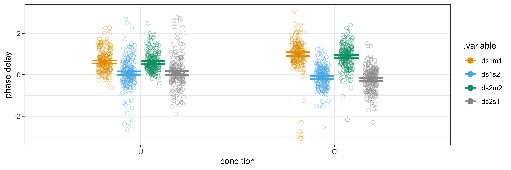

# Two finger tappers' entrainment (Part 2) {#chapTappers2}

This chapter builds upon the previous chapter's discussion of entrainment and its development of a state-space model. We now apply the state-space model to analyze entrainment in human finger tapping data. Our primary objective is to investigate whether the synchronized tapping of two individuals becomes influenced, or entrained, when they can see each other tapping, compared to when they cannot. Our goal is to gain a global perspective on the entrainment capabilities of the subjects.

As a bonus, we show that the state-space model can explain earlier findings based on smooth regression and recurrence analysis.

The code can be found in the following scripts for data preparation and plotting, modelling and plotting, and contrast analysis:


``` r
source("Code/chapAll_00_Initialization.R")
source("Code/chapAll_01_Functions.R")
source("Code/chapTappers2/chapTappers2_02_DataPreparation.R")
source("Code/chapTappers2/chapTappers2_03_DataPlotting.R")
source("Code/chapTappers2/chapTappers2_04_Modelling.R")
source("Code/chapTappers2/chapTappers2_05_ModelPlotting.R")
source("Code/chapTappers2/chapTappers2_06_Contrasts.R")
source("Code/chapTappers2/chapTappers2_05_SSM_DataPreparation_Posterior.R")
source("Code/chapTappers2/chapTappers2_06_SSM_Plotting.R")
```


## Theory

Given the state-space model as defined in the previous chapter, we can define some interaction concepts in terms of its state and observation parameters.

For example, *entrainment* can now be defined as depending on the coupling strength to the partner: 
$$
\begin{aligned}
E_{s1} &:= k_{s1s2} = 1 - k_{s1m1} \\
E_{s2} &:= k_{s2s1} = 1 - k_{s2m2}
\end{aligned}
$$
Entrainment in $s1$ $(E_{s1})$ depends on the coupling strength to $s2$.
Entrainment in $s2$ $(E_{s2})$ depends on the coupling strength to $s1$. 

The definition involves two competing forces defined by the *entrainment-coupling strength* and the *adherence-coupling strength*. One could argue that the *adherence-coupling strength* (or coupling to the metronome) characterizes a volitional anti-entrainment force once a competing non-volitional entrainment force is pulling the synchronization. This distinction is relevant for ensemble playing. In search of a joint tempo, the tempo played by each individual musician may be influenced by the tempi perceived from other musicians. In that case, volitional action and non-volitional perception compete through the adherence-coupling and entrainment-coupling strengths. 

A *leader--follower* relation can be defined as the difference in entrainment-coupling strength between two subjects. This makes only sense in the coupled condition (C), as we don't have a leader--follower relation in the uncoupled condition (U): 
$$
LF_{s1s2} := ks1s2 - ks2s1 =  ks2m2 - ks1m1
$$
$LF_{s1s2}$ is positive or negative depending on whether $s1$ or $s2$ is leading. 

Note that the concept of leader--follower, defined in terms of the strength of coupling, does not really tell us who is locally leading in the tapping. In fact, at the start and early phase of the outphasing-inphasing cycle, $s1$ is typically leading, in the sense that $s2$ taps at a slower speed. And the roles are reversed when both subjects pass the anti-phase in their relative tapping. From that moment on, it appears as if $s2$ is leading because the shortest phase interval is now initiated by $s2$. This is the anti-phase effect mentioned in the previous chapter. However, we interpret the concept of leader--follower in terms of adherence strength (or anti-entrainment). The leader is the one who better synchronizes with the own metronome, resisting entrainment. Or otherwise stated, the leader is the one having less entrainment.

Another useful term is *anticipation*, or the anticipation bias of a subject. It is defined in terms of the phase delay to the metronome:

$$
\begin{aligned}
A_{s1} &:= d_{s1m1} \\
A_{s2} &:= d_{s2m2}
\end{aligned}
$$
When the value of the phase delay parameter is positive it means anticipation, otherwise it is delay. Anticipation is expected to be in line with previous studies on finger tapping (see chapter \@ref(chapModelling)). Note that we also use the phase delay to the partner, defined as $ds1s2$ and $ds2s1$. Due to the non-linearity of the equations, these phase delays are not necessarily identical and are mainly used to allow some flexibility in the state-space model.

A final parameter of interest is *fluctuation*, which we can define as the standard deviation of the parameter that links the observations to the states.  If the observations are close to the states, then the fluctuation is low. Fluctuation can be understood as the uncertainty of the observations given the states.

## Setup

We are now ready to have a look at the tapping data from the experiment described in Rosso et al. (2023). We thereby limit ourselves to the uncoupled (U) and coupled (C) conditions of that experiment.^[We are not including the conditions involving perspective taking, the so-called: swap conditions where subjects see the partner's arm as their own arm, or their own arm as the partner's arm.
The U and C conditions are the socalled normal conditions, which apply to what people see in the natural condition, namely, the arm of the other person is seen from a second person perspective, then own arm from the first person perspective.] 

The experimental setup implements the drifting metronomes paradigm. In the *uncoupled* condition (U), subjects are requested to tap in sync with the metronome heard through headphones at 600 ms and 610 ms. In fact, the second metronome is not exactly 610 ms. It is 609.375 ms so that the outphasing-inphasing cycle is 39 seconds. Note that this period (609.375 ms) has been used in the state-space model that followins. Henceforth we'll say: about 610 ms. In the *coupled* condition (C) subject 1 hears 600 ms and sees the hand of subject 2, presumably tapping at about 610 ms, and subject 2 hears about 610 ms and sees the hand of subject 1, presumably tapping at about 600 ms. This creates the *incongruency* and the subjects' syncing may be influenced by seeing the partner tapping.

### Raw tapping data {-}

Figure \@ref(fig:chapTappers2RawAll1) shows the raw tapping data of all dyads in the two conditions.
The finger tap times are subtracted from the metronome tick times, and represented as a proportion to the metronome tick intervals multiplied by $2\pi$. The resulting *relative phase* is shown in the interval $[-\pi,+\pi]$. 
The calculation of the relative phase is found in `Code/chapTappers2/chapTappers2-02_DataPreparation.R`.
Both subjects have zero relative phase when they tap exactly at the time of a tick of their own metronome.

<div class="figure" style="text-align: center">

<p class="caption">(\#fig:chapTappers2RawAll1)Overview of all raw tapping data</p>
</div>

The figure gives a rough idea of the subjects' capabilities in the uncoupled condition (U) and in the coupled condition (C). In U (first two panels), the dots are expected to fluctuate smoothly around zero, or a bit lower than zero due to anticipation.
However, some subjects have severe fluctuation rather than smooth fluctuation.
For example, dyad_1 (both subjects), dyad_6 (subject 1), dyad_14 (subject 2) seem to fluctuate severely over the entire performance (10 outphasing-inphasing cycles).
In dyad_4 it seems as if subject 2 was distracted at cycle 6 and could only hardly match the metronome in later cycles. Overall, subjects can synchronize with the metronome but some subjects reveal more fluctuation than others.

In C (panels three and four), the subjects are exposed to entrainment.
When entrainment happens, we expect to see more change in the relative phase due to dynamic adaption. Overall, this change is seen in cycles of 39 seconds.
However, some panels show a more extreme pattern, as with dyad_8 and some cycles of dyad_15 and dyad_13. 

<!-- A rough measure of fluctuation is given by taking the standard deviation of the relative tapping over time. -->

<!-- ```{r chapTappers2_tappingcap} -->

<!-- tappingcap <- DTapping_RelativePhase %>% select(dyad,relphase,condition,names) %>%  -->
<!--   mutate(dyad = factor(dyad, labels = all_dyads), -->
<!--          condition = factor(condition)) %>% -->
<!--   group_by(condition, dyad, names) %>% summarize(sd = sd(relphase)) -->

<!-- p1 <- tappingcap %>% ggplot() + -->
<!--   geom_point(aes(x=dyad,y = sd, color = names), shape = 1, size = 3) + -->
<!--   theme_bw() +  -->
<!--     scale_fill_manual(values=cbPalette) + -->
<!--     scale_colour_manual(values=cbPalette) + -->
<!--     theme(axis.text.x = element_text(angle = 90, vjust = 0.5, hjust=1)) + -->
<!--   facet_grid(~ condition) -->


<!-- p2 <- tappingcap %>% ggplot() + -->
<!--   stat_halfeye(aes(x = sd, y=names), shape = 1, size = 3) + -->
<!--   theme_bw() +  -->
<!--     scale_fill_manual(values=cbPalette) + -->
<!--     scale_colour_manual(values=cbPalette) + -->
<!--     theme(axis.text.x = element_text(angle = 90, vjust = 0.5, hjust=1)) + -->
<!--   facet_grid(~ condition) -->

<!-- p1 / p2 -->
<!-- # x = tappingcap %>% filter(condition == "1PU", names == "subject 1") %>% select(sd) -->
<!-- # y = tappingcap %>% filter(condition == "2PC", names == "subject 1") %>% select(sd) -->
<!-- # cor(x$sd,y$sd) -->
<!-- #  -->
<!-- # x = tappingcap %>% filter(condition == "1PU", names == "subject 2") %>% select(sd) -->
<!-- # y = tappingcap %>% filter(condition == "2PC", names == "subject 2") %>% select(sd) -->
<!-- # cor(x$sd,y$sd) -->
<!-- ``` -->


To better see the structure over cycles, we can squeeze the sequence of ten outphasing-inphasing cycles into one single outphasing-inphasing cycle of 39 seconds, as in figure \@ref(fig:chapTappers2RawAllcycle). It is now easier to see that dyads tend to entrain, despite the request to follow the own metronome. That is, they show some kind bubble, although it is still hard to see what happens exactly. We also see that the strange behavior of subject 2 in dyad_8 and dyad_15 was rather consistent over cycles. It shows a constant decrease for subject 2. Dyad_13 seems more or less similar, but we see it increasing for subject 1. As we'll see, these drifts point to a total entrainment meaning that the subject is following the other subject, rather than the own metronome.

However, a deeper analysis is needed to get a clearer view on these phenomena.

<div class="figure" style="text-align: center">

<p class="caption">(\#fig:chapTappers2RawAllcycle)Overview of all raw tapping data, squeezed to one cycle, in the coupled condition (C).</p>
</div>

Overall, inspection of the raw data suggests that interaction outcomes vary among dyads and that subjects within dyads behave differently. Some subjects are not capable to sync with their own metronome in the uncoupled condition, and some subjects are apparently overwhelmed by the interaction in the coupled condition. That's all we can say so far.

With modelling we can go a step further.
We can model the performance of each dyad and each cycle with a state-space model in order get the coupling and delay parameters, as well as observation noice.
It will give us a clearer picture of the entrainment behaviour in this population.


## Data from state-space model

We now proceed with the analysis based on the state-space model.
Its configuration has been specified in figure \@ref(fig:chapTappers2ODEsystem).

We apply the same configuration for both interaction conditions U and C.
This requires a word of explanation because using the same state-space model for both conditions implies a test for the modelling because we allow the state-space model to capture an interaction where there is none. 
Obviously, in U, the fitted models shouldn't capture an interaction. The coupling strength parameter to the own metronome is expected to stay close to 1 (adherence to the metronome). 

## Running a single model with Stan {-}

The modelling with Stan is similar to what we did in the previous chapter, that is, one model per cycle (n= 10) of a dyad (n=19) of a given condition (n=2). In total, we have 380 models.

Here we show how to run one single model, say `C_dyad_8_cycle_2`. It stands for cycle 2 of dyad 8 in condition C.

First we filter the data for that model, from the tappings recorded during the experiment:

``` r
datt <- DTapping %>% filter(codycy == "C.dyad_8.cycle_5") %>% arrange(time0c)
```

We also need the relative phase of the originally tapped data:

``` r
# Note that we use the function do_calc_phase2 to calculate the relative phase based on time values
  Dummy <- datt 
  if( length(w<-which(Dummy$time0c==0)) > 0) {Dummy <- Dummy[-w,]
  print(paste("---->",w,"is deleted"))}
  Om1 <- Dummy %>% filter(names_indicator == 1) %>% mutate(time = time0c) %>% dplyr::select(time,names_indicator)
  Os1 <- Dummy %>% filter(names_indicator == 2) %>% mutate(time = time0c) %>% dplyr::select(time,names_indicator)
  Om2 <- Dummy %>% filter(names_indicator == 3) %>% mutate(time = time0c) %>% dplyr::select(time,names_indicator)
  Os2 <- Dummy %>% filter(names_indicator == 4) %>% mutate(time = time0c) %>% dplyr::select(time,names_indicator)
  dummy_C1 <- do_calc_phase2(Os1,Om1)
  dummy_C2 <- do_calc_phase2(Os2,Om2)
  Observations_relphase <- rbind(dummy_C1,dummy_C2) 
  rm(Dummy,Om1,Os1,Om2,Os2)
  rm(dummy_C1,dummy_C2)
```

The relative phase is shown as:


``` r
p0 <- ggplot() + 
  geom_point(data = Observations_relphase,
             aes(x=time,#%%aligned_beat_sec,
                 y=relphase,
                 color = factor(names_indicator)), 
             shape = 1, size = 2, alpha = 1) +
  theme_bw() +
  scale_fill_manual(values=cbPalette) +
  scale_colour_manual(labels = c("m1-s1", "m2-s2"), values=cbPalette) +
  labs(color = "")  # Change the legend label

p1 <- ggplot() + 
  geom_point(data = Observations_relphase,
             aes(x=time,#%%aligned_beat_sec,
                 y= do_rotate(relphase),
                 color = factor(names_indicator)), 
             shape = 1, size = 2, alpha = 1) +
  theme_bw() +
  scale_fill_manual(values=cbPalette) +
  scale_colour_manual(labels = c("m1-s1", "m2-s2"), values=cbPalette) +
  labs(color = "")  # Change the legend label


p <- p0 / p1
p

# \@ref(fig:chapTappers2run3)
```

<div class="figure" style="text-align: center">

<p class="caption">(\#fig:chapTappers2run3)Top: relative phase. Bottom: same but with rotated phase</p>
</div>


Next we define a function which first prepares our data for the state-space model and then runs the Stan engine with the code of the state-space model.

``` r
do_TapFitting_Stan <- function(Dat, fn){
  # Dat = datt
  # fn = filenameFitted
  # Define general variables needed in the StanData
  n_gen_times = 100
  time_gen = seq(0.0001,max(Dat$time0c), length.out = n_gen_times) # time generated
  filename <- paste(fn,unique(Dat$codycy),".rds",sep="")
  # Organize our data for Stan
  StanData <- list(
    n_times = length(Dat$time0c),
    n_gen_times = n_gen_times, # number of model-generated times requested
    time0 = 0.0,
    observed = Dat$phase,
    time = Dat$time0c,
    time_gen = time_gen,
    names_indicator = Dat$names_indicator
  )
  fit <- rstan::stan(
    data = StanData,
    #  file = "../chapTappers/StateSpaceModel_2_oct2024.stan",
    file = "Code/chapTappers2/chapTappers2_StateSpaceModel.stan",
    init = 0, thin = 2, iter = 4000,
    warmup = 1000, cores = 2, chain = 2
  )
  return(fit)
}
```

Here we show a routine that calls the above stan function when `run` is set to `TRUE`. However, we pre-calculated the model and stored the result as an `.rds` file, which we read.


``` r
run = FALSE
#run = TRUE
if(run){
fit <- do_TapFitting_Stan(datt, filenameFitted)
} else {
  print("readRDS a model")
  fit <- readRDS("Fitted/chapTappers2_C.dyad_8.cycle_8.rds")
}
```

```
## [1] "readRDS a model"
```

``` r
run = FALSE
```

In figure \@ref(fig:chapTappers2run6) we show a summary of the posterior of `fit.`

<div class="figure" style="text-align: center">

<p class="caption">(\#fig:chapTappers2run6)Posterior distribution of major parameters of the state-space model</p>
</div>

The interpretation of these parameters is straightforward. The coupling parameter ($k$), whose value goes from 0 to 1 reveals that $s1$ adheres to $m1$, while $s2$ is clearly entrained because it is even below .4. $s1$ is clearly the leader.
The phase delay parameters ($d$), whose value goes from $-\pi$ to $\pi$ reveal that the delay of $s1$ to the metronome $m1$ is constant, altough it is slightly behind the metronome, while $s2$ has more uncertainty and seenms to be ahead of the metronome. Obviously, this distribution is taken over all states. The uncertainty in $ds1s2$ is huge compared to uncertainty in delay from $s2$ to $s1$ ($ds2s1$).
The observation_std, or fluctuation, reveals that the metronomes have no fluctuation, while $s2$ has slightly more fluctuation than $s1$.

We can retrieve the parameters more explicitly as: 


```
## # A tibble: 12 × 8
##    .variable            .value   .lower   .upper .width .point .interval names  
##    <chr>                 <dbl>    <dbl>    <dbl>  <dbl> <chr>  <chr>     <fct>  
##  1 ds1m1               0.277    0.198    0.428     0.95 median qi        ds1m1  
##  2 ds1s2              -0.188   -1.52     1.01      0.95 median qi        ds1s2  
##  3 ds2m2              -0.635   -1.08    -0.193     0.95 median qi        ds2m2  
##  4 ds2s1              -0.107   -0.216    0.00484   0.95 median qi        ds2s1  
##  5 ks1m1               0.958    0.834    0.994     0.95 median qi        ks1m1  
##  6 ks2m2               0.253    0.195    0.311     0.95 median qi        ks2m2  
##  7 observation_std[1]  0.00815  0.00688  0.00979   0.95 median qi        observ…
##  8 observation_std[2]  0.218    0.182    0.264     0.95 median qi        observ…
##  9 observation_std[3]  0.00731  0.00615  0.00879   0.95 median qi        observ…
## 10 observation_std[4]  0.352    0.295    0.431     0.95 median qi        observ…
## 11 y0_s1               0.0290  -0.227    0.291     0.95 median qi        y0_s1  
## 12 y0_s2              -0.0599  -0.322    0.207     0.95 median qi        y0_s2
```

Using `fit`, we can also retrieve the generated quantities explicitly (also called: posterior predictions) as:


```
## # A tibble: 6 × 8
##    time  unit states_generated   .lower  .upper .width .point .interval
##   <int> <int>            <dbl>    <dbl>   <dbl>  <dbl> <chr>  <chr>    
## 1     1     1          0.00105  0.00105 0.00105   0.75 median qi       
## 2     1     2          0.0301  -0.115   0.180     0.75 median qi       
## 3     1     3          0.00103  0.00103 0.00103   0.75 median qi       
## 4     1     4         -0.0588  -0.215   0.0969    0.75 median qi       
## 5     2     1          4.07     4.07    4.07      0.75 median qi       
## 6     2     2          4.17     4.07    4.27      0.75 median qi
```

```
## # A tibble: 6 × 8
##    time  unit observations_generated   .lower  .upper .width .point .interval
##   <int> <int>                  <dbl>    <dbl>   <dbl>  <dbl> <chr>  <chr>    
## 1     1     1               0.000894 -0.00863 0.0103    0.75 median qi       
## 2     1     2               0.0343   -0.262   0.325     0.75 median qi       
## 3     1     3               0.00125  -0.00759 0.00963   0.75 median qi       
## 4     1     4              -0.0601   -0.495   0.382     0.75 median qi       
## 5     2     1               4.07      4.06    4.08      0.75 median qi       
## 6     2     2               4.17      3.89    4.44      0.75 median qi
```

Let us briefly reflect on what we have here.
The columns `observations_generated` and `states_generated` represent phase values, for each `unit`, generated at 100 instances uniformly distributed over 39 seconds. Accordingly, to retrieve the real time, we have to multiply the column `time` by $39/100$. 

In what follows, we show how to calculate the relative phase from `observations_generated`, showing a grey band that captures .75% of the uncertainty. 
The relative phase is calculated similar to what we did in chapter \@ref(chapTappers1).
The script is also very similar to what we did in chapTappers_05_ModelPlotting when we calculated the relative phase.


``` r
  # From fit_ps (summary of posterior selecting parameters)
  S <- fit_ps %>% 
    dplyr::select(.variable,.value) %>% 
    mutate(.value= round(.value,2)) %>% 
    rename(parameter = .variable, fitted = .value) %>% 
    arrange(match(parameter,c("ds1m1","ds2m2","ds1s2","ds2s1","ks1m1","ks2m2"))) %>% 
    data.frame() 
  # Prepare string for plot
string_plot = paste("k= ", toString(S$fitted[5:6]), 
                    "; d= ", toString(S$fitted[1:4]),"\n",
                    "fluct= ", toString(S$fitted[c(8,10)]), sep="")                           
  # aligned_beat_sec 
  aligned_beat_sec = 39
  
  # From post_observations (summary of posterior selecting generated quantities)
  # we rotate the phase from [0, 2pi] to [-pi, pi] when plotting
  m1 <- post_observations %>% filter(unit == 1) 
  s1 <- post_observations %>% filter(unit == 2)
  m2 <- post_observations %>% filter(unit == 3)
  s2 <- post_observations %>% filter(unit == 4)
  
  # 1. Relative phase calculation.
  # Given the fact that we have the phase, we can just take the difference between the 
  # phase of the metronome unit and the phase of the subject unit
  dummy_data1 = data.frame(time = s1$time, 
                           relphase.y = m1$observations_generated - s1$observations_generated) %>% 
    mutate(names = "m1-s1")
  dummy_data1.l = data.frame(relphase.lower = m1$.lower - s1$.lower)
  dummy_data1.u = data.frame(relphase.upper = m1$.upper - s1$.upper) 
  
  dummy_data2 = data.frame(time = s2$time, 
                           relphase.y = m2$observations_generated - s2$observations_generated) %>% 
    mutate(names = "m2-s2")
  dummy_data2.l = data.frame(relphase.lower = m2$.lower - s2$.lower) 
  dummy_data2.u = data.frame(relphase.upper = m2$.upper - s2$.upper) 
  
  y = rbind(dummy_data1,dummy_data2)
  ymin = rbind(dummy_data1.l,dummy_data2.l)
  ymax = rbind(dummy_data1.u,dummy_data2.u)
  Observations_generated_relphase = cbind(y,ymin,ymax)
  # remove dummy variables
  rm(dummy_data1,dummy_data1.l,dummy_data1.u)
  rm(dummy_data2,dummy_data2.l,dummy_data2.u)
```


Here we generate the plot showing the relative phase:


``` r
cbPalette <- c("#E69F00","#56B4E9","#E69F00","#56B4E9")
p0 <- ggplot() +
  geom_lineribbon(data = Observations_generated_relphase, 
                  aes(x = (time*aligned_beat_sec/100.5),
                      y = (relphase.y),
                      ymin = (relphase.lower),
                      ymax = (relphase.upper),
                      color = names),alpha=.5) +
  geom_point(data = Observations_relphase,
             aes(x=time,#%%aligned_beat_sec,
                 y=(relphase - (2*pi)),
                 color = factor(names_indicator)), shape = 1, size = 2, alpha = 1) +
scale_fill_manual(values=cbPalette) +
  scale_colour_manual(labels = c("m1-s1", "m2-s2"), values=cbPalette) +
  #ylim(-pi/2,+pi/2) + 
  theme_bw() + 
  ggtitle(paste("model",string_plot) ) +
  xlab("time [s]") + ylab("relative phase")
print(p0)
```


We then calculate the instantaneous period from `states_generated`.


``` r
  # 2. Instantaneous period of continuous generated observations
  
  m1 <- post_states %>% filter(unit == 1) 
  s1 <- post_states %>% filter(unit == 2)
  m2 <- post_states %>% filter(unit == 3)
  s2 <- post_states %>% filter(unit == 4)
  
  m1_ip <- m1 %>% mutate(states_generated = c(NA,diff(states_generated)),names = "m1") 
  s1_ip <- s1 %>% mutate(states_generated = c(NA,diff(states_generated)),names = "s1")
  m2_ip <- m2 %>% mutate(states_generated = c(NA,diff(states_generated)),names = "m2")
  s2_ip <- s2 %>% mutate(states_generated = c(NA,diff(states_generated)),names = "s2")
  states_generated_instperiod = rbind(m1_ip,s1_ip,m2_ip,s2_ip) 
  states_generated_instperiod$names = factor(states_generated_instperiod$names, levels = c("m1","s1","m2","s2"))
  rm(m1_ip,s1_ip,m2_ip,s2_ip)
  
  # #########################################
  
  
  #2. Plot instantaneous phase
  cbPalette <- c("#E69F00","#E69F00","#56B4E9","#56B4E9")
  p1 <-    ggplot() + 
    geom_line(data = states_generated_instperiod, 
              aes(x=time*aligned_beat_sec/100.5,
                  y=(aligned_beat_sec/100.5)*2000*pi/(states_generated),color=names),linewidth=1.5)  + 
    theme_bw() +
    scale_fill_manual(values=cbPalette) +
    scale_colour_manual(labels = c("dm1", "ds1", "dm2", "ds2"), values=cbPalette) +
    # ggtitle(paste("States (black) and generated states (color), model",s,"\n",ss) )+
    ylab("inst. period") +
    xlab("time [s]")
  p1
```


``` r
#  make_fig(paste("Figures/chapTappers2_exampleRelphase_model_",sep=""), p0)
#  make_fig(paste("Figures/chapTappers2_exampleInstPeriod_model_",sep=""), p1)
  
  p01 <-  p0/p1 
  p01
```


The figure reveals a tapping period of $s2$ that is heavily entrained by $s1$.

## Running all models

We are now ready to run all 380 models. 
We processed them all on a server, using the script shown in `Code/chapTappers2/chapTappers2_05_ModellingAllModels.R`.


The outcome of this calculation is a *parameter dataset*, as shown in Table \@ref(tab:chapTappers2data1).
The labels `value` and `parameter` refer to values for parameters, that is, coupling strength and phase delay.


<table class="table table-striped" style="font-size: 10px; margin-left: auto; margin-right: auto;">
<caption style="font-size: initial !important;">(\#tab:chapTappers2data1)Dataset of parameters, from dynamic models fitted with tapping data</caption>
 <thead>
  <tr>
   <th style="text-align:left;"> .variable </th>
   <th style="text-align:right;"> .value </th>
   <th style="text-align:right;"> .lower </th>
   <th style="text-align:right;"> .upper </th>
   <th style="text-align:right;"> .width </th>
   <th style="text-align:left;"> .point </th>
   <th style="text-align:left;"> .interval </th>
   <th style="text-align:left;"> codycy </th>
  </tr>
 </thead>
<tbody>
  <tr>
   <td style="text-align:left;"> ds1m1 </td>
   <td style="text-align:right;"> 1.4580371 </td>
   <td style="text-align:right;"> 1.2988521 </td>
   <td style="text-align:right;"> 1.6231330 </td>
   <td style="text-align:right;"> 0.95 </td>
   <td style="text-align:left;"> median </td>
   <td style="text-align:left;"> qi </td>
   <td style="text-align:left;"> U.dyad_1.cycle_1 </td>
  </tr>
  <tr>
   <td style="text-align:left;"> ds1s2 </td>
   <td style="text-align:right;"> -1.4324668 </td>
   <td style="text-align:right;"> -1.7566559 </td>
   <td style="text-align:right;"> -1.0393976 </td>
   <td style="text-align:right;"> 0.95 </td>
   <td style="text-align:left;"> median </td>
   <td style="text-align:left;"> qi </td>
   <td style="text-align:left;"> U.dyad_1.cycle_1 </td>
  </tr>
  <tr>
   <td style="text-align:left;"> ds2m2 </td>
   <td style="text-align:right;"> 1.4169068 </td>
   <td style="text-align:right;"> 1.3411807 </td>
   <td style="text-align:right;"> 1.4937437 </td>
   <td style="text-align:right;"> 0.95 </td>
   <td style="text-align:left;"> median </td>
   <td style="text-align:left;"> qi </td>
   <td style="text-align:left;"> U.dyad_1.cycle_1 </td>
  </tr>
  <tr>
   <td style="text-align:left;"> ds2s1 </td>
   <td style="text-align:right;"> -1.3811127 </td>
   <td style="text-align:right;"> -1.7524635 </td>
   <td style="text-align:right;"> -0.9648946 </td>
   <td style="text-align:right;"> 0.95 </td>
   <td style="text-align:left;"> median </td>
   <td style="text-align:left;"> qi </td>
   <td style="text-align:left;"> U.dyad_1.cycle_1 </td>
  </tr>
  <tr>
   <td style="text-align:left;"> ks1m1 </td>
   <td style="text-align:right;"> 0.6535340 </td>
   <td style="text-align:right;"> 0.5880515 </td>
   <td style="text-align:right;"> 0.7639568 </td>
   <td style="text-align:right;"> 0.95 </td>
   <td style="text-align:left;"> median </td>
   <td style="text-align:left;"> qi </td>
   <td style="text-align:left;"> U.dyad_1.cycle_1 </td>
  </tr>
  <tr>
   <td style="text-align:left;"> ks2m2 </td>
   <td style="text-align:right;"> 0.7921011 </td>
   <td style="text-align:right;"> 0.7423919 </td>
   <td style="text-align:right;"> 0.8544741 </td>
   <td style="text-align:right;"> 0.95 </td>
   <td style="text-align:left;"> median </td>
   <td style="text-align:left;"> qi </td>
   <td style="text-align:left;"> U.dyad_1.cycle_1 </td>
  </tr>
  <tr>
   <td style="text-align:left;"> observation_std[1] </td>
   <td style="text-align:right;"> 0.0153236 </td>
   <td style="text-align:right;"> 0.0129735 </td>
   <td style="text-align:right;"> 0.0185862 </td>
   <td style="text-align:right;"> 0.95 </td>
   <td style="text-align:left;"> median </td>
   <td style="text-align:left;"> qi </td>
   <td style="text-align:left;"> U.dyad_1.cycle_1 </td>
  </tr>
  <tr>
   <td style="text-align:left;"> observation_std[2] </td>
   <td style="text-align:right;"> 0.5612529 </td>
   <td style="text-align:right;"> 0.4699874 </td>
   <td style="text-align:right;"> 0.6841844 </td>
   <td style="text-align:right;"> 0.95 </td>
   <td style="text-align:left;"> median </td>
   <td style="text-align:left;"> qi </td>
   <td style="text-align:left;"> U.dyad_1.cycle_1 </td>
  </tr>
  <tr>
   <td style="text-align:left;"> observation_std[3] </td>
   <td style="text-align:right;"> 0.0150518 </td>
   <td style="text-align:right;"> 0.0127751 </td>
   <td style="text-align:right;"> 0.0181303 </td>
   <td style="text-align:right;"> 0.95 </td>
   <td style="text-align:left;"> median </td>
   <td style="text-align:left;"> qi </td>
   <td style="text-align:left;"> U.dyad_1.cycle_1 </td>
  </tr>
  <tr>
   <td style="text-align:left;"> observation_std[4] </td>
   <td style="text-align:right;"> 0.2614599 </td>
   <td style="text-align:right;"> 0.2189621 </td>
   <td style="text-align:right;"> 0.3181776 </td>
   <td style="text-align:right;"> 0.95 </td>
   <td style="text-align:left;"> median </td>
   <td style="text-align:left;"> qi </td>
   <td style="text-align:left;"> U.dyad_1.cycle_1 </td>
  </tr>
</tbody>
</table>

<!-- In what follows, we work with models having $Rhat > 1.05$ for all parameters^[The Rhat function in `rstan` (the R interface to the Stan engine) produces the R-hat convergence diagnostic, which compares the between- and within-chain estimates for model parameters and other univariate quantities of interest. If chains have not mixed well (ie, the between- and within-chain estimates don't agree), R-hat is larger than 1. We use four chains by default and using the model if R-hat is less than 1.05 for all parameters, as recommended in the `rstan` package.]. -->
<!-- Using this criterium, we found that 6.8% of the models did not fully converge. -->
<!-- In what follows, we work with fully converged models, which are 354 out of the fitted 380 models. -->

<!-- Table XXXX gives a list of the models that fail the $Rhat > 1.05$ criterion. -->
<!-- ```{r chapTappers2notselected, echo=FALSE} -->

<!-- knitr::kable(dat, caption = "Dataset of parameters, from dynamic models fitted with tapping data", booktabs=T, label = NA ) %>% -->
<!--   kable_styling("striped", font_size = 11) -->


<!-- # \@ref(tab:chapTappers2notselected) -->
<!-- ``` -->

### Global histograms {-}

Let's have a look at the posteriors of the parameters over all models.
For each model we take the posterior distribution of the parameter and we take the mean (over all iterations of the mcmc-optimization) for
coupling strength (k) phase delay (d), and fluctuation.

<div class="figure" style="text-align: center">

<p class="caption">(\#fig:chapTappers3distrKD)Histograms show the mean of the posterior distribution of the parameter, over all 380 state-space models. Left panel the coupling strength; middle panel the phase delay; right panel the fluctuation.</p>
</div>

 
Figure \@ref(fig:chapTappers3distrKD) (top panel) shows the compling strength parameters $ks1m1$ and $ks2m2$ for the conditions U and C. The values for the uncoupled condition (U) overall suggest a high adherence-coupling strength in line with our expectations, although some performances show an adherence-coupling strength < .7, which could be considered poor. The latter suggest that tappings have been interpreted as spurious interactions with the other subject.

The values for the coupled condition (C) shows a flat distribution suggesting that subjects differ in their response to entrainment. Values even go below .4,  suggesting a loss of adherence, meaning that the partner is followed instead of the own metronome. However, we also have some coupling strengths close to 1, suggesting that influence has been neglected. Overall, it seems that the mean may be about .7, meaning that overall, entrainment happens.

Figure \@ref(fig:chapTappers3distrKD) (middle panel) shows the phase delays.
First consider the phase delays to the metronome ($ds1m1, ds2m2$). The values are mainly positive suggesting anticipation, both in U and C. 
Next consider the phase delays to the partner. These seem to center around zero, both in U and C, meaning that the delay to the partner is on average zero. This is reasonable if we think that both have a similar delay to the metronome.

Figure \@ref(fig:chapTappers3distrKD) (lower panel) shows the fluctation, or standard deviation of the observation parameter. Recall that the mean of the observation parameter is the state value. Obviously, for metronomes, the fluctuation is zero, because there is no difference between the observation and the state. However, for subjects, we observe an average fluctuation of about .3 above or below the phase value of the state, with some models having a fluctuation of 1 or more. As this value is a standard deviation, it implies that 95% of all data points are situated in the interval $[0.588 (= 1.96 * .3,-0.588]$ around the states.

<!-- A summary is found in table \@ref(tab:chapTappers2_parmsMeanStd), with mean and standard deviation per parameter per condition.  -->

<!-- ```{r chapTappers2_parmsMeanStd, echo=FALSE} -->
<!--   df <- Posterior %>%   -->
<!--     #dplyr::filter(condition %in% c("1PU","2PC")) %>% -->
<!--     #mutate(condition = ifelse(condition == "1PU","uncoupled condition (U)","coupled condition (C)")) -->
<!--     group_by(condition, codycy) %>% -->
<!--     summarize(mean = mean(.value),standard_deviation = std(.value)) -->

<!-- knitr::kable(df, caption = "Summary of parameters", booktabs=T, label = NA ) %>% -->
<!--   kable_styling("striped", font_size = 11) -->
<!--   # \@ref(tab:chapTappers2_parmsMeanStd) -->
<!-- ``` -->


### Histograms uncoupled condition (U) {-}

A more detailed view is showh in 
figure \@ref(fig:chapTappers2real1cs1K).
The top panel shows the posterior distributions of the retained models in terms of median and $.25/.75$ quantiles over all cycles. The bottom panel shows a summary over cycles.
The same can be done for the delay parameters, as shown in figure \@ref(fig:chapTappers2real1cs1D).


<div class="figure" style="text-align: center">

<p class="caption">(\#fig:chapTappers2real1cs1K)Estimated coupling strength in the uncoupled condition (U) (top row) and coupled condition (C) (bottom row), all dyads (numbered 1, 2, ...) and cycles are shown</p>
</div>


Figure \@ref(fig:chapTappers2real1cs1K) now shows details of the coupling strength parameters per dyad and per cycle. In condition U, some dyads have low coupling strength values, such as dyads 1, 4, 6, 13, 14. Typically, one subject has a bad score, but in dyad 1 and 14, both subjects have low scores. 
In condition C, the situation can be very different per dyad. 
Good performers (with high coupling strength values in U), either reveal entrainment as in dyad 2, 3, 5, 12,17, 19, 20, or no entrainment as in dyad 9 and 18. The latter meas that subjects largely resist the influence of observing the partner. Then, a good performing dyad (in U) can reveal asymmetric entrainment, meaning that one subject adheres to the own metronome, while the other subject is fully entrained, as in dyad 8.

<div class="figure" style="text-align: center">

<p class="caption">(\#fig:chapTappers2real1cs1D)Estimated phase delays</p>
</div>

Figure \@ref(fig:chapTappers2real1cs1D) reveals some abberation in dyad_1 and 6.
It may be due to a bad converge of the modelling.


<div class="figure" style="text-align: center">

<p class="caption">(\#fig:chapTappers2real1cs1E)Estimated fluctuation</p>
</div>

Finaly, figure \@ref(fig:chapTappers2real1cs1D) shows that fluctuation is high in some dyacs, such as dyad 1, 6, 11, or individual cycles.

The conclusion is that dyads show particular individualities which can be identified based on posterior distributions of parameters. 

### Leader-follower {-}

Based on the same parameter dataset it is possible to get a view on the leader-follower relationship.
Figure \@ref(fig:chapTappers2LF) suggest that both conditions have a normal distribution around zero. The mean and standard deviation is -0.005 (0.13) for U and 0.07 (0.25) for C. Values above zero mean that subject 1 is leading, below zero subject 2 is leading. In condition C, dyad_8 pops up, indicating that subject 1 is leading.


<div class="figure" style="text-align: center">

<p class="caption">(\#fig:chapTappers2LF)Leader-folllower values. Above zero means that subject 1 is leading, below zero: subject 2.</p>
</div>
Recall that the leader-follower relation (LF) is a difference based on the adherence coupling strength of subjects in a dyad. This value doesn't capture whether both subjects had a good performance.
For example, we know that the coupling strength values in dyad_1 are low for both subjects,
but the difference is small because both subjects have low values.

Overall, the standard deviation is three times larger in C, meaning that due to entrainment there is a larger variability in leader-follower relationships.
And LF values in C are more pronounced than in U.
For example, in dyads 8, 14, 15, 17 and 19, the values are mostly positive, whereas in dyads 9, and certainly 13, the values are mostly negative, meaning that subjects become more consistent in being leader or follower over cycles, due to entrainment!

## Regression 

Finally, we ran a simple regression model on the data shown in 
figure \@ref(fig:chapTappers3distrKD).
The goal is to estimate the means of the posterior distribution defined by conditions and coupling strengths.

### Syntax specification {-}

We have the syntax of this model specified as:


``` r
  form_K00 = bf(.value ~ condition * .variable + ( 1 + condition * .variable| dyad:cycle),
     sigma ~ condition * .variable + ( 1 + condition * .variable| dyad:cycle))
```

This is a distributional model that estimates the parameters ($\mu$ and $\sigma$) of a skew-normal distribution for the data. The response is called `.value`, which refers to  the mean of the distributions of $ks1m1$ and $ks2m2$ obtained by the state-space modelling of 380 performances. We have
`condition` (U, C) and `.variable` ($ks1m1$ and $ks2m2$) as predictors, with `dyad:cycle` as group-level predictor.
The latter implies that cycles within each dyad are modeled as a random variable.


For phase delays we  use a similar model assuming a gaussian distribution.


``` r
  form_D00 = bf(parameter ~ condition * names + ( 1 | dyad:cycle),
                sigma ~ condition * names + ( 1  | dyad:cycle))
```

### Results {-}

Figure \@ref(fig:chapTappers2models) shows the posterior predictions for coupling strength and phase delay parameters.

<div class="figure" style="text-align: center">

<p class="caption">(\#fig:chapTappers2models)Estimated parameters per condition, excluding the group effects of cycle and dyad. (Top panel) Coupling strength. (Bottom panel) Phase delays</p>
</div>


Table \@ref(tab:chapTappers2modelAllmeans) shows a summary of the parameters. 
They can be used to generate the states using the state equation of the state-space model (see below).

<table class="table table-striped" style="font-size: 10px; margin-left: auto; margin-right: auto;">
<caption style="font-size: initial !important;">(\#tab:chapTappers2modelAllmeans)Estimated phase delay per condition</caption>
 <thead>
  <tr>
   <th style="text-align:left;"> condition </th>
   <th style="text-align:left;"> .variable </th>
   <th style="text-align:right;"> .epred </th>
   <th style="text-align:right;"> .lower </th>
   <th style="text-align:right;"> .upper </th>
   <th style="text-align:right;"> .width </th>
   <th style="text-align:left;"> .point </th>
   <th style="text-align:left;"> .interval </th>
  </tr>
 </thead>
<tbody>
  <tr>
   <td style="text-align:left;"> U </td>
   <td style="text-align:left;"> ks1m1 </td>
   <td style="text-align:right;"> 0.8756405 </td>
   <td style="text-align:right;"> 0.8639550 </td>
   <td style="text-align:right;"> 0.8859813 </td>
   <td style="text-align:right;"> 0.95 </td>
   <td style="text-align:left;"> median </td>
   <td style="text-align:left;"> qi </td>
  </tr>
  <tr>
   <td style="text-align:left;"> U </td>
   <td style="text-align:left;"> ks2m2 </td>
   <td style="text-align:right;"> 0.8709483 </td>
   <td style="text-align:right;"> 0.8587126 </td>
   <td style="text-align:right;"> 0.8815726 </td>
   <td style="text-align:right;"> 0.95 </td>
   <td style="text-align:left;"> median </td>
   <td style="text-align:left;"> qi </td>
  </tr>
  <tr>
   <td style="text-align:left;"> C </td>
   <td style="text-align:left;"> ks1m1 </td>
   <td style="text-align:right;"> 0.7148045 </td>
   <td style="text-align:right;"> 0.6872085 </td>
   <td style="text-align:right;"> 0.7384519 </td>
   <td style="text-align:right;"> 0.95 </td>
   <td style="text-align:left;"> median </td>
   <td style="text-align:left;"> qi </td>
  </tr>
  <tr>
   <td style="text-align:left;"> C </td>
   <td style="text-align:left;"> ks2m2 </td>
   <td style="text-align:right;"> 0.6606508 </td>
   <td style="text-align:right;"> 0.6280653 </td>
   <td style="text-align:right;"> 0.6890558 </td>
   <td style="text-align:right;"> 0.95 </td>
   <td style="text-align:left;"> median </td>
   <td style="text-align:left;"> qi </td>
  </tr>
  <tr>
   <td style="text-align:left;"> U </td>
   <td style="text-align:left;"> ds1m1 </td>
   <td style="text-align:right;"> 0.6208855 </td>
   <td style="text-align:right;"> 0.5504630 </td>
   <td style="text-align:right;"> 0.6934722 </td>
   <td style="text-align:right;"> 0.95 </td>
   <td style="text-align:left;"> median </td>
   <td style="text-align:left;"> qi </td>
  </tr>
  <tr>
   <td style="text-align:left;"> U </td>
   <td style="text-align:left;"> ds1s2 </td>
   <td style="text-align:right;"> 0.0721905 </td>
   <td style="text-align:right;"> -0.0218829 </td>
   <td style="text-align:right;"> 0.1658751 </td>
   <td style="text-align:right;"> 0.95 </td>
   <td style="text-align:left;"> median </td>
   <td style="text-align:left;"> qi </td>
  </tr>
  <tr>
   <td style="text-align:left;"> U </td>
   <td style="text-align:left;"> ds2m2 </td>
   <td style="text-align:right;"> 0.5893482 </td>
   <td style="text-align:right;"> 0.5260284 </td>
   <td style="text-align:right;"> 0.6533308 </td>
   <td style="text-align:right;"> 0.95 </td>
   <td style="text-align:left;"> median </td>
   <td style="text-align:left;"> qi </td>
  </tr>
  <tr>
   <td style="text-align:left;"> U </td>
   <td style="text-align:left;"> ds2s1 </td>
   <td style="text-align:right;"> 0.0762515 </td>
   <td style="text-align:right;"> -0.0216827 </td>
   <td style="text-align:right;"> 0.1765294 </td>
   <td style="text-align:right;"> 0.95 </td>
   <td style="text-align:left;"> median </td>
   <td style="text-align:left;"> qi </td>
  </tr>
  <tr>
   <td style="text-align:left;"> C </td>
   <td style="text-align:left;"> ds1m1 </td>
   <td style="text-align:right;"> 1.0073670 </td>
   <td style="text-align:right;"> 0.9201138 </td>
   <td style="text-align:right;"> 1.0932382 </td>
   <td style="text-align:right;"> 0.95 </td>
   <td style="text-align:left;"> median </td>
   <td style="text-align:left;"> qi </td>
  </tr>
  <tr>
   <td style="text-align:left;"> C </td>
   <td style="text-align:left;"> ds1s2 </td>
   <td style="text-align:right;"> -0.1351580 </td>
   <td style="text-align:right;"> -0.2070064 </td>
   <td style="text-align:right;"> -0.0625426 </td>
   <td style="text-align:right;"> 0.95 </td>
   <td style="text-align:left;"> median </td>
   <td style="text-align:left;"> qi </td>
  </tr>
  <tr>
   <td style="text-align:left;"> C </td>
   <td style="text-align:left;"> ds2m2 </td>
   <td style="text-align:right;"> 0.8775837 </td>
   <td style="text-align:right;"> 0.7982669 </td>
   <td style="text-align:right;"> 0.9559944 </td>
   <td style="text-align:right;"> 0.95 </td>
   <td style="text-align:left;"> median </td>
   <td style="text-align:left;"> qi </td>
  </tr>
  <tr>
   <td style="text-align:left;"> C </td>
   <td style="text-align:left;"> ds2s1 </td>
   <td style="text-align:right;"> -0.2205365 </td>
   <td style="text-align:right;"> -0.2991018 </td>
   <td style="text-align:right;"> -0.1427503 </td>
   <td style="text-align:right;"> 0.95 </td>
   <td style="text-align:left;"> median </td>
   <td style="text-align:left;"> qi </td>
  </tr>
  <tr>
   <td style="text-align:left;"> U </td>
   <td style="text-align:left;"> observation_std[1] </td>
   <td style="text-align:right;"> 0.0122724 </td>
   <td style="text-align:right;"> 0.0113701 </td>
   <td style="text-align:right;"> 0.0131796 </td>
   <td style="text-align:right;"> 0.95 </td>
   <td style="text-align:left;"> median </td>
   <td style="text-align:left;"> qi </td>
  </tr>
  <tr>
   <td style="text-align:left;"> U </td>
   <td style="text-align:left;"> observation_std[2] </td>
   <td style="text-align:right;"> 0.3294644 </td>
   <td style="text-align:right;"> 0.3066520 </td>
   <td style="text-align:right;"> 0.3535474 </td>
   <td style="text-align:right;"> 0.95 </td>
   <td style="text-align:left;"> median </td>
   <td style="text-align:left;"> qi </td>
  </tr>
  <tr>
   <td style="text-align:left;"> U </td>
   <td style="text-align:left;"> observation_std[3] </td>
   <td style="text-align:right;"> 0.0120555 </td>
   <td style="text-align:right;"> 0.0111277 </td>
   <td style="text-align:right;"> 0.0129924 </td>
   <td style="text-align:right;"> 0.95 </td>
   <td style="text-align:left;"> median </td>
   <td style="text-align:left;"> qi </td>
  </tr>
  <tr>
   <td style="text-align:left;"> U </td>
   <td style="text-align:left;"> observation_std[4] </td>
   <td style="text-align:right;"> 0.3115954 </td>
   <td style="text-align:right;"> 0.2960701 </td>
   <td style="text-align:right;"> 0.3277639 </td>
   <td style="text-align:right;"> 0.95 </td>
   <td style="text-align:left;"> median </td>
   <td style="text-align:left;"> qi </td>
  </tr>
  <tr>
   <td style="text-align:left;"> C </td>
   <td style="text-align:left;"> observation_std[1] </td>
   <td style="text-align:right;"> 0.0118796 </td>
   <td style="text-align:right;"> 0.0112611 </td>
   <td style="text-align:right;"> 0.0125293 </td>
   <td style="text-align:right;"> 0.95 </td>
   <td style="text-align:left;"> median </td>
   <td style="text-align:left;"> qi </td>
  </tr>
  <tr>
   <td style="text-align:left;"> C </td>
   <td style="text-align:left;"> observation_std[2] </td>
   <td style="text-align:right;"> 0.3913077 </td>
   <td style="text-align:right;"> 0.3633872 </td>
   <td style="text-align:right;"> 0.4208641 </td>
   <td style="text-align:right;"> 0.95 </td>
   <td style="text-align:left;"> median </td>
   <td style="text-align:left;"> qi </td>
  </tr>
  <tr>
   <td style="text-align:left;"> C </td>
   <td style="text-align:left;"> observation_std[3] </td>
   <td style="text-align:right;"> 0.0116334 </td>
   <td style="text-align:right;"> 0.0110031 </td>
   <td style="text-align:right;"> 0.0122990 </td>
   <td style="text-align:right;"> 0.95 </td>
   <td style="text-align:left;"> median </td>
   <td style="text-align:left;"> qi </td>
  </tr>
  <tr>
   <td style="text-align:left;"> C </td>
   <td style="text-align:left;"> observation_std[4] </td>
   <td style="text-align:right;"> 0.4245779 </td>
   <td style="text-align:right;"> 0.4011930 </td>
   <td style="text-align:right;"> 0.4495299 </td>
   <td style="text-align:right;"> 0.95 </td>
   <td style="text-align:left;"> median </td>
   <td style="text-align:left;"> qi </td>
  </tr>
</tbody>
</table>

So far we get a decent view on the parameters of the state-space models.
We can go into more details and estimate the coupling strength parameters per dyad, by averaging over cycles. However, this will not contribute much to the knowledge we already have. Therefore, we skip it.

<!-- ### Estimating coupling strength per dyad {-} -->


<!-- Figure \@ref(fig:chapTappers2modelK00dyads) is based on a repression model per dyad, to extract the mean and CI-95% per subject and condition. Now we get a rather clear picture of the estimated adherence-entrainment in each dyad. -->

<!-- The red line marks a value of 0.765, which is obtained by taking the lower bound of 75% of all estimated mean coupling strength values in the uncoupled condition (U). Below that line, one could say that we have a spurious entrainment effect. -->

<!-- When looking at the coupled condition (C), we could then argue that above that line, subjects don't entrain. -->
<!-- Dyad_9 pops up as the dyad where both subjects don't entrain. In fact, this is by far the best dyad because the task was to non-entrain and this dyad succeeded. All the other dyads have one or two subjects who couldn't resist the influence of seeing the partner tapping. -->
<!-- Dyad_8 is the one where one subjects doesn't entrain while the other subject is fully entrained. -->


<!-- ```{r chapTappers2modelK00dyads, echo=FALSE, fig.align='center', fig.asp=.75, fig.cap='Estimated coupling strength per dyad', message=FALSE, warning=FALSE, out.width='100%'} -->
<!--   knitr::include_graphics( -->
<!--                           "Figures/chapTappers2_EstimatedParameters_perDyad.png") -->
<!-- # \@ref(fig:chapTappers2modelK00dyads) -->

<!-- ``` -->

<!-- In a similar way, the phase delays can be calculated per dyad. If we would like to generate the phase functions per dyad we would need them. However, we will limit ourselves to generating the phase functions for the entire dyad population. -->


## Plots of dynamic models {-}

In this section, we show the *relative phase* and *instantaneous period* representations of generated observations (=posterior predictions). Basically we put the above code chunks for generating them in one big function, called `do_plot_gen_obs` (see `Code/chapTappers2/chapTappers2_06_SSMPlotting.R`).


We know already that when $k$ has a high adherence, $\hat{\phi}$ will be fluctuating along a straight horizontal line, whose distance to the metronome depends on $d$. For example, the top panel of figure \@ref(fig:chapTappers2real1cs3) shows a high adherence of $ks1m1= 0.85$ and $ks2m2= 0.74$ (summarized as $k= 0.84,0.74$ in the figure) with anticipative bias: $ds1m1= 0.69[rad], ds1s2= 1.37$ and $ds2m2= -0.28, ds2s1= -0.31$ (summarized as $d= 0.69, 1.37, -0.28, -0.31$). Finally we also have the fluctuation which is 0.23 and 0.37 for $s1$ and $s2$ (summarized as $fluct= 0.23, 0.37$). The latter gives an overall idea of the thickness of the gray band around the states, which depends on the real observations, shown as circles.
The bottom panel shows the instantaneous period of the states.

The parameters $k$ and $d$ can be used to generate the function with a simple ode-simulator http://odetappers.shinyapps.io/odetappers2/.

<div class="figure" style="text-align: center">

<p class="caption">(\#fig:chapTappers2real1cs3)Posterior predictions</p>
</div>


Figure \@ref(fig:chapTappers2real1cs4) shows the generated observations of dyad_2 cycle_6. Now we have  $k=0.6,0.48$ and $d=0.45,-0.35,0.37,-0.37$. Note that we could have rotated the axis of the figure in the top panel. It would show a better fit of the generated observations with the real observations.


<div class="figure" style="text-align: center">

<p class="caption">(\#fig:chapTappers2real1cs4)Posterior predictions</p>
</div>


An extreme example of asymmetric entrainment is shown in figure \@ref(fig:chapTappers2real1cs6). 
In that performance,  $s2$ is almost completely following $s1$. The instantaneous period of $s2$ becomes almost equal to the instantaneous period of $s1$.


<div class="figure" style="text-align: center">

<p class="caption">(\#fig:chapTappers2real1cs6)Posterior predictions</p>
</div>

<!-- Hysteresis can be observed in the relative phase representations, when the relative phases of $\phi_{ODEs1m2}$ and $\phi_{ODEs1m2}$ cross. -->


When tapping data contain a lot of fluctuation, or irregularities, it may be difficult to find a proper solution at all. Consider a particular example in Figure \@ref(fig:chapTappers2real1cs7).
The solution has already great difficulties at the beginning of the cycle. It may be due to the priors starting value, which is rather narrowly defined.
Our model assumes that the start is around zero, but here it is around 2 or -2.
The state-space model tracks $s2$ but not $s1$.

<div class="figure" style="text-align: center">

<p class="caption">(\#fig:chapTappers2real1cs7)Posterior predictions</p>
</div>

However, there is a way to check the models via Rhat, a diagnostic of the sampling behavior applied by Stan. Rhat should be $< 1.05$. Here we check `C.dyad_1.cycle_5` and we observe high Rhat values.

``` r
  fit <- readRDS(paste("Fitted/chapTappers2_", "C.dyad_1.cycle_5", ".rds", sep=""))
summary(fit)$summary %>% head(n=10) %>% data.frame() %>% dplyr::select(Rhat)
```

```
##                         Rhat
## ks1m1              12.831067
## ks2m2               2.944094
## ds1m1              12.457047
## ds2m2               2.330697
## ds1s2               1.820453
## ds2s1               4.471217
## observation_std[1]  1.002823
## observation_std[2]  2.905088
## observation_std[3]  1.001673
## observation_std[4]  2.305922
```

A check of all Rhat values for these 10 parameters reveals that 29 out of 380 models, the Markov Chain Monte Carlo (MCMC) chains did not converge properly. Although it does not necessarily mean that the model should be immediately rejected, high values are suspicious.
The table shows the line number on the right (n=380), the `mRhat` value, showing the mean of the Rhat of the relevant parameters per model, and the identifier for the model. Clearly the majority of the models having high mRhat are in condition C, with high values for dyad_1 and dyad_6.


``` r
RhatMean <- readRDS("Fitted/chapTappers2_RhatMean.rds")
w = which(RhatMean$mRhat > 1.05)
#RhatMean[w,]

 knitr::kable(RhatMean[w,],  booktabs=T, label = NA, 
             caption = paste("Rhat diagnostics")) %>%
  kable_styling("striped", font_size = 10)
```

<table class="table table-striped" style="font-size: 10px; margin-left: auto; margin-right: auto;">
<caption style="font-size: initial !important;">(\#tab:chapTappers2_table)Rhat diagnostics</caption>
 <thead>
  <tr>
   <th style="text-align:left;">  </th>
   <th style="text-align:right;"> mRhat </th>
   <th style="text-align:left;"> id </th>
  </tr>
 </thead>
<tbody>
  <tr>
   <td style="text-align:left;"> 7 </td>
   <td style="text-align:right;"> 3.519622 </td>
   <td style="text-align:left;"> U.dyad_1.cycle_7 </td>
  </tr>
  <tr>
   <td style="text-align:left;"> 40 </td>
   <td style="text-align:right;"> 1.075442 </td>
   <td style="text-align:left;"> U.dyad_4.cycle_10 </td>
  </tr>
  <tr>
   <td style="text-align:left;"> 54 </td>
   <td style="text-align:right;"> 1.091636 </td>
   <td style="text-align:left;"> U.dyad_6.cycle_4 </td>
  </tr>
  <tr>
   <td style="text-align:left;"> 130 </td>
   <td style="text-align:right;"> 2.039216 </td>
   <td style="text-align:left;"> U.dyad_14.cycle_10 </td>
  </tr>
  <tr>
   <td style="text-align:left;"> 164 </td>
   <td style="text-align:right;"> 3.469505 </td>
   <td style="text-align:left;"> U.dyad_18.cycle_4 </td>
  </tr>
  <tr>
   <td style="text-align:left;"> 191 </td>
   <td style="text-align:right;"> 1.618204 </td>
   <td style="text-align:left;"> C.dyad_1.cycle_1 </td>
  </tr>
  <tr>
   <td style="text-align:left;"> 192 </td>
   <td style="text-align:right;"> 4.374989 </td>
   <td style="text-align:left;"> C.dyad_1.cycle_2 </td>
  </tr>
  <tr>
   <td style="text-align:left;"> 194 </td>
   <td style="text-align:right;"> 1.715957 </td>
   <td style="text-align:left;"> C.dyad_1.cycle_4 </td>
  </tr>
  <tr>
   <td style="text-align:left;"> 195 </td>
   <td style="text-align:right;"> 4.407008 </td>
   <td style="text-align:left;"> C.dyad_1.cycle_5 </td>
  </tr>
  <tr>
   <td style="text-align:left;"> 196 </td>
   <td style="text-align:right;"> 3.029709 </td>
   <td style="text-align:left;"> C.dyad_1.cycle_6 </td>
  </tr>
  <tr>
   <td style="text-align:left;"> 198 </td>
   <td style="text-align:right;"> 3.315164 </td>
   <td style="text-align:left;"> C.dyad_1.cycle_8 </td>
  </tr>
  <tr>
   <td style="text-align:left;"> 200 </td>
   <td style="text-align:right;"> 2.555433 </td>
   <td style="text-align:left;"> C.dyad_1.cycle_10 </td>
  </tr>
  <tr>
   <td style="text-align:left;"> 204 </td>
   <td style="text-align:right;"> 1.050993 </td>
   <td style="text-align:left;"> C.dyad_2.cycle_4 </td>
  </tr>
  <tr>
   <td style="text-align:left;"> 241 </td>
   <td style="text-align:right;"> 1.094782 </td>
   <td style="text-align:left;"> C.dyad_6.cycle_1 </td>
  </tr>
  <tr>
   <td style="text-align:left;"> 244 </td>
   <td style="text-align:right;"> 5.716697 </td>
   <td style="text-align:left;"> C.dyad_6.cycle_4 </td>
  </tr>
  <tr>
   <td style="text-align:left;"> 245 </td>
   <td style="text-align:right;"> 5.466790 </td>
   <td style="text-align:left;"> C.dyad_6.cycle_5 </td>
  </tr>
  <tr>
   <td style="text-align:left;"> 247 </td>
   <td style="text-align:right;"> 2.244794 </td>
   <td style="text-align:left;"> C.dyad_6.cycle_7 </td>
  </tr>
  <tr>
   <td style="text-align:left;"> 250 </td>
   <td style="text-align:right;"> 4.820872 </td>
   <td style="text-align:left;"> C.dyad_6.cycle_10 </td>
  </tr>
  <tr>
   <td style="text-align:left;"> 253 </td>
   <td style="text-align:right;"> 1.123882 </td>
   <td style="text-align:left;"> C.dyad_8.cycle_3 </td>
  </tr>
  <tr>
   <td style="text-align:left;"> 271 </td>
   <td style="text-align:right;"> 1.069631 </td>
   <td style="text-align:left;"> C.dyad_10.cycle_1 </td>
  </tr>
  <tr>
   <td style="text-align:left;"> 287 </td>
   <td style="text-align:right;"> 7.694897 </td>
   <td style="text-align:left;"> C.dyad_11.cycle_7 </td>
  </tr>
  <tr>
   <td style="text-align:left;"> 300 </td>
   <td style="text-align:right;"> 1.084792 </td>
   <td style="text-align:left;"> C.dyad_12.cycle_10 </td>
  </tr>
  <tr>
   <td style="text-align:left;"> 312 </td>
   <td style="text-align:right;"> 1.185211 </td>
   <td style="text-align:left;"> C.dyad_14.cycle_2 </td>
  </tr>
  <tr>
   <td style="text-align:left;"> 322 </td>
   <td style="text-align:right;"> 2.207567 </td>
   <td style="text-align:left;"> C.dyad_15.cycle_2 </td>
  </tr>
  <tr>
   <td style="text-align:left;"> 328 </td>
   <td style="text-align:right;"> 1.068165 </td>
   <td style="text-align:left;"> C.dyad_15.cycle_8 </td>
  </tr>
  <tr>
   <td style="text-align:left;"> 340 </td>
   <td style="text-align:right;"> 1.066824 </td>
   <td style="text-align:left;"> C.dyad_16.cycle_10 </td>
  </tr>
  <tr>
   <td style="text-align:left;"> 341 </td>
   <td style="text-align:right;"> 1.062776 </td>
   <td style="text-align:left;"> C.dyad_17.cycle_1 </td>
  </tr>
  <tr>
   <td style="text-align:left;"> 361 </td>
   <td style="text-align:right;"> 1.051900 </td>
   <td style="text-align:left;"> C.dyad_19.cycle_1 </td>
  </tr>
  <tr>
   <td style="text-align:left;"> 362 </td>
   <td style="text-align:right;"> 1.197535 </td>
   <td style="text-align:left;"> C.dyad_19.cycle_2 </td>
  </tr>
</tbody>
</table>
<!-- check? -->
<!-- ```{r chapTappers2_fig} -->
<!-- model_id = "U.dyad_4.cycle_10" -->
<!-- fig <- do_plot_gen_obs(model_id) -->
<!-- fig -->
<!-- ``` -->


## Generating observations from the average {-}

In an earlier stage we obtained mean values for fitted parameters of condition C.
Here, we plug these mean values into the state equations.
It gives us a idea of how an average dyad of our population experiences entrainment.


``` r
dydt <- function(t, y, parms) {
  with(as.list(c(y, parms)), {
    p600 = 2*pi*1000/600
    p610  = 2*pi*1000/609.375
    dm1 = p600
    ds1 = p600  + 
      .5*(ks1m1* sin(m1 - s1 + ds1m1) + 
            (1-ks1m1)* sin(s2 - s1 + ds1s2) )
    
    dm2 = p610  
    #Eigenfrequency s2, m2 (600 * 609.375/9.375) /1000 = 39
    ds2 = p610    + 
      .5*(ks2m2* sin(m2 - s2 + ds2m2) + 
            (1-ks2m2)* sin(s1 - s2 + ds2s1) )
    return(list(c(dm1,ds1,dm2,ds2)))
  })
}

dt = 1/1000
time_points <- seq(0, 39, by = dt)
state <- c(m1 = 0, s1 = 0, m2 = 0, s2 = 0)

# plug in the estimated parameter values here:
parm = c(ks1m1 = 0.72, ks2m2 = 0.65, 
         ds1m1 = 0, ds2m2 = 0, 
         ds1s2 = 0, ds2s1 = 0)

solution <- ode(y = state, times = time_points, func = dydt, parms = parm) %>% 
  data.frame()
solution <- solution %>% mutate(
  dm1 = c(NA,diff(m1)),
  ds1 = c(NA,diff(s1)),
  dm2 = c(NA,diff(m2)),
  ds2 = c(NA,diff(s2))
)

p0 <- solution %>% group_by(time) %>% ggplot() +
  geom_line(aes(x= time,y = do_rotate(m1-s1)), color="#56B4E9",size=1) +
  geom_line(aes(x= time,y = do_rotate(m2-s2)), color = "#E69F00",size=1) +
  ylim(-pi,pi) +
  theme_bw() +
  labs(x="time of one cycle", y = "rel. phase") +
  labs(y="relative phase")

p1 <- solution %>% group_by(time) %>% ggplot() +
  geom_line(aes(x= time,y = ds1),color="#56B4E9",size=1) +
  geom_line(aes(x= time,y = ds2),color = "#E69F00",size=1) +
  geom_vline(xintercept = 39/2, color = "#D55E00", linetype = "dotted") +
  labs(x="time of one cycle", y = "inst. frequency") +
  #ylim(585,635) +
  theme_bw() 

p2 <- solution %>% group_by(time) %>% ggplot() +
  geom_line(aes(x= time,y = ds2 - ds1),color = "black",size=1, linetype = "dotted") +
  geom_vline(xintercept = 36.6/2, color = "#D55E00", linetype = "dotted") +
  labs(x="time of one cycle", y = "freq difference") +
  theme_bw() 

p0 / p1 / p2
```

<div class="figure" style="text-align: center">

<p class="caption">(\#fig:chapTappers2dynEq2)Generated phase-functions of average dyad interaction. (Top panel) Relative phase. (Middle panel) Instantaneous frequency. (Bottom panel) instantaneous frequency difference</p>
</div>

``` r
# \@ref(fig:chapTappers2dynEq2)
```

The results are shown in figure \@ref(fig:chapTappers2dynEq2).
The top panel shows a relative phase representation.
The middle panel shows the instantaneous frequency.
The bottom panel shows the instantaneous frequency difference.
We show the frequency rather than the period because we'll compare it with a recurrence analysis.


### Smooth regression of relative phase {-}

In this section we try a good old smooth regression approach on the data represented as relative phase. Would it not give us a smooth curve, capturing the underlying dynamic of the tapping? Similar to the smooth regression modelling used in chapters \@ref(chapDancer) and \@ref(chapExoskeletons)?

Here we use the following model specification:


             
with `relphase` being the relative phase of subject and metronome, `subjectcondition` is the interaction of two subject and two conditions, and `dyad:cycle` is a group-level variable of cycle per dyad, and `kappa` is the second parameter of the `von_mises` model fitting function.  


Figure \@ref(fig:chapTappersSmoothRegression) shows the smooth regression solution.
Recall that the vertical axis is the relative phase and the horizontal axis is the time of one cycle.
The figure suggests a flat line for the uncoupled condition (U) for both subjects.
In contrast, the figure shows curved lines for the coupled condition (C), suggesting entrainment.
The curve is asymmetrical in the sense that it is delayed with respect to the metronomes anti-phase point. 
Moreover, we also observe an anticipation in the sense that the curves are below zero.
Thanks to the explorations with the dynamic model in the previous chapter, we meanwhile know how this works.


<div class="figure" style="text-align: center">

<p class="caption">(\#fig:chapTappersSmoothRegression)Overview of all raw tapping data, squeezed to one cycle, in the coupled condition (C).</p>
</div>


Smooth regression has limitations mainly because it is purely descriptive, based on an expansion of data in a hyper-space of spline functions. Our goal is to show that our state-space model can replicate this figure, using dynamic parameters that can be interpreted as coupling strength and phase delay.
In fact, our result comes close to it, see the top panel of figure \@ref(fig:chapTappers2dynEq2).

### Recurrence analysis {-}

An alternative approach, the tapping data has been subjected to a recurrence analysis (Rosso et al.,2023). In that analysis, the phase at sample time  $\phi_t$ is expanded into a phase vector, with $d$ and delay $\tau$ defining the expansion. We have:

$$
\hat{\phi}_t = <\phi_{t + (d-1)\tau}>
$$
with $\hat{\phi}_t \in R^d$ having 
$d$ as an estimated embedding dimension, and
$\tau$ as an estimated delay of phases.

The time-delayed versions of the phase can be thought of as the coordinates of a point in a 
$d$-dimensional space. 
For example, if we choose $d=3$ and $\tau=1$, the time-delayed versions of the phase at time $t=1$ are $x(1),x(2)$, and $x(3)$. These three values can be thought of as the $x,y,z$ coordinates of a point in a three-dimensional space.

A matrix $R_{t,s}^{d,\tau}$ is then defined as
$$
R_{t,s}^{d,\tau} = \Theta(\epsilon - \left\| x_t - x_s \right\|), \quad x_t \in \mathbb{R}^d, \quad t, s = 1, \ldots, T
$$
where $\epsilon$ is a threshold distance, $\Theta$ is the  Heaviside function, and $\left\| . \right\|$ is the length of the vector difference, which can be interpreted as phase difference, or instantaneous frequency. 
The matrix contains $1$ when the difference of phase-vectors $x_t$ and $x_s$ falls within the ball defined by $\epsilon$, and $0$ otherwise.

Given matrix $R_{t,s}^{d,\tau}$, the sum over all samples $t$ results in counts at each sample instance $s$.
Accordingly, the resulting graph can be interpreted as a histogram of *phase differences*. 

In a joint recurrence analysis with two subjects, such as in figure \@ref(fig:chapTappersRecurrenceAnalysis), the matrix is first calculated for both subjects separately, giving  $Rs1_{t,s}^{d,\tau}$ and $Rs2_{t,s}^{d,\tau}$, whose notation can be simplified as $Rs1$ and $Rs2$. 

Taking the intersection $Rs1 \cap Rs2$ (where cells are $1$ if both $Rs1$ and $Rs2$ have a $1$, and $0$ otherwise) and then summing rows, we obtain a histogram that represents the *instantaneous frequency difference* among subjects. In figure \@ref(fig:chapTappersRecurrenceAnalysis) the 10 cycles, and 19 dyads are folded into one single cycle.

Figure \@ref(fig:chapTappersRecurrenceAnalysis) (from Rosso et al., 2023) shows the result for all dyads, with time series squeezed to one cycle. As this figure is a histogram, it shows the number of times that the two subjects had the same phase difference (up to a tolerance $\epsilon$) at the same time, within the time interval corresponding to the bin. 
With two subjects having different instantaneous frequencies, the synchronization between the two subjects will be unstable. As the frequency differences between them will vary over time, and the peaks in the histogram will be wider.

<div class="figure" style="text-align: center">

<p class="caption">(\#fig:chapTappersRecurrenceAnalysis)Recurrence analysis. Only the blue lines have to be considered. They show the uncoupled (1P Uncoupled) and coupled (2P Coupled) conditions.</p>
</div>

Recurrence analysis has limitations mainly because it is purely descriptive as it doesn't capture the parameters of the dynamic model. Likewise, our goal is to develop a dynamic model that could replicate this figure, using dynamic parameters that can be interpreted as coupling strength and phase delay.

The lower panel of figure \@ref(fig:chapTappers2dynEq2) shows that our result comes close to the recurrence analysis.

### Summary {-}

To summarize, we started from 380 dyadic finger tapping performances using data of Rosso et al. (2024). For each model, we estimated the parameters of a state-space model on the data. The configuration of the state-space model was developed in the previous chapter.

The hypothesis that the uncoupled condition (U) has a higher adherence coupling strength than the coupled condition (C) is confirmed. The adherence coupling strengths in the uncoupled condition are close to 0.87, while in the coupled condition it is close to $ks1m1 = 0.71$ and $ks2m2 =	0.66$.
This result implies that overall, when two subjects are seeing each other tapping, they have a dramatic reduction in adherence coupling strength, despite the request to adhere to the own metronome. This implies a considerable entrainment coupling strength to the other subject. 

Apparently, in the coupled condition (C) on average (over all dyads) subject $s2$ has a lower adherence coupling strength of about 5% to the own metronome $m2$, compared to $s1$. It is plausible that $s1$ is in the advantage due to the tapping speed.

Then, using the fitted parameters we generated continuous observations based on generated continuous states, and these can be compared with discrete tapping data. Using averages of all the parameters, it is possible to generate data as in \@ref(fig:chapTappers2_dynEq2). The curves represent relative phase, instantaneous frequency or instantaneous period, and instantaneous frequency difference. A high similarity with smooth regression solutions and recurrence analysis performed on the entire population reveals the power of the state-space approach.

## Conclusion

In this chapter, we explored how synchronized finger tapping can be entrained by seeing a partner tapping differently. The fact that non-voluntary entrainment can override the intended audio-based synchronization shows that entrainment is a extremely powerful phenomenon.

The conclusion is that  entrainment may be hard to resist. It seems as if the brain is determined to solve incongruent feedback, to such a degree that resistance to entrainment might require a specific training targetted at neglecting cause of incongruency.

Entrainment is believed to play a crucial role in activities that require joint collaboration, such as in joint music playing. In that context, entrainment is an added value to a dynamic adaptation of activities. Entrainment fits well with the idea of self-augmented interaction, where it can be seen as a facilitator for augmentation.

We showed that entrainment can be understood, basically, as a control of competing dynamic forces, informed by  hearing and seeing. Statistical modeling helped us to understand entrainment as a state-space system describing the causal flow in timing. This ends our journey in non-linear regression. 


