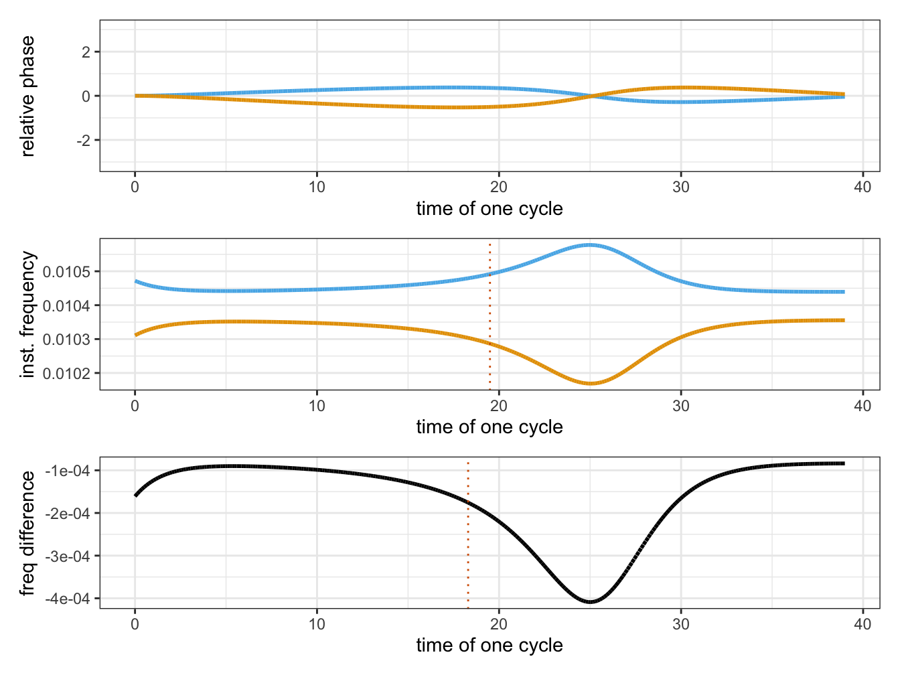

# Two finger tappers{#chapTappers2}

This chapter is a follow-up of the previous chapter. We now apply the dynamic model to analyse human finger tapping data. Our primary objective is to figure out whether two persons' synchronized tapping becomes influenced, or entrained, by seeing each other tapping.

We define entrainment in terms of a set of non-linear equations, as specified in the previous chapter.
With regression modelling, we estimate the coupling strength and phase delay parameters of these equations, for each individual performance. The parameters gives us insight in the entrainment of these individual dyadic performances (two persons tapping). 

Then, using averages of parameters, it is possible to get a view on the entrainment of a population of dyads. As the parameters define the dynamic model, we can always generate the phase-functions and as a bonus, we show that the modelling can nicely explain earlier findings based on smooth regression and recurrence analysis.

The code can be found in the following scripts for data preparation and plotting, modelling and plotting, and contrast analysis:


```r
source("Code/chapAll_00_Initialization.R")
source("Code/chapAll_01_Functions.R")
source("Code/chapTappers2/chapTappers2_02_DataPreparation.R")
source("Code/chapTappers2/chapTappers2_03_DataPlotting.R")
source("Code/chapTappers2/chapTappers2_04_Modelling.R")
source("Code/chapTappers2/chapTappers2_05_ModelPlotting.R")
source("Code/chapTappers2/chapTappers2_06_Contrasts.R")
```


## Theory

Based on the previous chapter, we can be more specific about the theoretical concepts of entrainment, leader-follower, and anticipation.

*Entrainment* can now be defined as the coupling strength to the partner: 
$$
E_{s1} = ks1s2 = 1 - ks1m1\\
E_{s2} = ks2s1 = 1 - ks2m2
$$
Entrainment in $s1$ $(E_{s1})$, is the coupling strength to $s2$.
Entrainment in $s2$ $(E_{s2})$, is the coupling strength to $s1$. 

However, given the fact that
$ks1s2 = 1 - ks1m1$ and $ks2s1 = 1 - ks2m2$, this definition also uses the adherence to the metronome (as requested task). To clarify this, we believe it is useful to distinguish between *entrainment-coupling strength* and *adherence-coupling strength*, to specify whether the coupling strength applies to the other subject or to the own metronome. One could argue that the *adherence-coupling strength* characterizes an anti-entrainment force once a competing entrainment force is pulling the synchronization.

Next, a *leader--follower* relation can be defined as the difference in entrainment-coupling strength between two subjects. This makes only sense in the coupled condition (C): 
$$
LF_{s1s2} = ks1s2 - ks2s1 =  ks2m2 - ks1m1
$$
$LF_{s1s2}$ is positive or negative depending on whether $s1$ or $s2$ is leading. 

Note that the concept of leader--follower, defined in terms of the strength of coupling, does not really tell us who is locally leading in the tapping. In fact, at the start and early phase of the outphasing-inphasing cycle, $s1$ is typically leading, simply due to the fact that $s2$ taps at a slower speed. Those roles are reversed when both subjects passed the anti-phase tap. From that moment on, it appears as if $s2$ is leading because the shortest phase interval is now initiated by $s2$. Accordingly, the concept of leader--follower should be actually interpreted in terms of adherence strength (or anti-entrainment). The leader is the one who better synchronizes with the own metronome, who better resists to entrainment. 

### Anticipation {-}
Another useful term is *anticipation*, or the anticipation bias of a subject. It is defined in terms of the phase delay to the metronome:

$$
A_{s1} = ds1m1\\
A_{s2} = ds2m2
$$
When the value of the phase delay parameter is positive it means anticipation, otherwise it is delay. Given the context, anticipation is expected to be in line with previous studies on finger tapping (see chapter \@ref(chapModelling)). Note that we also use the phase delay to the partner, defined as $ds1s2$ and $ds2s1$. Due to the non-linearity of the equations, these phase delays are not necessarily identical and are mainly used to allow some flexibility in the model.

## Setup

We are now ready to have a look at the tapping data from the experiment described in Rosso et al. (2023). We thereby limit ourselves to the uncoupled (U) and coupled (C) conditions of that experiment.^[We are not including the conditions involving perspective taking, the so-called: swap conditions where subjects see the partner's arm as their own arm, or their own arm as the partner's arm.
The U and C conditions are the socalled normal conditions, which apply to what people see in the natural condition, namely, the arm of the other person is seen from a second person perspective, then own arm from the first person perspective.] 

The experimental setup implements the drifting metronomes paradigm. In the *uncoupled* condition (U), subjects are requested to tap in sync with the metronome heard through headphones at 600 ms and 610 ms. In the *coupled* condition (C) subject 1 hears 600 ms and sees the hand of subject 2, presumably tapping at 610 ms, and subject 2 hears 610 ms and sees the hand of subject 1, presumably tapping at 600 ms. This creates an *incongruency* and the subjects' syncing may be influenced by seeing the partner tapping.

### Raw tapping data {-}

Figure \@ref(fig:chapTappers2RawAll) shows the raw tapping data of all dyads in the two conditions.
The finger tap times are subtracted from the metronome tick times, and represented as a proportion of the metronome tick intervals giving *phase*. We show the (rotated) phase in the interval $[-\pi,+\pi]$. 
Subjects have zero relative phase when they tap exactly at the time of a tick.

<div class="figure" style="text-align: center">

<p class="caption">(\#fig:chapTappers2RawAll)Overview of all raw tapping data (represented relative to the own metronome). The horizontal axis is time, the vertical axis is relative phase. (Top panel) Uncoupled condition (U). (Bottom panel) Coupled condition (C).</p>
</div>

The top panel gives a rough idea of the subjects' capabilities in the uncoupled condition. The dots are expected to smoothly fluctuate around zero, or a bit lower due to anticipation.

However, some dyads, or subjects in dyads, show rather extreme fluctuations suggesting de-sychronization with the metrome.
For example, dyad_1 (both subjects), dyad_6 (subject 1), dyad_14 (subject 2) show extreme fluctuation over the entire performance (10 cycles).
In dyad_4 it seems as if subject 2 was distracted at cycle 6 and couldn't catch up with the metronome in later cycles.

The lower panel gives a rough idea of the subjects' capabilities in the coupled condition.
What we expect to see is some change in relative phase due to dynamic adaption, and in the ideal cases, this structure should be more or less constrasting, such as in dyad_12 and dyad_20.

However, some panels show a remarkable pattern, for example dyad_8 and some cycles of dyad_15 and dyad_13, and we have to figure out that it means. 

We can squeeze the cycles to one single cycle as shown in figure \@ref(fig:chapTappers2RawAllcycle).
Most dyads seem to entrain, despite the request to follow the own metronome. Apparently, dyad_9 can resist the entrainment. Now we see that the strange behavior of subject 2 in dyad_8 and dyad_15 is rather consistent. Dyad_13 is similar, but we see it happening with subject 1, in the other direction.

A deeper analysis is needed to get a clearer view on these phenomena.

<div class="figure" style="text-align: center">

<p class="caption">(\#fig:chapTappers2RawAllcycle)Overview of all raw tapping data, squeezed to one cycle, in the coupled condition (C).</p>
</div>

Overall, inspection of the raw data suggests that interaction outcomes vary among dyads and that subjects within dyads behave differently. Some subjects are not capable to sync with their own metronome in the uncoupled condition, and some subjects are apparently overwhelmed by the interaction in the coupled condition. That's all we can say so far.

With modelling we want to go a step further.
For example, for each dyad and each cycle, we want to get the dynamic parameters of phase-functions and then see whether there is a trend over dyads. After averaging over dynamic parameters, we can always generate the corresponding phase-functions.

### Smooth regression of relative phase {-}

However, before we embark on dynamic modelling, it is of interest to try our good old smooth regression approach. Would it not give us a smooth curve, capturing the underlying dynamic of the tapping, similar to the smooth regression modelling used in chapters \@ref(chapDancer) and \@ref(chapExoskeletons)?

Here we use the following model specification:


with `relphase` being the relative phase of subject and metronome, `subjectcondition` is the interaction of two subject and two conditions, and `dyad:cycle` is a group-level variable of cycle per dyad, and `kappa` is the second parameter of the `von_mises` model fitting function.  


Figure \@ref(fig:chapTappersSmoothRegression) shows the smooth regression solution.
Recall that the vertical axis is the relative phase and the horizontal axis is the time of one cycle.
The figure suggests a flat line for the uncoupled condition (U) for both subjects.
In contrast, the figure shows curved lines for the coupled condition (C), suggesting entrainment.
The curve is asymmetrical in the sense that it is delayed with respect to the metronomes anti-phase point. 
Moreover, we also observe an anticipation in the sense that the curves are below zero.
Thanks to the explorations with the dynamic model in the previous chapter, we meanwhile know how this works.


<div class="figure" style="text-align: center">

<p class="caption">(\#fig:chapTappersSmoothRegression)Overview of all raw tapping data, squeezed to one cycle, in the coupled condition (C).</p>
</div>


Smooth regression has limitations mainly because it purely descriptive, based on an expansion of data in a hyper-space of spline functions. Our goal is to develop a dynamic model that could replicate this figure, using dynamic parameters that can be interpreted as coupling strength and phase delay.
In fact, our result comes close to it, see figure XXXX.

### Recurrence analysis {-}

An alternative approach to processing the tapping data is based on recurrence analysis (Rosso et al.,2023). In that analysis, the phase at sample time  $\phi_t$ is expanded into a phase vector, with $d$ and delay $\tau$ defining the expansion. We have:

$$
\hat{\phi}_t = <\phi_{t + (d-1)\tau}>
$$
with $\hat{\phi}_t \in R^d$ having 
$d$ as an estimated embedding dimension, and
$\tau$ as an estimated delay of phases.

The time-delayed versions of the phase can be thought of as the coordinates of a point in a 
$d$-dimensional space. 
For example, if we choose $d=3$ and $\tau=1$, the time-delayed versions of the phase at time $t=1$ are $x(1),x(2)$, and $x(3)$. These three values can be thought of as the $x,y,z$ coordinates of a point in a three-dimensional space.

A matrix $R_{t,s}^{d,\tau}$ is then defined as
$$
 R_{t,s}^{d,\tau} = \Theta(\epsilon - \left\| x_t - x_s \right\|), ~~~x_t \in R^d, ~~~t,s = 1, ..., T
$$
where $\epsilon$ is a threshold distance, $\Theta$ is the  Heaviside function, and $\left\| . \right\|$ is the length of the vector difference, which can be interpreted as phase difference, or instantaneous frequency. 
The matrix contains $1$ when the difference of phase-vectors $x_t$ and $x_s$ falls within the ball defined by $\epsilon$, and $0$ otherwise.

Given matrix $R_{t,s}^{d,\tau}$, the sum over all samples $t$ results in counts at each sample instance $s$.
Accordingly, the resulting graph can be interpreted as a histogram of *phase differences*. 

In a joint recurrence analysis with two subjects, such as in figure \@ref(fig:chapTappersRecurrenceAnalysis), the matrix is first calculated for both subjects separately, giving  $Rs1_{t,s}^{d,\tau}$ and $Rs2_{t,s}^{d,\tau}$, whose notation can be simplified as $Rs1$ and $Rs2$. 

Taking the intersection $Rs1 \cap Rs2$ (where cells are $1$ if both $Rs1$ and $Rs2$ have a $1$, and $0$ otherwise) and then summing rows, we obtain a histogram that represents the *instantaneous frequency difference* among subjects. In Figure \@ref(fig:chapTappersRecurrenceAnalysis) the 10 cycles, and 19 dyads are folded into one single cycle.

Figure \@ref(fig:chapTappersRecurrenceAnalysis) (from Rosso et al., 2023) shows the result for all dyads, with time series squeezed to one cycle. As this figure is a histogram, it shows the number of times that the two subjects had the same phase difference (up to a tolerance $\epsilon$) at the same time, within the time interval corresponding to the bin. 
With two subjects having different instantaneous frequencies, the synchronization between the two subjects will be unstable. As the frequency differences between them will vary over time, and the peaks in the histogram will be wider.

<div class="figure" style="text-align: center">

<p class="caption">(\#fig:chapTappersRecurrenceAnalysis)Recurrence analysis. Only the blue lines have to be considered. They show the uncoupled (1P Uncoupled) and coupled (2P Coupled) conditions.</p>
</div>

Recurrence analysis has limitations mainly because it is purely descriptive as it doesn't capture the parameters of the dynamic model. Likewise, our goal is to develop a dynamic model that could replicate this figure, using dynamic parameters that can be interpreted as coupling strength and phase delay.
Also here, our result comes close to it, see figure XXXX.

## Data from dynamic model

But how did we get those figures?
We now proceed with the analysis based on the dynamic model.
Recall that its configuration is that of figure \@ref(fig:chapTappers2ODEsystem).
Moreover, we apply the same configuration for both interaction conditions U and C.
This requires a word of explanation because using the same dynamic system configuration for both conditions implies a test for the modelling. 

Given the fact that the interaction between $s1$ and $s2$ is non-existing in uncoupled condition (U), the model should not find any interaction. All interactions found are spurious or accidental patterns when subjects deviate from their tapping task. Overall we can therefore expect that the adherence to the own metronome will be close to 1, because each subject is asked to sync with the metronome and doesn't see anybody else tapping. If an influence is detected, then it's a spurious influence. 

### Modelling with Stan {-}

The modelling with Stan is exactly the same as in the previous chapter, and it follows the logic of Block 3, as shown in figure
\@ref(fig:chapTappers1framework).
Accordingly, we estimated the parameters of 380 dynamic systems, one dynamic system for each performance, given condition (n=2), dyad (n=19), and cycle (n=10).

The outcome of this time consuming calculation is a *parameter dataset*, as shown in Table \@ref(tab:chapTappers2data1).
The labels `value` and `parameter` refer to values for parameters, that is, coupling strength and phase delay. At this point it is important to realize that each set of six parameters (two coupling strength and four phase delay parameters) define phase-functions for the units defined in the dynamic system configuration.


<table class="table table-striped" style="font-size: 11px; margin-left: auto; margin-right: auto;">
<caption style="font-size: initial !important;">(\#tab:chapTappers2data1)Dataset of parameters, from dynamic models fitteed with tapping data</caption>
 <thead>
  <tr>
   <th style="text-align:left;"> condition </th>
   <th style="text-align:left;"> dyad </th>
   <th style="text-align:left;"> cycle </th>
   <th style="text-align:left;"> parameter </th>
   <th style="text-align:right;"> value </th>
  </tr>
 </thead>
<tbody>
  <tr>
   <td style="text-align:left;"> U </td>
   <td style="text-align:left;"> dyad_1 </td>
   <td style="text-align:left;"> cycle_1 </td>
   <td style="text-align:left;"> ds1m1 </td>
   <td style="text-align:right;"> 1.6434551 </td>
  </tr>
  <tr>
   <td style="text-align:left;"> U </td>
   <td style="text-align:left;"> dyad_1 </td>
   <td style="text-align:left;"> cycle_1 </td>
   <td style="text-align:left;"> ds1s2 </td>
   <td style="text-align:right;"> -1.6974790 </td>
  </tr>
  <tr>
   <td style="text-align:left;"> U </td>
   <td style="text-align:left;"> dyad_1 </td>
   <td style="text-align:left;"> cycle_1 </td>
   <td style="text-align:left;"> ds2m2 </td>
   <td style="text-align:right;"> 1.6963661 </td>
  </tr>
  <tr>
   <td style="text-align:left;"> U </td>
   <td style="text-align:left;"> dyad_1 </td>
   <td style="text-align:left;"> cycle_1 </td>
   <td style="text-align:left;"> ds2s1 </td>
   <td style="text-align:right;"> -0.9144491 </td>
  </tr>
  <tr>
   <td style="text-align:left;"> U </td>
   <td style="text-align:left;"> dyad_1 </td>
   <td style="text-align:left;"> cycle_1 </td>
   <td style="text-align:left;"> ks1m1 </td>
   <td style="text-align:right;"> 0.7387698 </td>
  </tr>
  <tr>
   <td style="text-align:left;"> U </td>
   <td style="text-align:left;"> dyad_1 </td>
   <td style="text-align:left;"> cycle_1 </td>
   <td style="text-align:left;"> ks2m2 </td>
   <td style="text-align:right;"> 0.8708140 </td>
  </tr>
</tbody>
</table>
[[[[[
In what follows, we work with models having $Rhat > 1.05$ for all parameters^[The Rhat function in `rstan` (the R interface to the Stan engine) produces the R-hat convergence diagnostic, which compares the between- and within-chain estimates for model parameters and other univariate quantities of interest. If chains have not mixed well (ie, the between- and within-chain estimates don't agree), R-hat is larger than 1. We use four chains by default and using the model if R-hat is less than 1.05 for all parameters, as recommended in the `rstan` package.].
Using this criterium, we found that 6.8% of the models did not fully converge.
In what follows, we work with fully converged models, which are 354 out of the fitted 380 models.

Table XXXX gives a list of the models that fail the $Rhat > 1.05$ criterion.
<table class="table table-striped" style="font-size: 11px; margin-left: auto; margin-right: auto;">
<caption style="font-size: initial !important;">(\#tab:chapTappers2notselected)Dataset of parameters, from dynamic models fitteed with tapping data</caption>
 <thead>
  <tr>
   <th style="text-align:left;"> condition </th>
   <th style="text-align:left;"> dyad </th>
   <th style="text-align:left;"> cycle </th>
   <th style="text-align:left;"> parameter </th>
   <th style="text-align:right;"> value </th>
  </tr>
 </thead>
<tbody>
  <tr>
   <td style="text-align:left;"> U </td>
   <td style="text-align:left;"> dyad_1 </td>
   <td style="text-align:left;"> cycle_1 </td>
   <td style="text-align:left;"> ds1m1 </td>
   <td style="text-align:right;"> 1.6434551 </td>
  </tr>
  <tr>
   <td style="text-align:left;"> U </td>
   <td style="text-align:left;"> dyad_1 </td>
   <td style="text-align:left;"> cycle_1 </td>
   <td style="text-align:left;"> ds1s2 </td>
   <td style="text-align:right;"> -1.6974790 </td>
  </tr>
  <tr>
   <td style="text-align:left;"> U </td>
   <td style="text-align:left;"> dyad_1 </td>
   <td style="text-align:left;"> cycle_1 </td>
   <td style="text-align:left;"> ds2m2 </td>
   <td style="text-align:right;"> 1.6963661 </td>
  </tr>
  <tr>
   <td style="text-align:left;"> U </td>
   <td style="text-align:left;"> dyad_1 </td>
   <td style="text-align:left;"> cycle_1 </td>
   <td style="text-align:left;"> ds2s1 </td>
   <td style="text-align:right;"> -0.9144491 </td>
  </tr>
  <tr>
   <td style="text-align:left;"> U </td>
   <td style="text-align:left;"> dyad_1 </td>
   <td style="text-align:left;"> cycle_1 </td>
   <td style="text-align:left;"> ks1m1 </td>
   <td style="text-align:right;"> 0.7387698 </td>
  </tr>
  <tr>
   <td style="text-align:left;"> U </td>
   <td style="text-align:left;"> dyad_1 </td>
   <td style="text-align:left;"> cycle_1 </td>
   <td style="text-align:left;"> ks2m2 </td>
   <td style="text-align:right;"> 0.8708140 </td>
  </tr>
</tbody>
</table>


]]]]

### Global histograms {-}

Let's have a look at the parameter dataset.
The first thing we can do is plotting histograms of coupling strength and phase delays.

<div class="figure" style="text-align: center">

<p class="caption">(\#fig:chapTappers3distrKD)Histograms of the parameter dataset. Left panel the coupling strength values; middle panel the phase delay with metronome; right panel the phase delay with partner </p>
</div>

 
Figure \@ref(fig:chapTappers3distrKD) (top panel) suggests that the dynamic models have captured the adherence-coupling strength of the uncoupled condition (U) in line with our expectations, although some performances show an adherence-coupling strength < .7, which could be considered poor. 
The adherence-coupling strength of the coupled condition (C) shows more variability, suggesting that subjects are influenced by seeing the partner tapping, up to values way below .5, suggesting loss of adherence, meaning that the partner is followed instead of the own metronome. We also have some coupling strengths close to 1, suggesting that influence has been neglected.

Figure \@ref(fig:chapTappers3distrKD) (middle panel) shows the phase delays to the metronome, suggesting more anticipation and more variance for the coupled condition. 
Finally, figure \@ref(fig:chapTappers3distrKD) (bottom panel) shows the phase delays to the partner.
The mean values are around zero, although slightly below zero for coupled and above zero for uncoupled condition. The variance in the uncoupled condition is higher.

A summary is found in table \@ref(tab:chapTappers2_parmsMeanStd), with mean and standard deviation per parameter per condition. 


```
## `summarise()` has grouped output by 'condition'. You can override using the
## `.groups` argument.
```

<table class="table table-striped" style="font-size: 11px; margin-left: auto; margin-right: auto;">
<caption style="font-size: initial !important;">(\#tab:chapTappers2_parmsMeanStd)Summary of parameters</caption>
 <thead>
  <tr>
   <th style="text-align:left;"> condition </th>
   <th style="text-align:left;"> parameter </th>
   <th style="text-align:right;"> mean </th>
   <th style="text-align:right;"> standard_deviation </th>
  </tr>
 </thead>
<tbody>
  <tr>
   <td style="text-align:left;"> U </td>
   <td style="text-align:left;"> ds1m1 </td>
   <td style="text-align:right;"> 0.7038495 </td>
   <td style="text-align:right;"> 0.6006893 </td>
  </tr>
  <tr>
   <td style="text-align:left;"> U </td>
   <td style="text-align:left;"> ds1s2 </td>
   <td style="text-align:right;"> 0.1716869 </td>
   <td style="text-align:right;"> 0.9892757 </td>
  </tr>
  <tr>
   <td style="text-align:left;"> U </td>
   <td style="text-align:left;"> ds2m2 </td>
   <td style="text-align:right;"> 0.8572242 </td>
   <td style="text-align:right;"> 0.4956823 </td>
  </tr>
  <tr>
   <td style="text-align:left;"> U </td>
   <td style="text-align:left;"> ds2s1 </td>
   <td style="text-align:right;"> 0.1676287 </td>
   <td style="text-align:right;"> 1.3020191 </td>
  </tr>
  <tr>
   <td style="text-align:left;"> U </td>
   <td style="text-align:left;"> ks1m1 </td>
   <td style="text-align:right;"> 0.8599687 </td>
   <td style="text-align:right;"> 0.1217694 </td>
  </tr>
  <tr>
   <td style="text-align:left;"> U </td>
   <td style="text-align:left;"> ks2m2 </td>
   <td style="text-align:right;"> 0.8643841 </td>
   <td style="text-align:right;"> 0.1246130 </td>
  </tr>
  <tr>
   <td style="text-align:left;"> C </td>
   <td style="text-align:left;"> ds1m1 </td>
   <td style="text-align:right;"> 0.9301155 </td>
   <td style="text-align:right;"> 1.1060079 </td>
  </tr>
  <tr>
   <td style="text-align:left;"> C </td>
   <td style="text-align:left;"> ds1s2 </td>
   <td style="text-align:right;"> -0.3304042 </td>
   <td style="text-align:right;"> 0.6096687 </td>
  </tr>
  <tr>
   <td style="text-align:left;"> C </td>
   <td style="text-align:left;"> ds2m2 </td>
   <td style="text-align:right;"> 0.8861044 </td>
   <td style="text-align:right;"> 0.6905537 </td>
  </tr>
  <tr>
   <td style="text-align:left;"> C </td>
   <td style="text-align:left;"> ds2s1 </td>
   <td style="text-align:right;"> -0.0314963 </td>
   <td style="text-align:right;"> 0.7084562 </td>
  </tr>
  <tr>
   <td style="text-align:left;"> C </td>
   <td style="text-align:left;"> ks1m1 </td>
   <td style="text-align:right;"> 0.6833224 </td>
   <td style="text-align:right;"> 0.1771437 </td>
  </tr>
  <tr>
   <td style="text-align:left;"> C </td>
   <td style="text-align:left;"> ks2m2 </td>
   <td style="text-align:right;"> 0.6052570 </td>
   <td style="text-align:right;"> 0.2030231 </td>
  </tr>
</tbody>
</table>


### Histograms uncoupled condition (U) {-}

We can take a more detailed view on this dataset of parameters. 
<!-- This time we take the uncleaned dataset because it's of interest to see why we cleaned it. -->
Figure \@ref(fig:chapTappers2real1cs1K) (top panel) shows the posterior distributions of the retained models in terms of median and $.25/.75$ quantiles over all cycles, and figure \@ref(fig:chapTappers2real1cs1K) (bottom panel) shows a summary over cycles.
The same can be done for the delay parameters, as shown in figure \@ref(fig:chapTappers2real1cs1D).


<div class="figure" style="text-align: center">

<p class="caption">(\#fig:chapTappers2real1cs1K)Estimated coupling strength in the uncoupled condition (U), (top panel) all cycles, (bottom panel) summary over cycles</p>
</div>

<div class="figure" style="text-align: center">

<p class="caption">(\#fig:chapTappers2real1cs1D)Estimated phase delay in the uncoupled condition (D), (top panel) all cycles, (bottom panel) summary over cycles</p>
</div>


Figure \@ref(fig:chapTappers2real1cs1K) reveals that the coupling strength is mostly close to one, as expected due to the fact that the subjects don't see each other. Also, almost all models converged, except cycle 10 of dyad_1 and dyad_14.

Figure \@ref(fig:chapTappers2real1cs1D) reveals that the phase delay to the metronome is mostly above zero. However, there are considerable differences between subjects within dyads.
Some really low adherence-coupling values can be observed, suggesting entrainment-coupling, as in dyad_1-6-14. When looking at the phase delays, we also see more variability over cycles in these dyads.

Obviously, in this uncoupled condition (U), as subjects don't see each other, the entrainment captured by the model is a *spurious* entrainment. The reason can be loss of attention or inability to tap accurately.


### Histograms coupled condition (C) {-}

The next figures \@ref(fig:chapTappers2real1cs2K) and \@ref(fig:chapTappers2real1cs2D) show the coupling strength and delay parameters for the uncoupled condition U.
Figure \@ref(fig:chapTappers2real1cs2K) reveals that the average coupling strength is somewhere between .5 and 1, suggesting entrainment. Here we notice that more models did not converge, such as cycle_1, cycle_2, and cycle_9 in dyad_1, as well as in some other dyads (see table \@ref(tab:chapTappers2notselected)).


<div class="figure" style="text-align: center">

<p class="caption">(\#fig:chapTappers2real1cs2K)Estimated coupling strength in the coupled condition (C)</p>
</div>

Figure \@ref(fig:chapTappers2real1cs2D) reveals that the coupling delay is above zero, and over cycles more consistent for some dyads than others.

<div class="figure" style="text-align: center">

<p class="caption">(\#fig:chapTappers2real1cs2D)Estimated phase delay in the coupled condition (C)</p>
</div>


### Leader-follower {-}

Based on the same parameter dataset it is possible to get a view on the leader-follower relationship.
Figure \@ref(fig:chapTappers2real1cs2D) reveals that both the uncoupled condition U and the coupled condition C show a normal distribution around zero, with mean and standard deviation of -0.03 (0.1) for U and 0.06 (0.3) for C. Recall that above zero means that subject 1 is leading, below zero subject 2 is leading.


<div class="figure" style="text-align: center">

<p class="caption">(\#fig:chapTappers2LF)Leader-folllower values. Above zero means that subject 1 is leading, below zero: subject 2.</p>
</div>
Note that the leader-follower relation (LF) is a difference based on the adherence coupling strength of subjects in a dyad, but this value doesn't capture whether both subjects had a good performance.
For example, we know that the coupling strength values in dyad_1 are low for both subjects,
but the difference is small because both subjects have low values.

Overall, the standard deviation is three times larger in C, meaning that due to entrainment there is a larger variability in leader-follower relationships.
And LF values in C are more pronounced than in U.
For example, in dyads 8, 14, 15, 17 and 19, the values are mostly positive, whereas in dyads 9, and certainly 13, the values are mostly negative, meaning that subjects become more consistent in being leader or follower over cycles, due to entrainment!
The slight bias towards positive is interesting as it suggests that $s1$ is in the advantage compared to $s2$.

### Plots of dynamic models {-}

We now go deeper into the phase-functions generated by the dynamic models by considering instantiations of these phase-functions as *relative phase* and *instantaneous period* representations. 

When $k$ has a high adherence, $\hat{\phi}$ will be fluctuating along a straight horizontal line, whose distance to the metronome depends on $d$. For example, the top panel of figure \@ref(fig:chapTappers2real1cs3) shows a high adherence of $ks1m1 = 0.84$ and $ks2m2 = 0.96$ (summarized as $k=0.84,0.96$ in the figure) with anticipative bias: $ds1m1 = 0.49[rad], ds1s2 = 1.37$ and $ds2m2 = 1.02[rad], ds2s1 = -0.58$ (summarized as $d=0.49,1.37, 1.02, -0.58$ in the figure). As this is an uncoupled condition (U), the lines should be straight, but we do see a small bias in subject 1, captured by the model as a spurious interaction. 

The anticipative bias can be observed in the left panel, as below zero. It is about .5 for $s1$ and 1.02 for $s2$.
The bottom panel shows the instantaneous period.

The figures can be generated with http://odetappers.shinyapps.io/odetappers2/.


<div class="figure" style="text-align: center">

<p class="caption">(\#fig:chapTappers2real1cs3)Estimated phase delay in the coupled condition (C), dyad 9, cycle 8</p>
</div>


Figure \@ref(fig:chapTappers2real1cs4) shows the phase-functions of dyad_2 cycle_6, randomly selected to demonstrate the coupled condition (C). Now we have  $k=0.57,0.42$ and $d=0.6,0.16,-0.63,0.13$. The instantaneous phase reveals that $s2$ has a frequency rather close to $m1$, at least in the first part of the outphasing-inphasing cycle.


<div class="figure" style="text-align: center">

<p class="caption">(\#fig:chapTappers2real1cs4)Estimated phase delay in the coupled condition (C), dyad 2, cycle 6</p>
</div>


An extreme example of asymmetric entrainment is shown in figure \@ref(fig:chapTappers2real1cs6). 
In that performance,  $s2$ is almost completely following $s1$. The instantaneous period of $s2$ becomes almost equal to the instantaneous period of $s1$.


<!-- ```{r chapTappers2real1cs5, echo=FALSE, fig.align='center', fig.asp=.75, fig.cap='Estimated phase delay in the coupled condition (U), dyad 8, cycle 5', message=FALSE, warning=FALSE, out.width='100%', fig.show = "hold"} -->
<!--   knitr::include_graphics(c("Figures/chapTappers2_Fitted_015_aug_tap_1PU_dyad_8_cycle_5.png",                       "Figures/chapTappers2_Fitted_015_aug_tap_1PU_dyad_8_cycle_5_InstPeriod.png")) -->
<!-- # \@ref(fig:chapTappers2real1cs5) -->
<!-- ``` -->


<div class="figure" style="text-align: center">

<p class="caption">(\#fig:chapTappers2real1cs6)Estimated phase delay in the coupled condition (C), dyad 8, cycle 8</p>
</div>

<!-- Hysteresis can be observed in the relative phase representations, when the relative phases of $\phi_{ODEs1m2}$ and $\phi_{ODEs1m2}$ cross. -->


When tapping data contain a lot of fluctuation, or irregularities, it may be difficult to find a proper solution at all. Consider an example in Figure \@ref(fig:chapTappers2real1cs7).
The solution has some difficulties at the beginning of the cycle.
The sudden jump offers no problem because it reflects circularity of the data.
However, the problem is more at the start of the tapping. 
The failure of the model to capture that tapping start may be due to the priors starting value.
Those priors were constrained around zero (see previous chapter).
Our model thus assumes that the start is around zero, but here it is around 2 or -2.

<div class="figure" style="text-align: center">

<p class="caption">(\#fig:chapTappers2real1cs7)Estimated phase delay in the coupled condition (C), dyad 1, cycle 5</p>
</div>


## Regression 

The data visualization in figure \@ref(fig:chapTappers3distrKD) suggested that there is difference between conditions.
With a regression model we can estimate the means more accurately.
Such a model has `parameter` as response and 
`condition` (U, C) and `names` ($s1$ and $s2$) as predictors, with `dyad:cycle` as group-level predictor.
The latter implies that cycles within each dyad are modeled as a random variable.

### Syntax specification {-}

For the coupling strength parameters, a beta link function can be used, with flat priors. 
We also check whether a mixture of beta functions would actually work better than a distributional model (form_K02). 
Thus we have the syntax of two models specified as:


```r
  form_K00 = bf(parameter ~ condition * names + ( 1 + condition * names| dyad:cycle),
     phi ~ condition * names + ( 1 +condition * names | dyad:cycle))
  
  form_K02 = bf(parameter ~ 1,
               mu1 ~ condition * names + (1 | dyad:cycle),
               mu2 ~ condition * names + (1 | dyad:cycle),
               phi1 ~ condition * names + (1 | dyad:cycle),
               phi2 ~ condition * names + (1 | dyad:cycle))
```

The first model is a distributional model with mean and variance fitted. The second model is also a distributional model but based on a mixture of beta functions. Accordingly two means and variances are fitted. The models can be compared using `loo_compare()` which checks the log pointwise predictive density between two models (`elpd_diff`). A higher value indicates that model K02 is better at predicting the data.


```r
Model comparisons:
        elpd_diff se_diff
fit_K02   0.0       0.0  
fit_K00 -63.3      12.7 
```


For phase delays we  use a similar model assuming a gaussian distribution.


```r
  form_D00 = bf(parameter ~ condition * names + ( 1 | dyad:cycle),
                sigma ~ condition * names + ( 1  | dyad:cycle))
```

### Results {-}

Figure \@ref(fig:chapTappers2models) shows the posterior predictions for coupling strength and phase delay parameters.

<div class="figure" style="text-align: center">

<p class="caption">(\#fig:chapTappers2models)Estimated parameters per condition, excluding the group effects of cycle and dyad. (Top panel) Coupling strength. (Bottom panel) Phase delay.</p>
</div>


Table \@ref(tab:chapTappers2modelAllmeans) shows a summary of the parameters. 
We'll need them to plug in our dynamic equations.

<table class="table table-striped" style="font-size: 11px; margin-left: auto; margin-right: auto;">
<caption style="font-size: initial !important;">(\#tab:chapTappers2modelAllmeans)Estimated phase delay per condition</caption>
 <thead>
  <tr>
   <th style="text-align:left;"> condition </th>
   <th style="text-align:left;"> parameter </th>
   <th style="text-align:right;"> estimated </th>
  </tr>
 </thead>
<tbody>
  <tr>
   <td style="text-align:left;"> U </td>
   <td style="text-align:left;"> ks1m1 </td>
   <td style="text-align:right;"> 0.8639647 </td>
  </tr>
  <tr>
   <td style="text-align:left;"> U </td>
   <td style="text-align:left;"> ks2m2 </td>
   <td style="text-align:right;"> 0.8716099 </td>
  </tr>
  <tr>
   <td style="text-align:left;"> C </td>
   <td style="text-align:left;"> ks1m1 </td>
   <td style="text-align:right;"> 0.6870682 </td>
  </tr>
  <tr>
   <td style="text-align:left;"> C </td>
   <td style="text-align:left;"> ks2m2 </td>
   <td style="text-align:right;"> 0.5896415 </td>
  </tr>
  <tr>
   <td style="text-align:left;"> U </td>
   <td style="text-align:left;"> ds1m1 </td>
   <td style="text-align:right;"> 0.6457785 </td>
  </tr>
  <tr>
   <td style="text-align:left;"> U </td>
   <td style="text-align:left;"> ds2m2 </td>
   <td style="text-align:right;"> 0.8062085 </td>
  </tr>
  <tr>
   <td style="text-align:left;"> U </td>
   <td style="text-align:left;"> ds1s2 </td>
   <td style="text-align:right;"> 0.1445205 </td>
  </tr>
  <tr>
   <td style="text-align:left;"> U </td>
   <td style="text-align:left;"> ds2s1 </td>
   <td style="text-align:right;"> 0.1081255 </td>
  </tr>
  <tr>
   <td style="text-align:left;"> C </td>
   <td style="text-align:left;"> ds1m1 </td>
   <td style="text-align:right;"> 1.0933175 </td>
  </tr>
  <tr>
   <td style="text-align:left;"> C </td>
   <td style="text-align:left;"> ds2m2 </td>
   <td style="text-align:right;"> 0.9126510 </td>
  </tr>
  <tr>
   <td style="text-align:left;"> C </td>
   <td style="text-align:left;"> ds1s2 </td>
   <td style="text-align:right;"> -0.3637655 </td>
  </tr>
  <tr>
   <td style="text-align:left;"> C </td>
   <td style="text-align:left;"> ds2s1 </td>
   <td style="text-align:right;"> -0.0205270 </td>
  </tr>
</tbody>
</table>


### Contrasts {-}
As far as contrasts are concerned, we are mainly interested in the constrast of the coupling strength parameters. Although this contrast is rather evident in figure \@ref(fig:chapTappers2models), we summarize the explicit contrast test in
table \@ref(tab:chapTappers2modelK00contrasts).

<table class="table table-striped" style="font-size: 11px; margin-left: auto; margin-right: auto;">
<caption style="font-size: initial !important;">(\#tab:chapTappers2modelK00contrasts)Estimated coupling strength per condition, excluding the group effects of cycle and dyad. The column names d1 and d2 show means of two distributions, d12 shows mean of their difference, with min and max, pd is the probability of the direction in dicated in Hyp</caption>
 <thead>
  <tr>
   <th style="text-align:left;"> Hyp </th>
   <th style="text-align:right;"> d1 </th>
   <th style="text-align:right;"> d2 </th>
   <th style="text-align:right;"> d12 </th>
   <th style="text-align:right;"> d12min </th>
   <th style="text-align:right;"> d12max </th>
   <th style="text-align:right;"> pd </th>
  </tr>
 </thead>
<tbody>
  <tr>
   <td style="text-align:left;"> U &gt; C </td>
   <td style="text-align:right;"> 0.87 </td>
   <td style="text-align:right;"> 0.64 </td>
   <td style="text-align:right;"> 0.23 </td>
   <td style="text-align:right;"> 0.14 </td>
   <td style="text-align:right;"> 0.32 </td>
   <td style="text-align:right;"> 1.00 </td>
  </tr>
  <tr>
   <td style="text-align:left;"> U_ks1m1 &gt; U_ks2m2 </td>
   <td style="text-align:right;"> 0.86 </td>
   <td style="text-align:right;"> 0.87 </td>
   <td style="text-align:right;"> -0.01 </td>
   <td style="text-align:right;"> -0.04 </td>
   <td style="text-align:right;"> 0.03 </td>
   <td style="text-align:right;"> 0.33 </td>
  </tr>
  <tr>
   <td style="text-align:left;"> C_ks1m1 &gt; C_ks2m2 </td>
   <td style="text-align:right;"> 0.69 </td>
   <td style="text-align:right;"> 0.59 </td>
   <td style="text-align:right;"> 0.10 </td>
   <td style="text-align:right;"> 0.04 </td>
   <td style="text-align:right;"> 0.15 </td>
   <td style="text-align:right;"> 1.00 </td>
  </tr>
</tbody>
</table>


### Estimating coupling strength per dyad {-}

We can go into more details and estimate the coupling strength parameters per dyad. 
This can be done by averaging over cycles.
Figure \@ref(fig:chapTappers2modelK00dyads) is based on a repression model per dyad, to extract the mean and CI-95% per subject and condition. Now we get a rather clear picture of the estimated adherence-entrainment in each dyad.

The red line marks a value of 0.765, which is obtained by taking the lower bound of 75% of all estimated mean coupling strength values in the uncoupled condition (U). Below that line, one could say that we have a spurious entrainment effect.

When looking at the coupled condition (C), we could then argue that above that line, subjects don't entrain.
Dyad_9 pops up as the dyad where both subjects don't entrain. In fact, this is by far the best dyad because the task was to non-entrain and this dyad succeeded. All the other dyads have one or two subjects who couldn't resist the influence of seeing the partner tapping.
Dyad_8 is the one where one subjects doesn't entrain while the other subject is fully entrained.


<div class="figure" style="text-align: center">

<p class="caption">(\#fig:chapTappers2modelK00dyads)Estimated coupling strength per dyad</p>
</div>

In a similar way, the phase delays can be calculated per dyad. If we would like to generate the phase functions per dyad we would need them. However, we will limit ourselves to generating the phase functions for the entire dyad population.

### Generating phase functions {-}
We are interested in the coupled condition (C) and we plug the associated coupling strength values of table \@ref(tab:chapTappers2modelK00contrasts) ($ks1m1$ and $ks2m2$) into the dynamic equations defined in the previous chapter. This is shown here.


```r
dydt <- function(t, y, parms) {
  with(as.list(c(y, parms)), {
    dm1 = 2*pi*1000/600
    ds1 = 2*pi*1000/600  + 
      .5*(ks1m1* sin(m1 - s1 + ds1m1) + 
            (1-ks1m1)* sin(s2 - s1 + ds1s2) )
    
    dm2 = 2*pi*1000/610
    ds2 = 2*pi*1000/610  + 
      .5*(ks2m2* sin(m2 - s2 + ds2m2) + 
            (1-ks2m2)* sin(s1 - s2 + ds2s1) )
    return(list(c(dm1,ds1,dm2,ds2)))
  })
}

dt = 1/100
time_points <- seq(0, 36.6, by = dt)
state <- c(m1 = 0, s1 = 0, m2 = 0, s2 = 0)

# plug in the estimated parameter values here:
parm = c(ks1m1 = 0.6870682, ks2m2 = 0.5896415, 
         ds1m1 = 1.0933175, ds2m2 = 0.9126510, 
         ds1s2 = -0.3637655, ds2s1 = -0.0205270)

solution <- ode(y = state, times = time_points, func = dydt, parms = parm) %>% 
  data.frame()
solution <- solution %>% mutate(
  dm1 = c(NA,diff(m1)),
  ds1 = c(NA,diff(s1)),
  dm2 = c(NA,diff(m2)),
  ds2 = c(NA,diff(s2))
)

do_rotate <- function(value){
  return =  (value + pi)%%(2*pi)-pi
}

p0 <- solution %>% group_by(time) %>% ggplot() +
  geom_line(aes(x= time,y = do_rotate(m1-s1)), color="#56B4E9",size=1) +
  geom_line(aes(x= time,y = do_rotate(m2-s2)), color = "#E69F00",size=1) +
  ylim(-pi,pi) +
  theme_bw() +
  labs(x="time of one cycle", y = "rel. phase") +
  labs(y="relative phase")

p1 <- solution %>% group_by(time) %>% ggplot() +
  geom_line(aes(x= time,y = ds1),color="#56B4E9",size=1) +
  geom_line(aes(x= time,y = ds2),color = "#E69F00",size=1) +
  geom_vline(xintercept = 36.6/2, color = "#D55E00", linetype = "dotted") +
  labs(x="time of one cycle", y = "inst. frequency") +
  #ylim(585,635) +
  theme_bw() 

p2 <- solution %>% group_by(time) %>% ggplot() +
  geom_line(aes(x= time,y = ds2 - ds1),color = "black",size=1, linetype = "dotted") +
  geom_vline(xintercept = 36.6/2, color = "#D55E00", linetype = "dotted") +
  labs(x="time of one cycle", y = "freq difference") +
  theme_bw() 

p0 / p1 / p2
```

<div class="figure" style="text-align: center">

<p class="caption">(\#fig:chapTappers2dynEq2)Generated phase-functions of average dyad interaction. (Top panel) Relative phase. (Middle panel) Instantaneous frequency. (Bottom panel) instantaneous frequency difference</p>
</div>

```r
# \@ref(fig:chapTappers2dynEq2)
```

The results are shown in figure \@ref(fig:chapTappers2dynEq2).
The top panel shows a relative phase representation, similar to figure \@ref(fig:chapTappersSmoothRegression). 
The middle panel shows the instantaneous frequency.
The bottom panel shows the instantaneous frequency difference, similar to the blue curved line in figure \@ref(fig:chapTappersRecurrenceAnalysis).

Recall that our model assumes a starting position for tapping close to zero.
Actually, this applies to the first cycle of the experiment because the subsequent cycles start from the phase obtained after the first cycle, and that phase is not necessarily zero.
For that reason, it may be of interest to generate two subsequent cycles.

### Summary {-}

To summarize how we obtain this result, we started from discrete dyadic tapping data and for each of the 380 performances, we estimated the parameters of a dynamical system. We worked with models that converged on the Stan engine where our dynamic models perform the calculation. 

Using the estimated parameters we can generate continuous functions that fit the discrete tapping data. Such functions can also be generated using averages of the parameters, and that's what we did in figure \@ref(fig:chapTappers2_dynEq2). The phase-functions can be represented as relative phase, as instantaneous frequency or instantaneous period Finally, we can produce an instantaneous frequency difference. As these functions represent the average of all dyads, they show high similarity with smooth regression solutions and recurrence analysis performed on the entire population.

The hypothesis that the uncoupled condition (U) has a higher adherence coupling strength than the coupled condition (C) is confirmed, showing contrast (U > C) of 23% (see `d12` in table \@ref(tab:chapTappers2modelK00contrasts)). The adherence coupling strength in the uncoupled condition is close to $ks1m1 = .86$ and $ks2m2 = .87$, while in the coupled condition it is close to $ks1m1 = 0.69$ and $ks2m2 =	0.59$.
This result implies that two subjects coupled by seeing each other tapping, have a dramatic reduction of about 1/4 in adherence coupling strength, despite the request to adhere to the own metronome. This implies a considerable entrainment coupling strength (defined as $1-k$) to the other subject. 

Apparently, on average (over all dyads) subject $s2$ has a lower coupling strength of about 10% to the own metronome $m2$, compared to $s1$ and $m1$ in the coupled condition (C).
In the uncoupled condition (C), the coupling strength $k$ is not exactly 100%, meaning that there is some spurious entrainment detected due to fluctuation in tapping. Here, no difference exists between $s1$ and $s2$.
Therefore, it is plausible that in the coupled condition (C), $s1$ is in the advantage due to the tapping speed.

## Conclusion

In this chapter, we explored how synchronized finger tapping can be entrained by seeing a partner tapping differently. The fact that non-voluntary entrainment can override the intended audio-based synchronization shows that entrainment is a extremely powerful phenomenon.

Apparently, entrainment is hard to resist. It seems as if the brain is determined to solve incongruent feedback, to such a degree that resistance to entrainment might require a specific training targetted at neglecting cause of incongruency.

Entrainment is believed to play a crucial role in activities that require joint collaboration, such as in music playing. In that context, entrainment is an added value to a dynamic adaptation of activities. Entrainment fits well with the idea of self-augmented interaction, where it can be seen as a facilitator that stirrs the interaction.

We showed that entrainment can be understood, basically, as a control of competing dynamic forces, informed by  hearing (voluntary) or seeing (non-voluntary). Statistical modeling helped us to capture entrainment holistically, that is, as parameters (coupling strength and phase delay) of a dynamic system that describes the causal flow in timing. This ends our journey in non-linear regression. 


