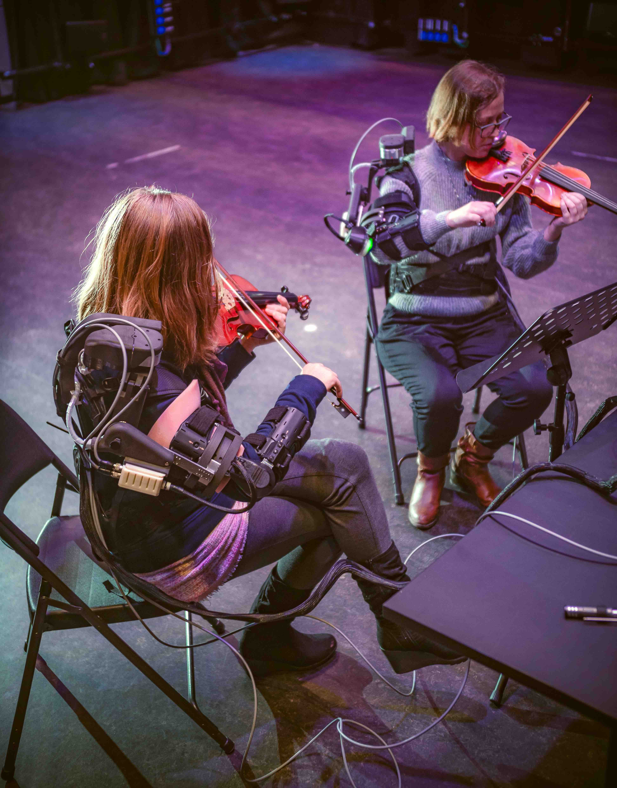

--- 
title: "Exploring music interactions"
author: "Marc Leman"
date:  '2024-12-19'
site: bookdown::bookdown_site
output: bookdown::bs4_book
documentclass: krantz
monofont: "Source Code Pro"
monofontoptions: "Scale=0.7"
bibliography: [book.bib, packages.bib]
biblio-style: apalike
link-citations: yes
colorlinks: yes
# url: your book url like https://bookdown.org/yihui/bookdown
# cover-image: path to the social sharing image like images/cover.jpg
graphics: yes
cover-image: "images/cover.jpeg"
description:
 "*Exploring music interactions* has a focus on musical data analysis, visualization and statistical modeling. It will interest readers in extending their knowledge about human behavior, basically, while performing music. Explorations are based on R, the R package `brms`, and Stan, a probabilistic programming language. "
github-repo: mleman/ExporingMusicInteractionWithR
url: https://www.ugent.be/
---


# Welcome {-}
This is the online home of *Exploring music interactions*, a book on musical data analysis, visualization and modeling.

Data and code will be provided soon. 
Any comments can be send to Marc.Leman@ugent.be

<a href="https://www.ugent.be"></a>
 

<!-- ```{r, cover, fig.show='hold', echo=FALSE, out.width='50%'} -->
<!-- if(knitr::is_html_output()){ -->
<!--   knitr::include_graphics("images/cover.png") -->
<!-- } -->
<!--  knitr::include_graphics("images/cover.png") -->
<!-- ``` -->


# Preface {-}

## Description {-}


``` r
source("Code/chapAll_00_Initialization.R")
```

## Goal {-}

Many people experience music as a positive force in their lives. But what do people do with music, and how does it affect them? This is probably based on precarious interaction states of high value, which we refer to as "self-augmented interactions."

In this book, we delve deeper into the how and why of self-augmented interactions. Our goal is to show how statistical modeling can increase our understanding of self-augmented interactions.

While our research focuses on the musical domain, it applies to many other domains of human interactive activity, such as conversations, sports, and teamwork. 
The study of interactions is rather new and it calls for explorative approaches.
Hence this book. 
We hope that it can be of interest to readers both inside and outside the field of music research.

## Limitations {-}

Every book has its limitations, and it is important to be transparent about them from the outset. 

First, we focus exclusively on behavioral data. While we recognize the importance of neurobiology, our focus lies on behavioral data. We hope that others will build on our work by incorporating neurobiological data to more fully support our theoretical claims.

Second, in our analysis of behavioral data, we focus primarily on timing. Specifically, we examine how people act in time with one another, such as during music playing or dancing. We chose this focus because timing is crucial for building and maintaining interactions, and because music provides an excellent domain for understanding self-augmented interactions.

Third, this book is not a textbook, but rather a guide to navigating the space between theory and data. We are exploring music interactions, and we acknowledge that research in this area is still in its infancy. 

Finally, this book is not about applications or technologies, although we are personally interested in biofeedback applications. While some of our data were collected using technologies such as augmented reality, virtual reality, and exoskeletons, we do not delve deeply into these topics.

Given these limitations, and above all, our own limited capacities as musicologist, we offer this book as an open contribution to the field. We welcome suggestions for improvement from our readers.

## Overview {-}

<table class="table table-striped" style="font-size: 10px; margin-left: auto; margin-right: auto;">
<caption style="font-size: initial !important;">(\#tab:IndexChapterOverview)Overview of chapters</caption>
 <thead>
  <tr>
   <th style="text-align:left;"> # </th>
   <th style="text-align:left;"> chapter </th>
   <th style="text-align:left;"> theory </th>
   <th style="text-align:left;"> performance </th>
   <th style="text-align:left;"> measure </th>
   <th style="text-align:left;"> modelling </th>
  </tr>
 </thead>
<tbody>
  <tr>
   <td style="text-align:left;"> 2 </td>
   <td style="text-align:left;"> theory </td>
   <td style="text-align:left;"> self-augmentation </td>
   <td style="text-align:left;">  </td>
   <td style="text-align:left;">  </td>
   <td style="text-align:left;">  </td>
  </tr>
  <tr>
   <td style="text-align:left;"> 3 </td>
   <td style="text-align:left;"> modelling </td>
   <td style="text-align:left;"> Bayesian </td>
   <td style="text-align:left;">  </td>
   <td style="text-align:left;">  </td>
   <td style="text-align:left;">  </td>
  </tr>
  <tr>
   <td style="text-align:left;"> 4 </td>
   <td style="text-align:left;"> listening </td>
   <td style="text-align:left;"> appreciation </td>
   <td style="text-align:left;"> listening </td>
   <td style="text-align:left;"> questions </td>
   <td style="text-align:left;"> structural equation modelling </td>
  </tr>
  <tr>
   <td style="text-align:left;"> 5 </td>
   <td style="text-align:left;"> dancer </td>
   <td style="text-align:left;"> anticipation </td>
   <td style="text-align:left;"> classical ballet </td>
   <td style="text-align:left;"> relative phase </td>
   <td style="text-align:left;"> regression </td>
  </tr>
  <tr>
   <td style="text-align:left;"> 6 </td>
   <td style="text-align:left;"> violinst </td>
   <td style="text-align:left;"> parallax </td>
   <td style="text-align:left;"> orchestra playing </td>
   <td style="text-align:left;"> procustus distance </td>
   <td style="text-align:left;"> regression </td>
  </tr>
  <tr>
   <td style="text-align:left;"> 7 </td>
   <td style="text-align:left;"> exoskeletons </td>
   <td style="text-align:left;"> modalities </td>
   <td style="text-align:left;"> dyad violin playing </td>
   <td style="text-align:left;"> relative phase </td>
   <td style="text-align:left;"> regression </td>
  </tr>
  <tr>
   <td style="text-align:left;"> 8 &amp; 9 </td>
   <td style="text-align:left;"> tappers </td>
   <td style="text-align:left;"> entrainment </td>
   <td style="text-align:left;"> dyad finger tapping </td>
   <td style="text-align:left;"> phase flow </td>
   <td style="text-align:left;"> state-space modelling </td>
  </tr>
</tbody>
</table>
Table \@ref(tab:IndexChapterOverview) gives an overview of the chapters.

- The first two chapters are about theory and methodology. Chapter \@ref(chapTheory) introduces the theory of *self-augmented interactions* and the Bayesian perspective that will be developed in subsequent chapters. 
Chapter \@ref(chapModelling) introduces *regression* modelling as our main analysis tool. 

- Chapter \@ref(chapListener) accesses the listener's music appreciation using questionnaires. The chapter shows how questionnaires are used in a *structural equation model* for validating a theory of appreciation. This is the only chapter that is not about timing. 

- Chapter \@ref(chapDancer) shows that synchronization of movement with music can be influenced by the narrative that defines classical ballet dancing. The chapter applies *circular-linear smooth regression* and an approach to contrast musical phrases selected over time. 

- Chapter \@ref(chapViolinist) is about the effect of parallax, using a 3D versus 2D music play-along system for violin, for training synchronized bowing gestures in an orchestra. It reduces bowing gesture to discrete events and  applies *regression* in a way that is similar to the previous chapter, including an approach to contrast musical phrases. 

- Chapter \@ref(chapExoskeletons) is about the effect of auditory, visual and haptic modalities on synchronized playing of two violinists, connected via *exoskeletons*. We go deeper into the feature extraction and use a *regression* with categorical predictors.

- Chapters \@ref(chapTappers1) to \@ref(chapTappers2) are about synchronized finger tapping.
In these chapters, we develop a state-space model where the phase flow among interacting units is described by ordinal differential equations. We use this predictor in a *regression* to capture entrainment as *coupling strength*. These chapters are a bit more advanced but we show that this type of *non-linear regression* is very powerful and promising for future work in the field.

- A brief concluding chapter \@ref(chapConclusion) offers some perspectives for future work in the field.

## Usage {-}

It is recommended to first read the chapters on theory and methodology. 
They offer an overall theoretical and methodological framework for the subsequent chapters. 
Chapter \@ref(chapTappers1) and  chapter \@ref(chapTappers2) are closely related and can best be read in that order.
All other chapters can be read in order of the reader's preference.

The book is organized such that the reader can have easy access to the code in R and in Stan.
Reference to the code scripts is given at the beginning of each chapter.
Further reference to parts of the code are specified in the text.
In each chapter we follow the same logic: first we do data preparation and data plotting, then we do modelling and plotting of modelling outcomes, then we do contrast testing and sometimes plotting of those tests.  We try to maintain this logic as much as possible because it reflects the workflow of statistical modelling as well as the structure of each chapter.

To access to the code we use a file name convention whose form is `X_Y_Z.R`:
 
 - X indicates the shortname of a chapter, such as `chapListener`, `chapDancer`. These names are shortcuts for full chapter names.

- Y is a sequence number, such as `02`, `O3`, which indicates the order in which the script should be processed. 

- Z is a processing name, such as `Initialization`, `DataPreparation`, `DataPlotting`, `Modelling`, which indicates the kind of processing that is dealt with.

- .R is just an extension to indicate the fact that the file is a pure R-script. At one point we use .san to specify that it is a Stan-script.

For example, the filename `chapListener_02_DataPreparation.R` is an R-script about data preparation in the chapter on the listener. It's sequence number `02` suggests that it there is a `01`, and even an `00` script which should be executed first. 
The script `chapListener_05_ModelPlotting.R` is about plotting the results of modelling. It should be executed after running the modelling script `script_chapListener_04_Modelling.R`. But that script requires at least that scripts `00`, `01`,  `02` and `03` have been considered as well.

The scripts that should be run in all chapters are called: `chapAll_00_Initialization.R` and `chapAll_01_Functions.R`.


## Level {-}

A word should be said about the level of this book.
As it is written for MA-students, PhD-students, and interested researchers, we don't offer a didactical approach from scratch. Instead, some level of statistics knowledge might be required in order to be able to read this book, or code in particular.
However, self-learning can largely profit from explorations with the code provided.
You may find example code for your developing your own explorations.

## Our inspiration {-}

Much of our statistical inspiration comes from McElreath (2020), Kruschke (2015), and Gelman et al. (2014). It was useful to consult books on regression, for example, Roback and Legler (2021), Singer and Willet (2003), or Dunn and Smyth (2018), as well as a book on structual equation modelling (Bollen, 1989). 

## Setting up {-}

We use R and several R-packages in RStudio. They get initialized in `Code/chapAll_00_Initialization.R`. Be sure that all those packages are installed on your system.
The installation of the R package `rstan`, an interface to the Stan probabilistic programming language, is also required for the R package `brms`. We recommend to have a look at the [Stan documentation](https://mc-stan.org/users/documentation/) and follow the link to the RStan documentation.

Some statistical modelling can be computational intensive, or very intensive.
We offer fitted models when we think computation is too intensive for an ordinary laptop.

We had a server at our disposal and used parallel processing.
This server runs R version 4.2.3 (2023-03-15) and R-Studio Server 2023.03.0 build 386 on Ubuntu 22.04.2 LTS. The hardware consists of a dual AMD Epyc 74F3 CPU (48 cores total, 96 threads), 128 GB (8x16GB) ECC DDR4 RAM and Nvidia RTX 3090TI graphics card.


## Finding sources {-}

Sources are found in `Data`/, `Code`/, `Figures`/, `Fitted`/, which are subdirectories to the main directory where the chapters exist as formatted text in R markdown files (.Rmd).
To try things with R, code is found in `Code`/, data in `Data`/. When larger pre-processed models are used, you'll find them in `Fitted`/. We also use `Fitted`/ as subdirectory for storing calculated models, and `Figures`/ to store calculated figures. Sometimes we use `Data`/ to store calculated data.

## About the author {-}

Marc Leman is emeritus professor at Ghent University, specialized in the epistemology and methodology of music research. He served as Methusalem research professor, head of the department Art History, Teater Studies, and Musicology, and founder of [ASIL](https://asil.ugent.be). 

## Acknowledgements {-}
This work was supported by my [Methusalem](https://www.ugent.be/en/research/funding/bof/methusalem) grant at Ghent University, grant number 01M00208, BOF UGent.

